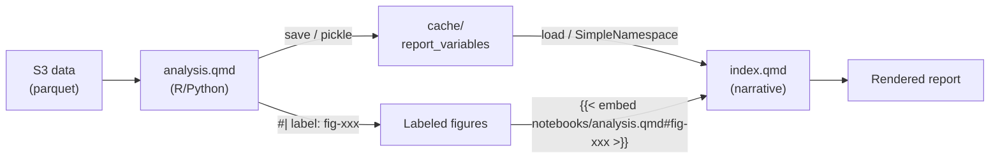

# Agent guide: reports2

This file orients AI agents so they can work effectively in this repo — writing reports, building analysis notebooks, and managing data — without reading the entire codebase.

## What this repo is

**reports2** is [Switchbox's](https://switch.box/) report repository. Switchbox is a nonprofit think tank that produces rigorous, accessible data on U.S. state climate policy for advocates, policymakers, and the public.

Each report is a [Quarto Manuscript](https://quarto.org/docs/manuscripts/) project that combines a **policy narrative** (`index.qmd`) with **reproducible data analysis** (`notebooks/analysis.qmd`), using R (tidyverse) and Python (polars). Reports are published as static HTML via GitHub Pages, reviewed as Word documents, and typeset as PDFs via InDesign.

The main inputs are data from S3 (`s3://data.sb/`): NREL ResStock building simulations, Cambium marginal costs, EIA energy data, Census PUMS, and utility tariff data. The main outputs are publication-quality reports on energy policy — heat pump rates, grid impacts, gas infrastructure, LMI programs, and building electrification.

The companion repo [rate-design-platform](https://github.com/switchbox-data/rate-design-platform) runs the CAIRO rate simulations whose outputs many reports analyze. See its AGENTS.md for simulation-side conventions.

## Layout

| Path                           | Purpose                                                                                                                  |
| ------------------------------ | ------------------------------------------------------------------------------------------------------------------------ |
| `reports/`                     | Source code for all report projects. Each subdirectory is a self-contained Quarto Manuscript project.                    |
| `reports/.style/`              | Shared SCSS theme (`switchbox.scss`), HTML includes (`switchbox.html`), and brand fonts (`fonts/`) used by all reports.  |
| `reports/references.bib`       | Shared BibTeX bibliography used by all reports.                                                                          |
| `lib/`                         | Shared R and Python libraries used across reports. Python side is an installable package (see "Shared libraries" below). |
| `lib/ggplot/switchbox_theme.R` | Custom ggplot2 theme (IBM Plex Sans, white background, Switchbox colors). Source this in every R analysis notebook.      |
| `lib/plotnine/`                | Custom plotnine theme (`theme_switchbox`) and `SB_COLORS` dict. Import in every Python analysis notebook.                |
| `lib/rates_analysis/`          | Shared R functions for heat pump rate analysis (bill calculation, tariff assignment, plotting).                          |
| `lib/eia/`                     | Python scripts for fetching EIA data (fuel prices, state profiles).                                                      |
| `docs/`                        | Published HTML reports served via GitHub Pages at `switchbox-data.github.io/reports2`.                                   |
| `tests/`                       | Pytest test suite.                                                                                                       |
| `.devcontainer/`               | Dev container configuration (Dockerfile, devcontainer.json).                                                             |
| `Justfile`                     | Root task runner: `install`, `check`, `test`, `new_report`, `aws`, `clean`.                                              |
| `pyproject.toml`               | Python dependencies (managed by uv).                                                                                     |
| `DESCRIPTION`                  | R dependencies (managed by pak).                                                                                         |

## Report architecture

Every report project lives in `reports/<project_code>/` and follows the Quarto Manuscript structure. This separation between narrative and analysis is the core architectural pattern — understand it before touching any report.

### Anatomy of a report project

```text
reports/<project_code>/
├── index.qmd              # The publication narrative (what readers see)
├── notebooks/
│   └── analysis.qmd       # The data analysis (the engine room)
├── _quarto.yml            # Quarto project config
├── Justfile               # render, draft, typeset, publish, clean
├── cache/                 # Gitignored: .RData files, intermediate outputs
└── docs/                  # Gitignored: rendered HTML/DOCX/ICML output
```

- **`index.qmd`**: The report's narrative. Contains prose, embedded charts, inline computed values, and margin citations. This is what the reader sees. It loads pre-computed variables and embeds figures from the analysis notebook. It never loads raw data or runs heavy computation.
- **`notebooks/analysis.qmd`**: The data analysis. Loads data from S3, computes statistics, generates labeled figures, and exports variables to `.RData`. Readers don't see this directly — its outputs flow into `index.qmd`. Prefer a single `analysis.qmd`; consult the team before adding multiple notebooks.
- **`_quarto.yml`**: Project config. Type is always `manuscript`. Theme always references `../.style/switchbox.scss`. The `render` list must include all notebooks needed for the build.

### Data flow: analysis to narrative



1. `analysis.qmd` loads data from S3, computes statistics, and exports report variables to `cache/`.
2. `analysis.qmd` creates labeled figures using chunk options like `#| label: fig-energy-savings`.
3. `index.qmd` loads report variables and uses them inline (never hardcoded).
4. `index.qmd` embeds figures from the analysis notebook: ``.

**R reports** export via `save()`/`save.image()` to `cache/report_variables.RData`; `index.qmd` loads with `load()` and uses inline R: `` `r total_savings |> scales::dollar()` ``.

**Python reports** accumulate stats into a `report_vars: dict` and pickle it to `cache/report_variables.pkl`; `index.qmd` loads it as a `SimpleNamespace` and uses inline Python:

```python
# analysis.qmd — top of notebook
report_vars: dict = {}

# analysis.qmd — wherever a stat is computed
report_vars["pct_natgas_save_default"] = save_w / total_w

# analysis.qmd — final cell
import pickle
Path("../cache/report_variables.pkl").write_bytes(pickle.dumps(report_vars))
```

```python
# index.qmd — setup cell
import pickle
from types import SimpleNamespace
v = SimpleNamespace(**pickle.loads(Path("cache/report_variables.pkl").read_bytes()))

def dollar(x, accuracy=0):
    return f"${x:,.{accuracy}f}"

def pct(x, accuracy=0):
    return f"{x * 100:,.{accuracy}f}%"
```

Inline usage in `index.qmd`: `` `{python} dollar(v.some_stat)` `` or `` `{python} pct(v.some_pct)` ``.

Never put raw data loading or heavy computation in `index.qmd`. Never put narrative prose in `analysis.qmd`.

### YAML frontmatter template

Every `index.qmd` uses this frontmatter (adapt title, authors, date, keywords):

```yaml
---
title: "Report Title"
subtitle: "Descriptive subtitle"
date: YYYY-MM-DD
author:
  - name: Author Name
    orcid: 0000-0000-0000-0000
    email: name@switch.box
    affiliations:
      - Switchbox

keywords: [keyword1, keyword2]

bibliography: ../references.bib
license: "CC BY-NC"

toc: true
notebook-links: false
reference-location: margin
fig-cap: true
fig-cap-location: margin
tbl-cap-location: margin

appendix-style: default
citation-location: document
citation:
  container-title: Switchbox

# Uncomment when PDF is ready:
#other-links:
#  - text: PDF
#    icon: file-earmark-pdf
#    href: switchbox_<project_code>.pdf
---
```

### Embedding figures and variables

In `analysis.qmd`, create a labeled figure:

````markdown
```{r}
#| label: fig-energy-savings
#| fig-cap: "Annual energy savings by heating fuel type"

ggplot(data, aes(x = fuel_type, y = savings)) +
  geom_col() +
  theme_minimal()
```
````

In `index.qmd`, embed it:

```markdown
:::{.column-page-inset-right}

:::
```

Use `:::{.column-page-inset-right}` or `:::{.column-page-inset}` for full-width layout (the standard for all charts).

### Great Tables (GT) in manuscript projects — critical workaround

**Never use `` to include Great Tables output in `index.qmd`.** Quarto's manuscript mode truncates `text/html` MIME outputs from Python notebook cells to just `\n\n</div>`. This rogue `</div>` gets injected into `index.html`, prematurely closes a parent container, and cascades — breaking the page structure and pushing all subsequent content into or after the appendix.

The workaround is file-based inclusion:

1. In `analysis.qmd`, save the GT HTML to a cache file and also display it (for notebook preview):

```python
from pathlib import Path
Path("../cache").mkdir(exist_ok=True)

_my_gt = GT(df).fmt_currency(...)
Path("../cache/my_table.html").write_text(_my_gt.as_raw_html())
_my_gt
```

2. In `index.qmd`, include the cached HTML via an R code block:

```markdown
:::{.column-page-inset-right}
`{r}
#| echo: false
htmltools::includeHTML("cache/my_table.html")`
:::
```

This applies to **every** GT table that needs to appear in `index.qmd`. Plotnine figures (`fig-` labels) are images and embed safely — the bug only affects `text/html` outputs.

For inline values, always use R inline code. Never hardcode statistics in prose:

```markdown
Gas-heated homes pay a median annual energy bill of **`r pre_hp_total_bill |> scales::dollar(accuracy = 1)`**.
```

## Writing conventions

This section codifies the voice, structure, and style of Switchbox reports. It is drawn from the full corpus of published reports (both the archived `reports` repo and the current `reports2` repo). Follow these conventions closely when writing or editing report narrative.

### Audience

Switchbox writes for **policymakers, advocates, journalists, and the informed public** — not academics or engineers. The reader is smart but not technical. They care about what the data means for policy, not about methodology for its own sake.

### Voice and tone

Switchbox's voice is **clear, direct, and confident without being strident**. The prose is evidence-driven but accessible. It states findings plainly, explains jargon on first use, and lets the numbers make the argument.

The tone varies by report type:

- **Rate/cost analysis** (hp_rates, aeba): Reassuring, authoritative, practical. Household-oriented language. "What does this mean for your wallet?"
- **Policy analysis** (neny, npa, heat, lmi_discounts): Analytical, measured, occasionally urgent. Heavy use of comparative frameworks.
- **Advocacy-adjacent** (gh2, blizzard, national_fuel): More narrative and argumentative. Stronger framing, direct rebuttals of industry claims. Still evidence-driven — never polemical.
- **Data briefings** (heat_regions, wny): More exploratory. Questions left open. Candid about limitations.

Across all types, the voice avoids:

- **Hedge words**: "somewhat," "arguably," "it could be said that." State the finding or don't.
- **Bureaucratic language**: "It should be noted that," "with respect to," "in terms of."
- **Academic passives**: "It was found that," "the analysis was conducted." Use active voice: "We find that," "Our analysis shows."
- **Vague quantification**: "significant savings," "many households," "a large number." Always use exact percentages, dollar figures, or counts.

### Sentence-level style

**Medium-length sentences** (15–25 words) are the default. Short punchy sentences are used sparingly for emphasis. Longer sentences are broken up with em-dashes, colons, or parentheticals.

The **colon-as-pivot** is a signature construction — a setup clause followed by a colon and the key point:

> "The bottom line: When it comes to energy, **green hydrogen divides, heat pumps multiply**."
>
> "The key takeaway is this: when a customer consumes more electricity, not only do they pay more for the electricity itself, but **they also pay more for the poles and wires that deliver that electricity**."

The **"In other words" restatement** appears throughout the corpus to restate a technical point in plain language:

> "In other words, we estimate the expected difference in mortgage payments and operating costs between all-electric and fossil-fueled homes, since this reflects what homeowners would actually experience under the AEBA."
>
> "In other words, replacing 20% of natural gas with hydrogen (by volume) means delivering more gas overall."

The **rhetorical question followed by a short answer** is a frequent transition device:

> "Why the difference? It comes down to fuel costs."
>
> "Would the State's Climate Plan increase risk for Buffalo residents, as National Fuel claims?"
>
> "Why such a small impact? Three reasons:"

### Bold and italics

**Bold** is used strategically for:

1. Key statistics in findings: "save approximately **$1,107** per year"
2. Policy names and concepts on first mention: "the **All-Electric Building Act** (AEBA)"
3. Category labels: "**Low-income households** would save..."
4. Emphasis words carrying argumentative weight: "neither a short-term fix, **nor** a stepping stone"

_Italics_ are used sparingly for:

1. Emphasis on a contrasting word: "the _price_ of climate pollution" vs. "the _level_"
2. Qualifying language: "_after the IRA is accounted for_"
3. Words being defined or discussed as words: "what we call _the heat pump premium_"

Do not use bold for entire sentences. Do not use italics for emphasis that bold would better serve.

### Report structure

Reports follow a consistent architecture. Not every report has every section, but the ordering is fixed:

1. **Introduction** — Context, problem statement, and the questions this report answers. The newer convention is to keep this short (1–3 paragraphs). Some reports use a single framing sentence: "This memo examines the impact of switching to heat pumps on the energy bills of homes in Connecticut, under today's electric rates."

2. **Executive Summary** — Bulleted key findings, each starting with a bold statistic or claim. Quantification is always specific. (See the dedicated subsection below.)

3. **Background** (when needed) — A technical primer for the non-technical reader. Explains concepts like supply vs. delivery rates, cross-subsidization, energy burden. Uses margin notes for definitions.

4. **Scope and Assumptions** (analytical reports) — An extensive bulleted list of every modeling assumption, with bolded key terms. This section is critical for analytical credibility.

5. **Findings** — The meat. Organized by question or by scenario. Each subsection typically has a question-as-header, a prose summary of the finding, and embedded figures. (See the dedicated subsection below.)

6. **Appendix** — Contains, in order:
   - **Acknowledgments** — Named individuals who provided input.
   - **Data and Methods** — Detailed enough to reproduce the analysis. Describes datasets, transformations, and assumptions underlying each major finding.
   - **Assumptions** (if not in the main text)
   - **References** — `:::{#refs}:::`

### Executive summaries

Executive summaries use a consistent formula:

1. **One framing sentence** that sets context, often referencing the law or policy.
2. **Bulleted findings**, each starting with a bold number or claim, followed by explanation.

The signature pattern is **bold the quantified claim first, then explain**:

> - **1 in 4** New York residents have a high energy burden: they pay more than **6%** of their annual income on electricity, natural gas, and delivered fossil fuels.
> - Only half of the $2.4 billion spent under NENY between 2020 and 2023 went to weatherization and heat pumps. A third went to unstrategic measures like lighting and gas efficiency.
> - AEBA will increase electricity use from buildings in winter, not summer. Virtually all new buildings already have air-conditioning.

Advocacy reports use punchier, more argumentative bullets. Analytical reports use more data-heavy bullets with sub-bullets for income/fuel breakdowns.

Never use vague bullets like "Findings suggest that savings could be significant." Every bullet must be specific and quantified.

### Findings sections

Findings sections use **questions as section headers** (the current convention):

> `## What happens to a home's energy bills after switching to heat pumps?`
>
> `## How does a home's baseline heating system affect its energy bills?`
>
> `## How does a home's income affect its energy bills after switching to heat pumps?`

The narrative flow within a findings section follows a **simple-to-complex** progression:

1. Start with the simplest version (one representative home, the median case).
2. Zoom out (statewide distribution, histograms).
3. Slice by dimensions (fuel type, building type, income level).

Each subsection tells you what to look for _before_ pointing to the figure:

> "Gas-heated homes in Rhode Island pay a median annual energy bill — including both electricity and natural gas — of **`r pre_hp_total_bill_gas |> scales::dollar(accuracy = 1)`**. `r round(pre_hp_annual_gas_bill / pre_hp_total_bill_gas * 100, 0)`% of the annual bill goes to gas, largely for heating the home, and the rest is electricity (@fig-stacked_bar_median_before_after_gas)."

Never introduce a figure without first telling the reader what it means. The pattern is: **state the finding, then point to the figure**.

Transitions between subsections are clean and direct — typically a one-sentence bridge:

> "We just examined the _median_ bill for an _individual_ home. But homes in Rhode Island are diverse — building size, shells and equipment vary widely — so the results we saw above may not be the same for all homes."

Or a conversational pivot:

> "Let's examine each of these populations in turn, looking at the change in their _annual_ energy bills this time."

### Data and Methods sections

The Data and Methods appendix is not a vague "methodology" section. It is a **technical audit trail** detailed enough that a reviewer can reproduce the analysis. For each major finding, describe:

- **What dataset** was used (with version, release, and S3 path or URL)
- **What transformations** were applied (aggregation, filtering, unit conversions)
- **What assumptions** were made (and why)
- **What limitations** apply

For an exemplary Data and Methods section, see the ny_aeba_grid report, which breaks methodology down by finding and walks through each step with formulas and source citations.

### Scope and Assumptions sections

Analytical reports (especially heat pump rate reports) include an extensive "Scope and Assumptions" section. Each assumption is a bullet point with bolded key terms:

> - This memo focuses only on **cold-climate air-source heat pumps** (ccASHPs) retrofits; ground-source heat pumps (GSHPs) are out of scope.
> - We only model **HVAC replacements**, not full electrification. Homes are assumed to keep whatever appliances they already had before installing ccASHPs, including their existing hot water heater.
> - The upfront costs of heat pump installations are out of scope; the focus is on **post-installation operating costs**.
> - **Low-income households** are defined as those making less than 60% of the State Median Income (SMI). **Moderate-income households** are defined as those making between 60% and 100% of the SMI.

This section is not optional for analytical reports. It establishes the analytical contract with the reader.

### Handling uncertainty, caveats, and limitations

Use Quarto callout boxes (`.callout-note`, `.callout-important`, `.callout-warning`) for caveats the reader must not miss:

```markdown
::: {.callout-note}
This report uses a very narrow definition of cost-effectiveness. We only compare
the **up-front capital cost** of targeted electrification and LPP replacement,
ignoring the latter's **down-the-road financial costs** and **externalized costs**.
:::
```

For inline caveats, use the **"While X, Y" construction** to acknowledge counterarguments:

> "While the 1.0 rates represent a step in the right direction, only the 2.0 rates would allow Massachusetts to credibly position heat pumps as a vehicle for energy affordability."

When an estimate is conservative, say so explicitly — and explain _which direction_ the estimate is biased:

> "Our estimates of the life-cycle costs of gas-heated homes exclude major infrastructure costs, and are quite conservative. We are likely underestimating the savings."

Use the conditional "would" for modeled outcomes. This is nearly universal across the corpus:

> "`r pct_save`% of homes **would** save money by switching to heat pumps."

Never "will save" for simulation results. "Would" maintains appropriate epistemic humility.

### Numbers and statistics in prose

- **Dollar amounts**: Always formatted with dollar sign and commas: "$1,107", "$2.4 billion". Bold when they're key findings. Never "about a thousand dollars."
- **Percentages**: Digits with percent sign: "40%", not "forty percent." Bold when key findings. Often paired with the absolute: "**24%** of owner-occupied households."
- **The "X in Y" pattern** for intuitive framing: "1 in 4 New York residents", "one in every 6 dollars spent."
- **Dollar-per-month translation**: Almost every seasonal savings figure is translated to a monthly amount to make it tangible: "median savings of **$X** per heating season, or **$Y** per month, on average."
- **Computed inline values**: Always use inline R code (`` `r var |> scales::dollar()` ``). Never hardcode numbers in prose. This ensures narrative and analysis stay in sync.
- **Rounding**: Whole dollars and whole percentages in prose. No decimals unless the precision matters.

### Citations and references

- Use BibTeX via `@citation_key` inline. The shared bibliography is at `reports/references.bib`.
- Citation key format: `{author_short_title_year}`, e.g., `@nyiso_GoldBook2025_2025`.
- Citations appear in the margin (`reference-location: margin`), keeping the main text clean.
- **Footnotes** (`[^label]`) are used for tangential context, secondary sources, and technical qualifications. They carry substantive information but never essential arguments. **Place the footnote definition (`[^label]: ...`) immediately after the paragraph where it is first invoked** — not grouped at the end of the section. This keeps the definition visible near its reference when editing the source.
- **DocumentCloud links** are used for primary source documents (regulatory filings, letters, reports). Link to the specific page with an annotation: `[p. 4](https://www.documentcloud.org/documents/XXX#document/p4/a1234)`.
- **Margin definitions** (using `:::{.column-margin}`) are used for key term definitions that would interrupt the prose.
- Do not use `{.aside}` for source citations or notes. Use footnotes (`[^label]`) — they render in the margin automatically via `reference-location: margin`.

### Explaining technical concepts

Switchbox uses several techniques to make technical content accessible:

- **"Poles and wires"** is the plain-English stand-in for transmission and distribution infrastructure. It appears throughout the corpus and has become almost a trademark.
- **Concrete analogies**: "Manufacturing the green hydrogen needed for a statewide 20% blend would require generating X TWh of additional electricity, enough electricity to power New York City for a year."
- **Per-household translations**: Abstract millions/billions are always grounded in household-level impact. Never leave a statewide figure without translating it.
- **Footnotes for technical depth**: The main text says heat pumps "leverage each unit of input electricity into two to four units of heat." The footnote handles COP temperature dependence and air-vs-ground-source nuances.
- **Definition on first use**: Key terms are defined inline or in the margin the first time they appear, then used freely afterward.

### Recurring phrases and framing

These phrases recur across the corpus and represent Switchbox's analytical vocabulary:

| Phrase                                    | Usage                                                 |
| ----------------------------------------- | ----------------------------------------------------- |
| "In other words,"                         | Restating a technical point in plain language         |
| "The bottom line:" / "Simply put:"        | Before a plain-language summary                       |
| "Let's examine..." / "Let's look at..."   | Conversational transition into subsections            |
| "energy burden"                           | Always defined as % of annual income on energy        |
| "cross-subsidization" / "cross-subsidy"   | HP customers overpaying for delivery                  |
| "cost-causation principles"               | Rates should reflect cost of service                  |
| "cost-reflective"                         | Rates that reflect marginal costs                     |
| "operating cost barrier"                  | High energy costs discouraging HP adoption            |
| "the heat pump premium"                   | Added cost of HP over conventional system             |
| "gain of function"                        | Getting air conditioning for the first time           |
| "conservative" (describing estimates)     | Always means "biased toward understating the finding" |
| "would save" / "would see bill increases" | Conditional for modeled outcomes                      |

### Rhetorical structures by report type

**Rate analysis reports** use **progressive revelation**: Status quo (default rates) -> modest reform (1.0 rates) -> transformative reform (2.0 rates). Each tier is presented with the same metrics, so the reader can compare directly. By the time they reach 2.0, the inadequacy of 1.0 is self-evident.

**Advocacy-adjacent reports** (GH2, AEBA grid) use **claim-rebuttal**: Present the industry/political claim, note what the claimants failed to analyze, provide that missing analysis, show the claim is overblown. The framing is measured but firm.

**Policy analysis reports** use **problem-solution-evidence-scale**: Establish the problem with a striking statistic, name the proposed solution, present evidence it works, quantify the scale of impact, identify what's needed.

### What NOT to do

- Do not write academic prose. No "This paper examines" or "The authors find." Switchbox is not a journal.
- Do not bury the lede. The finding comes first; the methodology justification comes second (or goes in the appendix).
- Do not use passive voice for findings. "We find that X" not "It was found that X."
- Do not editorialize beyond what the data supports. Let the numbers make the argument.
- Do not use "significant" without a number attached. (And definitely not in the statistical sense unless running a test.)
- Do not leave figures unexplained. Every chart needs a sentence before it telling the reader what to look for.
- Do not hardcode any number in narrative text. All computed values must come from inline R code pulling from the analysis.
- Do not put analysis code in `index.qmd` (beyond loading `.RData` and sourcing themes).
- Do not put narrative prose in `analysis.qmd`.
- Do not use `` for Great Tables (GT) output — it will break the page. Use the file-based `htmltools::includeHTML()` workaround (see "Great Tables in manuscript projects" above).

## Analysis notebook conventions

The Writing Conventions section above covers the prose style of `index.qmd`. This section covers the **literate programming style** of `notebooks/analysis.qmd` — the engine room that powers each report. All analysis notebooks are open-sourced alongside the report, so they must be readable and followable by anyone who knows the language.

The guiding principle: **a reader who knows R (or Python) should be able to follow the analysis without external documentation.** They should understand what data is being loaded, what it looks like, what transformations are applied and why, and how each output connects to the report. The notebook is not a script with comments — it is a document that happens to execute.

For polished reference implementations, see [tdr-model/notebooks/analysis.qmd](https://github.com/switchbox-data/tdr-model/blob/main/notebooks/analysis.qmd) (LMI discount modeling) and [ny_heat/notebooks/analysis.qmd](https://github.com/switchbox-data/reports/blob/main/src/ny_heat/notebooks/analysis.qmd) (Census PUMS energy burden analysis).

### Top-level structure

Analysis notebooks follow a consistent arc that mirrors the research process:

1. **Introduction** — A short, reader-facing welcome. Since these notebooks are open-sourced, the intro orients an external reader: what this notebook contains, how it relates to the report, and how to navigate (e.g., "click Download Source above"). It can also list caveats and limitations up front. From ny_heat: "This notebook, written in the R programming language, contains all of the code used to produce the findings in our report, starting from raw data."

2. **Setup** — Import libraries and define top-level parameters. Each parameter gets a brief comment or prose explanation. Group related parameters together and show their values (e.g., render a discount rate table with `gt()`). Parameters like `state_code`, `burdened_cutoff`, and `pums_year` should be defined here so the notebook can be rerun for a different state or scenario by changing a few values. If the analysis can be rerun with different parameters, include a "How to run this for X" subsection with numbered steps.

3. **Import data** — Load each dataset, explain what it contains, print it. This is the single most important section for readability. (See "Show the data on import" below.)

4. **Data preparation** — Filtering, joining, reweighting, tier assignment. Each transformation gets its own cell with a prose explanation of _what_ is being done and _why_.

5. **Core analysis** — The analytical functions and computations that produce the report's findings. Functions are defined in one cell, then called in subsequent cells. Complex functions get docstring-style prose above them.

6. **Visualization** — Figure-producing cells, each with `#| label: fig-xxx` and `#| fig-cap:` options. Group figures by the story they tell, not by chart type.

7. **Report variables** — A clearly labeled section at the end that computes the summary metrics used in `index.qmd` and exports them via `save.image()` or `save()`.

### Show the data on import

This is a policy, not a suggestion. When you load a dataset, **immediately show it** so the reader can reason about subsequent code. The pattern is:

1. Load the data.
2. Explain what it represents in prose.
3. Print a sample (first few rows via `gt()`, `head()`, or `glimpse()`).
4. If the schema isn't obvious, include a markdown table documenting the columns.

From the TDR model:

> "Each row in this table represents a housing unit. It could be a single-family home, or an apartment in a multi-family building. The ResStock data contains the following columns:"
>
> | Column            | Description                             |
> | ----------------- | --------------------------------------- |
> | `bldg_id`         | Unique identifier for each housing unit |
> | `assigned_income` | Annual household income (2024 dollars)  |
> | ...               | ...                                     |

Then later:

> "Let's take a look at the electricity and gas tariff data."

followed by a `gt()` table rendering the tariff data with formatted currency and percentages.

This applies equally to intermediate datasets. After a complex join or transformation, use a **checkpoint** — print a few rows and walk the reader through the new columns:

> "Let's take a look at where we stand."

Then explain what each new variable means in prose: "We know whether each household in our sample `is_energy_burdened`: whether they pay more than `r scales::label_percent()(burdened_cutoff)` of their annual income on energy." Note the use of inline R code even in the analysis notebook's own prose — this keeps the notebook parameterized.

When a dataset has encoding quirks, explain them. From ny_heat, on Census PUMS data:

> "ACS uses low values of these columns to denote different reasons for zeros, not actual values, so we need to set them to zero."

Without that comment, the `case_when(GASP <= 4 ~ 0)` would be mystifying.

### Cell size and atomicity

Each code cell should do **one logical thing**. If you're loading data, load data. If you're computing survey weights, compute survey weights. If you're making a plot, make a plot. Do not combine unrelated operations in a single cell.

Good:

```r
# Cell 1: Load electricity tariff data
elec_tariff <- googlesheets4::read_sheet(url, sheet = elec_sheet) |>
  select(utility, customer_charge, volumetric_rate, month, current_discount)
```

```r
# Cell 2: Show it
elec_tariff |> gt() |>
  fmt_currency(columns = c(customer_charge, volumetric_rate), decimals = 4)
```

Bad: A single cell that loads three datasets, joins them, filters, computes a summary, and makes a plot.

### Prose between cells

The prose between code cells is **informal, conversational, and directional**. It tells the reader what is about to happen and why it matters. It is not a formal methods section — it is a running commentary from a colleague walking you through their work.

Characteristic phrases:

- "First, we define a function to..."
- "Next, we read the ResStock data, excluding buildings with..."
- "We now need to match each housing unit to the correct HEAP tier, based on..."
- "Let's take a look at..."
- "Let's run a quick sanity check, ensuring that..."
- "These target percentages are stored in the Google Sheets and would need to be updated to model a different utility."

The tone is second-person-inclusive ("we") and present-tense ("we define", "we load", "we now need to"). It reads like pair programming.

### Introduce domain concepts where they're needed

Do not assume the reader knows what a HEAP tier is, or how survey weights work, or what a volumetric rate means. Introduce domain concepts **at the point in the code where they first matter**, not in a separate glossary.

From the TDR model, right before the tier-assignment code:

> "HEAP tiers are defined as:"
>
> | HEAP Tier    | Income Level         |
> | ------------ | -------------------- |
> | Lowest tier  | Less than 100% FPL   |
> | Middle tier  | 100%-200% FPL        |
> | Highest tier | 200% FPL to 60% SMI  |
> | Non-LMI      | Greater than 60% SMI |
>
> _FPL = federal poverty level, SMI = state median income._

Then the code that implements this mapping follows immediately. The reader learns the concept and sees the implementation in one scroll.

Sometimes domain education needs more than a definition table. From ny_heat, the explanation of Census PUMAs spans several paragraphs — what they are, why they matter for the analysis, how they relate to counties, why the allocation factor is needed — before the join code appears. The reader gets a mini-lesson, not just a glossary entry. This is appropriate when the concept is central to the analysis and would be confusing without context.

When a concept has external documentation that the curious reader might want, **link to it**:

> "For definitions of other PUMS variables, consult the official [data dictionary](https://www2.census.gov/programs-surveys/acs/tech_docs/pums/data_dict/PUMS_Data_Dictionary_2021.pdf). To learn how to work with PUMS data, check out [this tutorial](https://walker-data.com/tidycensus/articles/pums-data.html)."

This keeps the notebook self-contained for the casual reader while giving the motivated reader a path to go deeper.

### Orient the reader to what matters vs. boilerplate

Not every cell is equally important. Some are setup boilerplate (library imports, DB connection functions); others are the analytical core. Use prose to **signal which is which**:

- Before boilerplate: "First, we import the libraries we'll use in this notebook." (Then the cell. No further explanation needed.)
- Before core logic: Multiple paragraphs explaining the analytical approach, what the function computes and why, what the inputs and outputs represent.

The TDR model's `eval_discount_rate` function, for example, gets a full prose section ("Core Analysis Functions") with a numbered list of what the functions calculate — monthly bills, program costs, energy burdens, impact on non-LMI customers — before any code appears.

For visualization sections, annotate each figure group with what it demonstrates:

> "### Figure 3: Impact of Increasing Discounts —
> Shows how different discount rates affect
> lowest tier households and middle tier households
> (who get intermediate discount).
> Key findings discussed in report section 'Discount Rate Analysis'"

### Verification and sanity checks

Include assertions and verification steps throughout, not just at the end. After loading data, after joining, after reweighting — anywhere a silent error could propagate. Present them conversationally:

> "Let's run a quick sanity check, ensuring that each housing unit only appears in one row of each of these datasets."

```r
stopifnot(dim(bldgs_elec)[1] == length(unique(bldgs_elec$bldg_id)))
```

For survey weight verification, print a comparison table of weighted vs. target percentages and label it clearly:

```r
print("Electric - Weighted vs Target Percentages")
```

### Comments in code cells

Comments inside code cells should explain **why**, not **what**. The prose between cells handles the "what."

Good comments:

```r
filter(!bldg_id %in% exclude_bldgs)  # Remove buildings with negative electricity consumption
bill * (1 - current_discount)  # Apply current discount to LMI bills only
sum((bill - bill_discounted) * survey_weight)  # Must be weighted for cost-per-kwh calculation
```

Comments that explain **data encoding quirks** are especially valuable:

```r
GASP = case_when(GASP <= 4 ~ 0, .default = GASP),  # ACS uses low values to denote reasons for zeros, not actual dollar amounts
```

Bad comments:

```r
# Read the data
# Filter the data
# Calculate the sum
```

### Inline computed values in prose

Use inline R code (`` `r expr` ``) in the notebook's own prose — not just in `index.qmd`. This keeps the notebook parameterized and self-updating:

> "We know whether each household in our sample `is_energy_burdened`: whether they pay more than `` `r scales::label_percent()(burdened_cutoff)` `` of their annual income on energy."

If `burdened_cutoff` changes from 0.06 to 0.10, the prose updates automatically.

### Caching expensive fetches

When a data fetch is expensive (e.g., Census API calls), use a conditional download pattern so the notebook doesn't re-fetch every time it renders:

```r
if (file.exists(pums_path)) {
  raw_data <- readRDS(pums_path)
} else {
  raw_data <- get_pums(variables = vars, state = state_fips, ...)
  saveRDS(raw_data, pums_path)
}
```

Explain the pattern briefly in prose so the reader knows what's happening.

### Define metrics before computing them

Before a block of aggregation code, list the exact metrics you're about to compute. This gives the reader a roadmap so they can map each line of code to its purpose. From ny_heat:

> "All that's left now is to report the following metrics for different geographies, starting with the entire state:
>
> - `households_included`: the number of households
> - `median_income`: the median income of households across the state
> - `pct_energy_burdened`: the percent of households that are energy burdened
> - `avg_monthly_bill_of_burdened`: the average monthly energy bills of those households, before NY HEAT
> - `utility_burden_of_burdened`: how much utility burdened households stand to save every month, after NY HEAT"

Then the `summarise()` cell follows, and every column is already explained.

### Repeat-and-slice with progressive shortening

Many analyses compute the same metrics across multiple slicing dimensions — by building type, by fuel type, by income level, by ownership status. The pattern is always: **count → aggregate → plot → table**.

The first time through (e.g., building type), give the full treatment: explain what you're doing, why, how the categories are defined, and what the results show. By the second and third time (fuel type, income), the reader already knows the pattern. Shorten the prose to telegraphic transitions:

> "Next, we crunch the same numbers for each economic region:"
>
> "Now we do it for counties:"
>
> "Plot counts."
>
> "Aggregate results by fuel type."
>
> "Place results in a table."

This progressive shortening respects the reader's time. They learned the pattern once; they don't need it re-explained for every dimension.

### The report variables section

Report variables are statistics used in `index.qmd` prose (inline computed values, not hardcoded numbers). Two principles govern how they are managed:

**Capture stats close to where they are produced.** Do not defer all `report_vars["..."] = ...` assignments to a single block at the end of the notebook. Instead, assign each stat immediately after the code that computes it — in the same cell or the next cell. This keeps the variable definition next to its derivation, making it easy to audit and update. If a stat depends on a filtered DataFrame or an intermediate result, capture it right there rather than re-deriving it later.

**Export once at the end.** The final cell of the notebook serializes the accumulated variables to `cache/`. This is the only cell that writes to disk — the assignments throughout the notebook just populate the in-memory dict (Python) or environment (R).

For **R reports**:

1. Assign variables to the R environment throughout the notebook: `total_savings <- ...`
2. End with `save.image(file = "cache/report_variables.RData")` or a targeted `save()`.
3. In `index.qmd`, load with `load()` and use inline R: `` `r total_savings |> scales::dollar()` ``.

For **Python reports**:

1. Initialize `report_vars: dict = {}` at the top of the notebook.
2. Assign throughout: `report_vars["total_savings"] = ...` right after the computation.
3. End with `pickle.dumps(report_vars)` written to `cache/report_variables.pkl`.
4. In `index.qmd`, load as `SimpleNamespace` and use inline Python: `` `{python} dollar(v.total_savings)` ``.

### Figure cells

Figure-producing cells always include these Knitr chunk options:

```r
#| label: fig-descriptive-name
#| fig-cap: "Human-readable caption that stands alone"
#| fig-width: 10
#| fig-cap-location: margin
```

Group figures by the story they tell, not by chart type. Use markdown headers and prose before each figure group to orient the reader to what the figure shows and what the key findings are.

### What NOT to do in analysis notebooks

- Do not write a wall of code with no prose. Every 2-3 cells should have connecting text.
- Do not load data without showing it. The reader cannot follow joins and filters on data they've never seen.
- Do not define 10 functions in one massive cell. Break them into logical groups with prose between.
- Do not rely on comments alone to explain logic. If it needs more than a one-line comment, write prose above the cell.
- Do not put narrative conclusions in the analysis notebook. State what the _code_ is doing and what the _data_ shows; save the policy interpretation for `index.qmd`.
- Do not hardcode file paths that only work in one environment. Use relative paths or environment variables.
- Do not skip the report variables section. If `index.qmd` uses computed values, they must be exported from `analysis.qmd`.
- Do not create a GT table cell intended for embedding in `index.qmd` without using the file-based workaround. Every GT cell whose output appears in `index.qmd` must save its HTML to `cache/` via `as_raw_html()` and be included via `htmltools::includeHTML()` — never via ``. See "Great Tables in manuscript projects" in the report architecture section.

## Shared resources and branding

### Theme and styling

- `reports/.style/switchbox.scss`: Custom Quarto theme. Switchbox brand colors: sky (`#68bed8`), carrot (`#fc9706`), midnight (`#023047`), saffron (`#ffc729`), pistachio (`#a0af12`). Fonts: Farnham (body text), GT Planar (headings), IBM Plex Sans (tables/charts), SF Mono (code). Do not override these in individual reports.
- `reports/.style/switchbox.html`: Shared HTML include for figure caption formatting.
- `reports/.style/fonts/`: Brand font OTF files (IBM Plex Sans, GT Planar, Farnham Text) used by both the R (`lib/ggplot/switchbox_theme.R`) and Python (`lib/plotnine/`) chart themes. Committed to the repo so chart rendering doesn't require network access.

### ggplot2 theme (R)

Source `lib/ggplot/switchbox_theme.R` at the top of every R-based analysis notebook:

```r
source("/workspaces/reports2/lib/ggplot/switchbox_theme.R")
```

This sets `theme_minimal()` as the base, uses IBM Plex Sans at 12pt, white panel background, and axis lines/ticks. Do not create custom themes or override these defaults.

### plotnine theme (Python)

Import `theme_switchbox` from `lib.plotnine` at the top of every Python-based analysis notebook:

```python
from lib.plotnine import theme_switchbox, SB_COLORS
```

Importing `theme_switchbox` automatically configures matplotlib for SVG text-as-text output (`svg.fonttype = "none"`) and registers brand fonts. No per-notebook `rcParams` setup is needed.

Apply `+ theme_switchbox()` to every plot. The theme implements a **three-tier text hierarchy** — do not override font sizes, families, or colors with ad-hoc `+ theme(element_text(size=...))`. The only per-plot `+ theme(...)` you should set is `figure_size`:

```python
(
    ggplot(df, aes("x", "y"))
    + geom_col(fill=SB_COLORS["sky"])
    + theme_switchbox()
    + theme(figure_size=(10.5, 4.5))
)
```

**Chart typography guide** (baked into `theme_switchbox`):

| Tier               | Elements                                        | Font           | Size | Color   |
| ------------------ | ----------------------------------------------- | -------------- | ---- | ------- |
| 1 — Title          | `plot_title`                                    | GT Planar Bold | 15pt | black   |
| 2 — Labeling       | subtitle, axis titles, strip text, legend title | GT Planar      | 13pt | #333333 |
| 3 — Data reference | axis tick labels, legend text                   | IBM Plex Sans  | 11pt | #4D4D4D |

For data-layer text (`geom_text`, `annotate("text")`), use 11pt IBM Plex Sans to match the data-reference tier. In-bar labels: 11pt white bold. Side annotations: 11pt bold. Totals above bars: 11pt #333333 bold.

### Switchbox color palette for charts

Both R and Python themes define the same brand colors. In R, define them explicitly:

```r
sb_sky <- "#68bed8"
sb_carrot <- "#fc9706"
sb_midnight <- "#023047"
sb_saffron <- "#ffc729"
sb_pistachio <- "#a0af12"
```

In Python, import `SB_COLORS` from `lib.plotnine` (a dict with keys `"sky"`, `"midnight"`, `"carrot"`, `"saffron"`, `"pistachio"`, `"black"`, `"white"`, `"midnight_text"`, `"pistachio_text"`).

### Shared libraries (`lib/`)

`lib/` is a **Python-installable package** (configured via `packages = ["lib"]` in `pyproject.toml`). After `just install`, Python modules in `lib/` are importable directly — no `sys.path` hacking needed:

```python
from lib.rdp import fetch_rdp_file
from lib.cairo import add_delivered_fuel_bills
from lib.data.s3 import list_s3_subdirs, run_dir
```

R libraries under `lib/` are sourced the traditional way (e.g. `source("lib/ggplot/switchbox_theme.R")`).

#### Python modules

| Module                             | When to use                                                                                                                                                         |
| ---------------------------------- | ------------------------------------------------------------------------------------------------------------------------------------------------------------------- |
| `lib.rdp`                          | Fetching files from the `rate-design-platform` GitHub repo (tariff maps, configs). Also has `parse_urdb_json` for URDB tariff JSON.                                 |
| `lib.cairo`                        | CAIRO post-processing: `add_delivered_fuel_bills` tops up combined bills with oil/propane costs from monthly consumption x EIA prices.                              |
| `lib.data.s3`                      | S3 directory listing (`list_s3_subdirs`) and run directory resolution (`run_dir`) for navigating CAIRO output paths.                                                |
| `lib.data.eia.heating_fuel_prices` | Load monthly residential oil + propane prices from EIA data on S3 (`load_monthly_fuel_prices`).                                                                     |
| `lib.data.nrel.resstock`           | Load ResStock load curves for a specific utility (`scan_load_curves_for_utility`), reading metadata to construct per-building paths.                                |
| `lib.eia`                          | Standalone EIA fetch scripts (petroleum prices, state heating profiles). Use `lib.data.eia` for the cleaner S3-based API.                                           |
| `lib.plotnine`                     | Switchbox plotnine theme (`theme_switchbox`) with three-tier typography, brand colors (`SB_COLORS`), and auto SVG config. Import in every Python analysis notebook. |

#### R libraries

| File                                           | When to use                                                                                                               |
| ---------------------------------------------- | ------------------------------------------------------------------------------------------------------------------------- |
| `lib/ggplot/switchbox_theme.R`                 | Source in every R-based analysis notebook. Sets theme, fonts, axis styling.                                               |
| `lib/rates_analysis/heat_pump_rate_funcs.R`    | Bill calculation, tariff assignment, monthly/annual bill aggregation, LMI discount application, ResStock data processing. |
| `lib/rates_analysis/heat_pump_rate_plots.R`    | Plotting functions for rate analysis (histograms, supply rate plots).                                                     |
| `lib/rates_analysis/create_sb_housing_units.R` | Creates standardized housing unit datasets from ResStock.                                                                 |
| `lib/inflation.R`                              | CPI-based inflation adjustment.                                                                                           |
| `lib/utility_mapping.R`                        | Utility name/code mapping.                                                                                                |
| `lib/nyserda_cef_utils.R`                      | NYSERDA Clean Energy Fund data utilities.                                                                                 |

### Bibliography

`reports/references.bib` is the **single shared bibliography** used by every report (each report's YAML front matter points to it via `bibliography: ../references.bib`). It is auto-exported by Zotero from the "Reports" subcollection on JP's laptop — adding a reference to that Zotero collection automatically updates the `.bib` file in the local repo, but it only becomes available to others once committed and pushed to `main`. If you need to add a citation and don't have Zotero access, add the entry manually to `references.bib` following the key format below, and it will be reconciled on the next Zotero export.

Citation key format: `{author_short_title_year}`. When adding citations, follow this pattern:

```bibtex
@article{adams_BeingRebuffedRegulators_2024,
  title = {Being Rebuffed by Regulators...},
  author = {Adams, John},
  ...
}
```

## When to use R vs Python

- **R** (default): Data analysis, statistical modeling, data visualization, report notebooks. Use tidyverse for data manipulation, ggplot2 for charts, arrow for parquet I/O, gt for tables.
- **Python**: Data engineering scripts, numerical simulations, when a specific Python library is needed (e.g., geopandas for geospatial work, polars for large-scale data processing).
- Within a single analysis notebook, prefer consistency (usually all R).
- Both languages use Arrow/Parquet for data exchange and lazy evaluation for S3 reads.

## Working with data

All data lives on S3 (`s3://data.sb/`). Never store data files in git.

### Reading data

**R (preferred for analysis notebooks):**

```r
library(arrow)
library(dplyr)

lf <- open_dataset("s3://data.sb/eia/heating_oil_prices/")
result <- lf |>
  filter(state == "RI") |>
  group_by(year) |>
  summarize(avg_price = mean(price))
df <- result |> collect()
```

**Python:**

```python
import polars as pl

lf = pl.scan_parquet("s3://data.sb/eia/heating_oil_prices/*.parquet")
result = lf.filter(pl.col("state") == "RI").group_by("year").agg(pl.col("price").mean())
df = result.collect()
```

Stay in lazy execution as long as possible. Only `collect()` / `compute()` when you need the data in memory.

### S3 naming conventions

```text
s3://data.sb/<org>/<dataset>/<filename_YYYYMMDD.parquet>
```

- Lowercase with underscores. Date suffix reflects when data was downloaded.
- Always use a dataset directory, even for single files.
- Prefer Parquet format.

### Local caching

`data/` and `cache/` directories are gitignored. Use them for caching downloads and intermediate results, but the analysis must be reproducible from S3 alone. Never reference local-only files in committed code without a clear download/generation step.

## Code quality

Before considering any change done:

- **`just check`**: Runs lock validation (`uv lock --locked`) and pre-commit hooks (ruff-check, ruff-format, ty-check, trailing whitespace, end-of-file newline, YAML/JSON/TOML validation, no large files >600KB, no merge conflict markers).
- **`just test`**: Runs pytest suite. Add or extend tests for new or changed behavior.
- **`just render`** (from report directory): Snapshots the current `docs/` as a baseline for diffing, runs `quarto render`, inlines SVGs (if the report uses them), and removes `.ipynb` / `.svg` artifacts. Run it after any change to a report.

R formatting: Use the [air](https://github.com/posit-dev/air) formatter via the Posit.air-vscode editor extension (pre-installed in devcontainer). Not yet integrated with pre-commit hooks.

Python: Ruff for formatting and linting, ty for type checking.

## How to work in this repo

### Tasks

Use `just` as the main interface. Root `Justfile` for dev tasks, report `Justfile`s for rendering.

### Dependencies

- **Python**: `uv add <package>` (updates `pyproject.toml` + `uv.lock`). Never use `pip install`.
- **R**: Add to `DESCRIPTION` Imports section, then `just install`.

### Creating a new report

```bash
just new_report
```

Naming convention: `state_topic` (e.g., `ny_aeba_grid`, `ri_hp_rates`). Reuse topic names across states for consistency.

### Rendering

From the report directory:

```bash
just render           # Render HTML (snapshots baseline, inlines SVGs, cleans artifacts)
just draft            # Render DOCX for content review
just typeset          # Render ICML for InDesign
just publish          # Copy rendered HTML to root docs/ for GitHub Pages
just diff             # Diff current render against baseline
just diff my-label    # Diff with a label (archived under .diff/diffs/)
```

### Publishing

1. `just render` and `just publish` from the report directory.
2. Return to repo root: `cd ../..`
3. `git add -f docs/` (force-add; `docs/` is gitignored in report dirs).
4. Commit, push, and merge to `main`. GitHub Pages deploys automatically.

### Computing contexts

- Data scientists' laptops (Mac with Apple Silicon)
- Devcontainers via DevPod (local Docker or AWS EC2 in us-west-2)
- Be aware of which context you're in (affects S3 latency and data access patterns).

### AWS

Data is on S3 in `us-west-2`. Refresh credentials with `just aws`.

## Commits, branches, and PRs

### Commits

- **Atomic**: One logical change per commit.
- **Message format**: Imperative verb, <50 char summary (e.g., "Add winter peak analysis").
- **WIP commits**: Prefix with `WIP:` for work-in-progress snapshots.

### Branches and PRs

- **PR title** MUST start with `[project_code]` (e.g., `[ny_aeba] Add peak analysis`) — this becomes the squash-merge commit message on `main`.
- **Create PRs early** (draft is fine). This gives the team visibility into in-flight work.
- PRs should **merge within the sprint**; break large work into smaller PRs if needed.
- **Delete branches** after merging.
- **Description**: Don't duplicate the issue. Write: high-level overview, reviewer focus, non-obvious implementation details.
- **Close the GitHub issue**: Include `Closes #<github_issue_number>` (not the Linear identifier).
- Do not add "Made with Cursor" or LLM attribution.

## Issue conventions

All work is tracked via Linear issues (which sync to GitHub Issues). When creating or updating tickets, use the Linear MCP tools. Every new issue MUST satisfy the following before it is created:

### Issue fields

- **Type**: One of **Code** (delivered via commits/PRs), **Research** (starts with a question, findings documented in issue comments), or **Other** (proposals, graphics, coordination — deliverables vary).
- **Title**: `[project_code] Brief description` starting with a verb (e.g., `[ny_aeba] Add winter peak analysis`).
- **What**: High-level description. Anyone can understand scope at a glance.
- **Why**: Context, importance, value.
- **How** (skip only when the What is self-explanatory and implementation is trivial):
  - For Code issues: numbered implementation steps, trade-offs, dependencies.
  - For Research issues: background context, options to consider, evaluation criteria.
- **Deliverables**: Concrete, verifiable outputs that define "done":
  - Code: "PR that adds ...", "Tests for ...", "Updated `data/` directory with ..."
  - Research: "Comment in this issue documenting ... with rationale and sources"
  - Other: "Google Doc at ...", "Slide deck for ...", link to external deliverable
  - Never vague ("Finish the analysis") or unmeasurable ("Make it better").
- **Project**: Must be set. Should match `reports/<project_code>/`.
- **Status**: Default to Backlog. Options: Backlog, To Do, In Progress, Under Review, Done.
- **Milestone**: Set when applicable (strongly encouraged).
- **Assignee**: Set if known.
- **Priority**: Set when urgency/importance is clear.

### Status transitions

Keep status updated as work progresses — this is critical for team visibility:

- **Backlog** -> **To Do**: Picked for the current sprint
- **To Do** -> **In Progress**: Work has started (branch created for code issues)
- **In Progress** -> **Under Review**: PR ready for review, or findings documented
- **Under Review** -> **Done**: PR merged (auto-closes), or reviewer approves and closes

## Plotting and visualization (critical agent guidance)

This section exists because LLMs are systematically bad at writing plotting code — especially with plotnine (Python's ggplot2 port). The failure mode is always the same: guessing at API signatures and parameter types from training data, making changes without testing them, and then spiraling through multiple broken iterations. **Do not be that agent.** Follow these rules strictly.

### The cardinal rule: look it up, then test it

1. **Never guess at a plotting API.** Before writing or modifying any plot code, look up the exact function signatures using Context7 MCP (for plotnine, ggplot2, matplotlib, etc.) or web fetch. This is not optional. Training data for plotting libraries is unreliable — parameter names, types, and defaults change across versions.
2. **Always test plot changes in isolation before editing the notebook.** Write a minimal standalone Python script that exercises the exact plotting code you're about to use, run it via the Shell tool, save the output to a PNG, and read the image to verify it looks correct. Only after the test passes should you edit the `.qmd` file.
3. **Never make multiple untested changes at once.** If you need to change the title position AND the label positions AND the axis limits, test each change individually or test them together in a standalone script first. Do not edit the notebook and hope it works.

### The test-plot workflow

Every time you create or modify a plot, follow this workflow:

```
1. Look up docs for any API you're not 100% certain about
2. Write a standalone test script (/tmp/test_plot.py) with synthetic data
3. Run it: `uv run python3 /tmp/test_plot.py`
4. Save output: p.save("/tmp/test_plot.png", dpi=100)
5. Read the image to verify it looks right
6. ONLY THEN edit the notebook cell
```

This applies even for "small" changes like adjusting a font size or moving a label. Plotting libraries have non-obvious interactions between parameters, and the only way to know if something works is to see the rendered output.

### plotnine-specific pitfalls

These are real mistakes that waste time. Memorize them or look them up every time.

**`theme()` vs `theme_minimal()`**: `figure_size` belongs in `theme()`, not in `theme_minimal()`. `theme_minimal()` accepts no custom arguments beyond what its parent `theme` class defines. Always do:

```python
+ theme_minimal()
+ theme(figure_size=(14, 6))
```

Never:

```python
+ theme_minimal(figure_size=(14, 6))  # TypeError
```

**`element_text()` margin format**: The `margin` parameter in `element_text()` takes a dict with a `"units"` key, not a tuple. Correct:

```python
plot_title=element_text(margin={"b": -10, "units": "pt"})
```

Incorrect:

```python
plot_title=element_text(margin=(0, 0, -10, 0))  # AttributeError
```

**`coord_flip()` swaps everything**: When using `coord_flip()`, the x aesthetic becomes the vertical axis and y becomes horizontal. This means:

- `annotate("text", x=..., y=...)` — `x` controls vertical position, `y` controls horizontal position
- The first level of a categorical x-axis (Enum) appears at the **bottom** of the flipped chart, the last level at the **top**
- To put "All non-HP" at the top of a multi-bar chart, it must be the **last** level in the Enum order (reverse your input list)
- `scale_x_discrete(expand=...)` controls the vertical padding (top/bottom), `scale_y_continuous(expand=...)` controls horizontal padding (left/right)

**Annotation positioning with categorical axes**: After `coord_flip()`, categorical axis positions are integers starting at 1. For `n` categories, position 1 is the bottom bar, position `n` is the top bar. To place annotations above the top bar, use `x = n + offset`. To place labels at the left edge of bars, use `y = 0` with `ha="left"`.

**`scale_y_continuous(limits=...)` clips data and hardcodes range**: If you set fixed limits and a label or annotation falls outside them, it will be silently clipped. Hardcoded limits also create brittle layouts — a value that works for one dataset may leave too much whitespace or clip labels on another. **Prefer `expand=` over `limits=`** whenever possible. For example, `scale_y_continuous(expand=(0, 0, 0.15, 0))` adds 15% padding on the high end proportionally, so labels placed just past 100% always have room regardless of content. Reserve `limits=` for cases where you truly need to fix the axis range (e.g., `coord_cartesian(xlim=...)` for histograms).

**`position_stack()` and label filtering**: When using `geom_text()` with `position_stack(vjust=0.5)` for in-bar labels, filter out small segments first (e.g., `df.filter(pl.col("pct") >= 3)`) — otherwise labels from tiny segments overlap and become unreadable. Pass the filtered DataFrame directly to `geom_text()`:

```python
+ geom_text(
    df.filter(pl.col("pct") >= 3),
    aes(label="pct"),
    position=position_stack(vjust=0.5),
    ...
)
```

### ggplot2 (R) pitfalls

R's ggplot2 is more familiar to LLMs but still has traps:

- **`coord_flip()` follows the same axis-swapping rules** as plotnine. The same confusion about x/y in annotations applies.
- **Look up `theme()` element types.** `element_text()`, `element_blank()`, `element_rect()`, and `element_line()` each have specific parameters. Do not guess — check the docs.
- **Always source `switchbox_theme.R`** (R) or use `+ theme_switchbox()` (Python) before plotting. Do not create custom themes.

### SVG output pipeline

Python reports render plotnine charts as **inline SVGs** with text-as-text (not paths). This gives sharp rendering at any zoom, enables CSS font styling, and keeps repo size small. The pipeline is:

1. **`_quarto.yml`** sets `fig-format: svg` (no `fig-dpi` needed).
2. **`theme_switchbox`** auto-sets `mpl.rcParams["svg.fonttype"] = "none"` on import, so matplotlib emits `<text>` elements.
3. **`just render`** (via `lib/just/render.py`) calls `inline_svgs.py` after Quarto, which inlines SVGs into the HTML, sets fixed display widths, and removes standalone `.svg` files.

No per-notebook configuration is needed beyond `from lib.plotnine import theme_switchbox`.

### SVG sizing and font consistency

Matplotlib lays out a figure in abstract inches (72 points per inch). The SVG's `viewBox` encodes these dimensions. The post-processing script sets the SVG's display width to the viewBox width, which maps **1 matplotlib point = 1 CSS pixel** at the designed size. `max-width: 100%` prevents overflow on narrow viewports; Quarto column classes provide room but don't stretch the chart.

**The key formula:**

```
figure_width_inches = desired_display_width_px / 72
```

For example, `figure_size=(10.5, 4.5)` → 756px wide. A 13pt axis title renders at exactly 13px on screen.

**`figure_size` is the only knob agents should use** for chart dimensions. It controls:

1. **Display width** — `width_inches × 72` = pixels on screen
2. **Aspect ratio** — width-to-height proportion
3. **Visual density** — how much space labels and padding occupy relative to the chart area

Do not set font sizes per-chart. The theme handles all typography (see the chart typography guide above). The only `+ theme(...)` override you need is `figure_size` (and occasionally `legend_position`).

**Agent workflow for choosing `figure_size`:**

1. Default to `figure_size=(10.5, 4.5)` — this is 756px wide and fits comfortably in `column-page-inset-right`
2. Adjust height for the content (e.g., taller for multi-facet charts: `(10.5, 2.25 * n_facets)`)
3. Only go wider than 10.5" if the chart truly needs it — wider charts may scale down in the container, shrinking fonts below their designed sizes
4. Wrap every chart in `column-page-inset-right` in `index.qmd` unless there's a reason not to

**Approximate Quarto column widths** (at ~1440px desktop viewport):

| Column class               | Approx. width |
| -------------------------- | ------------- |
| `column-body`              | ~700px        |
| `column-body-outset-right` | ~830px        |
| `column-page-inset-right`  | ~900px        |
| `column-page-inset`        | ~900px        |

If the chart's designed width is narrower than the container, it centers automatically. If it's wider, `max-width: 100%` scales it down (fonts scale proportionally). A 10.5" chart (756px) renders at native size in `column-page-inset-right` (~900px) with room to spare.

### General plotting principles

- **Labels above bars, not beside them**, for NYT-style horizontal bar charts. Row labels go above each bar at `y=0` with `ha="left"` so bars span the full width.
- **Test with synthetic data first** when building a new chart type. Real data adds complexity (missing values, extreme outliers, edge cases) that makes debugging layout issues harder.
- **When something doesn't render as expected**, do NOT keep tweaking numbers blindly. Instead: (1) re-read the docs for the specific function, (2) write a minimal test isolating the issue, (3) form a hypothesis, (4) test it, (5) apply the fix.
- **Weighted histograms** need special care: compute weighted percentiles for axis limits (1st–99th), use `coord_cartesian(xlim=...)` (not `scale_x_continuous(limits=...)`) to avoid dropping data, and position quadrant labels at the midpoint of each segment.

## Conventions agents should follow

1. **Never hardcode computed values in prose.** Always use inline R code (`` `r var |> scales::dollar()` ``).
2. **Keep analysis in `notebooks/analysis.qmd`, narrative in `index.qmd`.** This separation is non-negotiable.
3. **Source `switchbox_theme.R`** (R) or **use `theme_switchbox()`** (Python) in every analysis notebook. Use the Switchbox color palette. **Do not override font sizes, families, or colors** with ad-hoc `element_text(size=...)` in `+ theme(...)` — the theme's three-tier typography handles all text styling. The only per-plot theme overrides should be `figure_size` and `legend_position`.
4. **Add new citations** to `reports/references.bib` with `{author_short_title_year}` keys.
5. **Use ``** for figures. Never copy-paste chart code into `index.qmd`.
6. **Don't commit** `data/`, `cache/`, or report `docs/` directories.
7. **Prefer R** for analysis and visualization. Use Python only when there's a specific reason.
8. **Run `just check`** before considering a change done.
9. **Follow the writing conventions** in this file. Clear, direct, accessible, policy-oriented. No academic prose. No vague quantification. No passive voice for findings.
10. **Technical details go in the Appendix**, not the main text.
11. **Every figure needs a sentence before it** telling the reader what to look for.
12. **Use the conditional "would"** for modeled outcomes, never "will."
13. **When adding or removing files under `reports/`**, verify `_quarto.yml` render lists are updated.
14. **Respect data boundaries.** Don't assume large data is in git. Follow S3 paths documented in existing notebooks.
15. **When adding or modifying modules under `lib/`**, update the "Shared libraries (`lib/`)" section in this file so the module tables stay accurate.

## Quarto reference

Reports are built with [Quarto](https://quarto.org/) using the Manuscript project type. When writing or editing reports, consult these pages for authoritative syntax and options. Do not guess at Quarto syntax from training data -- fetch the docs at runtime via Context7 or web fetch.

| When you need to...                                        | Consult                                                                                       |
| ---------------------------------------------------------- | --------------------------------------------------------------------------------------------- |
| Understand the Manuscript project type                     | [Quarto Manuscripts](https://quarto.org/docs/manuscripts/)                                    |
| Write markdown (text, lists, footnotes, tables)            | [Markdown Basics](https://quarto.org/docs/authoring/markdown-basics.html)                     |
| Add or configure figures                                   | [Figures](https://quarto.org/docs/authoring/figures.html)                                     |
| Embed output from analysis notebooks                       | [Embedding from Other Documents](https://quarto.org/docs/authoring/notebook-embed.html)       |
| Use callout boxes (note, warning, tip)                     | [Callout Blocks](https://quarto.org/docs/authoring/callouts.html)                             |
| Control page layout (margin, page-inset, screen columns)   | [Article Layout](https://quarto.org/docs/authoring/article-layout.html)                       |
| Set up front matter (authors, abstract, license, citation) | [Front Matter](https://quarto.org/docs/authoring/front-matter.html)                           |
| Add citations and bibliographies                           | [Citations](https://quarto.org/docs/authoring/citations.html)                                 |
| Create cross-references to figures, tables, sections       | [Cross References](https://quarto.org/docs/authoring/cross-references.html)                   |
| Make the report itself citeable                            | [Creating Citeable Articles](https://quarto.org/docs/authoring/create-citeable-articles.html) |
| Configure appendices                                       | [Appendices](https://quarto.org/docs/authoring/appendices.html)                               |
| Add Mermaid or Graphviz diagrams                           | [Diagrams](https://quarto.org/docs/authoring/diagrams.html)                                   |
| Set Jupyter code cell options                              | [Code Cells: Jupyter](https://quarto.org/docs/reference/cells/cells-jupyter.html)             |
| Set Knitr (R) code cell options                            | [Code Cells: Knitr](https://quarto.org/docs/reference/cells/cells-knitr.html)                 |
| Configure HTML format options                              | [HTML Options](https://quarto.org/docs/reference/formats/html.html)                           |

The Article Layout page is especially important -- it documents the column classes (`column-page-inset-right`, `column-margin`, etc.) that we use for figure placement and margin content throughout our reports.

## MCP Tools

### Context7

When writing or modifying code that uses a library, use the Context7 MCP server to fetch up-to-date documentation. Do not rely on training data for API signatures or usage patterns.

### Linear

When a task involves creating, updating, or referencing issues, use the Linear MCP server to interact with the workspace directly. Follow the issue conventions above.

## Quick reference

| Command           | Where      | What it does                          |
| ----------------- | ---------- | ------------------------------------- |
| `just install`    | Root       | Set up dev environment                |
| `just check`      | Root       | Lint, format, typecheck               |
| `just test`       | Root       | Run pytest suite                      |
| `just new_report` | Root       | Create report from template           |
| `just aws`        | Root       | Refresh AWS SSO credentials           |
| `just clean`      | Root       | Remove generated files and caches     |
| `just render`     | Report dir | Render HTML (snapshot + SVG inline)   |
| `just draft`      | Report dir | Render DOCX                           |
| `just typeset`    | Report dir | Render ICML for InDesign              |
| `just publish`    | Report dir | Copy HTML to `docs/` for GitHub Pages |
| `just diff`       | Report dir | Diff current render against baseline  |
| `just clean`      | Report dir | Remove report caches                  |
