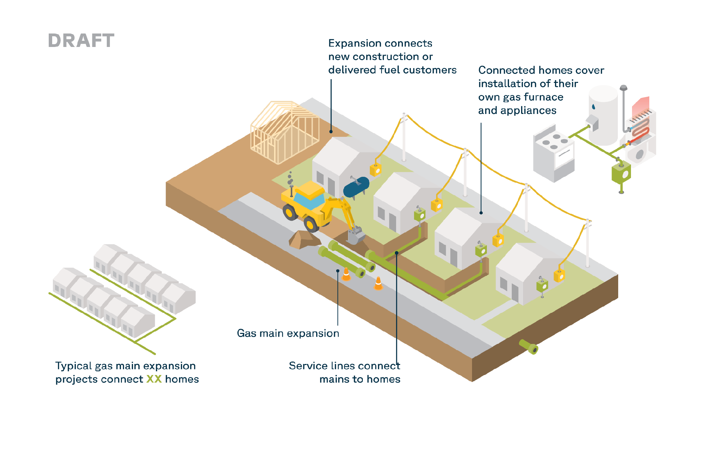

# Introduction

In order to connect new customers to the natural gas distribution system, gas
utilities fund the extension of their pipelines — and their own corporate
profits — by raising rates for existing customers. State regulators set the
size of these subsidies under rules called **Line Extension Allowances** (LEAs).

The dollars taken from ratepayers' bills to put new pipes in the ground amount
to only a down payment. Existing customers are locked in to pay off that
infrastructure, plus a bloated profit that utilities collect, over the pipe's
entire usable life. For some Illinois utilities, that is more than half a
century.

In the meantime, LEAs put consumers even further at risk for additional
financial hardships. As the benefits of electrification continue to lure
consumers away from natural gas for heating and cooking fuel, the customer
bases for Nicor, Peoples Gas, and Ameren could dwindle, leaving fewer
households to pay for LEAs through their bills. And the new pipes bankrolled by
LEAs are themselves subject to both market forces and climate policies. Changes
in either could render the infrastructure operationally obsolete long before it
has been paid for. These costly "stranded assets" would be most harmful to
lower-income households who can least afford to decouple themselves from the
legacy gas system.

So how much are Illinois consumers paying for the expansion of the gas system
under LEAs? How much money do gas utilities earn from those connections over
the life of the pipes? And what alternatives to this system are available?

This report presents the most complete analysis to date on what Illinois's
three major gas utilities (Nicor Gas, Peoples Gas, and Ameren Illinois) spend
on these system expansions. Furthermore, it offers the first quantification of
what a single year of LEA spending would cost each utility's ratepayers over
the full lifespan of the pipes they pay for.

The analysis draws on the Illinois Commerce Commission (ICC) recent staff
report on line extension allowances, discovery responses from recent ICC rate
cases, and a Switchbox amortization model built from each utility's own
approved regulatory parameters.[^icc_staff_report]

[^icc_staff_report]: Illinois Commerce Commission Staff, *Staff Report on
    Illinois Gas Utility Line Extension Policies* (CW Report — Line Extension),
    prepared by CW Financial and Management Group, May 2026. Directed by the
    Commission's Final Orders in Dockets 25-0055 (Nicor Gas) and 25-0084
    (Ameren Illinois), both dated November 19, 2025.

While this report provides unprecedented insight into the financial harm line
extension policies cause Illinois gas customers, the picture remains
incomplete. All three of these gas utilities either cannot or choose not to
make the full information on their LEA spending available to the public — or
to the ICC itself.

# Executive Summary

Illinois's three major gas utilities — Nicor Gas, Peoples Gas, and Ameren
Illinois — spent an estimated **$113.8 million** in 2022 (the most recent data
available) connecting new customers to the gas system under Line Extension
Allowances. Because these new gas hookups earn the utility a guaranteed profit
for decades, that one year of spending ultimately costs ratepayers far more:

- **Each year of LEA spending costs Illinois ratepayers roughly $284 million,
more than half of which is utility profit** — about **2.50x** what the
utilities actually spent putting new mains and service lines in the ground.

- Roughly **$170 million of that total is the profit utilities skim from the
expenditures,** so for every dollar spent on new pipes, utilities collect
nearly $1.50 more in profit, all from ratepayers.

- Nicor's 2022 LEA spending of $65.7 million would cost ratepayers
approximately **$181.9 million** over the assets' lives (**2.77x**). Peoples
Gas's 2022 spending would cost about **$50.9 million** (**1.90x**). Ameren's
2022 spending would cost about **$51.2 million** (**2.40x**).

- LEAs leave existing gas customers hostage to residual costs for decades. Once
a new main or service line extension is approved for construction, the
resulting expenditure is incorporated into a utility's permanent rate base and
paid down annually through customer bills. For Nicor, the average repayment
cycle for a new main or service line connection is 52 years; for Ameren it's
39 years; for Peoples Gas it's 20 to 34 years.

- **Existing customers fund almost all of this expansion.** For instance, the
ICC's staff report finds that existing **Nicor ratepayers bear** **94.8%** of
the cost of a new main extension (the highest share among the state's major
utilities, and the report's "highest category of cross-subsidization"). The
comparable figures are **76.9%** for Ameren and **67.1%** for Peoples Gas.

- At Nicor's current pace of building line extensions, paying off those new
connections makes up roughly **12% of customers' delivery charges every year**
— about **7% of the total bill**.

- **The Illinois Commerce Commission can act to effectively eliminate gas main
and service LEAs statewide.** The rules governing LEAs are regulatory, not
legislative. The Commission can act on its own authority through a rulemaking
proceeding without the need for legislation to directly address this issue.

- **Utilities do not consistently track or disclose LEA spending.** No utility
voluntarily publishes complete or consistent information on LEAs. Even the
ICC's own staff report could not obtain a complete picture. No utility reports
a single, standardized LEA spending figure, and some have explicitly objected
to requests for LEA data.

# Background

## What are Line Extension Allowances?

Each year, Illinois utilities connect thousands of new customers to the
state's gas distribution system.

Between 2018 and 2025, these utilities built hundreds of miles of **mains**
(the gas distribution lines that run under streets and neighborhoods). They
also built between 27,500 and 51,000 new **service** lines (the smaller pipes
that branch off the main to connect an individual building) annually. While
some of these connections are replacements for existing pipes, we estimate
that utilities added between **3,000 and 6,000 new customers per year** in
this period.[^phmsa_counts]

[^phmsa_counts]: U.S. Department of Transportation, Pipeline and Hazardous
    Materials Safety Administration, Gas Distribution Annual Report (Form
    F7100.1-1), 2017–2025. [@phmsa_GasDistributionAnnual_2025]

The customers receiving these new connections don't usually pay for them.
Instead, most of the cost is shifted onto other gas customers — covered through
increases to their monthly bills — under rules called Line Extension
Allowances, or LEAs.

Specifically, in Illinois, new customers are not required to pay for the first
100 to 200 feet of a main extension, or for the first 60 feet of a new service
line to connect their building to the main.[^tariff_thresholds]

[^tariff_thresholds]: These thresholds are codified in
    [Title 83, Part 501.600](https://www.ilga.gov/agencies/JCAR/EntirePart?titlepart=08300501)
    of the Illinois Administrative Code (for mains) as well as in individual
    ICC-approved tariff schedules (for service lines). A tariff is a utility's
    ICC-approved schedule of rates and service terms. Unlike main extensions,
    which are governed by a statewide administrative rule, service line
    allowances are set utility-by-utility in each company's tariff. Until 2025,
    Ameren Illinois voluntarily provided 400 feet of free main to new
    customers; in ICC Docket 25-0084, Ameren and the Public Interest
    Organizations agreed to reduce that allowance to 200 feet.
    [@iccTitle83Part2006]

In effect, LEAs hide the true cost of connecting a building to the gas system
from the developers and building owners who benefit from the new connections.
Because existing customers pay for the connection, gas heating seems cheaper
than it actually is. This creates a pricing distortion that makes cleaner
alternatives to gas heating (such as heat pumps) seem less
competitive.[^sb2269]

[^sb2269]: Bill SB2269, introduced in the Illinois General Assembly in 2025,
    would have required gas utilities to charge customers for the full
    incremental cost of new development and growth their connection creates.
    § 9-228.5 states: "Gas main and gas service extension policies shall be
    based on the principle that the full incremental cost associated with new
    development and growth shall be borne by the customers that cause those
    incremental costs." See
    [§ 9-228.5](https://www.documentcloud.org/documents/26212423-il-sb2269-villanueva/#document/p29/a2676215).
    [@villanueva_SB2269_2025]

The problem is statewide. While Illinois law only requires gas utilities to
provide LEAs to urban customers, most utilities also offer them to rural
customers, and the ICC currently approves this practice.[^rural_leas]

[^rural_leas]: Title 83, Part 501.600 of the Illinois Administrative Code
    mandates free main extension footage for urban customers. The companion
    provision, Section 501.610, governs rural extensions through a
    deposit-based mechanism rather than a free footage mandate. However, Ameren
    Illinois (which services much of rural Illinois) extends its main allowance
    to both urban and rural new customers under an agreement with ICC Staff
    (ICC Docket No. 03-0767, Appendix to Final Order, Jan. 25, 2006). The ICC
    currently approves this practice. [@iccTitle83Part2006]

## How do LEAs affect current customers' bills?

Utility companies make money by building infrastructure, not by selling gas.

When a utility company builds a new main extension or service line, the cost
of that infrastructure is added to the utility's rate base. The rate base is
the total value of the company's assets, which determines the amount of profit
that the utility can earn for its shareholders. The companies themselves
advocate for the size of that return, which is authorized by the ICC rather
than determined by the operation of a free market.

So when these companies build a new pipe under an LEA, their existing
customers must cover the construction cost plus the utility's guaranteed
profit margin on that investment. Gas customers pay for these costs through
their bills over the entire life of the pipe — for **Nicor's mains, that's**
**52 years**.[^depreciation_lives] In other words, customers keep paying for
the new connection, plus the company's profits, for decades after the
infrastructure is built.

[^depreciation_lives]: Depreciation lives vary by utility. Nicor's mains are
    the longest of the three at 52 years (services 50), versus roughly 20–34
    years for Peoples Gas's plastic pipe and ~38 years for Ameren's
    new-business assets. Nicor's customers pay the longest tail.

Here's how it works, using Nicor as an example.

Each year, Nicor builds a fresh round of line extensions. Counting both the
construction costs and the profit Nicor is guaranteed to earn over the decades
those pipes stay in service, that single year's worth of new connections ends
up costing customers approximately $182 million in total, which they pay back
to the utility over the course of the assets' roughly 50-year lives. But Nicor
makes this kind of investment *every year*, so Nicor's roughly 2.3 million
customers are always paying off many years' worth of extensions at once. In
fact, at today's expansion and return rates, the average Nicor customer pays
about $79 per year for line extensions, and will continue to do so for as long
as the buildout continues at this pace.[^overlapping_vintages]

[^overlapping_vintages]: The amount customers pay each year across all those
    overlapping vintages equals the full lifecycle cost of a single year's
    spending: $182 million, or about $79 per customer.

What percentage of an average gas bill does that come down to? Because a gas
bill has two parts, there are two answers. The supply part of the bill pays
for the gas itself, which a utility buys and then passes the cost straight
through to consumers, earning no profit. The delivery part of the bill pays
the utility back for building the pipe infrastructure that delivers that gas.
This is the part of the bill that pays for line extension allowances, among
other kinds of infrastructure. And this is where Nicor, and every other gas
utility, earns its profits.

For Nicor customers, LEAs represent about **12% of the delivery bill**. As a
share of the entire bill, gas included, they represent about **7%**.

## Why are states revisiting LEA policies?

Historically, LEAs were established to grow the gas distribution system,
allowing utilities to capitalize on economies of scale. More customers meant
cheaper service for everyone. LEAs made it cheaper to connect new customers to
the gas network, and that made sense when customers could be assumed to stay
in the system indefinitely. A growing customer base also meant the costs
associated with LEAs would be recouped through increased revenue over time,
making them even more attractive.[^vu_historical]

[^vu_historical]: See Vu and Bagdanov, "The End of Gas System Subsidies,"
    Building Decarbonization Coalition, August 2025. [@vu_EndGasSystem_2025]

But that's changing: rising gas bills, the growth of cost-effective electric
technology, and environmental concerns are pushing regulators to scrutinize
gas system spending overall — and the economics of gas system expansion no
longer look like a safe bet.

But even as regulators consider the viability of non-gas alternatives, they
must also take account of the risks of any potential transition. Shifting away
from the gas network to cheaper, cleaner alternatives can create "stranded
assets" — pieces of gas infrastructure (such as pipeline networks) that are
rendered obsolete or uneconomic before the end of their predicted useful life.
So as some customers shift away from gas, a shrinking pool of ratepayers would
be responsible for paying off investments in infrastructure they no longer
use.

LEAs exacerbate this problem. The gas mains and service lines built under LEAs
guarantee corporate profits for decades, regardless of whether or not those
pipes are useful, cost-effective, or safe for consumers.

Worse still, the costs of stranded assets can fall disproportionately on
lower-income ratepayers, who are often those least able to electrify their
homes and businesses. Renters have little say in how their landlord chooses to
heat their home, and residents of much older buildings face increased costs
for retrofitting their homes with electric alternatives.

Because of these risks, regulators and lawmakers across the country have begun
ending these subsidies. Six states have now moved to end LEAs outright:
California, Colorado, and New York have eliminated them
statewide,[^ca_co_ny] Washington and Oregon have ordered their largest gas
utilities to phase them out,[^wa_or] and just last week, Rhode Island's Public
Utilities Commission ordered a three-year phase-out of allowances for Rhode
Island Energy, the state's dominant gas utility.[^ri_phaseout] Several more
states are partway there: Massachusetts's utility regulator has ordered an end
to allowances in all but narrow circumstances, Maryland's commission has
concluded that new gas customers should pay the full cost of connecting
(though its implementing regulations have stalled), and Minnesota's two
largest gas utilities agreed to shrink their allowances in recent rate
cases.[^ma_md_mn] The savings are substantial: each of the three states that
eliminated LEAs earliest is saving its ratepayers an estimated $100–200
million per year.[^rmi_savings]

[^ca_co_ny]: California: CPUC Decision 22-09-026 (September 2022) eliminated
    gas line extension allowances effective July 2023. Colorado: SB 23-291
    (2023) prohibits gas utilities from providing line extension allowances
    for new gas service. New York: S.8417/A.8888, signed December 19, 2025,
    repeals the state's "100-foot rule"; a 2026 chapter amendment set the
    effective date at April 2027.

[^wa_or]: Washington: Avista and Puget Sound Energy eliminated gas LEAs
    effective January 1, 2025, with Cascade Natural Gas to follow by March
    2027 (WUTC Docket UG-210729). Oregon: the PUC ordered Avista to eliminate
    LEAs by January 2027 and NW Natural by November 2027 (Order Nos. 23-384
    and 24-359). [@vu_EndGasSystem_2025]

[^ri_phaseout]: Rhode Island Public Utilities Commission, Docket No. 25-45-GE
    (Rhode Island Energy rate case), decided August 21, 2026. The Commission
    ordered the line extension allowance phased out over three years,
    beginning with a 33% reduction in April 2027, and separately approved full
    decoupling of gas revenues from customer growth.

[^ma_md_mn]: Massachusetts: DPU Order 20-80-E (August 8, 2025) discontinues
    line extension allowances except where there is no technically feasible
    alternative to gas, with implementation through the utilities' Climate
    Compliance Plans. Maryland: PSC Order No. 91683, Case No. 9707 (June 2025)
    found that new gas customers should pay the full cost of extending
    service; the PSC returned draft implementing regulations to staff for
    further analysis in May 2026. Minnesota: the state's two largest gas
    utilities reduced per-connection allowances in rate case settlements in
    2022 and 2023. [@vu_EndGasSystem_2025]

[^rmi_savings]: Rocky Mountain Institute estimates that each of California,
    Colorado, and New York saves ratepayers $100–$200 million per year
    following LEA elimination. See Henchen et al., "Cutting These Subsidies
    Could Save States Millions of Dollars," RMI, 2025.
    [@henchen_CuttingTheseSubsidies_2025a]

## What can the ICC do about LEAs in Illinois?

The ICC has already begun a major review of the state's LEA policies in order
to determine what role, if any, this practice should play in Illinois's future
energy system.

In its November 2025 Final Orders in the Nicor and Ameren rate cases, the
Commission not only affirmed that "the historic policy rationale for line
extension allowances has changed," but also observed that "the energy
landscape is rapidly evolving," and expressed concern that these costs
represent a potential burden to ratepayers that may no longer provide
sufficient benefits to justify the costs.[^final_orders_2025]

[^final_orders_2025]: Illinois Commerce Commission, Final Order, Docket No.
    25-0084 (Ameren Illinois), November 19, 2025. The Commission's Final Order
    in Docket No. 25-0055 (Nicor Gas), issued the same day, reaches the same
    core conclusion. Both orders directed ICC Staff to issue a report on
    Illinois utilities' line extension policies within 180 days.
    [@final_order_Docket250084Ameren_2025]

The Commission then directed its staff to prepare a report on LEA policies.
The report, which was conducted by an independent consultant, and was released
in May 2026, shed new light on the scale of LEA-funded expansion and on how
unevenly its costs fall on existing customers. Switchbox's analysis
contributes additional, previously unreleased information about past, present,
and future LEA spending.

If the ICC decided to end LEAs, it could do so on the basis of its existing
statutory authority, without needing further legislation:

**Main extensions** are governed by Title 83, Part 501.600 of the Illinois
Administrative Code. That regulation mandates that gas utilities provide a
certain amount of main extension footage to new customers. The ICC can repeal
this rule through a **rulemaking proceeding** that doesn't require
legislation.[^rulemaking]

[^rulemaking]: "Rulemaking proceeding" refers to the formal process by which
    the ICC adopts, amends, or repeals administrative rules. This process
    involves public notice, comment periods, and commission votes, but does
    not require action by the General Assembly.

**Service line extensions** are governed differently. Utilities recover
service line costs by including them in their rate base during **rate cases**.
The ICC can simply disallow this inclusion in any future rate
cases.[^rate_cases]

[^rate_cases]: "Rate cases" are the periodic proceedings where utilities ask
    the ICC to let them adjust the rates they charge customers.

# Findings

This report's findings draw on three bodies of evidence:

1. Spending data extracted from ICC rate cases — Docket 23-0066 (Nicor Gas),
Dockets 23-0068 and 23-0069 (Peoples Gas), and Dockets 23-0067 and 25-0084
(Ameren Illinois).

2. The ICC's staff report on line extension policies.

3. An amortization model built from each utility's own approved regulatory
parameters.[^findings_dockets]

[^findings_dockets]: See [ICC Docket 23-0066](https://www.documentcloud.org/documents/26188653-nicor-p2023-0066-pio-exhibit-12-30205654/) (Nicor Gas PIO Exhibit 12), [ICC Docket 23-0068](https://www.documentcloud.org/documents/26189740-peoplesgas-p2023-0068-pio-exhibit-12-64269107/) and [23-0069](https://www.documentcloud.org/documents/26189763-peoples-gas-p2023-0069-pio-cross-exhibit-100-95312469/) (Peoples Gas), and [ICC Docket 23-0067](https://www.documentcloud.org/documents/26188848-ameren-p2023-0067-pio-exhibit-12-96925852/) and [25-0084](https://www.documentcloud.org/documents/26193410-ameren-p2025-0084-pio-exhibit-12-57399815/) (Ameren Illinois Gas). No utility voluntarily publishes this data. [@northernillinoisgascompany_Docket230066Nicor_2023; @peoplesgas_Docket230068Peoples_2023; @kilhoffer_Docket230067Ameren_2023]

The authors of this report combined these sources with the best estimates for
missing data in order to give the most comprehensive picture currently
available of the proportion of new gas connection costs paid for by
ratepayers. Where one source is more reliable for a given figure, or where a
figure is an estimate, it is clearly indicated.

## What does LEA spending look like at the block level?

To understand how much it costs existing ratepayers to connect a new customer
to the gas system, let's look at a hypothetical residential block in 2022 in
the Chicago suburbs — Nicor's territory. A new main runs under the street and
a service line branches off it to each house. Inside each house there's also a
furnace.

Each household pays in full for its own furnace, but the pipes needed to bring
gas to the house are mostly paid for by existing Nicor customers through their
bills. The service line and the new main look nearly free to the developer or
homebuyer, but they're actually a multi-thousand-dollar charge spread across
every other ratepayer on the system (@fig-block-level).

:::{.column-page-inset-right}
{#fig-block-level}
:::

**The main extension costs up to $11,846 in 2022 (and up to $15,202 in 2023),
paid by all other customers.**[^nicor_main_allowance]

[^nicor_main_allowance]: Under its tariff, Nicor must build the first 200 feet
    of a high-pressure main at no charge to the new customer. It reports the
    dollar value of that allowance as its per-foot main cost times 200 feet.
    Nicor's filings never define a "connection" — whether it means a building,
    a dwelling unit, or a meter. Both the ICC's report and Nicor use the proxy
    of one connection per customer, so this report follows that convention.
    Reported as `lea_cost_per_customer` for high-pressure mains. ICC Docket
    23-0066, PIO Exhibit 12,
    [p. 31](https://www.documentcloud.org/documents/26188653-nicor-p2023-0066-pio-exhibit-12-30205654/#document/p31/a2674817).
    [@northernillinoisgascompany_Docket230066Nicor_2023]

**The service line costs about $2,821, paid by all other
customers.**[^nicor_service_cost]

[^nicor_service_cost]: Nicor does not report a per-connection service cost.
    This number is calculated by dividing total service line spending over
    2018–2022 (net of customer contributions) by the number of service line
    projects over the same period. As with mains, Nicor does not define a
    "project," so this analysis treats one project as one connection.
    Calculated from ICC Docket 23-0066, PIO Exhibit 12: 2018–2022 net service
    line spending divided by 2018–2022 service line project counts.
    [@northernillinoisgascompany_Docket230066Nicor_2023]

**The furnace: paid by the homeowner.** Unlike the pipes, the furnace inside
each house is bought and installed at the customer's own expense.

The Nicor example is not an outlier. In 2022, Peoples Gas customers paid an
average of **$11,784** in combined main and service line costs for each new
single-family connection, and Ameren reported a standard cost equivalent of
**$6,376** per new main-extension connection — a figure that does not include
service lines. Each utility's per-connection costs are shown in detail below.

## What does LEA spending look like at the state level?

In 2022 — the last year with data across all three major utilities — existing
Illinois gas customers paid an estimated total of **$113.8 million** under
LEAs.[^service_costs]

[^service_costs]: Nicor main and service costs: ICC Docket 23-0066, PIO Exhibit 12, [p. 33](https://www.documentcloud.org/documents/26188653-nicor-p2023-0066-pio-exhibit-12-30205654/#document/p33/a2675139) (main gross), [p. 33](https://www.documentcloud.org/documents/26188653-nicor-p2023-0066-pio-exhibit-12-30205654/#document/p33/a2675140) (service gross), [p. 34](https://www.documentcloud.org/documents/26188653-nicor-p2023-0066-pio-exhibit-12-30205654/#document/p34/a2675143) (CIAC). Peoples Gas main and service costs: ICC Docket 23-0068, PIO Exhibit 12, [p. 36](https://www.documentcloud.org/documents/26189740-peoplesgas-p2023-0068-pio-exhibit-12-64269107/#document/p36/a2674688) (mains), [p. 36](https://www.documentcloud.org/documents/26189740-peoplesgas-p2023-0068-pio-exhibit-12-64269107/#document/p36/a2674690) (service). Peoples main figures explicitly net of customer contributions; same treatment assumed for service lines as no separate CIAC is disclosed. Ameren SWO C3231: ICC Docket 23-0067, PIO Exhibit 12, [p. 13](https://www.documentcloud.org/documents/26188848-ameren-p2023-0067-pio-exhibit-12-96925852/#document/p13/a2674478). [@northernillinoisgascompany_Docket230066Nicor_2023; @peoplesgas_Docket230068Peoples_2023; @kilhoffer_Docket230067Ameren_2023]

| Utility | Mains (net of customer contributions) | Service lines | Total |
|---|---|---|---|
| Nicor Gas | $31,080,414 | $34,624,181 | $65,704,595 |
| Peoples Gas | $6,401,127 | $20,348,036 | $26,749,163 |
| Ameren Illinois Gas | $21,349,683 (combined)[^ameren_combined] | — | $21,349,683 |
| **Total** | | | **$113,803,441**

[^ameren_combined]: Ameren doesn't track LEA spending as its own category.
    This analysis uses its internal standing work order C3231, which covers
    "gas mains, service lines, fittings and other material associated with new
    service requests", as one combined category.

That amount combines main extension and service line spending, minus customer
contributions, for Nicor Gas, Peoples Gas, and Ameren Illinois Gas.

Nicor Gas accounts for more than half of total statewide LEA spending, with
Peoples Gas and Ameren Illinois Gas making up the remainder
(@fig-statewide-lea-2022).

:::{.column-page-inset-right}

:::

This estimate is an approximation. In particular, this analysis is limited by
the unavailability of two pieces of information that Ameren and Peoples Gas do
not report to the public.[^data_caveats]

[^data_caveats]: In brief: Ameren does not report LEA spending as a separate
    line item, so its figure may include costs beyond traditional line
    extensions. Peoples Gas's rate cases do not indicate whether service line
    spending is net of customer contributions (CIAC); this analysis assumes
    the same net treatment as its main extension figures.

## What share of a new connection do existing customers pay?

LEAs shift the costs of new connections from the new customer to everyone
else: existing customers pay so that new ones don't have to. How large that
shift is differs sharply by utility, and Nicor's is the largest of the three.
When Nicor builds a new main extension, existing customers fund **94.8%** of
the construction cost — and then pay the utility's profit on that rate-based
amount over the life of the pipe. The comparable figure is **76.9%** for
Ameren and **67.1%** for Peoples Gas.[^csm_shares]

[^csm_shares]: Illinois Commerce Commission Staff, *Staff Report on Illinois
    Gas Utility Line Extension Policies*, May 2026, Chapter 5 (Cost
    Responsibility and Cross-Subsidization Analysis), pp. 72–73. Customer
    share vs. ratepayer share of total extension costs: Nicor 5.2%/94.8%;
    Ameren 23.1%/76.9%; Peoples Gas 32.9%/67.1%.

The ICC's report places Nicor in its **highest category of
"cross-subsidization"** — the report's term for the share of new-connection
costs borne by existing ratepayers. In other words, while all three of the
major Illinois gas utilities pursue this cost-shifting strategy, state
regulators confirm that Nicor is by far the most aggressive in passing on its
expansion costs to existing customers.

## What do Illinois ratepayers pay over the life of the pipes?

The $113.8 million above is what the utilities spent in 2022. But, over time,
the financial burden on gas customers is much higher because every new pipe
enters the utility's rate base, ratepayers repay the construction cost *and*
pay the utility a regulated return, every year, until the pipe is fully
depreciated. That return goes to the corporation's shareholders and debt
holders, as well as to state and federal taxes.

In order to estimate each utility's LEA-related profits, Switchbox built an
amortization model using each utility's own approved rate of
return.[^amortization_model] Here's what we found:

[^amortization_model]: See the Data and Methods appendix for the model's
    parameters and sources. In brief: each utility's 2022 LEA capital
    additions are amortized straight-line over the asset's approved
    depreciation life, with ratepayers funding annual depreciation plus the
    approved pre-tax rate of return on the tax-adjusted rate base. Parameters
    come from Nicor Docket 25-0055, Peoples Gas Dockets 23-0068/69 (Cons.),
    and Ameren Docket 25-0084.

- **Nicor**: **$65.7 million** of 2022 LEA spending would cost ratepayers
approximately **$181.9 million** over the assets' lives — **2.77x** the
original outlay (mains 2.80x, services 2.74x). About **$116.2 million** of
that is utility profit — above the construction cost itself.

- **Peoples Gas**: $26.7 million of 2022 spending would cost about
**$50.9 million** (**1.90x**), of which roughly **$24.2 million** is utility
profit.

- **Ameren**: $21.3 million of 2022 spending would cost about
**$51.2 million** (**2.40x**), of which roughly **$29.9 million** is utility
profit.

- **Statewide**: the $113.8 million that Illinois's three major utilities
spent in 2022 would ultimately cost ratepayers approximately **$284 million**
— **2.50x** the original spending — with roughly **$170 million** of that
being utility profit.

The chart below compares each utility's 2022 LEA spending to its full
lifecycle cost to ratepayers (@fig-lifecycle-cost).

:::{.column-page-inset-right}

:::

## Where does the money above the construction cost go?

The gas utilities' return on capital breaks down into three parts: (1)
Shareholder returns (2) Interest payments to debt holders (3) Income taxes on
the equity return

In order to see how this money is distributed, this analysis reviews Nicor's
return on capital. Of the $181.9 million that Nicor's 2022 LEA spending would
cost ratepayers, $65.7 million repays the original construction. The remaining
**$116.2 million** is the utility's return on capital.

- **Equity holders** — Southern Company shareholders — would receive about
**$65.3 million** (56% of the return). These are the shareholder returns.

- **Bondholders** would receive about **$28.6 million** in interest payments.

- **State and federal government** would receive about **$22.3 million** in
income taxes on the equity return.

Put in per-dollar terms: for every **$1** Nicor spends on a new main
extension, ratepayers would pay back about **$2.80** over the pipe's 52-year
life. Of the $1.80 above the original dollar, roughly **$1.46 is a return to
investors**.

This is what makes LEAs so attractive to the utilities — and so costly to
their customers. The companies are incentivized to keep growing their gas
network, not necessarily because the expansion serves their existing
customers, but because every rate-based dollar earns a guaranteed return for
decades.

That arrangement is risk-free for the company: if demand for gas shrinks and
some of this infrastructure is no longer needed, the cost of those stranded
investments would likely fall not on the gas utility's shareholders, but on
the customers still paying the pipes off. Those same ratepayer dollars could
just as easily fund lower-cost, lower-risk ways of heating these homes — such
as heat pumps — without putting existing customers on the hook for decades of
fixed payments on assets they may not need.

## What would LEAs cost customers if they continue at today's pace?

So far this report has followed a single year of LEA spending — the 2022
cohort — through its multi-decade payback. But 2022 is not special: if LEAs
continue at roughly the current pace, ratepayers would eventually pay the
equivalent of the lifetime cost of about one full cohort of pipes every single
year.[^steady_state]

[^steady_state]: These are steady-state, nominal, order-of-magnitude
    benchmarks — not measurements of today's bills. See the Data and Methods
    appendix ("Steady-state benchmark and bill shares") for the derivation,
    the revenue denominators, and the caveats. Because pipe has a 52 year
    expected life, customers are paid off 1/52 of each of the previous 52
    cohorts of LEA spending every year. Adding them up provides the equivalent
    of one full cohort's lifecycle cost.

Here is what that would look like for each utility:

- **Nicor**: approximately **$181.9 million per year**, or roughly **$79 per
customer per year** across Nicor's 2.3 million customer
accounts.[^customer_counts] That is roughly **11%–12% of Nicor's annual
delivery revenue** — and about **7% of the total bill**.

- **Peoples Gas**: approximately **$50.9 million per year**, or roughly
**$57 per customer per year**. That is roughly **5% of Peoples Gas's approved
annual delivery revenue** — and about **4% of the total
bill**.[^peoples_denominators]

- **Ameren**: approximately **$51.2 million per year**, or roughly **$63 per
customer per year**. That is roughly **7.5% of Ameren's approved annual gas
delivery revenue** — and about **5.5% of the total gas
bill**.[^ameren_denominators]

[^customer_counts]: Customer counts: 2,289,040 Nicor, 893,330 Peoples Gas, and
    810,370 Ameren customer accounts in 2025, per the ICC staff report
    (Chapter 3, Chart 2). U.S. DOT PHMSA data reports lower figures (roughly
    2.07 million for Nicor in 2025) because PHMSA counts physical service
    connections (meters) rather than billed customer accounts. This report
    uses the ICC account basis throughout. [@phmsa_GasDistributionAnnual_2025]

[^peoples_denominators]: Switchbox calculation. Delivery denominator: Peoples
    Gas's approved revenue requirement of approximately $1.0 billion (ICC
    Dockets 23-0068/69 Cons., Final Order Appendix B, Schedule 1). Total-bill
    denominator: a Switchbox estimate of approximately $1.4 billion,
    attributing Peoples Gas's share of customer accounts (about 84%) of the
    $1.6 billion of 2024 operating revenues WEC Energy Group reports for its
    combined Illinois segment (Peoples Gas plus North Shore Gas; WEC Energy
    Group 2024 Form 10-K).

[^ameren_denominators]: Switchbox calculation. Delivery denominator: Ameren's
    approved gas revenue requirement of approximately $683 million (ICC Docket
    25-0084, Final Order Appendix, Schedule 1). Total-bill denominator: $938
    million of 2024 operating revenues for the Ameren Illinois Natural Gas
    segment (Ameren 2024 Form 10-K).

## How much do gas customers pay under LEAs?

Illinois's three largest utilities each make different decisions about how to
take advantage of LEAs. Each utility chooses the per-connection costs of new
gas connections, and the share of these costs that will be paid for by
existing ratepayers.

### Nicor

#### How much do Nicor customers pay?

From 2018 to 2022, existing Nicor customers paid an average of
**$23.2 million** per year to extend gas mains, and **$25.3 million** per year
to build service lines for new customers (net of customer
contributions).[^nicor_historical]

[^nicor_historical]: See ICC Docket 23-0066, PIO Exhibit 12.
    [@northernillinoisgascompany_Docket230066Nicor_2023]

And Nicor's customer base is only getting bigger. U.S. Department of
Transportation data shows Nicor's service connections growing steadily, adding
roughly 5,000–7,000 net new connections per year.[^phmsa_nicor] A larger
customer base means more new connections, higher LEA spending, and greater
financial burden for existing gas customers.

[^phmsa_nicor]: U.S. Department of Transportation, Pipeline and Hazardous
    Materials Safety Administration, Gas Distribution Annual Report (Form
    F7100.1-1), 2017–2025. PHMSA reports Nicor's physical service connections
    growing from approximately 2.03 million in 2017 to 2.07 million in 2025;
    the ICC staff report counts approximately 2.29 million customer accounts
    in 2025 (see the customer-count footnote above).
    [@phmsa_GasDistributionAnnual_2025]

Both main extension and service line spending have grown in step with Nicor's
expanding customer base, and the utility's own forecasts show that trajectory
continuing through 2029 (@fig-nicor-lea-trend).[^nicor_forecast]

[^nicor_forecast]: Forecast data for 2023–2026 comes from ICC Docket 23-0066
    PIO Exhibit 12. Forecast data for 2026–2030 (plotted as combined, without
    service/main breakdown) comes from ICC Docket 25-0055 PIO Cross Exhibit
    2.0,
    [p. 46](https://www.documentcloud.org/documents/26193423-nicor_p2025-0055-pio-cross-exhibit-20-51703648/#document/p46/a2675138).
    2026 appears in both filings; the chart stacks the 23-0066 service/main
    breakdown and shows the 25-0055 delta as combined.
    [@northernillinoisgascompany_Docket250055LongTerm_2025]

:::{.column-page-inset-right}

:::

#### What does each Nicor connection cost?

Connecting a single new home in Nicor territory can cost existing customers up
to **$15,202** for the main extension (the 2023 maximum allowance), while a
service line costs roughly **$3,716** (the 2022 average cost per service line
project).[^nicor_3716]

[^nicor_3716]: Calculated as 2022 net service line spending ($34,624,181)
    divided by the number of service line projects (9,318). ICC Docket
    23-0066, PIO Exhibit 12,
    [p. 33](https://www.documentcloud.org/documents/26188653-nicor-p2023-0066-pio-exhibit-12-30205654/#document/p33/a2675140)
    (costs),
    [p. 35](https://www.documentcloud.org/documents/26188653-nicor-p2023-0066-pio-exhibit-12-30205654/#document/p35/a2675145)
    (project counts). [@northernillinoisgascompany_Docket230066Nicor_2023]

These connection costs are growing. The maximum LEA payment for a
main-extension connection more than doubled, from **$6,412 in 2019 to $15,202
in 2023**, driven by per-foot main costs that themselves more than doubled
over the same period, from **$32.06** to **$76.01**.[^nicor_perfoot] The chart
below traces this escalation for both main extensions and service lines,
showing how rapidly the cost of each new Nicor connection has grown since 2019
(@fig-nicor-per-connection-cost).

[^nicor_perfoot]: Per-foot costs for high-pressure mains. ICC Docket 23-0066,
    PIO Exhibit 12,
    [p. 31](https://www.documentcloud.org/documents/26188653-nicor-p2023-0066-pio-exhibit-12-30205654/#document/p31/a2674817).
    [@northernillinoisgascompany_Docket230066Nicor_2023]

:::{.column-page-inset-right}

:::

In other words: not only is the number of new connections growing every year,
but so is the cost of each of those connections.

### Peoples Gas

#### How much do Peoples Gas customers pay?

From 2018 to 2022, Peoples Gas customers paid an average of **$5.6 million**
per year to extend gas mains and **$15.5 million** per year to build service
lines for new customers. That's **$21.1 million** per year.

And while Peoples forecasted that it would decrease its spending on *main*
extensions from $5.2 million in 2023 to $4.0 million in 2024, it
simultaneously forecasted that it would increase spending on *service line*
extensions from $17.2 million in 2023 to $18.5 million in
2024.[^peoples_spending]

[^peoples_spending]: Peoples Gas main figures reported as "NonQIP main
    expenditures" net of customer contributions. Historical (2018–2022): ICC
    Docket 23-0068, PIO Exhibit 12,
    [p. 36](https://www.documentcloud.org/documents/26189740-peoplesgas-p2023-0068-pio-exhibit-12-64269107/#document/p36/a2674688).
    Forecast (2023–2024):
    [p. 39](https://www.documentcloud.org/documents/26189740-peoplesgas-p2023-0068-pio-exhibit-12-64269107/#document/p39/a2674694).
    Service line historical:
    [p. 36](https://www.documentcloud.org/documents/26189740-peoplesgas-p2023-0068-pio-exhibit-12-64269107/#document/p36/a2674690),
    forecast:
    [p. 40](https://www.documentcloud.org/documents/26189740-peoplesgas-p2023-0068-pio-exhibit-12-64269107/#document/p40/a2674695).
    [@peoplesgas_Docket230068Peoples_2023]

:::{.column-page-inset-right}

:::

Peoples Gas's LEA spending on mains and service lines from 2018 through 2024,
with forecasted figures for 2023–2024, shows service line spending sustained
at over $15 million per year while main extension spending declines
(@fig-peoples-lea-trend).

#### What does each Peoples Gas connection cost?

**Peoples Gas does not report a cost per connection for either main or service
line extensions separately.** However, a review of rate cases before the ICC
found that in 2022 (the last year for which complete data was available)
Peoples Gas customers paid an average of **$11,784** to extend gas mains and
build service lines for each new single-family connection.[^peoples_11784]

[^peoples_11784]: Combined main and service line cost per new single-family
    residential connection. Multi-family costs not disclosed. ICC Docket
    23-0069, PIO Cross-Exhibit 10.0,
    [p. 1](https://www.documentcloud.org/documents/26189763-peoples-gas-p2023-0069-pio-cross-exhibit-100-95312469/#document/p1/a2674697).
    [@peoplesgas_Docket230069PIO_2023]

:::{.column-page-inset-right}

:::

The chart above shows the combined per-connection cost — covering both main
extensions and service lines — for new single-family residential connections
to Peoples Gas's system between 2020 and 2022
(@fig-peoples-per-connection-cost).

### Ameren Illinois Gas

#### How much do Ameren customers pay?

Remarkably, Ameren has denied requests in rate-case discovery to report
directly on LEA spending. As an approximation, this report uses Ameren's
distribution **standing work order** (SWO) spending as a proxy for LEA
costs.[^ameren_swo]

[^ameren_swo]: The Standing Work Order, or SWO (internal code C3231), covers
    gas mains, service lines, fittings, and other materials associated with
    new service requests. A separate transmission SWO (C3160) is excluded as
    it covers large-scale equipment rather than new-customer connections.
    [@kilhoffer_Docket230067Ameren_2023]

Using SWO data from 2021, Ameren spent an estimated **$20.1 million** under
LEAs that year. In 2022, that spending increased to
**$21.3 million**.[^ameren_swo_calc]

[^ameren_swo_calc]: Ameren SWO C3231 gross and CIAC. ICC Docket 23-0067, PIO
    Exhibit 12,
    [p. 13](https://www.documentcloud.org/documents/26188848-ameren-p2023-0067-pio-exhibit-12-96925852/#document/p13/a2674478)
    (2021–2022),
    [p. 14](https://www.documentcloud.org/documents/26188848-ameren-p2023-0067-pio-exhibit-12-96925852/#document/p14/a2674480)
    (2023–2024 forecast). Net figures: 2021 $21,486,023 − $1,355,566 =
    $20,130,457; 2022 $22,217,528 − $867,845 = $21,349,683. Note that the ICC
    staff report's Ameren figure — approximately $2.5 million per year,
    averaged over 2016–2025 — covers main extensions only and is not
    comparable to the C3231 proxy, which combines mains, services, fittings,
    and other new-business materials. [@kilhoffer_Docket230067Ameren_2023]

This spending is particularly notable because unlike Nicor and Peoples Gas,
Ameren's customer base is shrinking. U.S. Department of Transportation data
shows Ameren has lost approximately 1,000 to 2,000 service connections per
year consistently since 2017. The total number of connections has declined
from roughly 819,000 in 2017 to 809,000 in 2025.[^phmsa_ameren]

[^phmsa_ameren]: U.S. Department of Transportation, Pipeline and Hazardous
    Materials Safety Administration, Gas Distribution Annual Report (Form
    F7100.1-1), 2017–2025. [@phmsa_GasDistributionAnnual_2025]

**In other words, Ameren's ratepayers are likely funding more than $20 million
annually of new infrastructure — for a pipeline network that serves fewer and
fewer customers each year.** And each of those dollars would cost ratepayers
2.40x over the assets' roughly 38-year composite life. Fewer remaining
customers, splitting a multi-decade bill that keeps growing: this is a clear
example of the stranded-cost dynamic.

Ameren's annual LEA spending rose steadily from 2021 through 2024, even as its
total service connections declined (@fig-ameren-spending-trend).

:::{.column-page-inset-right}

:::

#### What does each Ameren connection cost?

Ameren reports an **average standard cost equivalent** per new connection —
the dollar value of the free main extension footage it provides. These figures
cover main extensions only. Because they do not include service line
extensions, they likely underestimate the true cost of connecting a new
customer to Ameren's network.

The best estimate is that Ameren's per-connection cost rose from **$5,539** in
2021 to **$7,331** in 2025 (for main extensions only — service lines were not
separately reported) (@fig-ameren-per-sce).

:::{.column-page-inset-right}

:::

## Why is LEA spending data so difficult to obtain?

No utility has made their complete LEA spending data available to the public.
This analysis used data extracted from discovery responses in ICC rate case
filings.

Regrettably, even formal discovery procedures aren't sufficient to give the
public a clear understanding of LEA spending and its impact on customers.
Utilities can object to requests for data on the grounds that isolating the
information would require too much work — the legal term is "an objection on
grounds of undue burden." As a result, no utility reported a standardized LEA
spending figure. Nicor provided the most detailed data, including
per-connection costs, but no other utility replicated that level of
disclosure. Peoples Gas does not track service line extension costs as a
separate category, while Ameren has denied requests to report directly on LEA
spending.

Even the authors of the report commissioned by the ICC itself could not obtain
a set of comprehensive, standardized spending figures that disclose the full
impact of LEA costs on Illinois ratepayers.

# Appendix

## Acknowledgments

The authors would like to thank:

- Bradley Cebulko, Current Energy Group
- Sarah Moskowitz, Citizens Utility Board
- Eric DeBellis, Citizens Utility Board
- Jim Chilsen, Citizens Utility Board
- Mike Truppa
- Stephanie Blumenthal, Faith in Place
- Liliana Scales, Illinois Clean Jobs Coalition
- Kristin George Bagdanov, Building Decarbonization Coalition
- Tiffany Vu, Building Decarbonization Coalition
- Lizzy Case, Switchbox
- Ben Oldenburg
- Energy Foundation

## Data and Methods

### Data collected from rate case filings

All source data used in this report is available in consolidated form in our
[public input data spreadsheet](https://docs.google.com/spreadsheets/d/1b6I4uyH8H2FiMoeM-trO7eAWk_X2AYhovzEbS9u1cfM/edit?gid=527161228#gid=527161228),
which links each figure to its original ICC filing.

LEA spending figures in this report come from rate cases for the three major
Illinois gas utilities. No utility voluntarily publishes this data.

**Nicor Gas** ([ICC Rate Case 23-0066](https://www.documentcloud.org/documents/26188653-nicor-p2023-0066-pio-exhibit-12-30205654/)):

- *Main extension spending*: Reported as `extension_cost` by year
  (2018–2022 historical, 2023–2026 forecast), net of Contributions in Aid
  of Construction (CIAC) which Nicor reports separately as
  `customer_contribution`. Figures in this report reflect the net amount
  (gross minus CIAC).
- *Service line spending*: Same structure as main extensions, with
  separate CIAC figures for service lines.
- *Per-connection main extension cost*: Reported directly by Nicor as
  `lea_cost_per_customer` (2019–2023). Nicor is the only utility in our
  sample that reports a standardized per-connection figure.
- *Service line per-project cost*: Not directly reported. Calculated
  as total service line extension cost (net of CIAC) divided by the number
  of service line projects (`n_projects`). This analysis interprets one
  project as one connection.
- *Per-foot main extension cost*: Reported directly by Nicor for
  high-pressure mains (2019–2023).
- *Extended forecast (2026–2030)*: ICC Docket 25-0055, PIO Cross Exhibit
  2.0 provides an additional source of forecast data covering 2026–2030.
  These figures are reported in aggregate only (no service/main
  breakdown), so they are shown as combined in @fig-nicor-lea-trend and
  in @tbl-data-availability.

**Peoples Gas** ([ICC Rate Case 23-0068](https://www.documentcloud.org/documents/26189740-peoplesgas-p2023-0068-pio-exhibit-12-64269107/); [ICC Rate Case 23-0069](https://www.documentcloud.org/documents/26189763-peoples-gas-p2023-0069-pio-cross-exhibit-100-95312469/)):

- *Main extension spending*: Reported as `lea_cost` by year (2018–2022
  historical, 2023–2024 forecast). Peoples' filing explicitly states main
  figures are "net of customer contributions."
- *Service line spending*: Reported as `lea_cost` by year with the same
  structure. Peoples does not separately disclose CIAC amounts for service
  lines. The figures are therefore assumed to also be net of customer
  contributions, consistent with the treatment of main extensions in the
  same filing.
- *Per-connection combined cost*: Reported as `cost_per_new_service`
  (2020–2022), covering single-family residential connections only.
  Multi-family connection costs were not disclosed.
- *Service line project counts*: Reported for 2018–2022. Peoples does not
  forecast service line project counts, describing this work as
  customer-driven.

**Ameren Illinois Gas** ([ICC Rate Case 23-0067](https://www.documentcloud.org/documents/26188848-ameren-p2023-0067-pio-exhibit-12-96925852/); [ICC Rate Case 25-0084](https://www.documentcloud.org/documents/26193410-ameren-p2025-0084-pio-exhibit-12-57399815/)):

- *LEA spending*: Ameren does not track LEA spending as a separate
  category. This analysis uses the distribution standing work order (SWO,
  internal code C3231) as the closest available proxy. Per Ameren's filing,
  C3231 covers "gas mains, service lines, fittings and other material
  associated with new service requests." Figures are reported as
  `distribution_extensions_total` (gross) and
  `distribution_extensions_customer_contributions` (CIAC). This report uses
  net figures. A separate transmission SWO (C3160) is excluded as it
  covers large-scale equipment rather than new-customer connections.
- *Per-connection cost*: Reported as the standard cost equivalent for the
  free main extension footage (`max_lea_cost_per_connect`, 2021–2025). This
  covers main extensions only. Service line costs are not reported
  separately.

### Data availability

The data available for each utility varies substantially in both completeness
and comparability. Nicor Gas provides the most detailed disclosures, including
per-connection costs for main extensions and separate CIAC figures for both
mains and service lines. Peoples Gas provides total spending figures but does
not isolate service line CIAC amounts, and does not forecast service line
project counts. Ameren Illinois does not track LEA spending as a distinct
category at all. The SWO C3231 figures used in this report are the closest
available proxy.

```{r}
#| label: setup-gt-table
#| include: false

suppressPackageStartupMessages({
  library(gt)
  library(tidyverse)
})

load("report_vars.RData")

gt_table$`_data`[6, "Services Total"] <- "2023-2024"
gt_table <- gt_table |>
  tab_style(
    style = cell_fill(color = "#fff3cd"),
    locations = cells_body(columns = `Services Total`, rows = 6)
  )

gt_table <- gt_table |>
  tab_options(
    table.font.size = px(8),
    container.overflow.x = FALSE,
    container.overflow.y = FALSE
  )
```

```{r}
#| label: tbl-data-availability
#| tbl-cap: "Data availability by utility, metric, and period. Green indicates complete data; yellow indicates partial or caveated data; red indicates data not available or not provided. Peoples Gas forecast service line spending (2023–2024) is reported net of customer contributions in ICC Docket 23-0068, though the utility does not maintain forecasts for this category."
#| echo: false

gt_table
```

This inconsistency is itself a finding. Illinois ratepayers cannot make
informed decisions about gas system expansion when the three utilities
serving the state use three different accounting methods, and when one of
them does not separately track LEA spending at all.

### ICC staff report figures

Several figures in this report come from the ICC staff report on line
extension policies (Illinois Commerce Commission Staff, *Staff Report on
Illinois Gas Utility Line Extension Policies*, prepared by CW Financial and
Management Group, May 2026, as directed by the Commission's November 19, 2025
Final Orders in Dockets 25-0055 and 25-0084):

- **Ratepayer shares of new-extension costs** (Nicor 94.8%, Ameren 76.9%,
  Peoples Gas 67.1%): Chapter 5 (Cost Responsibility and Cross-Subsidization
  Analysis), pp. 72–73. The report's Cross-Subsidization Metric (CSM) divides
  total extension costs between the connecting customer and existing
  ratepayers; ratepayer share is quoted here.

- **Customer accounts** (Nicor 2,289,040; Peoples Gas 893,330; Ameren 810,370;
  all 2025): Chapter 3, Chart 2. PHMSA reports lower connection counts
  (roughly 2.07 million for Nicor in 2025) because it counts physical service
  connections (meters) rather than billed customer accounts; the ICC account
  basis is used throughout this report.

- **Ameren mains-only spending** (approximately $2.5 million per year,
  averaged over 2016–2025): this figure covers main extensions only and is
  not comparable to the C3231 proxy used in this report, which combines
  mains, services, fittings, and other new-business materials. The two are
  kept separate throughout.

### Lifecycle (amortization) model

The lifecycle cost and multiplier figures in this report come from a Switchbox
amortization model that estimates the cumulative ratepayer cost of one year
(2022) of each utility's LEA capital additions, amortized over the asset's
approved depreciation life. For each year of the asset's life, ratepayers fund
(a) depreciation — the straight-line recovery of the construction cost — and
(b) return on capital, equal to the utility's approved pre-tax rate of return
applied to the tax-adjusted rate base. Tax adjustment follows IRS
normalization rules: book depreciation is straight-line over the approved
life, while tax depreciation follows the 20-year MACRS schedule, and the
resulting accumulated deferred income taxes (ADIT) reduce the rate base.
Negative ADIT balances are floored at zero, which is slightly conservative (it
understates ratepayer cost). The return on capital is further decomposed into
shareholder profit, interest to bondholders, and income taxes on the equity
return using Nicor's approved capital structure (listed below); this
decomposition underlies the "Where does the money above the construction cost
go?" section.

Model parameters, all drawn from each utility's most recent approved rate
case:

- **Nicor** (Docket 25-0055): pre-tax rate of return 8.54%; main depreciation
  life 52 years; services life 50 years; 2022 LEA capex of $31.1 million
  (mains) and $34.6 million (services), net of contributions. The
  return-on-capital decomposition uses Nicor's approved capital structure:
  weighted cost of equity 4.80% (post-tax), long-term debt 2.07%, short-term
  debt 0.03%, income tax loading 1.64%.

- **Peoples Gas** (Dockets 23-0068/69 Cons., Final Order Appendix B): approved
  pre-tax rate of return 8.43%; plastic-subaccount depreciation rates of
  2.94%/year for mains (Acct 376.20) and 4.92%/year for services (Acct
  380.20), implying effective lives of roughly 34.0 and 20.3 years. Plastic
  subaccount rates are used because new LEA capex is plastic pipe; composite
  account rates (3.44%/4.96%), which are inflated by legacy steel and cast
  iron, are used only for sensitivity checks.

- **Ameren** (Docket 25-0084 Final Order Appendix): approved pre-tax rate of
  return 8.84%; composite depreciation rate of 2.66%/year for SWO C3231
  (Distribution Services — New Business), implying an effective life of
  roughly 37.6 years. Because the approved rate applies to C3231 itself — the
  same SWO used as the LEA capex proxy — no mains/services split is needed.

- **Tax rate**: a combined effective income tax rate of 26.93% (21% federal
  plus 7.505% effective Illinois rate: 7.505% + 21%×[1 − 7.505%] = 26.93%) is
  used throughout.[^tax_rate]

[^tax_rate]: The Peoples Gas order's own ADIT schedules use a 28.505%
    effective rate, which double-counts the Illinois Personal Property
    Replacement Tax for this asset class. The model retains 26.93%; using
    28.505% instead would change the multipliers by less than 0.5%.

The model's tax normalization mechanics were validated by reproducing CUB's
published PGL Exhibit 1.2 result (a 2.37x multiplier on Peoples Gas's $265.1
million of 2023 SMP capex).

Two scope warnings. First, the statewide figures in this report replace
earlier Switchbox estimates that applied a single 2.37x multiplier as a
statewide proxy; the utility-specific multipliers presented here supersede
them. Second, Ameren's C3231 proxy (approximately $21.3 million in 2022,
combining mains, services, fittings, and other new-business materials) must
not be combined with the ICC staff report's Ameren figure (approximately $2.5
million per year averaged over 2016–2025, mains only); the two cover
different scopes and are kept separate throughout this report.

### Steady-state benchmark and bill shares

The figures in "What would LEAs cost customers if they continue at today's
pace?" are built on a **steady-state benchmark**. Every year of continued LEA
spending adds another cohort of pipes to the rate base, each with its own
decades-long stream of payments. If LEA additions continue at roughly the 2022
pace indefinitely, those overlapping cohorts eventually stack up so that, in
any given year, ratepayers are paying — in that single year — about what one
full cohort costs over its entire life. Each utility's steady-state annual
cost therefore equals its 2022 cohort's lifecycle cost from the amortization
model: $181.9 million for Nicor, $50.9 million for Peoples Gas, and $51.2
million for Ameren. The benchmark assumes LEA additions continue at the 2022
pace indefinitely and that cohort vintages fully overlap.

These are **steady-state, nominal** figures — an order-of-magnitude benchmark
for where today's policy leads, not a measurement of today's bills, and not a
present-value calculation. Three caveats matter:

- **Today's embedded cost is below the benchmark.** Past cohorts were smaller
  than recent ones (Nicor's LEA spending has roughly doubled since 2018), so
  the LEA-related amounts embedded in today's bills are lower than the
  steady-state figure.

- **The forward path isn't locked.** The benchmark assumes LEA spending
  continues at the current pace indefinitely. The ICC can change that.

- **Ending LEAs would not immediately reduce bills.** Pipes already in the
  rate base keep amortizing — and keep earning the utility's return — over
  their remaining lives. How long that overhang lasts differs by utility:
  Nicor's mains and services pay back over 52 and 50 years, Peoples Gas's
  plastic pipe over roughly 20 to 34 years, and Ameren's new-business assets
  over a composite life of roughly 38 years. Ending LEAs stops the meter on
  *new* obligations; it cannot unwind the old ones. That is an argument for
  acting sooner, not later — every additional cohort extends the overhang by
  decades.

**Denominators.** The per-customer figures divide each utility's steady-state
annual cost by its customer accounts (ICC staff report, 2025: Nicor
2,289,040; Peoples Gas 893,330; Ameren 810,370). The delivery-revenue shares
compare the same benchmark to each utility's annual delivery (base rate)
revenues: Nicor's shares (roughly 11%–12% of delivery revenue, about 7% of
the total bill) are a Switchbox calculation against Nicor's annual delivery
revenues; Peoples Gas's delivery denominator is its approved revenue
requirement of approximately $1.0 billion (ICC Dockets 23-0068/69 Cons.,
Final Order Appendix B, Schedule 1); Ameren's is its approved gas revenue
requirement of approximately $683 million (ICC Docket 25-0084, Final Order
Appendix, Schedule 1). The total-bill shares add the gas commodity, which the
utilities pass through at cost: Ameren's denominator is the $938 million of
2024 operating revenues reported for the Ameren Illinois Natural Gas segment
(Ameren 2024 Form 10-K); Peoples Gas's is a Switchbox estimate of
approximately $1.4 billion, attributing Peoples Gas's share of customer
accounts (about 84%) of the $1.6 billion of 2024 operating revenues WEC
Energy Group reports for its combined Illinois segment (Peoples Gas plus
North Shore Gas; WEC Energy Group 2024 Form 10-K). All of these shares are
nominal and order-of-magnitude.

### Estimated data

The following report figures involve calculation or estimation beyond the
raw values in utility filings:

- **Nicor service line per-connection costs ($2,821 pooled; $3,716 in
  2022)**. The pooled figure is calculated as total net service line spending
  over 2018–2022 divided by the total number of service line projects over
  the same period; the 2022 figure divides that year's net service line
  spending by that year's project count. Nicor does not directly report a
  cost-per-project figure for service lines.[^est_nicor_service]

  [^est_nicor_service]: See ICC Docket 23-0066, PIO Exhibit 12. [@northernillinoisgascompany_Docket230066Nicor_2023]

- **Nicor main extension spending, net of CIAC**. Calculated as
  `extension_cost` + `customer_contribution`, where CIAC is stored as a
  negative value. Gross and net figures differ by approximately 3–8
  percent in each year.[^est_nicor_ciac]

  [^est_nicor_ciac]: See ICC Docket 23-0066, PIO Exhibit 12. [@northernillinoisgascompany_Docket230066Nicor_2023]

- **Peoples Gas service line spending, CIAC treatment**. Peoples does not
  explicitly disclose whether its reported service line spending is gross
  or net of customer contributions. The same filing states that Peoples'
  main extension figures are net of customer contributions. This analysis
  assumes the same treatment applies to service lines. If service line
  figures are instead gross, the actual ratepayer burden would be
  approximately 3–8 percent lower.[^est_peoples_ciac]

  [^est_peoples_ciac]: See ICC Docket 23-0068, PIO Exhibit 12. [@peoplesgas_Docket230068Peoples_2023]

- **Ameren LEA spending**. Estimated using the distribution SWO (C3231)
  net of CIAC. The SWO covers gas mains, service lines, fittings, and
  other materials associated with new service requests. This proxy may
  overstate LEA spending to the extent that C3231 includes costs beyond
  traditional line extensions. Conversely, it may understate LEA spending
  to the extent that relevant costs are charged to other work orders.
  Because Ameren does not track LEA spending as a separate category, no
  direct comparison is possible.[^est_ameren]

  [^est_ameren]: See ICC Docket 23-0067, PIO Exhibit 12. [@kilhoffer_Docket230067Ameren_2023]

- **Statewide 2022 total ($113.8 million)**. Calculated as the sum of
  each utility's 2022 net LEA spending: Nicor ($65.7M), Peoples ($26.7M),
  Ameren ($21.3M). All three figures are net of customer contributions. The
  amortization model uses Nicor capex rounded to $31.1 million (mains) and
  $34.6 million (services), so the model's statewide capex input differs
  from the exact rate-case total by less than $5,000 — an immaterial
  difference for the lifecycle estimates.[^est_statewide]

  [^est_statewide]: See ICC Dockets 23-0066, 23-0068, and 23-0067. [@northernillinoisgascompany_Docket230066Nicor_2023; @peoplesgas_Docket230068Peoples_2023; @kilhoffer_Docket230067Ameren_2023]

- **Steady-state benchmark and bill shares**. See the dedicated subsection
  above for the derivation, assumptions, denominators, and caveats.

- **PHMSA-derived connection counts**. Statewide net growth (3,000–6,000
  new connections per year), gross new installations (27,500–51,000 per
  year), and per-utility net change figures (Ameren: -1,000 to -2,000 per
  year and Nicor: +5,000 to +7,000 per year) are calculated from U.S.
  Department of Transportation Pipeline and Hazardous Materials Safety
  Administration Gas Distribution Annual Reports (Form F7100.1-1),
  2017–2025. PHMSA data tracks all physical service line installations
  regardless of funding mechanism. It does not distinguish LEA-funded
  connections from customer-paid connections or from replacements of
  existing service lines. Gross installation counts from PHMSA are
  therefore not directly comparable to LEA-funded project counts from
  utility rate case filings.[^est_phmsa]

  [^est_phmsa]: U.S. Department of Transportation, Pipeline and Hazardous Materials Safety Administration, Gas Distribution Annual Report (Form F7100.1-1), 2017–2025. [@phmsa_GasDistributionAnnual_2025]

## References

::: {#refs}
:::
