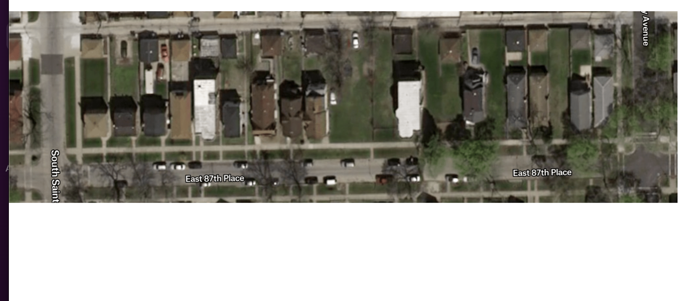
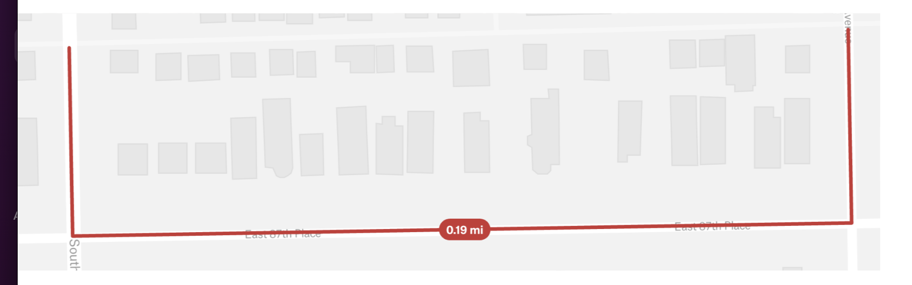
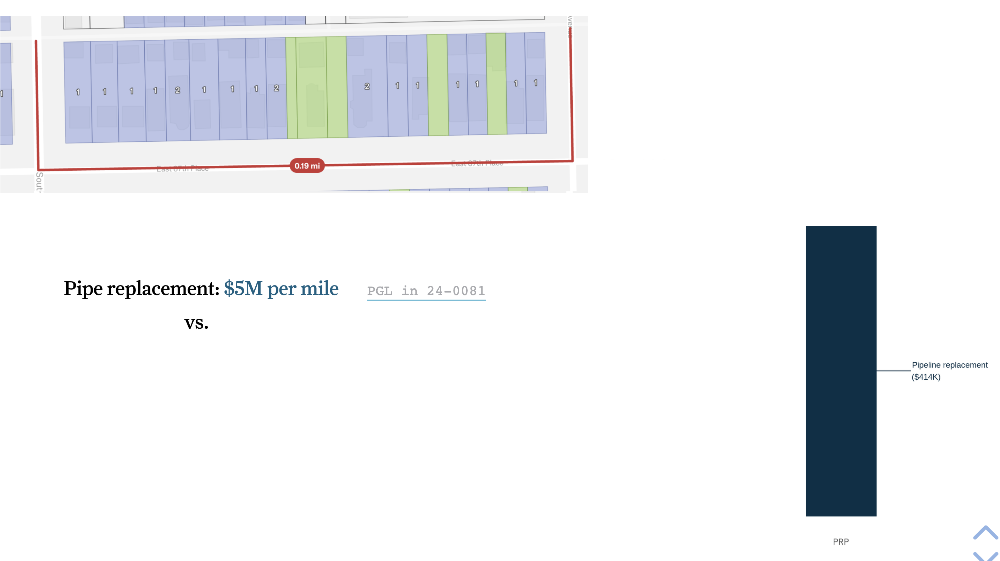
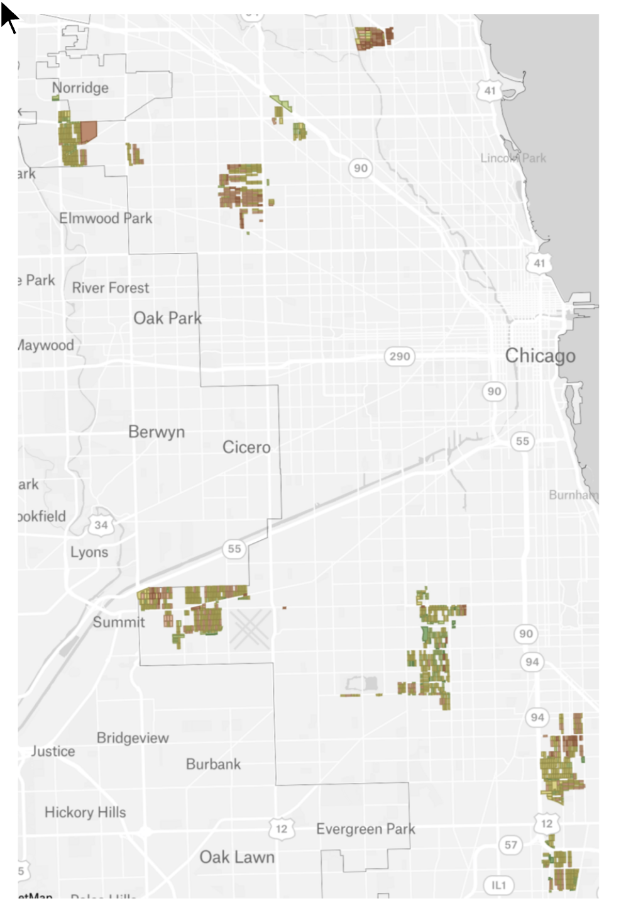
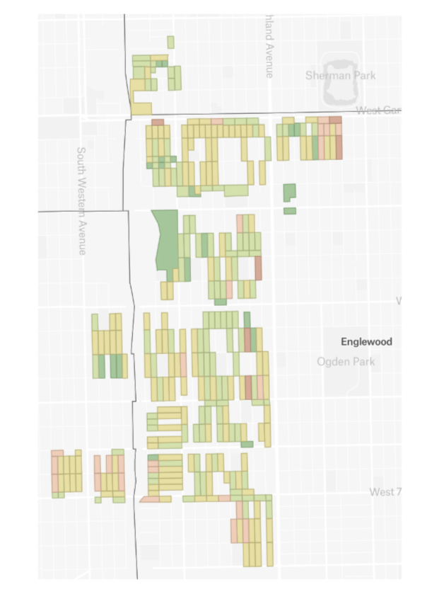
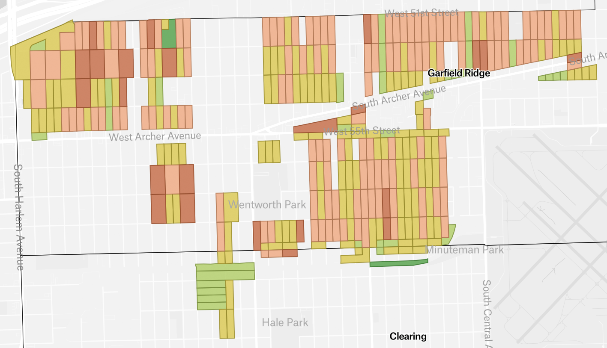
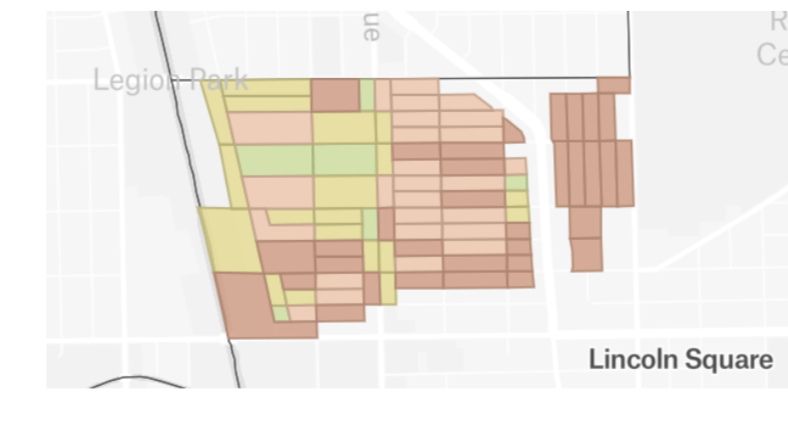

> **What this is.** A bullet-form Q&A skeleton of the direct testimony Switchbox would file on behalf of CUB in PGL Docket 26-0065. **Questions are written as near-final prose; answers are bulleted points, arguments, and figure pointers** so the team can see the argumentative architecture at a glance and then progressively prose-up the bullets. All quantitative claims are pulled programmatically from `notebooks/analysis.qmd` via inline R; all charts and maps are embedded via ``. This document is **not** a draft of the final filing.

# Setup

```{r}
#| label: setup
#| echo: false
#| message: false
#| warning: false
library(scales)
library(here)
library(dplyr)
here::i_am("reports/il_npa/direct_testimony_skeleton.qmd")
load(here("reports", "il_npa", "report_variables.RData"))

# Aggregate portfolio totals not pre-saved as named variables in analysis.qmd.
# Computed here (lightweight) so inline R below stays simple.
total_prp_cost_portfolio  <- sum(res_only$prp_cost,        na.rm = TRUE)
total_npa_cost_portfolio  <- sum(res_only$elec_cost_total, na.rm = TRUE)
total_ss_npv_portfolio    <- sum(res_only$scattershot_npv, na.rm = TRUE)
total_prp_ss_portfolio    <- total_prp_cost_portfolio + total_ss_npv_portfolio

# Net portfolio savings: NPA vs PRP-alone (Lens 2 reference) and vs PRP+scattershot (Lens 3).
portfolio_savings_vs_prp     <- total_prp_cost_portfolio - total_npa_cost_portfolio
portfolio_savings_vs_prp_ss  <- total_prp_ss_portfolio   - total_npa_cost_portfolio

# Average miles avoided per Lens-1 block (rounded later in prose).
avg_mile_per_block_1_0 <- if (n_res_blocks_cheaper > 0) n_miles_1_0 / n_res_blocks_cheaper else NA_real_
```

# Caption and title block

> **STATE OF ILLINOIS**
>
> **ILLINOIS COMMERCE COMMISSION**

| The Peoples Gas Light and Coke Company                                                                                  | ) | Docket No. 26-0065 |
| ----------------------------------------------------------------------------------------------------------------------- | - | ------------------ |
| Proposed general increase in rates and revisions to service classifications, riders and terms and conditions of service | ) |                    |

**DIRECT TESTIMONY OF**

**JUAN-PABLO VELEZ**

Switchbox

**ON BEHALF OF THE**

**CITIZENS UTILITY BOARD**

**CUB Exhibit 1.0**

April 30, 2026

# Exhibits sponsored

- **CUB Ex. 1.0** — This testimony.
- **CUB Ex. 1.1** — Statement of Qualifications (CV). _TK._
- **CUB Ex. 1.2** — Methodology Memo (data sources, transformations, cost inputs, limitations). Mirrors `notebooks/analysis.qmd` and the Data and Methods appendix of the underlying Switchbox NPA report.
- **CUB Ex. 1.3** — Figures & Tables Appendix (the same charts and maps embedded inline in this testimony, listed with figure numbers and analytical context). _See §XII._

---

## I. Introduction and qualifications

**Q.** Please state your name and business address.

**A.**

- Juan-Pablo Velez. _Switchbox business address — TK._

**Q.** By whom are you employed and in what capacity?

**A.**

- Employed by Switchbox; current title — TK.
- Switchbox is a non-profit policy data shop building open analyses of state climate and energy policy for advocates, regulators, and the public.

**Q.** On whose behalf are you submitting this testimony?

**A.**

- Citizens Utility Board ("CUB").

**Q.** Please summarize your professional and educational background.

**A.**

- Career chronology in prose. _Detail TK; full CV in CUB Ex. 1.1._
- Emphasize: rate-design and gas-transition data work; recent heat-pump rate analyses for state utility commissions; building-level cost modeling using NREL ResStock and Cambium.

**Q.** Have you previously testified before the Illinois Commerce Commission?

**A.**

- _TK — yes/no and dockets if applicable._

**Q.** Have you previously testified or submitted comments before regulatory commissions in other states?

**A.**

- _TK — list jurisdictions and topic areas (e.g., heat-pump rates and bill-alignment analyses in Rhode Island)._

**Q.** Was this testimony prepared by you or under your direct supervision?

**A.**

- Yes.

**Q.** Are you sponsoring any exhibits with this testimony?

**A.**

- Yes — CUB Ex. 1.1 (CV), CUB Ex. 1.2 (Methodology Memo), and CUB Ex. 1.3 (Figures & Tables Appendix).

---

## II. Purpose of testimony and summary of recommendations

**Q.** What is the purpose of your testimony?

**A.**

- Quantify, on the residential blocks within PGL's planned Pipe Retirement Program ("PRP") project areas, the upfront capital cost of meeting the Commission's 2035 cast-iron / ductile-iron ("CI/DI") retirement deadline through **targeted electrification** ("TE") — a non-pipeline alternative ("NPA") — versus PGL's planned **pipeline replacement**.
- Identify the share of PGL's planned residential PRP scope that is cost-effective to electrify under three progressively realistic comparisons.
- Show why the **current PRP process and the emerging NPA-evaluation framework discussed at the ICC's NPA workshop cannot, by construction, capture that potential**.
- Recommend two narrow, incremental, and legally defensible orders the Commission should issue in this case to put the missing facts on the record before PGL's PRP capital is locked in.

**Q.** How is your testimony organized?

**A.**

- §III: background and policy context (the conflict between Chicago's electrification trajectory and PGL's pipe-replacement trajectory).
- §IV: scope and analytical approach.
- §§ V–VII: three findings, one per cost-effectiveness lens.
- §VIII: geographic implications across PGL's planned project areas.
- §IX: structural critique — why the current PRP and emerging NPA-evaluation processes cannot capture this potential.
- §X: recommendations to the Commission.
- §XI: reservations and conclusion.
- §XII: Appendix — Figures & Tables index (CUB Ex. 1.3).

**Q.** Please summarize your principal findings.

**A.**

- Of `r comma(n_res_blocks)` fully residential blocks inside PGL's planned PRP project areas, **approximately `r percent(pct_res_blocks_cheaper, accuracy = 0.1)`** (`r comma(n_res_blocks_cheaper)` blocks) are individually cheaper to electrify than to replace pipe, even before counting any operating-cost, decarbonization, or air-quality benefit (Lens 1).
- Under a portfolio cost-neutral approach — using the savings from cheaper blocks to fund electrification on next-cheapest blocks — **approximately `r percent(zero_crossing, accuracy = 0.1)`** of the same residential portfolio could be electrified at no net additional cost compared to PGL's PRP (Lens 2).
- When the comparison is made against a realistic counterfactual that includes the household-level "scattershot" electrification PGL itself implicitly assumes (and Chicago's Climate Action Plan explicitly targets), **the entire residential portfolio is cheaper to coordinate as TE than to repipe-plus-scattershot**, and **approximately `r percent(pct_res_blocks_cheaper_ss, accuracy = 0.1)`** of blocks are individually cheaper under that comparison (Lens 3).
- Across all three lenses, the share of the residential PRP scope that is cost-effective to electrify is large — somewhere between roughly a quarter and all of it. There is no defensible reading of the data under which the answer is "approximately none."

**Q.** Please summarize your recommendations.

**A.**

The Commission should issue a **two-part order**, in this docket or in a new proceeding initiated from it:

1. **Order PGL to conduct a hydraulic-feasibility-and-sequencing study** covering the full universe of mains currently planned for retirement under the PRP (~1,020 miles, 179 projects). The study must, at minimum:
   - Identify the decommissioning sequence that **maximizes** the cumulative share of PRP miles that are physically decommissionable (pressures balance; no stranded customers).
   - Report the **upper bound** on the share of PRP miles and project areas that are hydraulically decommissionable under that maximizing sequence.
   - Replace the single-average cost-per-mile assumption with the **actual cost distribution by project type** under that sequence — addressing PGL's own observation that "they don't all cost the same."
   - Identify the **engineering, contractor staging, customer engagement, and procurement capabilities** PGL would need to execute a parallel "Track 2" program at the cadence implied by the 2035 deadline.
2. **Order PGL to release the inputs** to that study — public inputs to all parties; sensitive inputs (most importantly PGL's hydraulic pipe-topology data) to qualified intervenors under NDA in **a new docketed proceeding** scoped around this question.

**Q.** Should your silence on any other issue in this proceeding be construed as agreement with PGL or any other party?

**A.**

- No. My silence with respect to any position taken by the Companies or any other party in this case should not be construed as agreement with that position.

---

## III. Background and policy context

**Q.** What is the central policy tension this testimony addresses?

**A.**

- Chicago has a stated electrification trajectory: roughly **1 in 3** residential buildings electrified over the next 10 years, per the Chicago Climate Action Plan.
- PGL is operating under a Commission-ordered trajectory that points the opposite direction: under the 2024 SMP Investigation Order (Docket 24-0081), PGL must retire all remaining CI/DI mains under 36" by January 1, 2035 — roughly **1 in 4** miles of mains in its system — and proposes to do so primarily via like-for-like pipeline replacement.
- The same households are being asked to fund both. Every dollar of PRP spend on a block that ends up electrifying anyway is a dollar paid twice. This is not a policy abstraction; it is a cost question on the record in this rate case.

**Q.** What is PGL asking the Commission to authorize on the PRP in this case?

**A.**

- ~1,020 miles of CI/DI pipe retirement across **179 distinct projects** (Eldringhoff/Dickson, NSG-PGL Ex. 3.0 at 8, 105).
- Project-level spending of approximately **$188M in 2026** and **$306M in 2027**, excluding contingency (NSG-PGL Ex. 3.0 at 106–107).
- Total PRP spending of ~$214M (2026) and ~$360M (2027) flowing through base rates rather than a Rider QIP — the legacy QIP rider has sunset (Eidukas, NSG-PGL Ex. 1.0 at 4–6).
- PGL itself acknowledges declining gas demand: SC-1 (residential) sales forecast down nearly 5% by 2027 vs. 2024 (Eidukas, NSG-PGL Ex. 1.0).
- _Flag — TK reconciliation:_ our analysis uses ~1,451 miles as the total remaining PRP universe; PGL reports ~1,020. Sources need to be reconciled before final filing.

**Q.** Did the Commission's prior order open the door to non-pipeline alternatives?

**A.**

- Yes. The Final Order in Docket 24-0081 (Feb. 20, 2025) directed PGL to "work with stakeholders to study the feasibility of NPAs on its distribution system."
- The Commission specifically directed PGL to consider, at minimum: gas asset risk and timeline, hydraulic feasibility, local electric capacity, customer types and counts, coordination with community-based organizations, customer propensity to opt-in, and equity in NPA siting (citing the City of Chicago's testimony in Docket 24-0081).
- Two motivations are evident in the Commission's framing of the NPA workshops, even where not stated verbatim in the Order:
  - Identify **cheaper ways to fix leaks** (lining, repair, smaller-scope retirements).
  - Identify where **leak fixing and targeted electrification can be done together** cost-effectively — the harder and more interesting question.
- This testimony takes up the second motivation directly.

**Q.** What did the NPA workshop process actually produce?

**A.**

- Eight workshops between September and December 2025 with over 140 participants (Celia Johnson Consulting, Workshop Report, Feb. 11, 2026).
- The Facilitator's Report concludes that "the feasibility of NPAs were not studied" during the workshop process and that PGL "did not commit to specific actions related to NPAs on its distribution system."
- The City of Chicago, in written comments on the draft report, stated that the Commission's directive for the workshop series **was not fulfilled**.
- Switchbox's own presentation in Workshop #8 (Dec. 16, 2025) shared the analysis underlying this testimony — the cost-effective TE potential was **on the workshop record** before this rate case was filed.

**Q.** What did PGL itself say about NPAs in the present rate case?

**A.**

- In the PRP testimony, PGL commits to "considering Non-Pipeline Alternatives ("NPAs") before deciding to replace CI/DI pipe" and identifies "geothermal systems, targeted electrification, and cured-in-place liners ("CIPLs")" as current options (Eldringhoff/Dickson, NSG-PGL Ex. 3.0 at 99).
- In separate testimony in the same case, PGL forecloses any rate-case action on those alternatives:
  > "First, we believe it is neither feasible nor realistic for PGL to present material resource or service design plans in the current rate case that call for decarbonization or that would affect the execution of the PRP in 2027 or beyond in a cost-effective manner." (Graves/Figueroa/Sreenath, PART_5 part1of68.pdf at p. 8; ICC exhibit number — TK at filing.)
- _TK: pull the rest of the Graves/Figueroa/Sreenath sequenced argument ("Second…", "Third…") to confirm the full structure of the foreclosure._
- The bottom line: PGL says NPAs are within scope at the project level but cannot be evaluated at the system level in this case. **That is precisely the gap this testimony addresses.**

---

## IV. Scope and analytical approach

**Q.** Please describe the universe of pipe and customers your analysis covers.

**A.**

- Of the planned PRP project areas mapped in PGL's filing, **`r comma(n_blocks_total)` total city blocks** fall inside the analyzed footprint.
- **`r comma(n_res_blocks)` of those blocks are fully residential** and in scope for this analysis (~`r percent(pct_res_blocks_total, accuracy = 0.1)`). Mixed-zoning and commercial blocks are excluded because per-unit electrification costs for non-residential parcels are not well-established in the public literature.
- The in-scope blocks contain **`r comma(n_res_units)` residential units** (`r comma(n_sf)` single-family parcels and `r comma(n_mf)` multi-family units).
- Pipeline mileage on these residential blocks: **approximately `r round(n_miles, 0)` miles** out of the ~1,451-mile total system-wide PRP universe.

::: {.column-page-inset-right}

:::

::: {.column-page-inset-right}

:::

::: {.column-page-inset-right}

:::

**Q.** What cost components did you include?

**A.**

- **Pipeline replacement:** approximately **$4.96M / mile** (sourced from Docket 24-0081).
- **Pipeline decommissioning:** approximately **$66K / mile** (Docket 24-0081).
- **Single-family electrification:** approximately **$29K / unit** (ComEd Whole Home Electrification Program, residential).
- **Multi-family electrification:** approximately **$15K / unit** (same source).
- **Electric grid upgrade:** **$209.74 / peak winter-summer kW delta**, ~$944 per household (E3 VDER analysis for Illinois).
- **Scattershot baseline (Lens 3 only):** 30% of residential units electrify over 10 years, evenly distributed in time, 5% discount rate (anchored to the Chicago Climate Action Plan trajectory).
- All inputs documented in the Methodology Memo (CUB Ex. 1.2) and the open Google Sheet that drives the analysis notebook.

**Q.** What did you exclude, and why does each exclusion bias the analysis conservatively?

**A.**

- **Operating costs (gas-bill and electric-bill impacts on participants and non-participants), avoided gas-system O&M, rate-base / return-on-equity effects, carbon and air-quality benefits.** Each of these tilts the comparison further in TE's favor; including them would only raise the cost-effective share.
- **Project-specific PRP cost variation.** We use an average $/mile; PGL has the actual project-by-project cost data and acknowledges projects are heterogeneous (NSG-PGL Ex. 3.0 at 106–107). Some PRP projects cost more than the average; those are precisely the projects most likely to be NPA-cheaper.
- **PRP cost growth.** PGL forecasts 5.4% annual O&M growth against ~3% inflation (Eidukas, NSG-PGL Ex. 1.0 at 6). Electrification cost trajectories are roughly flat to declining; we hold both at present values, which understates TE's relative advantage over time.
- **Hydraulic decommissioning feasibility.** Out of scope here; addressed structurally in §IX.
- **Pipe lining, repair, and smaller-scope retirements** (a third pathway between full replacement and full electrification). Excluding these is conservative for the same reason: they would further reduce the cost of the non-replacement option.
- **Commercial and industrial parcels.** Excluded out of caution; their inclusion could meaningfully expand the NPA-cost-effective share.

**Q.** What three cost-effectiveness lenses do you evaluate?

**A.**

- **Lens 1 — Strict block-level.** A block "passes" only when its NPA cost is at or below its PRP cost, comparing the block to itself. The most conservative possible upfront-cost test.
- **Lens 2 — Portfolio cost-neutral.** Rank blocks cheapest-first by NPA-to-PRP ratio; "bank" the savings from cheap blocks to fund electrification on next-cheapest blocks; stop where cumulative net savings cross zero. The same dollars PGL was already going to spend, deployed differently.
- **Lens 3 — Portfolio with scattershot baseline.** Compare coordinated TE to PRP **plus** the scattershot household-level electrification that will happen anyway over the same horizon. The honest comparison once Chicago's electrification trajectory is taken seriously.
- The lenses are not competing hypotheses; they are progressively less restrictive ways of comparing the same costs.

---

## V. Lens 1 — strict block-level cost-effectiveness

**Q.** Under a strict block-by-block comparison, how many residential blocks in PGL's planned PRP project areas could be electrified at or below the cost of pipeline replacement?

**A.**

- **Approximately `r percent(pct_res_blocks_cheaper, accuracy = 0.1)` of fully residential blocks** (`r comma(n_res_blocks_cheaper)` of `r comma(n_res_blocks)`).
- Affecting **`r comma(n_res_units_1_0)` residential units** (`r comma(n_sf_1_0)` single-family + `r comma(n_mf_1_0)` multi-family).
- Avoiding **approximately `r round(n_miles_1_0, 0)` miles** of pipeline replacement.
- Net upfront capital savings of **approximately `r dollar(-total_cost_diff_1_0, scale = 1e-6, suffix = "M", accuracy = 1)`** across these blocks (`r dollar(npa_total_ce_1_0, scale = 1e-6, suffix = "M", accuracy = 1)` NPA cost vs. `r dollar(prp_total_ce_1_0, scale = 1e-6, suffix = "M", accuracy = 1)` PRP cost).
- This is the **floor**. Any cost-effectiveness lens less restrictive than this returns a larger number.

**Q.** Walk the Commission through how the analysis works on a single block, before showing aggregate results.

**A.**

- The cost comparison is built from the bottom up — block by block — using publicly available parcel and street data.
- Take a representative residential block in the sample: census block `170314407001003`, on East 87th Place. Aerial imagery shows a low-density Chicago residential block of mostly single-family homes.
- The block spans roughly 0.19 miles of mains that PGL is planning to replace under PRP.
- Inside that footprint, each parcel is either a structure or a vacant lot. Structures and units, not miles, drive electrification cost.
- Stack the PRP and NPA cost components side by side and the comparison is immediate: pipeline replacement on one side; single-family electrification, multi-family electrification, grid upgrade, and gas decommissioning on the other.

{#fig-block-aerial}

{#fig-block-outline}

{#fig-block-colored}

::: {.column-page-inset-right}

:::

**Q.** Now show the same comparison across every residential block in the planned PRP project areas.

**A.**

- The histogram below is the headline picture of Lens 1: each residential block plotted by its **NPA-to-PRP cost ratio**. Anything left of 100% is cheaper to electrify than to repipe.
- The left tail is dense: roughly a quarter of blocks sit below 100%.
- The bulk of the distribution sits between 100% and 200% — these are the blocks where TE is more expensive than PRP at the block level but where Lenses 2 and 3 will start to do the work.

::: {.column-page-inset-right}

:::

**Q.** What attribute most strongly predicts whether a block is cheaper to electrify than to repipe?

**A.**

- **Housing density**, dominantly. Lower-density single-family blocks (and blocks with vacant lots) skew toward cheap-to-electrify; high-density multi-family blocks skew toward expensive.
- The data needed to operationalize this relationship — parcel counts, building types, miles of mains — is **publicly available right now**, from the Cook County Assessor and Chicago city street data. **A first NPA tranche can be scoped from public data alone, before any building-by-building survey program.**

::: {.column-page-inset-right}

:::

**Q.** Is that density relationship a real-world finding, or an artifact of your model?

**A.**

- **Both, and we are explicit about it.**
- The model uses an average $/mile to estimate PRP cost and an average $/unit to estimate electrification cost. Mechanically, that links density to the NPA-to-PRP ratio: blocks with the same miles and the same units will get similar answers regardless of any other characteristic.
- But the underlying drivers are real: fewer pipe-miles per resident on low-density blocks means less PRP cost per resident; vacant lots cost nothing to electrify; high-density multi-family blocks have more parcels to retrofit per mile of pipe.
- The Methodology Memo (CUB Ex. 1.2) documents this caveat in detail. Project-specific cost data — which PGL has and we do not — would tighten the relationship in either direction without changing its sign.

**Q.** Is this Lens-1 cost-effective potential geographically concentrated, or distributed across the city?

**A.**

- **Distributed.** Cost-effective blocks (green on the map below) are scattered across many parts of the planned PRP footprint, not clustered in a single neighborhood or ward.
- That has direct programmatic implications: a citywide first-tranche TE program can be scoped without picking winners among PGL's planned project areas.

{#fig-city-wide-colored}

**Q.** Wouldn't this finding require coordinating electrification across every household on a block, which is unrealistic?

**A.**

- The 100%-participation assumption is a programmatic constraint, not a free assumption — we acknowledge it.
- The relevant comparison is not "TE with full participation" vs "do nothing." It is "TE with full participation" vs "PRP with full participation" — PGL is also tearing up the streets and entering every customer's premises under PRP. The question is which coordinated investment ratepayers are funding.
- PGL itself lists targeted electrification as a current NPA option (NSG-PGL Ex. 3.0 at 99). The infeasibility argument cannot do work for a tool PGL has already endorsed.

**Q.** Why does the Lens-1 finding matter to the Commission?

**A.**

- It connects directly to four interests the Commission already balances under standard prudence-and-reasonableness review:
  - **Cost-causation.** On blocks where TE is cheaper than pipe, the pipeline-replacement cost is harder to defend under the Commission's cost-causation principles.
  - **Just and reasonable rates.** PGL's own filing forecasts residential gas sales declining nearly 5% by 2027 vs. 2024 (Eidukas, NSG-PGL Ex. 1.0). Funding additional pipe in front of customers PGL itself expects to leave the system is harder to defend as just and reasonable.
  - **Leak reduction.** The SMP Investigation Order's leak-reduction objective is met identically by removing the gas line on a block as by replacing it. On the cheaper-to-electrify blocks, removal achieves the same safety outcome at lower cost.
  - **Bill affordability.** Lower upfront capital → lower rate base → lower bills for all PGL customers, TE participants and non-participants alike.
- Even under the strictest possible test, a non-trivial subset of in-scope blocks satisfies all four interests at lower cost than PGL's plan.

**Q.** Does the Commission need to act on the Lens-1 finding alone in this case?

**A.**

- **No — and we are not asking it to.** The recommendation in §X is narrower: require PGL to measure how much of this potential is hydraulically reachable, and release the inputs.
- The bottom line: even under the strictest possible upfront cost-effectiveness test, **roughly a quarter of the planned residential PRP scope is already cheaper to electrify than to repipe**. That is the floor of the conversation, not its ceiling.

---

## VI. Lens 2 — portfolio cost-neutrality

**Q.** What does Lens 2 measure that Lens 1 does not?

**A.**

- Lens 2 asks: how many blocks could PGL electrify for the **same total cost as the PRP** PGL was already going to do, if it ranked blocks cheapest-first by NPA-to-PRP ratio and used the savings from cheap blocks to fund electrification on next-cheapest blocks?
- The intuition: PGL was already going to spend that money. Spending the same dollars on the cheapest TE projects first, then "banking" the savings to subsidize moderately-priced TE projects, is **identical from the ratepayer's perspective** — same total spend, different infrastructure delivered.

**Q.** What does the analysis show?

**A.**

- The cumulative-savings curve below sorts all `r comma(n_res_blocks)` in-scope residential blocks cheapest-first. The y-axis is cumulative net savings vs PRP as an ever-larger share of blocks is converted from PRP to TE.
- The curve **rises** as long as we are choosing blocks where NPA < PRP, **peaks** at the point where the marginal block crosses NPA = PRP (this is the Lens 1 threshold), and **declines** as blocks where NPA > PRP are added.
- The curve crosses zero at **approximately `r percent(zero_crossing, accuracy = 0.1)`** of blocks — this is the Lens 2 cost-neutral threshold.

::: {.column-page-inset-right}

:::

::: {.column-page-inset-right}

:::

**Q.** Why is this framing more appropriate than block-by-block?

**A.**

- PGL itself plans the PRP at the **portfolio level** — 179 projects across the city, sized $1–3M to >$5M each (NSG-PGL Ex. 3.0 at 105–107).
- Project-by-project NPA evaluation is tractable for the larger jobs but carries prohibitive overhead for the smaller-project tail; portfolio-level matching of cheap and expensive blocks uses the same money PGL is already asking ratepayers to fund and stretches it further.
- Lens 2 is also explicitly aligned with the ICC's own stated workshop motivations: lower leak risk, advance electrification, hold costs steady. It is not as cheap as a pure leak-minimizing strategy (which would emphasize lining and repair), but it is the cheapest **electrification-maximizing** strategy that holds total cost constant.

**Q.** Wouldn't using savings from cheap blocks to fund expensive ones constitute cross-subsidization?

**A.**

- PGL's existing PRP cost recovery already pools costs across all blocks in base rates — every PRP customer subsidizes the most expensive miles of pipe regardless of where they live.
- Lens 2 applies the **same pooling logic** to a cheaper portfolio. It is not a new cross-subsidy; it is a re-allocation of an existing one.

**Q.** Bottom line on Lens 2?

**A.**

- **Using the same dollars PGL was going to spend on PRP, but spending them on TE in cheapest-first order, gets the program to a majority of the residential portfolio at zero net additional cost.**
- This is not a more expensive program than the PRP. It is the same program with different physical outputs.

---

## VII. Lens 3 — coordinated TE vs PRP-with-scattershot

**Q.** What is wrong with comparing NPA cost to PRP cost in isolation?

**A.**

- A PRP-only baseline implicitly assumes nothing else changes — that the 30% of Chicago residential buildings the City expects to electrify by 2035 (Climate Action Plan) does not exist.
- In reality, ratepayers will pay twice on the same blocks: once for new pipe under PRP, again for uncoordinated household-by-household electrification.
- PGL itself acknowledges declining gas demand on its own system in this docket: SC-1 sales forecast down nearly 5% by 2027 vs. 2024 (Eidukas, NSG-PGL Ex. 1.0). The Lens 3 comparison just makes this declining-demand reality explicit on the cost side.

**Q.** What does your analysis find under a scattershot-aware comparison?

**A.**

- **Across the entire residential portfolio of `r comma(n_res_blocks)` in-scope blocks, the total cost of coordinated TE is lower than the total cost of PRP plus the scattershot electrification that would happen anyway** — by approximately `r dollar(portfolio_savings_vs_prp_ss, scale = 1e-6, suffix = "M", accuracy = 1)` in undiscounted upfront capital.
- At the block level, **approximately `r percent(pct_res_blocks_cheaper_ss, accuracy = 0.1)`** of blocks (`r comma(n_res_blocks_cheaper_ss)`) are individually cheaper to electrify than to repipe-plus-scattershot.
- The portfolio-level cumulative savings under Lens 3 **never go negative** across the ranked portfolio.

::: {.column-page-inset-right}

:::

::: {.column-page-inset-right}

:::

::: {.column-page-inset-right}

:::

::: {.column-page-inset-right}

:::

::: {.column-page-inset-right}

:::

**Q.** Why does this matter for the Commission?

**A.**

- This is the scenario that matches the actual world the rate case is asking the Commission to authorize spending in.
- PGL's revenue requirement already embeds shrinking residential demand. The Commission is being asked to fund pipe in front of customers who PGL itself forecasts are leaving the system.
- Continuing PRP on a contracting customer base is buying two energy systems for the price of two-and-a-half. **Coordinated electrification is the cheap option even before counting any avoided gas-bill, decarbonization, or air-quality benefit.**

**Q.** Doesn't a coordinated-NPA approach raise rates more than just replacing pipes, since the utility doesn't pay for the scattershot?

**A.**

- Acknowledged directly. Under the current cost-recovery design, PGL's ratepayers pay PRP through base rates while individual customers pay for their own scattershot heat-pump installations out of pocket and through federal incentives. The two cost streams are not netted at the utility.
- The aggregate gap is real but small relative to the $214M / $306M annual PRP ask, and it is bridgeable by program-design tools the Commission already has access to:
  - City of Chicago bond-financed on-bill financing for participating customers.
  - LIDA-aligned bill-impact mitigation for low-income households (PGL is already proposing to align Rider LIDA with the 3% energy-burden floor adopted in the Ameren and Nicor orders, Dockets 25-0085 and 25-0055).
  - Federal IRA / Inflation Reduction Act incentives for coordinated retrofits.
- This is a cost-recovery design problem, not a fatal flaw. And critically, **continuing PRP also worsens the gas-cost spiral** — growing the rate base just as customers begin leaving the system, which PGL's own forecast confirms (~5% residential decline by 2027). Lens 3 is the lens that prices that dynamic.

**Q.** Bottom line on Lens 3?

**A.**

- The honest comparison for these blocks is not "TE vs. PRP" but **"coordinated TE vs. PRP-plus-uncoordinated-background-electrification."** Once the comparison is framed honestly, **the cheap option is coordinated TE for the entire residential portfolio** — not a slice of it.

---

## VIII. Geographic implications across PGL's planned PRP areas

**Q.** Does the share of cost-effective blocks vary across PGL's planned project areas?

**A.**

- **Yes, dramatically.** Different Chicago neighborhoods sit at very different points on the density distribution, and density drives the ratio. The same analysis applied to three contrasting areas yields three very different answers.

**Q.** Please walk the Commission through three example areas.

**A.**

- **Englewood** (South Side): low-density, predominantly single-family, with substantial vacant land. **Almost every in-scope residential block is cheaper to electrify than to repipe** under Lens 1 — most of the map is green. _Per-area share — TK; recompute at filing time using `res_only_w_area`._
- **Garfield Ridge** (Southwest Side): mixed single-family and multi-family, moderate density. **A roughly even split** between cost-effective and not-cost-effective blocks, with a long tail of borderline blocks.
- **Lincoln Square** (North Side): high-income, dense, predominantly multi-family. **Almost no in-scope blocks are cheaper to electrify than to repipe** under Lens 1 — most of the map is red.

{#fig-englewood}

{#fig-garfield-ridge}

{#fig-lincoln-square}

**Q.** Does the geographic pattern have an income dimension worth surfacing?

**A.**

- **Yes — and it cuts in a direction the Commission should attend to.**
- The cost-effective-to-electrify pattern **anti-correlates with income**: lower-income, lower-density South and Southwest Side neighborhoods are the cheap ones; higher-income, denser North Side neighborhoods are the expensive ones.
- A first-tranche NPA program scoped on cost-effectiveness alone would land disproportionately in lower-income neighborhoods — where customers also carry the highest energy burden and stand to gain the most from full electrification (operating-cost reduction).
- That can be the right outcome — but it requires program-design discipline (consent, equitable participation, no displacement risk) and explicit alignment with Rider LIDA's 3% energy-burden floor (the alignment PGL is itself proposing in this case, tracking the Ameren and Nicor orders in Dockets 25-0085 and 25-0055). _Detail TK; flagged here as a finding worth surfacing on its own._
- _TK: income / energy-burden cross-tab numbers for each of the three areas — Census PUMS data is available but not yet wired into the analysis notebook._

---

## IX. Why the current PRP and emerging NPA-evaluation processes cannot capture this potential

**Q.** Are PGL's current PRP project-selection process and the NPA-evaluation framework discussed at the ICC's NPA workshop sufficient to capture the cost-effective TE potential you have identified?

**A.**

- **No.** The combination is structurally incapable of capturing more than a negligible share of even the most conservative finding above. This is not a tuning problem — no adjustment to JANA risk weights, NPA decision criteria, or screening thresholds inside the existing framework changes the conclusion.
- There are two failure modes, both fatal, both endogenous to the ordering itself.

**Q.** Please describe Failure Mode 1.

**A.**

- **Time-to-block-participation is fatal under risk-first ordering.**
- The PRP, as scoped in Docket 24-0081, is a **risk-first** program: projects are ranked by JANA-style probabilistic risk scoring, and PGL selects projects in approximately riskiest-first order, evaluating one project at a time (NSG-PGL Ex. 3.0 at 89, 96).
- The emerging NPA-evaluation process discussed in the workshop sits **on top of** that ordering: the NPA question — "could we do an NPA on this project instead?" — is asked **after** a project has been selected for its risk score.
- Even on a block where TE is unambiguously cheaper, signing up every household on the block — even with strong incentives — takes **years**. Planning, outreach, financing, and equipment installation cannot happen on a single-pipe-segment timeline.
- Under risk-first ordering, the NPA question is being asked about **the riskiest pipe segment of the year**. The answer is structurally: "we cannot wait three years for full block participation; the pipe will fail; replace it now."
- **Cost-effective TE never wins the timing fight under risk-first ordering**, no matter how cost-effective it is.

**Q.** Please describe Failure Mode 2.

**A.**

- **Hydraulic decommissioning feasibility is endogenous to the ordering.**
- Whether a given pipe segment can actually be decommissioned — pressures balance, no stranded customers downstream — depends on **which adjacent segments have already been decommissioned**. Decommissioning is a network problem, not a project-by-project problem.
- A risk-first ordering is **essentially random** with respect to the network constraint. It selects the segment scoring highest on probabilistic risk, without regard for whether that segment is reachable in the decommissioning sequence.
- **The realized share of pipe that turns out to be hydraulically decommissionable under risk-first ordering will be far below the share that *could* have been decommissionable under a sequence chosen to maximize feasibility.** That is true mathematically, before any data is collected.
- This is the missing piece of the record. Nobody — including PGL — has run the sequencing problem.

**Q.** What is the net consequence?

**A.**

- Under the current process and the emerging NPA add-on, the realized share of cost-effective TE captured will be a **small fraction of even the most conservative finding** above — i.e., a tiny fraction of `r percent(pct_res_blocks_cheaper, accuracy = 0)`, not a small fraction of the full portfolio.
- The findings of `r percent(pct_res_blocks_cheaper, accuracy = 0)` / `r percent(zero_crossing, accuracy = 0)` / 100% describe **what a rational planner could capture in principle.** The current process cannot, by construction, capture more than a negligible share of even the smallest of those numbers.
- **This is a structural problem, not a parameter problem.** The framework selects against TE in two independent, compounding ways.

**Q.** What would the right structural fix look like?

**A.**

- A **parallel "second track"** added to the PRP — not a replacement for the existing process; an addition to it.
  - **Track 1 (existing, possibly slimmer):** continue risk-first replacement on the truly highest-risk pipe — the segments that genuinely cannot wait. A smaller number of projects per year than today.
  - **Track 2 (new):** plan proactively how to decommission the **not-riskiest** segments, in a sequence chosen to maximize hydraulic decommissioning feasibility, on the subset of blocks where TE is cost-effective under whatever lens the Commission adopts. Run "from the ends in" rather than "from the riskiest out."
- The two tracks together handle real safety risk **and** capture the cost-effective TE the PRP investigation was already looking for. Neither track alone does both.
- This is the **strategic destination**. It is not what we are asking the Commission to order in this case — see §X.

---

## X. Recommendations to the Commission

**Q.** What do you recommend the Commission order?

**A.**

The Commission should issue a **two-part order**, structured to be (a) legally defensible (no order to electrify any specific block), (b) incremental (no redirection of capital from PRP), and (c) compatible with allied intervenors (no conflict with Illinois PIRG / Groundwork Data on TE-mechanism questions).

**Q.** Please describe Part 1 of the recommended order.

**A.**

- **Order PGL to conduct a hydraulic-feasibility-and-sequencing study** covering the universe of mains currently planned for retirement under the PRP, as filed in PGL's PRP project plan in this docket (~1,020 miles, 179 projects).
- The study must, at minimum, answer four questions:
  1. **Maximum-decommissioning sequence.** For that universe of pipe, what sequence of decommissioning (paired with voluntary TE on the block) **maximizes** the cumulative share of mileage that can be physically decommissioned?
  2. **Decommissionable upper bound.** Under that maximizing sequence, what is the upper bound on the share of planned PRP miles — and the share of planned project areas — that is hydraulically feasible to decommission?
  3. **Cost distribution by project type.** What is the actual cost distribution across project types under the optimized sequence? (Replacing the single-average-cost-per-mile assumption — directly addressing PGL's own observation that "they don't all cost the same.")
  4. **Capability requirements.** What engineering planning, contractor staging, customer engagement, and procurement capabilities would PGL need to execute a Track 2 program at the cadence implied by the 2035 retirement deadline?
- Why frame it this way: **this is the analysis PGL itself would need to know what it can decommission.** The ask is not a novel demand — it is for the Commission to require PGL to actually run that analysis, in writing, on the record, where stakeholders can see it.

**Q.** Please describe Part 2 of the recommended order.

**A.**

- **Order PGL to release the inputs to the Part 1 study in a new docketed proceeding.**
- **Public inputs:** all inputs to the study that **can** be made public must be made public, so other parties can replicate, sanity-check, and extend the work.
- **Sensitive inputs under NDA:** the truly sensitive inputs — most importantly **PGL's hydraulic pipe-topology data** and any customer-level data — must be made available to qualified intervenors **under NDA**, in a new proceeding scoped around this question.
- PGL's hydraulic map is the single piece of data that no third party can reconstruct independently. Without it, no one — not CUB, not PIRG, not Staff, not the Attorney General — can verify PGL's claims about what is and isn't decommissionable.
- _TK: confirm whether Part 2 is filed in this docket or initiated as a new proceeding from this docket._

**Q.** Why is this the right ask — why narrow?

**A.**

- **Does not order TE on any specific block.** No specific block is required to be electrified.
- **Does not redirect capital from PRP** to anything else. PGL's PRP capital plan is unchanged by this order.
- **Does not take a position on the legal mechanism for compelling TE.** That is a separate question and a different intervenor's lane (Illinois PIRG / Groundwork Data).
- **Does not contest PGL's safety case.** Risk-first replacement on the truly highest-risk pipe continues unaffected under Track 1.

**Q.** Why is this the right ask — why incremental?

**A.**

- **PGL is being asked to do an analysis and release inputs.** That is well within what the Commission can order in a rate case under standard prudence-and-reasonableness review.
- **The cost of the study itself is small** — well under 1% of the ~$520M of PRP project spend in 2026–2027.
- **It is consistent with the Commission's own stated direction** in opening the NPA workshops. The Commission already asked the question; this ask just operationalizes it.

**Q.** Why is this the right ask — why does it resolve an information asymmetry the Commission cannot resolve any other way?

**A.**

- **Only PGL has the hydraulic system map.** No third party can reconstruct it. No analytical workaround substitutes for it.
- **PGL has a not-unreasonable institutional incentive to characterize hydraulic feasibility as low.** Not because PGL is acting in bad faith, but because the framing "this isn't feasible" is an easier defense of the existing capital plan than the framing "this is feasible but here's why we're choosing not to."
- **A docketed proceeding with NDA-protected access converts the disagreement from rhetorical to empirical** — the kind of dispute the Commission is best equipped to resolve.

**Q.** What are you **not** claiming?

**A.**

- We are **not** claiming a specific number of blocks should be electrified. The data does not yet support a specific number; that is the point of Part 1.
- We are **not** claiming our cost numbers are precise. They are conservative averages built from public data and are documented in CUB Ex. 1.2. PGL has the actual project-by-project costs and they should replace ours.
- We are **not** claiming hydraulic feasibility is high. We are claiming **nobody currently knows what it is, including PGL, because nobody has done the sequencing analysis.** Part 1 is how to find out.

**Q.** Are these two parts severable, or do they stand together as a package?

**A.**

- **Severable, but stronger together.**
- **Part 1 alone** — ordering the study without the new docketed proceeding — would still put the maximum-decommissioning sequence and the upper bound on hydraulically feasible miles on the record. That is a meaningful improvement over the status quo even without intervenor access to inputs.
- **Part 2 alone** — opening the new docketed proceeding for NDA-protected access without ordering the study — would still let qualified intervenors examine PGL's hydraulic data and recompute key inputs themselves. That is also a meaningful improvement.
- **Without Part 1, intervenors in Part 2 would be replicating PGL's analysis instead of reviewing it. Without Part 2, Part 1's outputs would land on the record but couldn't be independently checked.** Granting both produces the most useful record.
- If the Commission grants only one, **Part 1 is the higher-leverage intervention** — it is the analysis nobody, including PGL, has yet run.

**Q.** Bottom line on the ask?

**A.**

- **Getting serious about TE, knowledge first.** You cannot plan for the share of the pipe that is decommissionable if you have not measured it. We are not asking the Commission to commit to a number. We are asking the Commission to require that the number be measured.

---

## XI. Reservations and conclusion

**Q.** Are there limitations on the conclusions in this testimony?

**A.**

- **Conservative bias throughout.** Every modeling exclusion (operating costs, avoided O&M, carbon and air-quality benefits, project-specific cost variation, PRP cost growth above inflation, pipe lining/repair as a third pathway) tilts the analysis toward overstating TE cost relative to PRP. The findings are a lower bound.
- **Hydraulic feasibility is unmodeled.** That is the point of the recommendation in §X.
- **Average rather than project-specific costs** because PGL has not made project-specific cost data public.
- **Commercial and industrial parcels excluded.** Their inclusion could materially expand the cost-effective share.
- **Reserve right to update findings** if PGL's rebuttal puts new data — including project-specific cost data, hydraulic-network data, or a Commission-ordered sequencing analysis — on the record.

**Q.** Should your silence on any other issue in this proceeding be construed as agreement with PGL or any other party?

**A.**

- No (re-affirmed from §II).

**Q.** Does this conclude your direct testimony?

**A.**

- Yes, it does.

---

## XII. Appendix — Figures & Tables Index (CUB Ex. 1.3)

> **What this is.** A standalone listing of every figure and map embedded inline in this testimony, with figure number, source, and a one-paragraph analytical context for what it shows and how it was constructed. Charts and maps are produced by `notebooks/analysis.qmd`; static images are PNG renders of geospatial layers (parcel and street data) overlaid on aerial imagery.

### Section IV — Scope and approach

- **Figure IV-1** (`fig-miles-of-prp-3seg`): **System-wide PRP mileage in three segments** — fully residential (in scope), mixed-zoning (out of scope), and remaining system-wide miles not yet tied to a planned project. Stacked single-bar geometry chosen to communicate scale at a glance: this analysis covers `r round(n_miles, 0)` of ~1,451 system-wide PRP miles. Data: PGL planned PRP project areas joined to Cook County parcel data and Chicago street segments.
- **Figure IV-2** (`fig-prp-spending-by-year`): **Estimated PRP capital by project start year, residential blocks only**. Annual-cost histogram derived by multiplying street-mile counts on residential blocks by PGL's $4.96M/mile cost assumption (Docket 24-0081) and bucketing by the maximum project start year for each block.
- **Figure IV-3** (`fig-prp-spending-by-year-all`): **Same as IV-2, all block types**. Stacked into residential vs. mixed-zoning to show that residential blocks dominate the capital cost in some years and not others.

### Section V — Lens 1

- **Figure V-1** (`google_street.png`): **Aerial view, example block** (East 87th Place, GEOID 170314407001003). Static image; aerial imagery base layer.
- **Figure V-2** (`street_outline.png`): **Block outline overlaid on aerial**, showing the ~0.19 miles of mains in PRP scope for the example block.
- **Figure V-3** (`colored_individual_block.png`): **Parcel-level view of the example block**: blue = structures, green = vacant lots — the inputs to the per-block cost model. Static image.
- **Figure V-4** (`fig-single-block-eg`): **PRP vs. NPA cost stack for the example block**. Pipeline replacement on the left bar; single-family electrification, multi-family electrification, grid upgrade, and gas decommissioning on the right bar. Same cost components, applied at scale, drive every other Lens-1 result in this section.
- **Figure V-5** (`fig-histogram-npa-over-prp`): **Citywide histogram of NPA-to-PRP cost ratios** across all `r comma(n_res_blocks)` in-scope residential blocks. Bins of 10%; truncated at 350% for legibility. The mass to the left of 100% is the `r percent(pct_res_blocks_cheaper, accuracy = 0.1)` Lens-1 cost-effective share.
- **Figure V-6** (`fig-scatter-density-vs-npa-over-prp-w-line`): **Density vs. cost ratio scatter** with OLS fit. Each point is a block; color = share of units in single-family. Establishes density as the dominant predictor of cost-effectiveness.
- **Figure V-7** (`city_wide_colored.png`): **Citywide map of NPA-to-PRP cost ratio by block.** Five-bin color scale: < 50% (dark green), 50–100% (light green), 100–150% (yellow), 150–200% (orange), > 200% (red). Static map render.

### Section VI — Lens 2

- **Figure VI-1** (`fig-cumulative-saving`): **Cumulative net savings (Lens 2)** as blocks are electrified cheapest-first. Two dashed verticals: the Lens 1 threshold (`r percent(pct_res_blocks_cheaper, accuracy = 0)`, where marginal block crosses NPA = PRP) and the Lens 2 cost-neutral threshold (`r percent(zero_crossing, accuracy = 0)`, where cumulative savings cross zero).
- **Figure VI-2** (`fig-cumulative-saving-bar`): **Same data, bar form** — green bars = net savings still positive at that share; red bars = net cost drag. Communicates the positive-then-negative shape more directly.

### Section VII — Lens 3

- **Figure VII-1** (`fig-total-spending-bar-ss`): **Portfolio-total stacked bars: NPA vs. PRP-plus-scattershot** across all `r comma(n_res_blocks)` in-scope residential blocks. PRP+SS bar decomposes into pipeline replacement plus scattershot electrification NPV (30% of units over 10 years, 5% discount rate).
- **Figure VII-2** (`fig-cumulative-saving-ss`): **Cumulative savings curve, Lens 3** (NPA vs. PRP+scattershot). Stays above zero across the full ranked portfolio.
- **Figure VII-3** (`fig-histogram-npa-over-prp-ss`): **Histogram of NPA-to-(PRP+scattershot) ratios** — same construction as Figure V-5 with the scattershot NPV added to the denominator. Mass shifts left vs. V-5; the cost-effective share grows to `r percent(pct_res_blocks_cheaper_ss, accuracy = 0.1)`.
- **Figure VII-4** (`fig-single-block-eg-ss`): **Single-block PRP vs. NPA cost stack with scattershot NPV** added to the PRP side, for the same example block as Figure V-4.
- **Figure VII-5** (`fig-scatter-density-vs-npa-over-prp-ss`): **Density vs. cost ratio scatter, Lens 3 ratio**. Same construction as Figure V-6 with scattershot in the denominator.

### Section VIII — Geographic implications

- **Figure VIII-1** (`englewood.png`): **Englewood NPA-to-PRP cost ratio by block.** Static map; same five-bin color scale as Figure V-7.
- **Figure VIII-2** (`garfield_ridge.png`): **Garfield Ridge NPA-to-PRP cost ratio by block.**
- **Figure VIII-3** (`lincoln_square.png`): **Lincoln Square NPA-to-PRP cost ratio by block.**

### Tables

- **Table TBD** — Per-area summary for Englewood / Garfield Ridge / Lincoln Square: count of in-scope residential blocks, share cost-effective under Lens 1, share cost-effective under Lens 3, median household income, share LMI. _TK — to be added at filing time using `res_only_w_area` from the analysis notebook plus a Census PUMS join._

---

## Open items flagged in this draft

- **§III:** Reconcile our ~1,451-mile total-remaining-PRP universe with PGL's reported ~1,020 miles.
- **§III:** Pull the rest of the Graves/Figueroa/Sreenath sequenced foreclosure argument beyond "First, …".
- **§I:** CV details and prior-testimony list.
- **§VIII:** Per-area cost-effectiveness shares plus income / energy-burden cross-tab from Census PUMS.
- **§X:** Decide whether the new NDA-protected proceeding is initiated in this docket or as a separate proceeding.
- **All sections:** Convert inline parenthetical citations to footnotes at the typesetting stage (label-only, sentence-case, period Q-formatting is locked in).
