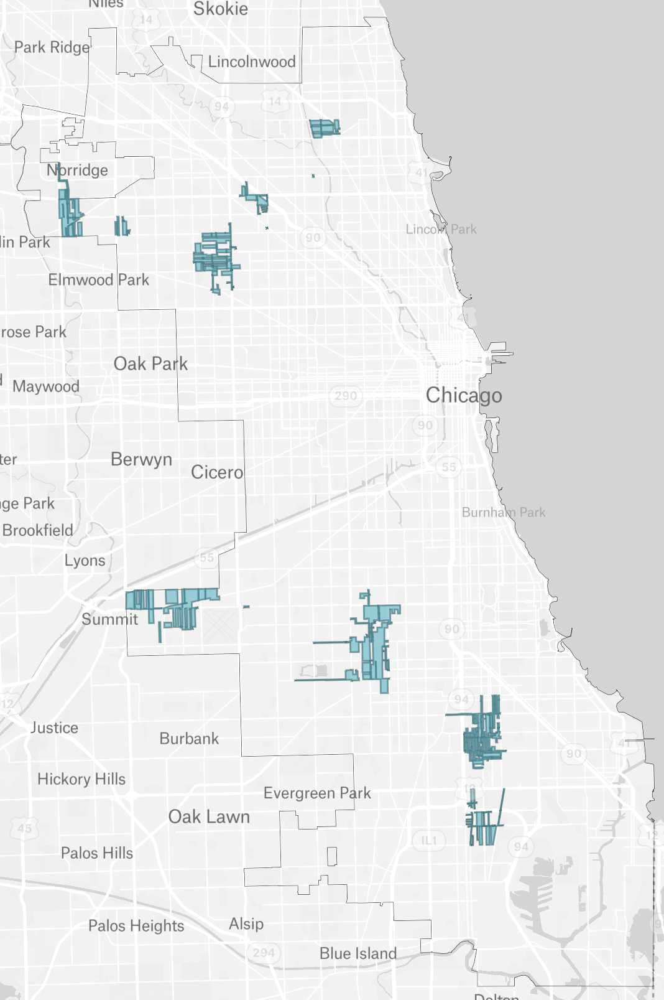
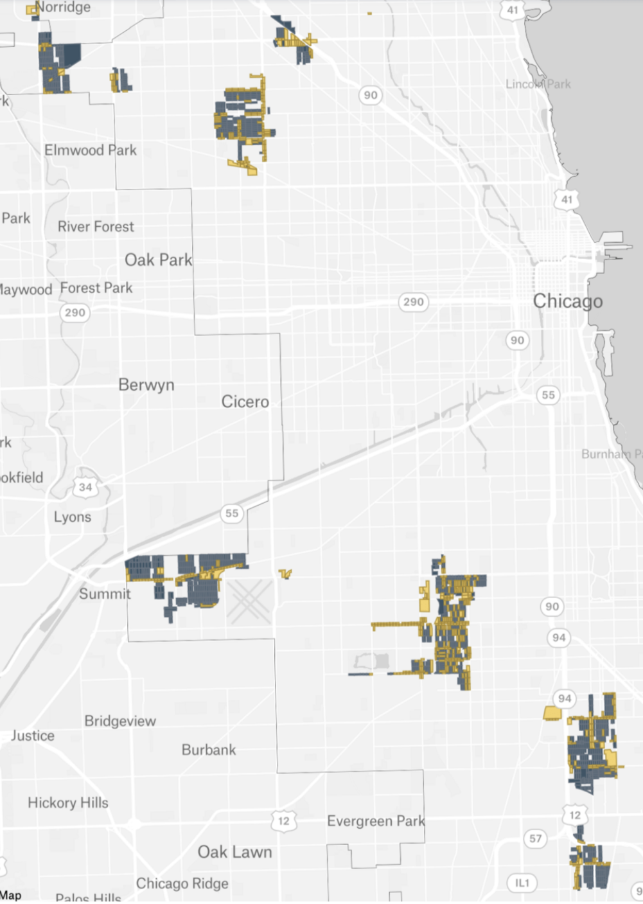

```{r}
#| label: setup
#| echo: false
#| message: false
#| warning: false
library(scales)
library(here)
library(dplyr)
library(sf)
here::i_am("reports/il_npa/working_draft_testimony.qmd")
load(here("reports", "il_npa", "report_variables.RData"))

# `res_only` and `res_only_w_area` are sf data frames; drop geometry once so
# downstream dplyr verbs operate on plain data.frames.
res_only_df        <- st_drop_geometry(res_only)
res_only_w_area_df <- st_drop_geometry(res_only_w_area)

# System-wide PRP scope: `total_prp_miles` and `lpp_spending_total` are
# loaded from the input sheet (lpp_program_3, lpp_spending_total) by
# notebooks/analysis.qmd and arrive via report_variables.RData above. We
# alias `total_prp_miles` to `prp_total_miles` for prose-readability.
# `n_prp_projects` is sourced from PGL's filing (NSG-PGL Ex. 3.0 at
# 8:150-151, 105) and is not currently in the input sheet — update here
# if PGL's filing revises the project count.
prp_total_miles    <- total_prp_miles
n_prp_projects     <- 179
pct_miles_in_scope <- n_miles / prp_total_miles

# Per-block example values for the §V single-block walkthrough.
sample_block_id <- "170314407001003"
sample_block <- res_only_df |> filter(geoid10 == sample_block_id)
sample_total_pipe       <- 0.1726  # both-sides total length on this block
sample_attributed_pipe  <- sample_block$street_miles
sample_sf               <- sample_block$sf_parcels
sample_mf_buildings     <- sample_block$mf_parcels
sample_mf_units         <- sample_block$mf_units
sample_total_units      <- sample_block$total_residential_units
sample_prp_cost         <- sample_block$prp_cost
sample_elec_sf_cost     <- sample_sf * cost_elec_sf
sample_elec_mf_cost     <- sample_mf_units * cost_elec_mf
sample_grid_cost        <- sample_total_units * grid_upgrade_cost_hh
sample_decomm_cost      <- sample_attributed_pipe * cost_decomm_mile
sample_total_npa        <- sample_elec_sf_cost + sample_elec_mf_cost +
  sample_grid_cost + sample_decomm_cost
sample_ratio            <- sample_total_npa / sample_prp_cost

# Per-block scattershot values for the §VII single-block walkthrough.
sample_scattershot_npv  <- sample_block$scattershot_npv
sample_prp_ss           <- sample_prp_cost + sample_scattershot_npv
sample_ratio_ss         <- sample_total_npa / sample_prp_ss

# Neighborhood-level cost-effectiveness summary for §V.
neigh_summary <- res_only_w_area_df |>
  filter(neighborhood %in% c("Englewood", "Garfield Ridge", "Lincoln Square")) |>
  group_by(neighborhood) |>
  summarise(
    n_res     = n(),
    n_cheaper = sum(npa_over_prp <= 1, na.rm = TRUE),
    pct_cheap = n_cheaper / n_res,
    .groups   = "drop"
  )
get_neigh <- function(name, col) neigh_summary |> filter(neighborhood == name) |> pull({{ col }})
n_eng        <- get_neigh("Englewood",      n_res)
n_eng_cheap  <- get_neigh("Englewood",      n_cheaper)
pct_eng      <- get_neigh("Englewood",      pct_cheap)
n_gar        <- get_neigh("Garfield Ridge", n_res)
n_gar_cheap  <- get_neigh("Garfield Ridge", n_cheaper)
pct_gar      <- get_neigh("Garfield Ridge", pct_cheap)
n_lin        <- get_neigh("Lincoln Square", n_res)
n_lin_cheap  <- get_neigh("Lincoln Square", n_cheaper)
pct_lin      <- get_neigh("Lincoln Square", pct_cheap)

# Portfolio totals (total_prp_cost_portfolio, total_npa_cost_portfolio,
# total_npa_pgl_cost_portfolio, total_grid_upgrade_cost_portfolio,
# total_ss_npv_portfolio, total_ss_npv_household_portfolio,
# total_ss_npv_grid_portfolio, total_prp_ss_portfolio,
# portfolio_savings_vs_prp, portfolio_savings_vs_prp_ss,
# portfolio_savings_pgl_household) are computed in
# notebooks/analysis.qmd and loaded from report_variables.RData above.
```

> **STATE OF ILLINOIS**
>
> **ILLINOIS COMMERCE COMMISSION**

| The Peoples Gas Light and Coke Company                                                                                  | ) | Docket No. 26-0065 |
| ----------------------------------------------------------------------------------------------------------------------- | - | ------------------ |
| Proposed general increase in rates and revisions to service classifications, riders and terms and conditions of service | ) |                    |

**DIRECT TESTIMONY OF**

**JUAN-PABLO VELEZ**

**ON BEHALF OF THE**

**CITIZENS UTILITY BOARD**

**CUB Exhibit 1.0**

April 30, 2026

---

## I. INTRODUCTION AND QUALIFICATIONS

**Q.** Please state your name and business address.

**A.** Juan-Pablo Velez. Co-founder and Executive Director of Switchbox. 1 Whitehall Street, 17th Floor, New York, NY 10004.


<br>

**Q.** By whom are you employed and in what capacity?

**A.** I am currently the Executive Director of Switchbox, a non-profit policy think tank building open analyses of state climate and energy policy for advocates, regulators, and the public.


<br>

**Q.** On whose behalf are you submitting this testimony?

**A.** I am testifying on behalf of the Citizens Utility Board ("CUB").


<br>

**Q.** Please summarize your professional and educational background.

**A.** I have a BA in Sociology from the University of Chicago. I took post-graduate math courses in probability theory, mathematical statistics, and vector calculus at Columbia University and NYU.

Before founding Switchbox, I was a staff machine learning engineer at Spotify, where I helped build some of the company's large-scale AI systems. Before that, I worked as a data scientist for a boutique data science consultancy called Polynumeral.

I founded and have led Switchbox for the past four years, where I have authored reports covering heat pump rates, building electrification and weatherization incentive programs, green hydrogen blending, non-pipeline alternatives, the economics and grid impacts of all-electric new construction mandates, and other topics. Our reports are based on software implementations of economics and engineering models.

I have presented our work on heat pump rate design at Northeast Energy Efficiency Partnership’s annual Heating Electrification Workshop and in front of the Illinois Commerce Commission. Our clients have included Environmental Defense Fund, National Resources Defense Council, Earthjustice, Acadia Center, Green Energy Consumers Alliance, Rewiring America, and others. Our reports have been covered by numerous national and local press outlets.


<br>

**Q.** Have you previously testified before the Illinois Commerce Commission?

**A.** No.


<br>

**Q.** Have you previously testified or submitted comments in regulatory proceedings in other states?

**A.** Yes. I submitted prefiled expert testimony before the Rhode Island Public Utilities Commission (RIPUC) on heat pump rates and bill-alignment analyses on 04/16/2026.


<br>

**Q.** Was this testimony prepared by you or under your direct supervision?

**A.** Yes.


<br>

**Q.** Are you sponsoring any exhibits with this testimony?

**A.** Yes — CUB Ex. 1.1 (CV), CUB Ex. 1.2 (Methodology Memo), and CUB Ex. 1.3 (Figures & Tables Appendix).

---

## II. PURPOSE OF TESTIMONY AND SUMMARY OF RECOMMENDATIONS

**Q.** What is the purpose of your testimony?

**A.** The purpose of my testimony is threefold. First, I identify the share of PGL's planned residential PRP scope that is cost-effective to electrify under three different cost-effectiveness perspectives. To do so, I quantify the upfront capital cost of meeting the Commission's 2035 cast-iron / ductile-iron ("CI/DI") retirement deadline through **targeted electrification** ("TE"), a type of non-pipeline alternative ("NPA"), and compare that cost to PGL's planned **pipe replacement**. The comparison is made at the level of residential blocks within PGL's planned Pipe Retirement Program ("PRP") project areas. Second, I show why the **current PRP process and the emerging NPA-evaluation framework discussed at the ICC's NPA workshop cannot, by construction, capture that potential**. Third, I recommend a three-part order the Commission should issue in order to help realize that potential.


<br>

**Q.** How is your testimony organized?

**A.** My testimony is organized as follows. Section III provides background and policy context. It describes the conflict between Chicago's electrification goals and PGL's pipe-replacement trajectory. Section IV describes my scope and analytical approach. Sections V through VII present three findings, one per cost-effectiveness perspective. Section VIII provides a structural critique. That is, why the current PRP and emerging NPA-evaluation processes cannot capture the potential benefits of TE. Section IX sets out my recommendations to the Commission. Section X presents reservations and conclusion. Section XI is an appendix containing the Figures & Tables index (CUB Ex. 1.3).


<br>

**Q.** Please summarize your principal findings.

**A.** My findings can be summarized in four parts, one for each cost-effectiveness perspective, plus a synthesis across all three.

Under the first cost-effectiveness perspective, of `r comma(n_res_blocks)` fully residential blocks inside PGL's planned PRP project areas, **approximately `r percent(pct_res_blocks_cheaper, accuracy = 0.1)`** (`r comma(n_res_blocks_cheaper)` blocks) are individually cheaper to electrify than to replace pipe, even before counting benefits beyond cost savings on upfront capital expenditures.

Under the second cost-effectiveness perspective, I detail a "portfolio" cost-neutral approach. This approach considers the effect that the planning of the sequence in which TE is implemented could have on its cost-effectiveness. Prioritizing the electrification of the cheapest blocks would lead to savings that could be used to electrify the next-most expensive group of blocks. Under this approach, **approximately `r percent(zero_crossing, accuracy = 0.1)`** of the PRP portfolio could be electrified at no net additional cost compared to PGL's PRP.

Under the third cost-effectiveness perspective, the comparison is made against the following counterfactual: PGL's planned pipe replacement plus the household-level "scattershot" electrification that would unfold as Chicago moves toward the residential electrification target in its Climate Action Plan. To represent that pattern, I assume that approximately 30% of residential units in the PRP scope electrify uniformly over a 10-year horizon, consistent with the CAP's 2035 trajectory. Under that counterfactual, **the entire residential portfolio is cheaper to coordinate as TE than to repipe-plus-scattershot**, and **approximately `r percent(pct_res_blocks_cheaper_ss, accuracy = 0.1)`** of blocks are individually cheaper under that comparison.

Across all three perspectives, the share of the residential PRP scope that is cost-effective to electrify is large — somewhere between roughly a quarter and all of it. There is no defensible reading of the data under which the answer is "approximately none."


<br>

**Q.** Please summarize your recommendations.

**A.** The Commission should issue a **three-part order**, structured to be incremental and to require no redirection of capital from the existing PRP.

1. **Order an independent third-party, selected by the Commission, to conduct a large-scale hydraulic feasibility study** covering the full universe of mains currently planned for retirement under the PRP (approximately `r comma(prp_total_miles)` miles across `r n_prp_projects` projects).

At minimum, the study must do three things:

(i) Identify the decomissioning sequence of pipe segments within the PRP program that would **maximize** the miles of CI/DI pipe that are hydraulically feasible to decomission citywide, assuming affected customers participate in targeted electrification projects.

(ii) Report the maximum number of CI/DI pipe miles, city blocks, and physical buildings that are hydraulically decommissionable under that maximizing sequence.

(iii) Identify the capabilities PGL would need to execute targeted electrification projects on the majority of city blocks identified as cost-effective to electrify and hydraulically feasible to decomission (assuming affected customers participated), and identify the gap between those capabilities and how PGL operates today. Decommissioning at this scale is not just a planning exercise: it requires signing up entire blocks of households at once rather than one customer at a time, coordinating gas decommissioning with electrification retrofits and potential ComEd grid upgrades, and bulk procuring efficient electrial appliances. None of these are capabilities PGL operates today, and the study should report what it would take to build them.

Decomissioning a segment of CI/DI pipe requires that targeted electrification of the affected buildings be cost-effective, and that it be hydraulically feasible to do so. The analysis presented in this testimony provides strong evidence that a significant share of the residential blocks that PGL is planning to do pipe replacement projects on could instead be cost-effectively electrified. However, we do not know which of these pipe segments would be hydraulically feasible to decomission, which in turn depends on the sequence in which surrounding pipe segments are decomissioned.

The purpose of the study would be to complement the cost-effectiveness analysis presented in this testimony with a high-level estimate of how many pipe segments it would be possible to decomission citywide if PGL was proactively planning to do so, rather than reactively evaluating hydraulic feasibility as individual projects are planned.

The independence of the study is essential. PGL has a financial incentive to underrepresent the share of its system that is hydraulically decommissionable, and no other party — not CUB, not Staff, not the Attorney General — can verify PGL's claims about hydraulic feasibility without access to PGL's pipe-topology data. A study conducted by PGL itself is at risk of ratifying the status quo.

2. **Order PGL to release the inputs to the Part 1 study.** Public inputs must be made available to all parties so they can replicate, sanity-check, and extend the work. Sensitive inputs — most importantly PGL's hydraulic pipe-topology data, along with any customer-level data — must be made available to qualified intervenors under NDA.

3. **Order a follow-on process to translate the Part 1 findings into an actionable plan.** Whether structured as a technical workshop or a new docketed proceeding, that process should produce two outputs: an estimate of the number of hydraulically feasible and cost-effective city blocks currently served by CI/DI mains that are planned for retirement under the PRP, and the design of a TE "track" under the PRP program that would allow PGL to decommission a meaningful share of those blocks. As proposed, the PRP program retires pipe segments in highest-risk order. For reasons that are detailed in this testimony, exclusive use of this approach precludes the possibility of large scale targeted electrifiction. The TE "track" would run alongside the existing "riskiest-first" track of PRP program, proactively decomissioning lower-risk pipe segments in a sequence that maximizes hydraulic feasibility. Together, these two tracks prioritize addressing safety risk while proactively executing on cost-effective TE. Without this third step, the Part 1 study risks producing a finding on which no party is empowered to act.

---

## III. BACKGROUND AND POLICY CONTEXT

**Q.** What is the central policy tension this testimony addresses?

**A.** Chicago and PGL are operating on two trajectories that point in opposite directions for the same residential customer base. On one side, Chicago has set a goal of electrifying 30% of residential buildings by 2035 in the Chicago Climate Action Plan.[^cap-2035] On the other side, the Commission has directed PGL to retire all remaining CI/DI mains under 36 inches by January 1, 2035 — roughly 1 in 4 miles of mains in PGL's distribution system[^smp-final-order] — and PGL proposes to do this work primarily through traditional pipe replacement.[^prp-traditional]

[^cap-2035]: City of Chicago, [*Chicago Climate Action Plan*](https://www.chicago.gov/content/dam/city/sites/climate-action-plan/documents/Chicago-CAP-071822.pdf) (2022) at 106.
[^smp-final-order]: Final Order in [Docket 24-0081](https://www.icc.illinois.gov/docket/P2024-0081/documents/361580/files/633326.pdf) at 3, 97.
[^prp-traditional]: NSG-PGL [Ex. 3.0](https://www.icc.illinois.gov/docket/P2026-0065/documents/375324/files/657976.pdf) at 38:778–788.

The same households are being asked to fund both: their own electrification costs and the PRP capital invested in gas infrastructure whose useful life their departure shortens. The magnitude of that overlap — the PRP capital that would be spent on blocks where electrification is cost-competitive, and that would become stranded as those households leave the gas system — is what the analysis presented in this testimony quantifies.


<br>

**Q.** What is PGL asking the Commission to authorize on the PRP in this case?

**A.** PGL is asking the Commission to authorize the retirement of approximately `r comma(prp_total_miles)` miles of CI/DI pipe across `r n_prp_projects` distinct projects under the PRP.[^prp-scope] Project-level spending is approximately $188M in 2026 and $306M in 2027, excluding contingency.[^prp-project-spending] Total PRP spending — approximately $214M in 2026 and $360M in 2027, including contingency — would flow through base rates rather than through Rider QIP, which has sunset.[^prp-total-spending]

[^prp-scope]: NSG-PGL [Ex. 3.0](https://www.icc.illinois.gov/docket/P2026-0065/documents/375324/files/657976.pdf) at 8:150–151, 105.
[^prp-project-spending]: NSG-PGL [Ex. 3.0](https://www.icc.illinois.gov/docket/P2026-0065/documents/375324/files/657976.pdf) at 106:2022 to 107:2026.
[^prp-total-spending]: Direct Testimony of Theodore Eidukas, NSG-PGL [Ex. 1.0](https://www.icc.illinois.gov/docket/P2026-0065/documents/375324/files/657962.pdf) at 4:86–89, 13:243–244.

PGL also acknowledges that residential gas demand on its system is declining: its SC-1 residential sales forecast is down nearly 5% by 2027 relative to 2024.[^sc1-decline]

[^sc1-decline]: NSG-PGL [Ex. 1.0](https://www.icc.illinois.gov/docket/P2026-0065/documents/375324/files/657962.pdf) at 21:394–396.


<br>

**Q.** Did the Commission's prior order open the door to non-pipeline alternatives?

**A.** Yes. The Final Order in Docket 24-0081 (Feb. 20, 2025) directed PGL to "work with stakeholders to study the feasibility of NPAs on its distribution system."[^npa-directive] The Commission specifically directed PGL to consider, at minimum, seven topics drawn from the City of Chicago's testimony in the SMP investigation: gas asset risk and timeline; hydraulic feasibility; the outlook for local electric capacity; types and numbers of customers; coordination with community-based organizations, local governments, and others; customer propensity to opt in to an NPA project; and equity in the locations of NPA projects.[^coc-seven-topics]

[^npa-directive]: Final Order in [Docket 24-0081](https://www.icc.illinois.gov/docket/P2024-0081/documents/361580/files/633326.pdf) (Feb. 20, 2025) at 205.
[^coc-seven-topics]: City of Chicago direct testimony, COC [Ex. 1.00](https://icc.illinois.gov/docket/P2024-0081/documents/351857/files/615437.pdf) at 48:910–49:927.

While I am not a lawyer, my reading of the Final Order is that the Commission's directive to study NPAs has two primary motivations:

1. **Cost.** The Commission found PGL "uniquely situated to seriously consider the application of Non-Pipeline Alternatives" because of its "urban, dense service territory, combined with significant CI/DI pipe retirement work"[^npa-directive] — language that, in regulatory NPA practice, identifies the conditions under which NPAs are most likely to be cheaper than replacement. The Commission also adopted the City of Chicago's framing that NPAs "can present cost savings, emissions reductions, and other societal benefits,"[^coc-three-benefits] and grounded the directive in the Initiating Order's request for "alternatives to the SMP" — PGL's largest capital program.[^initiating-order-alternatives] The directive, in other words, treats NPAs as a potential way to do the same job (CI/DI retirement) for less ratepayer cost.

[^coc-three-benefits]: City of Chicago direct testimony, COC [Ex. 1.00](https://icc.illinois.gov/docket/P2024-0081/documents/351857/files/615437.pdf) at 48 ("[NPAs] can present cost savings, emissions reductions, and other societal benefits."), as cited and adopted in [Final Order](https://www.icc.illinois.gov/docket/P2024-0081/documents/361580/files/633326.pdf) at 202.
[^initiating-order-alternatives]: Order Initiating Investigation, Docket 24-0081 (Feb. 7, 2024) at 3 (asking for information regarding alternatives to the SMP).

2. **Electrification and decarbonization.** The Commission's directive cross-references the Future of Gas proceeding, whose explicit charter is decarbonizing the gas system, and incorporates by reference its prior finding that planning methods to mitigate stranded-asset risk on the gas distribution system include NPAs.[^fog-decarb-cross-ref] It adopts the City's position that PGL's investment decisions must be "compatible with the goals and objectives of [the City's] energy vision, articulated in the Climate Action Plan"[^city-cap-context] — including the Plan's target to electrify 30% of existing residential buildings by 2035.[^cap-electrification] Two of the seven minimum study topics the Commission specifically adopted — **the outlook for local electric capacity** and **customer propensity to opt in to an NPA project**[^coc-seven-topics] — only make sense if NPAs are understood to include shifting customers off gas to electricity; neither question is relevant to liners, repairs, or other pipeline-based interventions. The consensus framing in the NPA workshops, including by utility Nicor Gas, was that "decarbonization is a primary objective of this proceeding."[^nicor-decarb]

[^fog-decarb-cross-ref]: [Final Order](https://www.icc.illinois.gov/docket/P2024-0081/documents/361580/files/633326.pdf) at 204 ("The Commission expressly determined that Non-Pipeline Alternatives ('NPAs') should be examined in the Future of Gas proceeding. See 2023 Final Order at 122."); 2023 Final Order, [Docket 23-0068/0069 (Consol.)](https://www.icc.illinois.gov/docket/P2023-0068) at 122 (directing the Future of Gas process to consider, among other issues, "[s]tranded assets of the gas distribution system and planning methods to mitigate the issue, including NPAs").
[^city-cap-context]: City of Chicago direct testimony, COC [Ex. 1.00](https://icc.illinois.gov/docket/P2024-0081/documents/351857/files/615437.pdf), as recounted in [Final Order](https://www.icc.illinois.gov/docket/P2024-0081/documents/361580/files/633326.pdf) at ~30.
[^cap-electrification]: City of Chicago, [2022 Climate Action Plan](https://www.chicago.gov/content/dam/city/sites/climate-actionplan/documents/Chicago-CAP-071822.pdf) (target: electrifying 30% of total existing residential buildings, 20% of total existing industrial buildings, 10% of total existing commercial buildings, and 90% of total existing City-owned buildings by 2035), as recounted in [Final Order](https://www.icc.illinois.gov/docket/P2024-0081/documents/361580/files/633326.pdf) at ~30.
[^nicor-decarb]: Nicor Gas comments at NPA Workshop #1, summarized in Celia Johnson Consulting, [*NPA Workshop Report*](https://icc.illinois.gov/api/web-management/documents/downloads/public/NPAI/NPA%20for%20Peoples%20Gas%20Workshop%20Report_FINAL_2-11-26.pdf) (Feb. 11, 2026) at 11.

This testimony responds to both motivations: it identifies _at what scale_ pipe retirement and targeted electrification can be paired cost-effectively on PGL's urban, CI/DI-heavy system.


<br>

**Q.** What did the NPA workshop process actually produce?

**A.** Eight workshops were held between September and December 2025 with over 140 participants. The Facilitator's Report concludes that "the feasibility of NPAs were not studied" during the workshop process and that PGL "did not commit to specific actions related to NPAs on its distribution system."[^facilitator-report]

[^facilitator-report]: Celia Johnson Consulting, [*NPA Workshop Report*](https://icc.illinois.gov/api/web-management/documents/downloads/public/NPAI/NPA%20for%20Peoples%20Gas%20Workshop%20Report_FINAL_2-11-26.pdf) (Feb. 11, 2026).

The City of Chicago, in written comments on the draft report, argued that the Commission's directive for the workshop series was not fulfilled. The City and the Facilitator's Report converge on the same two reasons. PGL had not retained its NPA consultant during the workshop period — the consultant was hired only after the workshops had concluded — and as a result PGL was "not in a position to propose an evaluation framework" or to engage in detailed discussions with stakeholders about how NPAs would be incorporated into the PRP. ComEd was unable to participate in the workshops or to submit written comments on local electric capacity by the time the report was finalized, which prevented stakeholders from assessing one of the seven minimum workshop topics the Commission had specified. The Commission's 120-day workshop window provided no opportunity to remedy these gaps before the report's deadline.

Switchbox's presentation at Workshop #8 on December 16, 2025 shared the analysis underlying this testimony.[^workshop-8] The cost-effective TE potential I quantify in Sections V through VII was therefore on the workshop record before this rate case was filed.

[^workshop-8]: [*Workshop #8 Meeting Notes*](https://icc.illinois.gov/api/web-management/documents/downloads/public/NPAI/December-16-2025_Meeting%20Notes_FINAL.pdf) (Dec. 16, 2025).


<br>

**Q.** What did PGL itself say about NPAs in the present rate case?

**A.** PGL's position on NPAs in this rate case has two parts that do not fit together.

At the project level, PGL commits to considering NPAs before deciding to replace CI/DI pipe, and identifies geothermal systems, targeted electrification, and cured-in-place liners as the current options it would consider.[^prp-npa-options]

[^prp-npa-options]: NSG-PGL [Ex. 3.0](https://www.icc.illinois.gov/docket/P2026-0065/documents/375324/files/657976.pdf) at 99:1881–1890.

But at the system level, PGL forecloses any rate-case action on those same alternatives. PGL witnesses Graves, Figueroa, and Sreenath argue that it is "neither feasible nor realistic" for PGL to include in this rate case any material resource or service design plans that would call for decarbonization or affect PRP execution in 2027 or beyond in a cost-effective manner.[^gfs-not-feasible] They give five reasons:

[^gfs-not-feasible]: Direct Testimony of Frank C. Graves, Josh Figueroa, and Ragini Sreenath, NSG-PGL [Ex. 7.0](https://www.icc.illinois.gov/docket/P2026-0065/documents/375328/files/658043.pdf) at 8:174 to 9:216.

- **Unresolved policy issues.** The Commission has not yet decided how to handle critical issues such as incentivizing or mandating customer fuel switching, which are under discussion in the Illinois Future of Gas ("FoG") proceedings and other forums but whose outcomes remain unclear. Aggressive decarbonization by gas and electric utilities may require new laws and regulatory authorizations to permit new forms of engagement with customer end-use energy management.

- **Limited budget and staff.** PGL does not currently have the resources to run large-scale decarbonization programs, and scaling them up would require material changes to the Commission's historic approach to rate-setting. This explains why we propose that this topic be considered as part of the hydraulic feasibility study we recommend.

- **Electric system challenges.** The Illinois electric grid is already facing significant demand pressures and fundamental cost increases, citing recent North American Electric Reliability Corporation ("NERC") assessments and the December 2025 Illinois Resource Adequacy Study. The witnesses argue that mandating electricity for heating and cooking, alongside surging demand from data centers, would exacerbate these pressures and make a near-term carbon-free power supply less likely.

- **Big projects take administrative time.** Major decarbonization initiatives require long lead times for siting, permitting, neighborhood coordination, and cross-utility planning. The witnesses also state that, based on the Commission's recent decisions in gas utility rate cases, they understand the Commission's preference is that potential pilot studies be addressed in the ongoing FoG proceeding rather than in rate cases.

- **The Commission's 2035 retirement directive.** The Commission has ordered PGL to complete the retirement of CI/DI main in Chicago by 2035. Satisfying that 10-year horizon while also reducing operating costs takes priority while longer-term policy questions are addressed.

The witnesses reach a second major conclusion: PGL would need a series of new authorizations even to begin preparing for deep decarbonization, with deep decarbonization itself anticipated to proceed only starting around 2030. Those authorizations include expanded budgets, new investment-decision criteria, clarity on incentives and potential subsidies, and policies for recovery of stranded costs and decarbonization expenses. The witnesses note that several of the relevant mechanisms — capitalized energy efficiency, rate-base subsidies for low-income NPA adoption, cross-billing of gas-utility-sponsored electrification to local electric utilities, utility ownership of behind-the-meter decarbonization equipment, and NPA adoption incentives such as performance-based rates — have precedents or are under consideration in other states' FoG proceedings.


<br>

**Q.** How does this testimony respond to PGL's framing of the role of NPAs?

**A.** I disagree with PGL's framing that Targeted Electrification NPAs are within scope at the project level but cannot be evaluated at the system level. System-level cost-effectiveness can be approximately estimated using publicly available GIS data on parcels, buildings, and street centerlines, and that is what this testimony does. System-level hydraulic feasibility can be similarly approximated using PGL's existing hydraulic pipe model, which PGL already operates internally — and that is precisely the analysis the recommendations in Section IX ask the Commission to order. The information needed to evaluate NPAs at the system level is not unavailable: it is simply not on the record.

In addition, while we agree that the Commission has currently bound PGL to complete the retirement of CI/DI mains by 2035, we do not agree that the potential for large-scale targeted electrification constitutes a longer-term policy question that is out of scope for this rate case (rather, it may be the 2035 goal itself that is incompatible with large-scale targeted electrification.) The Commission is considering whether to authorize the retirement of roughly a quarter of the City of Chicago's gas distribution system, which PGL has indicated it will do primarily via replacement. The choices being locked in by that decision are not abstract policy questions for some future docket — they are concrete, system-shaping commitments whose consequences will compound for decades.

PGL's own forecast expects residential gas demand to decline by nearly 5% by 2027,[^sc1-decline] indicating that the natural gas death spiral — a negative feedback loop wherein rising gas delivery costs push customers to electrify, leaving fewer customers to pay for gas delivery, which raises delivery rates further — may already be underway. Rebuilding a quarter of Chicago's gas distribution network—which needs to be decomissioned over the next few decades to meet IL's decarbonization goals—would inflate PGL's rate base, worsening and accelerating that spiral.

Large-scale targeted electrification, on the other hand, would kickstart the process of decomissioning the distribution system, slowing the death spiral and dramatically accelerating the Chicago's electrification trajectory.

---

## IV. SCOPE AND ANALYTICAL APPROACH

**Q.** What are the planned PRP project areas your analysis covers, and where does the project-area data come from?

**A.** PGL maintains a public construction map of its planned PRP project areas at https://www.peoplesgasdelivery.com/services/pipe-retirement-program-construction. The map renders project polygons coded by status — Preparation, Installation, Restoration, and Complete. It also stores the per-project metadata (project name, phase code, contractor, status, and construction start and end dates). The project areas analyzed by this testimony are sourced directly from that public map.

I applied two pre-processing steps to this dataset of GIS polygons. First, I unioned adjacent and overlapping project polygons to avoid double-counting pipe miles where two or more projects share an edge or footprint. For unioned polygons whose component projects had different start dates, I retained the latest of those dates. Second, I only kept project areas currently classified as "planned", and excluded any project area already underway or completed at the time of the analysis. The final PRP project dataset comprises project polygons with construction start dates after January 1, 2026, excluding service-installation and street-restoration projects.

::: {.column-page-inset-right}
{#fig-projects}
:::

Within that universe of project areas, my analysis focuses on a specific subset of fully residential city blocks.


<br>

**Q.** What is the universe of pipe and customers in scope?

**A.** Inside the footprint of PGL's planned PRP project areas, my analysis identifies `r comma(n_blocks_total)` total city blocks. Of those, `r comma(n_res_blocks)` — approximately `r percent(pct_res_blocks_total, accuracy = 0.1)` — are fully residential blocks, and they form the "in-scope" set of city blocks evaluated in this analysis. I exclude mixed-zoning and commercial blocks because per-unit electrification costs for non-residential buildings in Chicago are not well-established in the public literature, and including them would introduce a source of cost uncertainty that the residential-only analysis does not have.

@fig-blocks-by-type shows where these city blocks are located within PGL's planned PRP project areas. The blue blocks are the in-scope residential blocks, and the yellow blocks are the excluded mixed-zoning and commercial blocks.

::: {.column-page-inset-right}
{#fig-blocks-by-type}
:::

The `r comma(n_res_blocks)` in-scope residential blocks contain `r comma(n_res_units)` residential units, comprising `r comma(n_sf)` single-family parcels and `r comma(n_mf)` multi-family units.

I estimate that`r round(n_miles)` miles of mains run beneath these blocks. That is roughly `r percent(pct_miles_in_scope, accuracy = 0.1)` of the approximately `r comma(prp_total_miles)` miles of CI/DI mains PGL plans to retire system-wide under the PRP, as shown in @fig-miles-of-prp-3seg.[^prp-scope]

::: {.column-page-inset-right}

:::

<br>

**Q.** What cost categories did you include in your comparison of the up-front costs of pipe replacement and targeted electrification?

**A.** The cost model is built from six inputs.

On the pipe-replacement side, I use approximately `r dollar(cost_lpp_mile, scale = 1e-6, suffix = " million", accuracy = 0.01)` per mile for replacement and approximately `r dollar(cost_decomm_mile, scale = 1e-3, suffix = " thousand", accuracy = 1)` per mile for decommissioning. Both figures come from PGL's own data in its System Modernization Plan filing in Docket 24-0081.[^smp-replacement-cost] [^smp-decomm-cost]

TODO UPDATE THIS AND SIDENOTE

[^smp-replacement-cost]: Peoples Gas, *System Modernization Plan* (Docket 24-0081), [Total PRP Program cost at 63](https://www.documentcloud.org/documents/26371764-p2024-0081-pgl-ex-20-220-part-1-47633300/#document/p64/a2775097) (~$7.19B for Program Option 3) divided by [miles of main to be retired at 42](https://www.documentcloud.org/documents/26371764-p2024-0081-pgl-ex-20-220-part-1-47633300/#document/p42/a2775095) (1,451 miles), yielding ~$4.96M per mile.
[^smp-decomm-cost]: Peoples Gas, [*System Modernization Plan* at 50](https://www.documentcloud.org/documents/26288705-p2024-0081-pgl-ex-20-220-part-1-47633300/#document/p50/a2677860) (Docket 24-0081, decommissioning).

On the electrification side, I use approximately `r dollar(cost_elec_sf, scale = 1e-3, suffix = " thousand", accuracy = 1)` per unit for single-family electrification and approximately `r dollar(cost_elec_mf, scale = 1e-3, suffix = " thousand", accuracy = 1)` per unit for multi-family electrification, drawn from Commonwealth Edison's ("ComEd") CY2024 Cost-Effectiveness Analysis, prepared by Guidehouse. To capture the cost of accommodating new winter electric load on the local distribution grid, I add an electric distribution upgrade cost of approximately `r dollar(grid_upgrade_cost_hh, accuracy = 1)` per household — derived from the long-run marginal cost of distribution capacity, approximately `r dollar(lrmc_peak_kw, accuracy = 0.01)` per kilowatt, applied to the incremental winter peak demand from heating electrification (the difference between winter peak with a heat pump and summer peak with air conditioning). The grid-upgrade figure is sourced from Energy and Environmental Economics' ("E3") Value of Distributed Energy Resources analysis for Illinois.

For the scattershot baseline used in the third cost-effectiveness perspective, I assume that approximately 30% of residential units in the in-scope blocks electrify uniformly over a 10-year horizon, discounted at 5%. That trajectory is anchored to the residential electrification target in Chicago's Climate Action Plan, as discussed in §III.

The full citation chain for each input is documented in the Methodology Memo (CUB Ex. 1.2).


<br>

**Q.** What did you exclude from your analysis?

**A.** The analysis excludes seven categories of cost, benefit, and feasibility considerations.

1. I exclude operating costs, rate-base effects, and externalities. That covers gas-bill and electric-bill impacts on participants and non-participants, avoided gas-system O&M, rate-base and return-on-equity effects, and the carbon-emissions and air-quality benefits of switching off gas heating. This is an upfront-capital-only analysis.

2. I exclude project-specific PRP cost variation. I use a single average dollars-per-mile figure across all blocks, derived from PGL's rate case filing. PGL has the actual project-by-project cost data and acknowledges that projects are heterogeneous.[^prp-cost-variation] Using PGL's own project-by-project costs instead of a single average would change which specific blocks are identified as cost-effective TE candidates. (Consequently, our analysis should not be used as basis for detailed TE planning, but rather as an estimate of the potential cost savings of cost-effective TE citywide.)

3. I exclude any escalation of PRP capital costs beyond PGL's own forecast. The approximately `r dollar(cost_lpp_mile, scale = 1e-6, suffix = "M", accuracy = 0.01)`-per-mile figure I use is PGL's SMP-horizon projection, held flat in this analysis. PGL also forecasts approximately 5.4% annual day-to-day O&M growth for 2024–2027, against projected CPI inflation of approximately 3% over the same period.[^om-growth] O&M is not PRP capital expenditure, but I take the O&M trajectory as a proxy indicator that PGL's broader cost base is rising — which would mean my analysis understates TE's relative advantage if PRP capital costs follow a similar trend.

TODO: DECIDE WHETHER TO CUT OR REWRITE THE ABOVE

[^om-growth]: NSG-PGL [Ex. 1.0](https://www.icc.illinois.gov/docket/P2026-0065/documents/375324/files/657962.pdf) at 5:95 to 6:105.

4. I exclude hydraulic decommissioning feasibility — whether segments can be physically decommissioned as a unit, given the rest of the network. That question is taken up structurally in §VIII.

5. I exclude social feasibility. The analysis assumes that every unit on a block participates in TE. Real-world participation rates would depend on enabling policies, program design, marketing, and incentive levels.

6. I exclude pipe lining, repair, and other smaller-scope retirements — a third pathway between full pipe replacement and full electrification. The analytical focus here is the cost-effectiveness of TE specifically. In practice, a real-world program could combine TE on cost-effective blocks with lining or repair on others.

7. As noted above, I exclude commercial and industrial parcels for lack of public data on their upfront electrification costs.


<br>

**Q.** What three cost-effectiveness perspectives do you evaluate?

**A.** I evaluate the in-scope residential blocks under three different perspectives on upfront cost-effectiveness.

Perspective 1 — Strict block-level cost-effectiveness. A block is deemed cost-effective only when its TE cost is at or below its PRP cost. This is the most conservative possible upfront-cost test.

Perspective 2 — Portfolio cost-neutral. I rank the in-scope residential blocks cheapest-first by their TE-to-PRP cost ratio. The savings on the cheapest blocks offset the higher costs of the next-cheapest blocks. The cost-effective set extends to the point where cumulative net savings cross zero. In other words: how many blocks could be electrified for the same cost as PGL was already going to spend on pipe replacement, assuming the most cheapest-to-TE blocks are prioritized?

Perspective 3 — Portfolio with scattershot electrification baseline. I compare coordinated TE not to PRP alone, but to PRP plus the upfront capital cost of a scattershot household-level electrification trajectory consistent with Chicago's stated 2035 residential electrification target of 30%. This comparison takes the City of Chicago's stated electrification goal seriously: under the electrification trajectory needed to meet that goal, Chicagoans would pay for both new pipe under PRP and for 30% of their homes to be electrified over the same period, unless those investments are coordinated. In other words, this is a total upfront cost perspective.

<br>

**Q.** How do the three cost-effectiveness perspectives compare?

**A.**
The three perspectives are not competing hypotheses. They are three different ways of balancing two values that this proceeding must weigh together: ratepayer cost-effectiveness on the one hand, and the City's stated electrification trajectory on the other. **Perspective 1** privileges ratepayer cost-effectiveness absolutely — TE is justified only on blocks where it would strictly save money relative to pipe replacement on those blocks. In other words, pursuing TE on these blocks would address potential leaks on those blocks for less than pipe replacement, and would have to important additional benefit of fully electrifying those homes.

**Perspective 2** recognizes that TE and pipe replacement are not equivalent investments: a dollar spent on TE advances the City toward its decarbonization goals, while a dollar spent on PRP risks creating stranded assets in a system the State must wind down to meet its decarbonization goals. Under that asymmetry, the natural question is no longer whether TE strictly saves money block by block, but how much TE could be done _at the same total cost as PRP_ across the portfolio.

**Perspective 3** carries that logic one step further, by noting that it makes little sense to rebuild the gas distribution system while simultaneously paying — outside the rate base, household by household — to retire approximately 30% of its demand. A simple way to measure this opportunity cost is to compare TE to PRP plus scattershot electrification, and the question becomes how many blocks could be fully electrified for less than that combined sum.

---

## V. PERSPECTIVE 1 (STRICT BLOCK-LEVEL COST-EFFECTIVENESS)

**Q.** Under a strict block-by-block cost-effectiveness comparison, what share of fully residential blocks in PGL's planned PRP project areas could be electrified at or below the cost of pipe replacement?

**A.** Approximately `r percent(pct_res_blocks_cheaper, accuracy = 0.1)` — `r comma(n_res_blocks_cheaper)` of the `r comma(n_res_blocks)` in-scope fully residential blocks — are individually cheaper to electrify than to replace pipe under the cost inputs and exclusions described in §IV.


<br>

**Q.** To understand the methodology you used to arrive at those aggregate results, can you walk through how your methodology is applied to a single block?

**A.** The cost comparison is built from the bottom up — block by block — using publicly available parcel and street data. To illustrate the methodology I apply to every in-scope residential block, I walk through the calculation for a single representative block: Census block `r sample_block_id`, on East 87th Place in Chicago's South Side.

::: {.column-page-inset-right}
{#fig-aerial-87th}
:::

Aerial imagery shows a low-density Chicago residential block dominated by single-family homes, with several vacant lots and a few low-rise multi-family buildings interspersed.

::: {.column-page-inset-right}
{#fig-outline-87th}
:::

To estimate the length of CI/DI gas main serving this block, we measure the length of the street. Approximately `r round(sample_total_pipe, 2)` miles of street run along this block.

At the approximately `r dollar(cost_lpp_mile, scale = 1e-6, suffix = " million", accuracy = 0.01)` per mile pipe-replacement cost from §IV, pipe replacement on this block prices at approximately `r dollar(sample_prp_cost, scale = 1e-3, suffix = " thousand", accuracy = 1)`.

Because gas mains in this corridor serve blocks on both sides of the street, the analysis allocates the pipe replacement cost along this block proportionally — by each block's share of the construction-polygon perimeter — yielding approximately `r round(sample_attributed_pipe, 3)` miles of pipe attributed to this block for cost-accounting purposes.


::: {.column-page-inset-right}
{#fig-parcels-87th}
:::

Inside that footprint, each parcel is either a residential structure or a vacant lot. The block contains `r sample_sf` single-family parcels and `r sample_mf_buildings` multi-family buildings totaling `r sample_mf_units` multi-family units — `r sample_total_units` residential units in all. Structures and units, not miles, drive the electrification side of the comparison, which has four components:

(i) Single-family electrification: `r sample_sf` parcels at approximately `r dollar(cost_elec_sf, scale = 1e-3, suffix = " thousand", accuracy = 1)` per parcel, totaling approximately `r dollar(sample_elec_sf_cost, scale = 1e-3, suffix = " thousand", accuracy = 1)`.

(ii) Multi-family electrification: `r sample_mf_units` units at approximately `r dollar(cost_elec_mf, scale = 1e-3, suffix = " thousand", accuracy = 1)` per unit, totaling approximately `r dollar(sample_elec_mf_cost, scale = 1e-3, suffix = " thousand", accuracy = 1)`.

(iii) Electric distribution upgrade: `r sample_total_units` residential units at approximately `r dollar(grid_upgrade_cost_hh, accuracy = 1)` per unit, totaling approximately `r dollar(sample_grid_cost, scale = 1e-3, suffix = " thousand", accuracy = 1)`.

(iv) Pipe decommissioning: the same approximately `r round(sample_attributed_pipe, 3)` miles of attributed pipe at approximately `r dollar(cost_decomm_mile, scale = 1e-3, suffix = " thousand", accuracy = 1)` per mile, totaling approximately `r dollar(sample_decomm_cost, scale = 1e-3, suffix = " thousand", accuracy = 1)`.

<!-- TODO: chunk fig-single-block-eg in notebooks/analysis.qmd is missing a `#| fig-cap:` directive — flag for Alex. -->

::: {.column-page-inset-right}

:::

Summed together, the electrification side of the comparison comes to approximately `r dollar(sample_total_npa, scale = 1e-3, suffix = " thousand", accuracy = 1)` against approximately `r dollar(sample_prp_cost, scale = 1e-3, suffix = " thousand", accuracy = 1)` for pipe replacement, as shown in @fig-single-block-eg. The block's TE-to-PRP cost ratio is approximately `r percent(sample_ratio, accuracy = 1)` — slightly more expensive to electrify than to replace pipe on this block. It is not part of the cost-effective set under Perspective 1, but I use it to illustrate the cost-decomposition mechanics that produce that set. The same four components, applied at scale across all `r comma(n_res_blocks)` in-scope blocks, drive every result in this section.


<br>

**Q.** Does the share of cost-effective blocks vary across Chicago neighborhoods?

**A.** Yes, dramatically. Different Chicago neighborhoods sit at very different points on the housing density distribution, and density largely drives the block-level cost ratio. Lower-density blocks dominated by single-family homes have few residential units per mile of pipe, so each unit's electrification cost is set against a relatively large share of avoided pipe-replacement cost on the PRP side. Higher-density blocks dominated by multi-family buildings have many units per mile, so per-unit electrification costs accumulate against a smaller per-unit pipe-cost share — raising the ratio.

To illustrate the variation, I selected three contrasting neighborhoods from the in-scope set: Englewood on the South Side, Garfield Ridge on the Southwest Side, and Lincoln Square on the North Side. Together they span the range of housing forms in PGL's planned PRP footprint — from low-density blocks with substantial vacant land, through moderate-density bungalow blocks, to dense multi-family blocks. The maps below show each neighborhood's in-scope residential blocks colored by TE-to-PRP cost ratio: green and yellow blocks are cost-effective under Perspective 1, orange and red are not.

In **Englewood**, `r comma(n_eng)` of the in-scope residential blocks fall within the neighborhood boundary, and approximately `r percent(pct_eng, accuracy = 1)` of them — `r comma(n_eng_cheap)` blocks — are individually cheaper to electrify than to replace pipe. That is more than twice the citywide cost-effective share. Englewood's housing stock is predominantly single-family, and substantial vacant land further lowers the residential-unit count per mile of pipe — yielding favorable economics on a strict block-by-block test.

::: {.column-page-inset-right}
{#fig-englewood}
:::

In **Garfield Ridge**, `r comma(n_gar)` in-scope residential blocks fall within the neighborhood boundary, of which approximately `r percent(pct_gar, accuracy = 1)` — `r comma(n_gar_cheap)` blocks — are cost-effective under Perspective 1. Garfield Ridge has a mix of single-family and multi-family housing at moderate density. Many blocks are made up of detached single-family bungalows on standard Chicago lots — visible in the map as the prevalent yellow shading, indicating cost ratios in the 100–150% range — while denser multi-family blocks pull others into the orange/red. The result is a roughly even split between cost-effective and not-cost-effective blocks, with a long tail of borderline (yellow) blocks that sit just above the Perspective 1 threshold but would become cost-effective under the more permissive perspectives in §§ VI and VII.

::: {.column-page-inset-right}
{#fig-garfield-ridge}
:::

In **Lincoln Square**, `r comma(n_lin)` in-scope residential blocks fall within the neighborhood boundary, and approximately `r percent(pct_lin, accuracy = 1)` — `r comma(n_lin_cheap)` blocks — are cost-effective under Perspective 1. That is about a third of the citywide cost-effective share. Lincoln Square's housing stock is predominantly multi-family — two-flats, three-flats, and small apartment buildings — with high residential-unit counts per mile of pipe. Per-unit electrification costs accumulated across many units per block outpace the per-mile pipe-replacement cost, leaving most of the map red.

::: {.column-page-inset-right}
{#fig-lincoln-square}
:::

These three neighborhoods illustrate how cost-effectiveness varies with housing form across PGL's planned PRP footprint.


<br>

**Q.** Does the geographic pattern across these three neighborhoods correlate with income?

**A.** In these three neighborhoods, yes — and the correlation runs in a direction the Commission should attend to. Englewood, the lowest-income of the three, is also the most cost-effective to electrify under Perspective 1 due to its low density and substantial vacant land. Lincoln Square, the highest-income, is the least cost-effective due to its high density and dense multi-family housing. Garfield Ridge sits between them along both dimensions.

This is a finding about these three neighborhoods, not a system-wide claim. I have not analyzed the income distribution across all `r comma(n_res_blocks)` in-scope residential blocks in PGL's planned PRP project areas, and I do not assert that the income-cost-effectiveness correlation observed here would hold across the full footprint or across PGL's entire CI/DI service territory.

However, the directional implication is worth making explicit: a TE program scoped on Perspective 1 cost-effectiveness alone, if extrapolated from the pattern in these three neighborhoods, would tend to land disproportionately in lower-income neighborhoods. Lower-income customers in those neighborhoods also tend to carry higher energy burden and stand to gain disproportionately from operating-cost reductions associated with electrification.


<br>

**Q.** What does this cost comparison look like across all of PGL's planned PRP project areas?

**A.** The histogram in @fig-histogram-npa-over-prp is the citywide picture under Perspective 1: each in-scope residential block plotted by its NPA-to-PRP cost ratio — the cost of electrifying the block divided by the cost of replacing the pipe under it. Anything to the left of 100% is cheaper to electrify than to replace pipe.

::: {.column-page-inset-right}

:::

Two features of the distribution stand out. The left tail is dense — roughly a quarter of blocks sit below 100%. These blocks represent the cost-effective share already reported above. The bulk of the distribution sits between 100% and 200%. These are blocks where TE is more expensive than pipe replacement at the strict block-by-block test, but where the gap is small enough that the portfolio and scattershot perspectives in §§ VI and VII bring most of them into the cost-effective set.


<br>

**Q.** What attribute most strongly predicts whether a block is cheaper to electrify than to replace pipe?

**A.** Housing density, dominantly — the same driver visible in the contrast between Englewood, Garfield Ridge, and Lincoln Square, but now across all `r comma(n_res_blocks)` in-scope residential blocks. Lower-density blocks dominated by single-family homes — particularly those that include vacant lots — skew toward cheap-to-electrify. Higher-density blocks dominated by multi-family buildings skew toward expensive.

@fig-scatter-density-vs-npa-over-prp-w-line plots NPA-to-PRP cost ratio against units per acre within the in-scope blocks. Each point is a block, colored by the share of units on the block that are single-family. The color gradient is orange for single-family blocks and blue for multi-family blocks. The orange high single-family points cluster in the lower-left, while the blue low single-family points climb up and to the right. This, along with the upward slope, shows a positive correlation between density and cost ratio. Single-family share runs in the opposite direction: blocks dominated by single-family parcels tend to have lower density and lower cost ratios.

::: {.column-page-inset-right}

:::

The data needed to operationalize this relationship at the block scale — parcel counts, building types, and miles of mains — is publicly available right now, from the Cook County Assessor's parcel records and the City of Chicago's street centerline data. A first NPA tranche can therefore be scoped from public data alone.


<br>

**Q.** Is this Perspective 1 cost-effective potential geographically concentrated, or distributed across the city?

**A.** Distributed. Cost-effective blocks (green and yellow on the map below) are scattered across many parts of PGL's planned PRP footprint, not clustered in a single neighborhood or ward. @fig-city-wide-colored maps every in-scope residential block by its NPA-to-PRP cost ratio. Cost-effective blocks are visible across the South Side, the Southwest Side, and parts of the Northwest Side.

::: {.column-page-inset-right}
{#fig-city-wide-colored}
:::


<br>

**Q.** How feasible is the assumption that every household on a block would participate?

**A.** While I am not a lawyer, my understanding is that the 100%-participation assumption built into Perspective 1 reflects a constraint of current state law: a public utility cannot abandon or discontinue service to a customer without Commission approval (220 ILCS 5/8-508), and a gas main cannot be physically retired while any customer remains connected to it. This is not a free analytical assumption — I acknowledge it directly. The point of the cost-effectiveness analysis is to identify the cost-effective potential first, before getting into the question of social feasibility. There would be little value in spending energy on the social-feasibility question if no blocks were cost-effective to electrify in the first place. Conversely, the fact that a non-trivial share of in-scope blocks is cost-effective even under the strictest test strengthens, rather than weakens, the case for practically addressing social feasibility through program design.

It is also worth noting that the relevant comparison is not "TE with full participation" versus "do nothing." It is "TE with full participation" versus "PRP with full participation". The question for the Commission is which coordinated investment ratepayers fund.


<br>

**Q.** What do the `r comma(n_res_blocks_cheaper)` cost-effective blocks represent in dollars, miles, and units?

**A.** The `r comma(n_res_blocks_cheaper)` in-scope residential blocks where electrification is at or below the cost of pipe replacement under Perspective 1 collectively contain `r comma(n_res_units_1_0)` residential units — `r comma(n_sf_1_0)` single-family parcels and `r comma(n_mf_1_0)` multi-family units — and approximately `r round(n_miles_1_0, 1)` miles of CI/DI mains that PGL would not need to replace if those blocks were electrified instead.

Aggregated across these `r comma(n_res_blocks_cheaper)` blocks, the electrification cost totals approximately `r dollar(npa_total_ce_1_0, scale = 1e-6, suffix = " million", accuracy = 0.1)`, against pipe-replacement cost of approximately `r dollar(prp_total_ce_1_0, scale = 1e-6, suffix = " million", accuracy = 0.1)` — a difference of approximately `r dollar(-1 * total_cost_diff_1_0, scale = 1e-6, suffix = " million", accuracy = 0.1)` in upfront capital savings under the Perspective 1 test.

These totals are not budgetary numbers, and they are not what I am asking the Commission to redirect. They are the magnitude, in physical units and undiscounted dollars, of the share of PGL's planned residential PRP scope for which it is already cheaper to electrify than to replace pipe.


<br>

**Q.** Why does this finding matter to the Commission?

**A.** It connects directly to three interests the Commission already balances under standard prudence-and-reasonableness review.

1. **Prudence in the face of a contracting customer base.** Cost is a central element of prudence review, and on blocks where TE delivers the same service for less upfront capital than pipe replacement, PGL's choice of pipe replacement is harder to defend on prudence grounds. That question sharpens when read against PGL's own filing, which forecasts residential gas sales declining nearly 5% by 2027 versus 2024.[^sc1-decline] New pipe installed in front of customers PGL itself expects to leave the system is exposed to stranding over its depreciation period, with the cost of any stranding falling on the customers who remain.

2. **Leak reduction.** The SMP Investigation Order's leak-reduction objective — to replace PGL's leak-prone CI/DI pipe[^smp-leak-objective] — is met identically by removing the gas line on a block as by replacing it. On the cheaper-to-electrify blocks, removal achieves the same safety outcome at lower upfront capital cost than replacement. (Other non-pipeline alternatives — lining, repair, smaller-scope retirements — are not in scope for this testimony but could in principle reduce leak risk at still lower cost on blocks where TE itself is not cost-effective.)

[^smp-leak-objective]: Final Order in [Docket 24-0081](https://www.icc.illinois.gov/docket/P2024-0081/documents/361580/files/633326.pdf) at 7.

3. **Bill affordability.** To the extent upfront capital savings flow through to ratepayers, lower capital outlays tend toward lower bills for all PGL customers — TE participants and non-participants alike.

Even under the strictest possible upfront cost-effectiveness test, a non-trivial subset of the in-scope blocks satisfies all three of these interests at lower cost than PGL's planned pipe replacement. The bottom line is straightforward: for roughly a quarter of the planned residential PRP scope it is already cheaper to electrify than to replace pipe. That is the floor of the conversation, not its ceiling — Perspectives 2 and 3 in §§ VI and VII relax the test in two different ways, and each identifies a larger cost-effective share.

---

## VI. PERSPECTIVE 2 (PORTFOLIO COST-NEUTRALITY)

**Q.** What does Perspective 2 measure that Perspective 1 does not?

**A.** Perspective 1 asked whether each individual block's electrification cost is at or below its own pipe-replacement cost. That is a useful floor, but it is not the question the Commission ultimately faces. The Commission is being asked to authorize approximately $214M in 2026 and $360M in 2027 of PRP capital,[^prp-total-spending] across `r n_prp_projects` projects covering approximately `r comma(prp_total_miles)` miles of pipe.[^prp-scope] That authorization is a portfolio decision, not a block-by-block decision.

The relevant question at the portfolio level is simpler and more consequential than the strict block-by-block comparison: if the Commission is prepared to authorize that level of capital spending anyway, can the same total dollars be deployed in a way that retires leak-prone pipe and advances Chicago's residential electrification trajectory at the same time, rather than locking in new pipe in front of customers PGL itself forecasts will leave the system?

Perspective 2 takes up that question directly. It asks how many of the in-scope residential blocks could be electrified for no more upfront capital than PGL was already planning to spend replacing pipe under the same blocks. The mechanic is straightforward. I rank the `r comma(n_res_blocks)` in-scope residential blocks cheapest-first by their TE-to-PRP cost ratio. Walking down the ranking from the cheapest block, the running net savings rise as long as each next block's TE cost is below its PRP cost. Once the ranking crosses the Perspective 1 threshold, each additional block has a TE cost above its PRP cost and subtracts from the running savings. The cost-neutral set extends from the cheapest block to the point where the running net savings cross zero.


<br>

**Q.** What does the analysis show?

**A.** Approximately `r percent(zero_crossing, accuracy = 0.1)` of the `r comma(n_res_blocks)` in-scope residential blocks could be electrified for the same total upfront capital that PGL has planned to spend replacing pipe under those same blocks.

The cumulative-savings curve in the figure below traces the mechanic described above. The horizontal axis shows the percentage of blocks electrified, while the vertical axis shows the cumulative net savings from electrifying the blocks in cheapest-first order. So as you move from the cheapest block on the left, the curve rises as more cheap-to-electrify blocks are added and peaks at the Perspective 1 threshold of approximately `r percent(pct_res_blocks_cheaper, accuracy = 0.1)` — in other words, at the percentage of blocks for which it is strictly cheaper to electrify than to replace pipe. The curve then declines as more-expensive blocks are added, and crosses zero at approximately `r percent(zero_crossing, accuracy = 0.1)` of the portfolio. The crossing point is the Perspective 2 cost-neutral threshold. This divides the graph into two regions: the green left region where the cumulative savings are positive, and the red right region where the cumulative savings are negative.

::: {.column-page-inset-right}

:::

The figure above gives an accounting view of total ratepayer outlay, comparing what PGL plans to spend under the PRP against what it would cost to electrify a cheapest-first slice of those same blocks. PGL was already going to spend approximately `r dollar(total_prp_cost_portfolio, scale = 1e-6, suffix = "M", accuracy = 1)` on pipe replacement across the in-scope residential blocks. Spending the same dollars on TE in cheapest-first order, instead of on uniform pipe replacement, would deliver the retirement of leak-prone CI/DI mains and electrification across approximately `r percent(zero_crossing, accuracy = 0.1)` of those same residential blocks. The same total upfront capital outlay with different physical infrastructure delivered. The remaining residential blocks would still be addressed through PRP, exactly as PGL has planned. Perspective 2 changes the physical mix of investments, not the total upfront capital envelope.


<br>

**Q.** Why is this framing more appropriate than block-by-block?

**A.** For three reasons.

1. Most importantly, the cost-neutrality framing aligns the NPA conversation with the actual decision the Commission is making in this case. The Commission is not deciding whether to authorize residential gas distribution capital at all — PGL's filing has already proposed that capital. The Commission is deciding what physical infrastructure that capital will deliver. If the Commission is prepared to authorize billions of dollars in pipe-replacement capital over the SMP horizon, then at minimum that spending should advance the residential electrification trajectory the City of Chicago has set, rather than invest in new gas assets in front of a customer base PGL itself forecasts is shrinking — SC-1 residential sales are projected down nearly 5% by 2027 versus 2024.[^sc1-decline]

2. Perspective 2 aligns with the Commission's own stated motivations for the NPA workshops in Docket 24-0081: lower leak risk, advance electrification, and hold customer costs steady. It is not the cheapest possible leak-mitigation strategy — that distinction would belong to lining and repair on the very leakiest segments, and would not advance Illinois's electrification goals. It is the cheapest electrification-maximizing strategy that holds total upfront capital cost at or below PGL's existing PRP plan.

3. The mechanic of cost-neutrality treats the program as a whole, not block by block. The PRP itself is funded and evaluated as a program, with cheap miles and expensive miles addressed under one capital authorization. Perspective 2 applies the same whole-program logic to a different physical mix: in cheapest-first order, the savings on the cheap-to-electrify blocks fund the electrification of the next-cheapest blocks, until the cumulative outlay reaches the total PGL was already going to spend on pipe. The unit of evaluation — the program, not the individual block — is the one already built into the PRP. What changes is the physical infrastructure delivered.


<br>

**Q.** Why do these findings matter to the Commission?

**A.** Spending the same upfront capital PGL was already planning to spend on the PRP, but deploying it across blocks in cheapest-first order as TE rather than uniformly as pipe replacement, gets the program to approximately `r percent(zero_crossing, accuracy = 0.1)` of the in-scope residential portfolio at no net additional capital cost. Perspective 2 is not a more expensive program than the PRP. It is the same upfront-capital envelope, delivering different physical infrastructure.

The remaining blocks in the in-scope portfolio would still receive PRP under Perspective 2, exactly as PGL has planned. What changes is the mix of physical infrastructure delivered against the same total upfront capital envelope, not the envelope itself.

The dollar amounts compared here are total upfront capital outlay across both scenarios. How that capital would be allocated across PGL, ComEd, customers, and other funding sources is a cost-recovery design question, separate from the question of whether the upfront capital envelope is the same.

---

## VII. PERSPECTIVE 3 (COORDINATED TE VS PRP-WITH-SCATTERSHOT)

**Q.** What is wrong with comparing NPA cost to PRP cost in isolation?

**A.** Comparing NPA cost to PRP cost in isolation implicitly assumes that nothing else changes on the customer side over the same horizon. Relevantly, it assumes that no households on the in-scope residential blocks would electrify their own homes between 2026 and 2035 while PGL is replacing the gas main beneath them. That is not a realistic baseline. In a one-in-three-homes-electrify-in-the-next-decade scenario consistent with the City of Chicago's Climate Action Plan,[^cap-2035] approximately a third of the homes on a typical in-scope block would be electrifying anyway over the same period.

PGL's own filing in this docket already reflects the demand-side mirror image of that pattern: SC-1 residential sales are forecast down nearly 5% by 2027 versus 2024.[^sc1-decline] Independent statewide analyses of Illinois's gas-system trajectory document the same pattern across other Illinois utilities and reach similar conclusions about the cost dynamics that result.[^bdc-future-gas-il]

[^bdc-future-gas-il]: Building Decarbonization Coalition and Groundwork Data, [*The Future of Gas in Illinois*](https://buildingdecarb.org/wp-content/uploads/BDC-The-Future-of-Gas-in-Illinois.pdf) (May 2024) at 5–6, 78.

To make the intuition concrete, let me revisit the example block from §V — Census block `r sample_block_id` on East 87th Place. Under Perspective 1, that block was slightly more expensive to electrify than to replace pipe: the TE-to-PRP cost ratio was approximately `r percent(sample_ratio, accuracy = 1)`, just above the 100% threshold, so the block was not part of the cost-effective set.

The Perspective 1 comparison priced only PGL's planned pipe replacement on this block. It did not price the parallel, household-by-household electrification investment that would be unfolding on the same block over the same decade. If approximately a third of the homes on this block electrify over the next ten years — the share required for the block to track the City's 2035 residential electrification target — then the appropriate counterfactual is no longer "TE on the whole block" versus "pipe replacement on the whole block." It is "TE on the whole block" versus "pipe replacement on the whole block plus scattershot electrification on roughly a third of the homes."

Adding the present value of that scattershot electrification to the PRP side of the comparison adds approximately `r dollar(sample_scattershot_npv, scale = 1e-3, suffix = " thousand", accuracy = 1)`. Once it is added, the same block that was not cost-effective under Perspective 1 becomes cost-effective: the TE-to-(PRP+scattershot) ratio falls to approximately `r percent(sample_ratio_ss, accuracy = 1)`.

::: {.column-page-inset-right}

:::

@fig-single-block-eg-ss shows the same cost decomposition as @fig-single-block-eg in §V, with the scattershot-electrification NPV added to the PRP side.

Two plain-English scenarios fall out of that comparison.

Under PRP-plus-scattershot:

1. Ratepayers and households together fund approximately `r dollar(sample_prp_ss, scale = 1e-3, suffix = " thousand", accuracy = 1)` of upfront capital for both the pipe replacement and their own electrification.

2. PGL's leak-prone CI/DI main is replaced.

3. Approximately a third of the homes on the block are electrified one at a time at the end of the decade.

Under coordinated TE:

1. Ratepayers and households together fund approximately `r dollar(sample_total_npa, scale = 1e-3, suffix = " thousand", accuracy = 1)` of upfront capital across both cost streams.

2. The gas line is decommissioned, achieving the same leak-reduction outcome that pipe replacement would.

3. Every home on the block is electrified.

Coordinated TE delivers the same leak-reduction outcome and a more complete electrification outcome at lower total upfront capital cost.


<br>

**Q.** What does your analysis find under a scattershot-aware comparison?

**A.** Across the entire in-scope residential portfolio, the total upfront capital cost of coordinated TE is lower than the total upfront capital cost of PRP plus the scattershot electrification (consistent with the City's stated 2035 trajectory) by approximately `r dollar(portfolio_savings_vs_prp_ss, scale = 1e-6, suffix = " million", accuracy = 1)` in undiscounted upfront capital across both cost streams.

@fig-total-spending-bar-ss decomposes the comparison. The PRP-plus-scattershot bar splits into pipeline replacement (the dark portion) plus scattershot-electrification NPA (the light portion), against the single-bar coordinated-TE total.

::: {.column-page-inset-right}

:::

At the block level, approximately `r percent(pct_res_blocks_cheaper_ss, accuracy = 0.1)` of the in-scope residential blocks (`r comma(n_res_blocks_cheaper_ss)` blocks) are individually cheaper to electrify than to repipe-plus-scattershot under Perspective 3 — compared to approximately `r percent(pct_res_blocks_cheaper, accuracy = 0.1)` under Perspective 1. The cost-effective share more than doubles.

What's more, the cumulative savings under this perspective never go negative across the ranked portfolio. That is, if we consider the entire portfolio of planned PRP work, the total savings from blocks where it is strict cheaper to electrify are greater than the costs of replacing the pipe in the blocks where TE is more expensive than traditional pipe replacement.


<br>

**Q.** Why does this matter for the Commission?

**A.** The Perspective 3 baseline matches the trajectory the City of Chicago has stated and the trajectory consistent with the broader emissions reductions Illinois has committed to.

PGL's revenue requirement already embeds shrinking residential demand on its system. The Commission is being asked to authorize approximately $214M in 2026 and $360M in 2027 of pipe-replacement capital[^prp-total-spending] in front of customers PGL itself forecasts are leaving the gas system.

These customers need one energy system, not two. This rate case asks the Commission to authorize PGL to finish rebuilding most of the second. Coordinated electrification is the cheap option for delivering a single system before counting any avoided gas-bill, decarbonization, or air-quality benefit.


<br>

**Q.** Doesn't a coordinated-NPA approach raise rates more than just replacing pipes, since the utility doesn't pay for the scattershot?

**A.** On PGL's rate base, yes — coordinated TE on the in-scope residential portfolio would cost gas ratepayers approximately `r dollar(total_npa_pgl_cost_portfolio - total_prp_cost_portfolio, scale = 1e-6, suffix = " million", accuracy = 1)` more than pipe replacement alone. But that figure does not represent the new cost to society. It represents the transfer of an existing customer-side expenditure (the electrification of individual homes) onto the gas-utility rate base, and the bridging mechanisms available to the Commission can shift a meaningful share of it back off.

To see why, it helps to compare the two scenarios across three ledgers: what PGL's gas ratepayers pay through their gas bills, what individual households pay out of pocket and through federal incentives for their own electrification equipment, and what ComEd's electric ratepayers pay through their delivery charges for the distribution-grid upgrades that any heating electrification — scattershot or coordinated — drives.[^comed-grid-recovery]

[^comed-grid-recovery]: ComEd recovers distribution-system investment through its Commission-approved delivery-service rates, applied to all retail customers, including capital investment in the Multi-Year Integrated Grid Plan to support beneficial electrification of buildings and EV charging. *TK: confirm pin-cite to most recent ComEd MYIGP / delivery-service rate order with CUB counsel.*

Under PRP-plus-scattershot, PGL gas ratepayers fund approximately `r dollar(total_prp_cost_portfolio, scale = 1e-6, suffix = " million", accuracy = 1)` of pipe replacement, households fund approximately `r dollar(total_ss_npv_household_portfolio, scale = 1e-6, suffix = " million", accuracy = 1)` of their own scattershot electrification equipment, and ComEd electric ratepayers fund approximately `r dollar(total_ss_npv_grid_portfolio, scale = 1e-6, suffix = " million", accuracy = 1)` (in present value) of distribution-grid upgrades to integrate the 30% of homes that electrify — approximately `r dollar(total_prp_ss_portfolio, scale = 1e-6, suffix = " million", accuracy = 1)` in total across the three ledgers.

Under coordinated TE, PGL gas ratepayers fund approximately `r dollar(total_npa_pgl_cost_portfolio, scale = 1e-6, suffix = " million", accuracy = 1)` for the full electrification equipment and pipe decommissioning; households no longer pay separately because the utility is doing the work; and ComEd electric ratepayers fund approximately `r dollar(total_grid_upgrade_cost_portfolio, scale = 1e-6, suffix = " million", accuracy = 1)` of distribution-grid upgrades to integrate the full set of homes — approximately `r dollar(total_npa_cost_portfolio, scale = 1e-6, suffix = " million", accuracy = 1)` in total. Total societal cost falls by approximately `r dollar(portfolio_savings_vs_prp_ss, scale = 1e-6, suffix = " million", accuracy = 1)`.

The three ledgers move in different directions. PGL gas ratepayers pay approximately `r dollar(total_npa_pgl_cost_portfolio - total_prp_cost_portfolio, scale = 1e-6, suffix = " million", accuracy = 1)` more than they would under PRP alone. Households pay approximately `r dollar(total_ss_npv_household_portfolio, scale = 1e-6, suffix = " million", accuracy = 1)` less than they would under scattershot. ComEd electric ratepayers pay approximately `r dollar(total_grid_upgrade_cost_portfolio - total_ss_npv_grid_portfolio, scale = 1e-6, suffix = " million", accuracy = 1)` more than they would under scattershot, because coordinated TE drives grid upgrades on every in-scope block rather than on the third of homes that would electrify on their own over the 2026–2035 horizon. Netting the three movements yields approximately `r dollar(portfolio_savings_vs_prp_ss, scale = 1e-6, suffix = " million", accuracy = 1)` of total societal savings. The PGL rate-base gap is not new societal spending — it is smaller than the household out-of-pocket electrification spending that coordination absorbs onto the gas-utility rate base, even though coordinated TE expands electrification to every home in the in-scope blocks and decommissions the gas line.

The mismatch is a cost-recovery design problem, not a fatal flaw in coordinated TE itself. The Commission has access to a range of program-design tools that can shift a meaningful share of the rate-base impact off PGL's base rates. For example:

1. A revolving loan fund operated jointly with the City of Chicago or the State of Illinois, with bond-financed up-front capital recovered from participating customers through property-tax assessments.

2. On-bill financing for participating customers, modeled on on-bill repayment frameworks operating in multiple states.

These mechanisms, used in combination, can shift a meaningful share of the coordinated-TE cost stream off of PGL's base rates while preserving the gross savings quantified above.

The harder problem is what happens if coordinated TE does not proceed. Continuing to add pipe-replacement capital to the rate base of a contracting customer base produces the gas-cost spiral that statewide analyses of Illinois's gas-system trajectory have flagged: as customers leave the gas system, the remaining ratepayer base shrinks, the per-customer share of the rate base grows, and gas-distribution rates rise.[^bdc-future-gas-il-spiral] PGL's own SC-1 forecast of nearly 5% residential decline by 2027[^sc1-decline] is the early-stage signal of that dynamic.

An unmanaged transition does not avoid the cost-recovery question — it concentrates it on the customers least able to leave the gas system.

[^bdc-future-gas-il-spiral]: Building Decarbonization Coalition and Groundwork Data, [*The Future of Gas in Illinois*](https://buildingdecarb.org/wp-content/uploads/BDC-The-Future-of-Gas-in-Illinois.pdf) (May 2024) at 5, 78.


<br>

**Q.** Can you summarize the importance of Perspective 3?

**A.** The honest comparison for the in-scope residential blocks is not "TE versus PRP" but coordinated TE versus PRP-plus-uncoordinated-background-electrification.

Once the comparison is framed against a counterfactual that includes the residential electrification trajectory the City of Chicago has already committed to, the cost-effective share of the in-scope residential portfolio is no longer roughly a quarter (Perspective 1) or roughly a majority (Perspective 2). It is the entire portfolio. Coordinated TE is the cheap option for the in-scope residential portfolio as a whole.

---

## VIII. WHY THE CURRENT PRP AND EMERGING NPA-EVALUATION PROCESSES CANNOT CAPTURE THIS POTENTIAL

**Q.** Are PGL's current PRP project-selection process and the NPA-evaluation framework discussed at the ICC's NPA workshop sufficient to capture a meaningful share of the cost-effective TE potential you have identified?

**A.** No. The two processes, even taken together, cannot capture more than a negligible share of the cost-effective TE potential I have identified — including under the most conservative of the three perspectives in §§V through VII. This is not a tuning problem. No adjustment to JANA-style risk weights, NPA decision criteria, or screening thresholds inside the existing framework would change the conclusion.

The reason is structural: it lies in the project-selection ordering under the PRP, which the emerging NPA-evaluation process inherits. Two problems follow from that ordering, and neither can be fixed without changing the ordering itself.


<br>

**Q.** What is the first problem?

**A.** The first problem is timing. Under the PRP as scoped in Docket 24-0081, projects are ranked using JANA-style probabilistic risk scoring, and PGL selects projects in approximately riskiest-first order, evaluating one project at a time.[^prp-risk-first] The emerging NPA-evaluation framework discussed at the ICC's NPA workshops sits on top of that ordering: the NPA question ("could we do an NPA on this project instead?") is asked only after a project has already been selected for its risk score.

[^prp-risk-first]: NSG-PGL [Ex. 3.0](https://www.icc.illinois.gov/docket/P2026-0065/documents/375324/files/657976.pdf) at 89:1686–1693, 96:1815–1828.

That sequencing is the problem. Even on a block where TE is unambiguously cheaper than pipe replacement, organizing every household on the block to electrify on a single project schedule will invariably take longer than replacing the pipe would.

Two stages drive this gap. First, planning the work: customer outreach and sign-ups, financing, ComEd grid coordination, and contractor procurement. Second, doing the work: the equipment installations themselves, sequenced so that gas service can be retired across the block at one time. Even with strong incentives, the planning-and-execution timeline for a coordinated, block-level electrification project will invariably take longer than replacing the pipe would.

Once a segment has been selected on the basis of its risk score, the NPA question is, by construction, being asked about the riskiest pipe segment of the year. The structurally available answer is: "we cannot wait two to three years for full block electrification because the pipe is too risky: replace it now." Cost-effective TE rarely if ever wins the timing fight under risk-first ordering, no matter how cost-effective it is.


<br>

**Q.** What is the second problem?

**A.** The second problem is that whether a given pipe segment can actually be physically retired depends on the rest of the network. A segment can be decommissioned only when pressures on the remaining network balance. This ensures that no customer downstream is left without service. The process depends on which adjacent segments have already been decommissioned. Decommissioning is thus a network problem, not a project-by-project problem.

A concrete example may help. Suppose the NPA-evaluation process is asked about a particular project segment and finds that the segment is not hydraulically decommissionable today. Retiring it means that customers downstream would be stranded. That finding is not a fixed fact about the segment. It is a fact about the segment given the current state of the network around it. Had PGL proactively decommissioned a handful of downstream segments first, before arriving at this juncture, the same segment would in all likelihood be hydraulically decommissionable.

Risk-first ordering is oblivious to that network constraint. It selects the segment scoring highest on probabilistic risk, without regard for whether that segment is reachable in the decommissioning sequence. The realized share of pipe that turns out to be hydraulically decommissionable under risk-first ordering will necessarily fall below the share that could have been decommissionable under a sequence chosen to maximize hydraulic feasibility. That is true mathematically, before any field data is collected.

Capturing the larger share is a system-wide planning and proactive-decommissioning problem, not a reactive project-by-project NPA-evaluation problem. This is the missing piece of the record. No party — including PGL — has run the sequencing problem.


<br>

**Q.** What is the net consequence of these two failure modes?

**A.** Under the current PRP process and the emerging NPA add-on, the realized share of cost-effective TE captured will be a small fraction of even the most conservative cost-effectiveness finding above — that is, a tiny fraction of approximately `r percent(pct_res_blocks_cheaper, accuracy = 0.1)`, not a small fraction of the full residential PRP portfolio.

The Perspective 1, 2, and 3 findings — approximately `r percent(pct_res_blocks_cheaper, accuracy = 0.1)`, approximately `r percent(zero_crossing, accuracy = 0.1)`, and 100%, respectively — describe what a rational planner could capture in principle, under each cost-effectiveness perspective the Commission might adopt. The current process cannot, by design, capture more than a negligible share of even the smallest of those three numbers.


<br>

**Q.** What would the right structural fix look like?

**A.** A limited update to the current PRP process along with a parallel "second track" added to the PRP. This second track would not be a replacement for the existing process, but an addition to it.

- Track 1 (updated current process): continue risk-first replacement on the truly highest-risk pipe — those segments that genuinely cannot wait two to three years for a coordinated block-level electrification project to organize. This is a meaningfully smaller number than the number of replacements per year PGL currently performs. *TK: confirm with CUB how this would actually be evaluated.*

- Track 2 (new): plan proactively how to decommission the not-riskiest segments, in a sequence chosen to maximize hydraulic decommissioning feasibility, on the subset of blocks where TE is cost-effective under whatever cost-effectiveness perspective the Commission adopts. Run "from the ends in" in addition to "from the riskiest out."

The two tracks together handle real safety risk and capture the cost-effective TE that the PRP investigation in Docket 24-0081 was already looking for. Neither track alone does both.

This is the strategic destination. It is not what I am asking the Commission to order in this case — see §IX. What I am asking the Commission to order is the analysis that would tell PGL, the Commission, and stakeholders whether Track 2 is feasible and at what scale.

---

## IX. RECOMMENDATIONS TO THE COMMISSION

**Q.** What do you recommend the Commission order?

**A.** The Commission should issue a three-part order, structured to be incremental and to require no redirection of capital from the existing PRP. None of the three parts asks the Commission to commit to a Track 2 program in this case, or to a specific number of blocks for electrification. They ask the Commission to put the analysis on the record that would tell every party — including PGL — whether Track 2 is feasible and at what scale.


<br>

**Q.** What is Part 1 of the recommended order?

**A.** Part 1 is the analytical foundation. The Commission should order an independent third party, selected by the Commission, to conduct a hydraulic-feasibility-and-sequencing study covering the full universe of mains currently planned for retirement under the PRP — approximately `r comma(prp_total_miles)` miles across `r n_prp_projects` projects, as filed in PGL's PRP project plan in this docket.[^prp-scope]

The independence requirement is not procedural decoration. The most useful precedent is the engineering review the Commission required in the SMP investigation,[^smp-final-order] which came out of a docketed proceeding but — crucially — was conducted by an outside party chosen by the Commission rather than by PGL itself. If PGL conducts the Part 1 study itself, it is at substantial risk of producing an endorsement of the status quo. The reasoning is structural. I take it up below.

The framing of the ask is important. This is the analysis PGL itself would need to run to know what share of its system it can decommission. The ask is not a novel demand. It is for the Commission to require, in writing and on the record, that the analysis actually be run.

At minimum, the study must answer three questions:

(i) Maximum-decommissioning sequence: For the PRP universe of pipe, what sequence of decommissioning — paired with voluntary TE on the affected blocks — maximizes the cumulative share of mileage that can be physically retired?

(ii) Decommissionable upper bound: Under that maximizing sequence, what is the upper bound on the share of planned PRP miles, and the share of planned project areas, that is hydraulically feasible to decommission?

(iii) **Capability requirements.** What would PGL need to do organizationally to decommission at this scale? For instance, what engineering planning, contractor staging, customer engagement, and procurement capabilities would PGL need to execute a Track 2 program at the cadence implied by the 2035 retirement deadline,[^smp-final-order] and what is the gap between those capabilities and what PGL operates today? Decommissioning at this scale is not a planning exercise alone. It requires signing up entire blocks of households at once rather than one customer at a time, coordinating gas decommissioning with electrification and ComEd grid upgrades on a single project schedule, and procuring electrification equipment in volume. None of these are capabilities PGL operates today, and the study should report what it would take to build them.


<br>

**Q.** Please describe Part 2 of the recommended order.

**A.** Part 2 is order PGL to release the inputs to the Part 1 study so the analysis can be independently verified. The release should have two tiers, matched to the sensitivity of the data:

1. Public inputs. All inputs to the study that can be made public must be made public, so other parties can replicate, sanity-check, and extend the work.

2. Sensitive inputs under NDA. The truly sensitive inputs — most importantly PGL's hydraulic pipe-topology data, along with any customer-level data — must be made available to qualified intervenors under NDA, in a new docketed proceeding scoped around this question.[^new-proceeding]

[^new-proceeding]: Whether this NDA-protected proceeding is initiated within the present docket or as a separate docket flowing from this case is a procedural question the Commission is best positioned to answer. *TK: confirm with CUB.*

Independent verification of PGL's hydraulic data is essential because PGL's hydraulic map is the single piece of data that no third party can reconstruct. Without it, no party — not CUB, not PIRG, not Staff, not the Attorney General — can verify PGL's claims about what is and is not decommissionable.


<br>

**Q.** Please describe Part 3 of the recommended order.

**A.** Part 3 is to order a follow-on process to translate the Part 1 findings into an actionable plan. Whether structured as a technical workshop, as a new docketed proceeding, or as both, that process should produce two outputs:

- An estimate, grounded in the Part 1 study, of the number of hydraulically feasible and cost-effective blocks across PGL's full PRP universe.

- The design of a Track 2 program that would allow PGL to decommission a meaningful share of those blocks at the cadence implied by the 2035 deadline.

Without this third step, the Part 1 study risks producing a finding on which no party is empowered to act. The Commission has shown in prior dockets that it is not shy about ordering new processes where they are needed; this is the pathway that converts the analytical findings into program design. *TK: confirm with CUB.*

<br>

**Q.** Is this ask feasible and necessary?

**A.** Yes — on six grounds.

1. PGL is being asked to do an analysis and release inputs. That is well within what the Commission can order in a rate case under standard prudence-and-reasonableness review.

2. The cost of the study itself is small. It would be well under 1% of the approximately $188M of planned PRP project spending in 2026 and approximately $306M in 2027 that PGL is asking the Commission to authorize.[^prp-project-spending]

3. Only PGL has the hydraulic system map. No third party can reconstruct it, and no analytical workaround substitutes for it.

4. PGL has a not-unreasonable institutional incentive to characterize hydraulic feasibility as low. This is not a claim that PGL is acting in bad faith. The framing "this isn't feasible" is simply an easier defense of the existing capital plan than the framing "this is feasible, but here is why we are choosing not to pursue it." A study conducted by PGL itself would be answering a question PGL has a financial interest in the answer to.

5. A docketed proceeding with NDA-protected access converts the disagreement from rhetorical to empirical. That is the kind of dispute the Commission is best equipped to resolve. The current state of the record — PGL asserting low feasibility, intervenors asserting otherwise, and neither party operating from the same dataset — is the kind of dispute the Commission is structurally *least* equipped to resolve.

6. It is consistent with the Commission's own stated direction in opening the NPA workshops in Docket 24-0081. The Commission already asked the question. This ask just operationalizes it.


<br>

**Q.** Why is this the right ask — why does it resolve an information asymmetry the Commission cannot resolve any other way?

**A.** The disagreement between PGL and intervenors over hydraulic feasibility is not a disagreement of opinion. It is a disagreement that turns on a single dataset — PGL's hydraulic pipe-topology model — that exists only inside PGL. The information asymmetry is therefore structural. Without ordered access to that dataset, the question of how much of the PRP universe is decommissionable cannot be settled by any party other than PGL itself, and PGL has not run the sequencing analysis that would settle it.

Parts 1 and 2 of the ask (an independent third party running the analysis with PGL's underlying data made available to that third party, and, under NDA, to qualified intervenors) is the only path forward that does not depend on PGL's willingness to concede a number it has not measured. It is also the path that puts the answer on the record in a form the Commission can act on in future dockets, regardless of which way the answer comes out.


<br>

**Q.** What are you **not** claiming?

**A.** Three things.

1. I am not claiming a specific number of blocks should be electrified. The data does not yet support a specific number. That is precisely the point of Part 1.

2. I am not claiming the cost numbers in this testimony are precise. They are conservative averages built from public data and are documented in CUB Ex. 1.2. PGL has the actual project-by-project costs, and the Part 1 study should replace them with PGL's.

3. I am not claiming hydraulic feasibility is high. I am claiming that nobody currently knows what it is, including PGL, because nobody has run the sequencing analysis. Part 1 is how to find out.


<br>

**Q.** Are these parts severable, or do they stand together as a package?

**A.** Severable, but stronger together.

- Part 1 alone: Ordering the study without the NDA-protected proceeding for input release would still put the maximum-decommissioning sequence and the upper bound on hydraulically feasible miles on the record. That is a meaningful improvement over the status quo, even without intervenor access to the underlying inputs.

- Part 2 alone: Opening the new docketed proceeding for NDA-protected access without ordering the study would still let qualified intervenors examine PGL's hydraulic data and recompute the key inputs themselves. That is also a meaningful improvement.

- Part 3 alone: Ordering a follow-on workshop or proceeding without the Part 1 study or input release — would put the right parties in the room with nothing new to discuss. The conversation would still turn on PGL's own characterizations of hydraulic feasibility, with no independent analysis to test them against.

Without Part 1, intervenors in Part 2 would be replicating PGL's analysis instead of reviewing it. Without Part 2, Part 1's outputs would land on the record but could not be independently checked. Without Part 3, the analysis would land but would have nowhere to go. Granting all three produces the most useful record.

If the Commission grants only one, Part 1 is the higher-leverage intervention — it is the analysis nobody, including PGL, has yet run.


<br>

**Q.** What is the simplest version of your ask?

**A.** In order to get serious about TE, the Commission must first know how much of the PRP universe is decommissionable. The Commission cannot plan for the share of the PRP universe that is decommissionable if no party — including PGL — has measured it. I am not asking the Commission to commit to a number. I am asking the Commission to require that the number be measured.

---

## X. RESERVATIONS AND CONCLUSION

**Q.** Are there limitations on the conclusions in this testimony?

**A.** Yes — four, all of which are described in §IV but worth re-stating here as reservations on the findings rather than as scope choices on the analysis.

1. Hydraulic feasibility is unmodeled. This testimony does not estimate the share of the in-scope mileage that could be physically decommissioned under a coordinated program. That is exactly what the Part 1 study in §IX is designed to answer.

2. Average rather than project-specific costs. The PRP-side cost figure used here is a single average dollars-per-mile across all in-scope blocks, because PGL has not made project-specific cost data public.

3. Commercial and industrial parcels are excluded for lack of public data on their upfront electrification costs.

4. I reserve the right to update these findings if PGL's rebuttal — or a Commission-ordered Part 1 study — puts new data on the record, including project-specific PRP cost data, hydraulic-network data, or a sequencing analysis of the PRP universe.


<br>

**Q.** Does this conclude your direct testimony?

**A.** Yes, it does.

---

## XI. APPENDIX — FIGURES & TABLES INDEX (CUB EX. 1.3)

**What this is.** A standalone listing of every figure and map embedded inline in this testimony, with the in-document figure label, the source artifact, and a one-paragraph analytical context for what each figure shows and how it was constructed. Charts and embedded figures are produced by `notebooks/analysis.qmd`; static images are PNG renders of geospatial layers (parcel and street data) overlaid on aerial imagery.

### SECTION IV — SCOPE AND ANALYTICAL APPROACH

- **Figure IV-1** (`fig-blocks-by-type`, `city_wide_block_type.png`): **Citywide map of fully residential blocks (dark blue) and excluded mixed-zoning blocks (yellow)** within PGL's planned PRP project areas. Static map; defines the in-scope analytical footprint for this testimony.

- **Figure IV-2** (`fig-miles-of-prp-3seg`): **System-wide PRP mileage in three segments** — fully residential blocks (in scope), mixed-zoning blocks (out of scope), and remaining system-wide miles not yet tied to a planned project. A single stacked bar, chosen to communicate scale at a glance: this analysis covers approximately `r round(n_miles)` of approximately `r comma(prp_total_miles)` system-wide PRP miles. Data: PGL planned PRP project areas joined to Cook County parcel data and Chicago street segments.

- **Figure IV-3** (`fig-prp-spending-by-year-all`): **Estimated PRP capital by project start year, all block types**. Annual stacked-bar histogram derived by multiplying street-mile counts on each block by PGL's pipe-replacement cost assumption (Docket 24-0081)[^smp-replacement-cost] and bucketing by the latest project start year for each block. Stacked into residential vs. mixed-zoning to show that residential blocks dominate the planned capital cost in some years and not others.

### SECTION V — PERSPECTIVE 1 (STRICT BLOCK-LEVEL COST-EFFECTIVENESS)

- **Figure V-1** (`fig-aerial-87th`, `google_street.png`): **Aerial view of the example block** (East 87th Place, Census block GEOID 170314407001003). Static image; aerial imagery base layer.

- **Figure V-2** (`fig-outline-87th`, `street_outline.png`): **Block outline overlaid on aerial**, showing the approximately `r round(sample_total_pipe, 2)` miles of mains in PRP scope along the example block.

- **Figure V-3** (`fig-parcels-87th`, `colored_individual_block.png`): **Parcel-level view of the example block** — blue = structures, green = vacant lots. These parcel counts are the inputs to the per-block electrification cost model.

- **Figure V-4** (`fig-single-block-eg`): **PRP vs. NPA cost stack for the example block.** Pipeline replacement on the left bar; single-family electrification, multi-family electrification, electric distribution upgrade, and gas decommissioning on the right bar. The same four cost components, applied at scale, drive every other Perspective 1 result in this section.

- **Figure V-5** (`fig-englewood`, `englewood.png`): **Englewood NPA-to-PRP cost ratio by block.** Static map; five-bin color scale (< 50% dark green, 50–100% light green, 100–150% yellow, 150–200% orange, > 200% red).

- **Figure V-6** (`fig-garfield-ridge`, `garfield_ridge.png`): **Garfield Ridge NPA-to-PRP cost ratio by block.** Same map style as Figure V-5.

- **Figure V-7** (`fig-lincoln-square`, `lincoln_square.png`): **Lincoln Square NPA-to-PRP cost ratio by block.** Same map style as Figure V-5.

- **Figure V-8** (`fig-histogram-npa-over-prp`): **Citywide histogram of NPA-to-PRP cost ratios** across all `r comma(n_res_blocks)` in-scope residential blocks. Bins of 10%; truncated at 350% for legibility. The mass to the left of 100% is the approximately `r percent(pct_res_blocks_cheaper, accuracy = 0.1)` Perspective 1 cost-effective share.

- **Figure V-9** (`fig-scatter-density-vs-npa-over-prp-w-line`): **Density vs. cost ratio scatter** with OLS fit. Each point is one in-scope residential block; color encodes the share of units on the block that are single-family. Establishes housing density as the dominant predictor of block-level cost-effectiveness.

- **Figure V-10** (`fig-city-wide-colored`, `city_wide_colored.png`): **Citywide map of NPA-to-PRP cost ratio by block.** Same five-bin color scale as the neighborhood maps in Figures V-5 through V-7. Static map render across PGL's full planned PRP footprint.

### SECTION VI — PERSPECTIVE 2 (PORTFOLIO COST-NEUTRALITY)

- **Figure VI-1** (`fig-cumulative-saving-bar`): **Cumulative net savings under Perspective 2** as in-scope residential blocks are electrified cheapest-first by TE-to-PRP cost ratio. Bar form: green bars = net savings still positive at that share; red bars = net cost drag past the cost-neutral threshold. Communicates the positive-then-negative shape of the cumulative-savings curve directly. The cost-neutral threshold sits at approximately `r percent(zero_crossing, accuracy = 0.1)` of the in-scope residential portfolio.

### SECTION VII — PERSPECTIVE 3 (COORDINATED TE VS. PRP-WITH-SCATTERSHOT)

- **Figure VII-1** (`fig-single-block-eg-ss`): **Single-block PRP vs. NPA cost stack with scattershot NPV** added to the PRP side, for the same example block as Figure V-4. The added scattershot component shows how the present value of household-by-household electrification — under the City of Chicago's stated 30%-by-2035 trajectory — changes the PRP-side comparison.

- **Figure VII-2** (`fig-total-spending-bar-ss`): **Portfolio-total stacked bars: coordinated TE vs. PRP-plus-scattershot** across all `r comma(n_res_blocks)` in-scope residential blocks. The PRP-plus-scattershot bar decomposes into pipeline replacement (dark portion) plus scattershot electrification NPV (light portion: 30% of units over a 10-year horizon, 5% discount rate); the coordinated-TE bar is shown as a single total against it.
