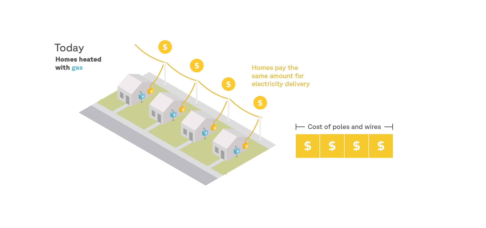
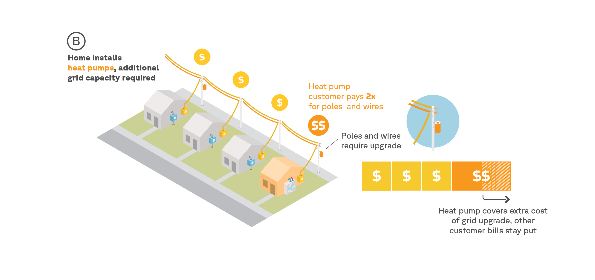
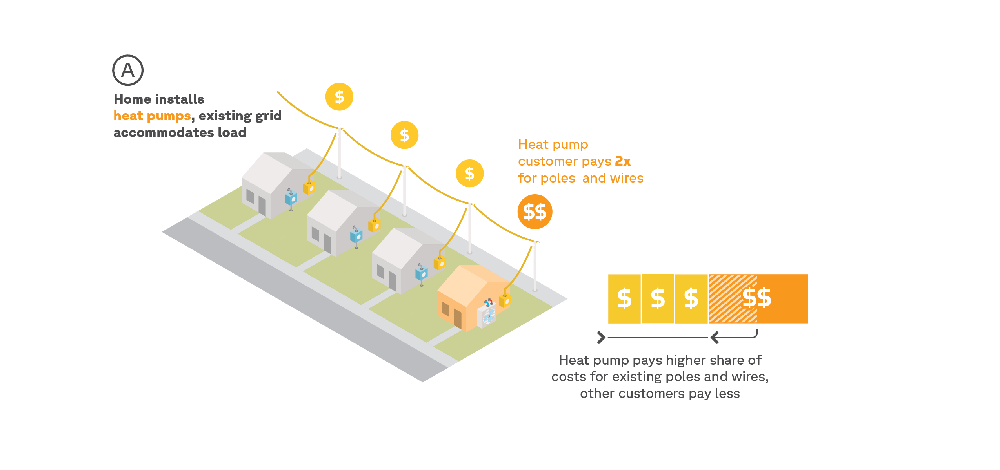
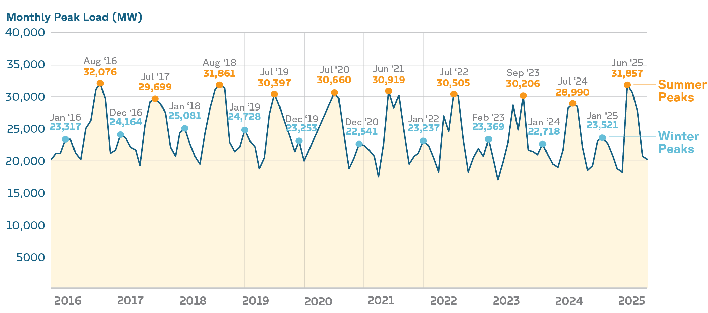

```{python}
#| echo: false

import pickle
from pathlib import Path
from types import SimpleNamespace

v = SimpleNamespace(**pickle.loads(Path("cache/report_variables.pkl").read_bytes()))


def dollar(x, accuracy=0):
    return f"${x:,.{accuracy}f}"


def pct(x, accuracy=0):
    return f"{x * 100:,.{accuracy}f}%"


def comma(x, accuracy=0):
    return f"{x:,.{accuracy}f}"


def cents(x, accuracy=1):
    return f"{abs(x) * 100:,.{accuracy}f}"
```

<!--
# Introduction

# Executive Summary

# Background
## Rate 101 - supply vs. delivery rates

## Costs

- Let's look at those costs first.

- CHARTS: Statewide 8760 heat map of marginal energy costs, generation capacity costs, transmission capacity costs, and
  distribution capacity costs.

- (Heat maps for each zone-utility combination are in the appendix.)

- Marginal energy costs are just the wholesale price of electricity from the NYISO spot market. They vary hour by hour,
  as different generators with different costs are dispatched to meet shifting demand. They mostly range from $TK to $TK
  per MWh, reaching a peak of $TK per MWh during summer afternoons.

- Marginal generation capacity costs reflect the cost of adding a new megawatt of generation capacity to the NYISO
  system. They are zero most of the year, but spike during summer afternoons, when generation capacity approaches its
  peak. They are estimated by allocating the cost of the previous year's capacity auction to the top hundred hours of
  the year, and then dividing by the number of hours in the year. They mostly range from $TK to $TK per MWh, reaching a
  peak of $TK per MWh during summer afternoons.

- Marginal transmission capacity costs reflect the cost of adding a new megawatt of transmission capacity to the NYISO
  system. They are zero most of the year, but spike during summer afternoons, when transmission capacity approaches its
  peak. Different transmission zones have different monthly patterns. They are estimated by XYZ. They mostly range from
  $TK to $TK per MWh, reaching a peak of $TK per MWh during summer afternoons.

- Marginal distribution capacity costs are the cost of adding a new megawatt of distribution capacity to the NYISO
  system. Technically, every feeder has a heatmap that looks like this, and they may each peak at different times,
  meaning marginal distribution capacity costs vary by feeder. We average them together to produce a single 8760 heatmap
  for each utility, which is then averaged across utilities to produce a statewide 8760 heatmap. They mostly range from
  $TK to $TK per MWh, reaching a peak of $TK per MWh during summer afternoons.

## The fairness problem

- Delivery rates are volumetric
- That doesn't mix well with heat pumps (or EVs): when your load doubles, you delivery payments do too, even when your
  cost-of-service doesn't, so you pay more than your fair share.
- And by artificially increasing heat pump operating costs, that's hurting heat pump adoption (and it also affects EVs).
- And since heat pumps, electric water heaters, and EVs account for much of the demand flexibility potential in
  Brattle's study, this fairness problem is actually another obstacle to unlocking demand flexibility in NY.

## The cost-reflectiveness problem

- Then there's the fact that rates, which are an important way to achieve demand flexibility, are not currently doing
  so, because they're not cost-reflective.
- The problem occurs on both the supply and delivery sides of the bill.
- Wholesale electricity prices are volatile, reflecting that the underlying cost of generating electricity changes based
  on the demand level and the availability of different types of generators.
- However, supply rates are flat, so customers have no incentive shift their load to take advantage of lower prices, and
  reduce the need for costly and polluting peaker generators.
- Similarly, the need for new grid capacity is largely driven by demand during peak periods.
- But delivery rates are also flat, so customers have no incentive to load shift away from these periods, and thus
  right-size the infrastructure needed to serve them. -->

# Findings

## What happens to heating bills when households switch to heat pumps?

<!-- Imagine a home in Utica: a pre-war, two-bedroom unit in a small multifamily building, heated by a natural gas furnace with central air conditioning. It pays {python} dollar(v.median_energy_total) for energy every year, which is the median bill for gas-heated homes in the state. [^utica_home] -->

Imagine a single-family home in Buffalo: a pre-war, three-bedroom house heated by a natural gas furnace with central
air conditioning. It pays `{python} dollar(v.median_energy_total)` for energy every year, which is the median bill for
gas-heated homes in the state.[^buffalo_home]

Like all homes in New York, when this household switches to an air-source heat pump,[^heatpump_efficiency] its annual
energy use plummets (@fig-consumption-only-state):

::: {.column-body-outset-right}

:::

[^buffalo_home]:
    Specifically: a 1,228 sq ft, owned-occupied, single-story home built before 1940 with uninsulated wood-frame walls,
    an 80% AFUE gas furnace, and SEER 15 central AC. The home is served by National Grid (electricity) and National
    Fuel (gas).

<!-- [^utica_home]: Specifically: a 2,648 sq ft, owner-occupied, two-story unit in a 2-unit building, built before 1940 with uninsulated brick walls, an 80% AFUE gas furnace, and SEER 15 central AC. The home is served by National Grid (electricity and gas). -->

[^heatpump_efficiency]: TODO add model specs here.

Heat pumps are 2 to 3 times more efficient than furnaces, so they only require a fraction as much energy input to heat a
home to the same temperature.

However, while switching to heat pumps cuts a home's energy *use*, it often increases its energy *costs*, as is the case
with this Buffalo home (@fig-consumption-vs-bills-state).

::: {.column-body-outset-right}

:::

This is because electricity is more expensive than natural gas in New York State: while it makes up only
`{python} pct(v.elec_share_of_energy_use)` of this gas-heated household's annual energy use, it accounts for
`{python} pct(v.elec_share_of_energy_bill)` of its annual energy bill.

After this building replaces its gas furnace with a heat pump, its
annual [gas bill]{style="color: #a0af12; font-weight: bold"} drops by
`{python} dollar(v.median_gas_drop)`.[^using_gas_for_cooking_and_hot_water] But its annual
[electric bill]{style="color: #e6b400; font-weight: bold"} jumps by `{python} dollar(v.median_elec_jump)`.

The result: despite the heat pump's lower energy use, switching this home's heating fuel from natural
gas to electricity causes its annual **combined energy bills**—which are the statewide median—to jump by
`{python} dollar(v.median_net_increase)`.

[^using_gas_for_cooking_and_hot_water]:
    The home in this example still uses some gas for cooking and hot water, which is why the gas bill doesn't drop to
    zero after the switch.

In other words, it costs more to heat this home with heat pumps than with natural gas. While this experience is fairly
typical of what happens when gas-heated homes switch to heat pumps today, New York State's building stock is diverse, so
the full range of bill impacts varies widely (@fig-quadrant-bar-natgas-state).

::: {.column-page-inset-right}

:::

While most natural gas-heated households that switch to heat pumps do see their bills go up, approximately
`{python} pct(v.pct_natgas_save_default)` actually enjoy lower bills after the switch.

---

::: {.callout-note}
The chart above assumes that no LMI households receive the LMI discounts they're eligible for, either before or after
switching to heat pumps. The charts below show bill impacts under two LMI discount scenarios.
:::

The chart below shows what the bill impact would look like under current LMI enrollment rates—40% of eligible LMI
customers across the state start out receiving electric and gas discounts before switching, and retain these discounts
after switching to heat pumps.

::: {.column-page-inset-right}

:::

Adding LMI discounts changes our original bill impact chart only slightly: households saving more than $1,000 per year
would grow by 3 percentage points, and households losing more than $1,000 per year would grow by 4 percentage points.

LMI electrification programs present an opportunity to enroll low-income households in LMI discounts, however.

So the following chart shows what happens to the bills of natural gas households after switching to heat pumps—if
all eligible LMI customers are enrolled in LMI discounts when heat pumps are installed, assuming around 40% of these
customers are already receiving these discounts (in line with the current enrollment rate).

::: {.column-page-inset-right}

:::

Enrolling eligible LMI customers when they install heat pumps would incrementally improve outcomes, but it would not be
transformative: the number of households who save would grow by 6 percentage points, and the number of households who
lose more than $1,000 per year would shrink by 5 percentage points.

---

Only `{python} pct(v.pct_natgas_households)` of NY households are heated with natural gas, however. The rest are
heated with delivered fuels or electric resistance—both of which have more potential for bill savings than natural gas
(@fig-households-by-fuel).

::: {.column-page-inset-right}

:::

Indeed, when households who heat with delivered fuels switch to heat pumps, their bills tend to go down
(@fig-quadrant-bar-oil-propane-state).

::: {.column-page-inset-right}

:::

Today, over `{python} pct(v.pct_oil_propane_save_default)` of oil and propane households lower their bills after
switching, and `{python} pct(v.pct_oil_propane_save_1k_default)` save more than $1,000 per year.

The story is similar for electric resistance-heated households (@fig-quadrant-bar-elec-resistance-state).

::: {.column-page-inset-right}

:::

For households that heat with electric resistance, `{python} pct(v.pct_elec_resistance_save_default)` would see bill
decreases after switching to heat pumps, and `{python} pct(v.pct_elec_resistance_save_1k_default)` would save more than
$1,000 per year.

---

So why do heat pumps struggle to compete against natural gas in New York State?

Low natural gas prices are a significant reason, but it's not the only one. As we'll see in the next section, the main
culprit is (artificially) high electricity prices: outdated volumetric rates are causing heat pump customers to pay more
than their fair share for the poles and wires that deliver electricity to their homes.

## HP customers are cross-subsidizing non-HP customers

### Why electric bills go up when heat pumps are installed

When a household with existing air conditioning switches to a heat pump, its annual electricity
consumption goes up by roughly `{python} f"{v.elec_pct_change_full_cooling_p25:.0f}"`% to
`{python} f"{v.elec_pct_change_full_cooling_p75:.0f}"`% — and much more for homes that gain cooling for the first
time.[^elec_increase_range] The electric bill goes up by approximately the same amount.

[^elec_increase_range]:
    The range shown is the weighted interquartile range (25th to 75th percentile) for fossil-fueled homes with full
    baseline cooling statewide. The increase varies by utility territory and by whether the home already had air
    conditioning:

```{python}
#| echo: false
#| output: asis
print(Path("cache/elec_pct_change_table.html").read_text())
```

In the case of the Buffalo home, its annual electricity use and its annual electric bill both double
(@fig-consumption-elec-focus-state).

::: {.column-body-outset-right}

:::

To understand why this happens, we need to drill down into the electric bill's components
(@fig-bill-components-decomposed-state).

::: {.column-body}

:::

The home pays `{python} f"{v.supply_multiplier:.1f}"`× as much for [supply]{style="color: #E69F00; font-weight: bold"},
which makes sense: after making the switch, the home consumes `{python} f"{v.elec_kwh_multiplier:.1f}"`× as much
electricity per year.

But upon turning on the heat pump, the home also starts paying `{python} f"{v.delivery_multiplier:.1f}"`× more for the
same poles and wires that bring that electricity to their home.

This happens because delivery costs are largely recovered through
[volumetric charges]{style="color: #56B4E9; font-weight: bold"}, rather than
[fixed charges]{style="color: #023047; font-weight: bold"}. The result: when a customer consumes more electricity,
not only do they pay more for that electricity, but they also pay more for the grid itself—regardless of whether they
trigger the need for grid upgrades.

Is this delivery bill inflation fair?

### Heat pump customers are overpaying for delivery

To be fair, a customer's **bill** must match the **costs** the customer imposes on the
system.[^cost-causation-principle]

[^cost-causation-principle]: TODO add link to Bonbright's principle of fairness based on cost-causation.

When a customer grows their electricity use after installing a heat pump, they grow their **energy
costs**—power plants have to burn more fuel to generate that electricity, and so on. So it is fair that their
[supply bill]{style="color: #E69F00; font-weight: bold"} also grows.

But a customer's [delivery bill]{style="color: #56B4E9; font-weight: bold"} should only grow if they grow their
**capacity costs**, also known as their [delivery cost-of-service]{style="color: #1b7837; font-weight: bold"}. And this
only happens when their new electricity use triggers new upgrades to the grid's capacity—during the handful of "peak
hours" of the year, when the grid as a whole (or their local distribution line) is most congested.

If a customer's delivery bill exceeds their delivery cost-of-service, they are
[overpaying]{style="color: #b71c1c; font-weight: bold"}.

---

To illustrate, let's return to our Buffalo home, which is served by National Grid, and has an annual delivery
cost-of-service of `{python} dollar(v.cs_gas_cost)` per year (@fig-cross-subsidy-example).

When heated with natural gas, the home's annual [electric delivery bill]{style="color: #56B4E9; font-weight: bold"}
happens to equal its [delivery cost-of-service]{style="color: #1b7837; font-weight: bold"}—a coincidence, since, as
we'll see, most gas-heated homes actually *underpay* for delivery.

::: {.column-page-inset-right}

:::

After switching to the heat pump, its delivery cost-of-service is nudged up by only
`{python} dollar(v.cs_hp_cost - v.cs_gas_cost)` per year, due to slightly increased electrical use during peak
hours.[^notmuch]

[^notmuch]:
    The fact that the home's electricity use grew by `{python} f"{(v.elec_kwh_multiplier - 1) * 100:.0f}"`%, but its
    delivery cost of service grew by only `{python} f"{(v.cs_hp_cost / v.cs_gas_cost - 1) * 100:.0f}"`%, reflects the
    fact that both the NYISO grid as a whole and National Grid's local distribution system have ample winter headroom
    (see @sec-headroom).

But as we saw earlier—as a direct consequence of volumetric rates—the Buffalo home's annual
[electric delivery bill]{style="color: #56B4E9; font-weight: bold"} grows to `{python} dollar(v.cs_hp_bill)` per
year, causing an [overpayment]{style="color: #b71c1c; font-weight: bold"} of `{python} dollar(v.cs_hp_bat)` per
year. In other words: if National Grid's delivery rates were fair, the home's *total* electric bill would shrink by
`{python} f"{v.cs_hp_bat / v.median_elec_bill_hp * 100:.0f}"`%.

---

How widespread is this overpayment problem in practice?

We find that households with heat pumps are systematically paying more than their cost-of-service for delivery across
New York State.

Statewide, the [delivery cost-of-service]{style="color: #1b7837; font-weight: bold"} for
fossil fuel customers is `{python} dollar(v.ff_mean_delivery_cost)` per year, on average,
compared to `{python} dollar(v.hp_mean_delivery_cost)` per year for heat pump customers, just
**`{python} f"{(v.hp_mean_delivery_cost / v.ff_mean_delivery_cost - 1) * 100:.0f}"`%** higher.

But the [delivery bills]{style="color: #56B4E9; font-weight: bold"} that heat pump customers currently pay are
**`{python} f"{(v.hp_mean_delivery_bill / v.ff_mean_delivery_bill - 1) * 100:.0f}"`%** higher than those of fossil fuel
customers, on average.

::: {.column-page-inset-right}
```{python}
#| echo: false
#| output: asis
print(Path("cache/bat_simple_table.html").read_text())
```
:::

We find that heat pump customers are overpaying for delivery by
**`{python} f"{dollar(v.hp_mean_delivery_bat)} per year"`**, on average.

::: {.callout-note}
To see how heat pump overpayments vary by utility, see @sec-bill-alignments-by-utility.
:::

Simultaneously, households that heat with natural gas are *underpaying* for delivery by
**`{python} f"{dollar(abs(v.natgas_mean_delivery_bat))} per year"`**, on average, while those with heating oil and
propane are *underpaying* by **`{python} f"{dollar(abs(v.oil_propane_mean_delivery_bat))} per year"`**.

These findings are connected: part of what allows fossil fuel customers to pay less for delivery than their
cost-of-service is precisely the fact that heat pump customers are overpaying, which creates a cross-subsidy to
customers that heat with fossil fuels.[^er-cross-subsidy]

[^er-cross-subsidy]:
    Electric resistance customers are also overpaying, and are responsible for a substantial portion of the
    cross-subsidy to fossil fuel customers.

### How overpayments create cross-subsidies

To understand how cross-subsidies arise, let's return to the single-family home in Buffalo.

Before switching to a heat pump, let's assume its annual electricity use, and therefore its annual delivery bill, equals
those of its natural gas-heated neighbors.

::: {.column-page-inset}
{#fig-same-delivery}
:::

The cost of the power line on this block, which was upgraded in recent years, is split evenly between the home and its
neighbors.

As we've seen, after the home installs a heat pump, its annual electricity use (and therefore its annual delivery bill)
both double. But this new electricity use is highly concentrated in the winter:

::: {.column-body-outset}

:::

Does the power line have enough capacity to accommodate this additional wintertime load?

If it does not, the electrical utility would need to upgrade the power line.

::: {.column-page-inset}
{#fig-capacity-upgrade}
:::

These new **capacity costs** (represented by the growth in rectangle in the diragram above) must now be recovered from
the customers.

The costs were caused by the heat pump installation, so under the principle of cost-causation, they should be borne by
that customer.

And, in this case, they are: the higher delivery bills resulting from volumetric delivery rates cover these "marginal
capacity costs." The customer's delivery cost-of-service grows, but the delivery bill grows to match it. There's no
underpayment or overpayment, and no impact on the other customers on the block.

But as we'll see in the next section, the overwhelming majority of New York's grid *does* have the capacity to
accommodate this additional wintertime load. And that's what creates the cross-subsidy.

::: {.column-page-inset}
{#fig-no-capacity-upgrade}
:::

In this alternative scenario, the power line's spare winter capacity absorbs the heat pump's additional winter load.
**Capacity costs** don't grow, they stay fixed.

Volumetric rates cause the heat pump customer's delivery bill to rise, despite the fact that their delivery
cost-of-service hasn't changed. The heat pump customer pays a bigger share of the fixed costs, which allows the other
customers on the block to pay less.[^howitworks]

[^howitworks]:
    TODO add a note on how this actually works in practice—revenue adjustments respond to overcollection caused by heat
    pump customer overpayments in one year to lower the delivery rates for everyone in the following year, causing the
    bills of non-heat pump customers to shrink compared to the year before. Those of heat pump customers shrink too, but
    they remain far above their cost-of-service, while those of fossil fuel customers sink below theirs.

And this "no capacity upgrade" scenario is the one that prevails across most of the state today.

### Why the grid can handle the additional load {#sec-headroom}

Over the past ten years, New York's grid-wide winter peak has averaged only **77%** of the summer peak
(@fig-nyiso-peaks).

::: {.column-body-outset}
{#fig-nyiso-peaks}
:::

In other words, at the level of **generation** and **transmission**, around a quarter of the grid's capacity goes unused
during the winter.

And since the grid is already sized to handle these summer peaks, there's significant "headroom" for winter peaks to
grow up to their level, using existing infrastructure.

But what about at the **distribution** level of the grid?

A recent study by Synapse Energy Economics analyzed the capacity of New York's distribution grid to accommodate building
electrification.

While the picture varies by utility, the distribution grid as a whole appears to have even more winter headroom than the
bulk power grid:

::: {.column-page-inset-right}
| Utility           | Distribution winter peak (MW) | Total estimated winter headroom (MW) | Available winter capacity |
| ----------------- | ----------------------------- | ------------------------------------ | ------------------------- |
| National Grid     | 4,276                         | 4,477                                | 51%                       |
| Central Hudson    | 796                           | 279                                  | 26%                       |
| NYSEG and RGE     | 3,786                         | 3,235                                | 46%                       |
| ConEd             | 4,691                         | 1,346                                | 22%                       |
| Orange & Rockland | 1,123                         | 1,071                                | 49%                       |
| **Total**         | **14,673**                    | **10,408**                           | **42%**                   |

Table: Distribution grid winter headroom by utility, adapted from [p. 4](https://www.documentcloud.org/documents/26207519-synapse-bd-assessment-of-electric-grid-headroom-for-accommodating-building-electrification-2024/?mode=annotating#document/p4/a2675823) of [@takahashi_AssessmentElectricGrid_2024]. {#tbl-dist-grid-headroom}
:::
For instance, in Central Hudson, 26% of the distribution grid's winter capacity is currently unused. In National Grid,
the figure is 51%.
The study concludes: "Existing distribution grids could support residential heat pumps reaching
roughly 29 percent to 47 percent of the entire heating fuel stock... with the statewide average of 39
percent."[^nyiso_distribution_grid_headroom]

[^nyiso_distribution_grid_headroom]:
    See [p.
    4](https://www.documentcloud.org/documents/26207519-synapse-bd-assessment-of-electric-grid-headroom-for-accommodating-building-electrification-2024/?mode=annotating#document/p4/a2675823)
    of Synapse Energy Economics' distribution headroom report [@takahashi_AssessmentElectricGrid_2024].

Simply put: at present, New York's grid has significant spare winter capacity to accommodate
heat pumps. And this is the main reason why their delivery cost-of-service is only
`{python} f"{(v.hp_mean_delivery_cost / v.ff_mean_delivery_cost - 1) * 100:.0f}"`% higher than that of fossil fuel
customers.

## Proposal: fair rate for heat pump customers

In this report, we propose a new rate for heat pump customers that would reduce their overpayments for delivery,
eliminate their cross-subsidy to fossil fuel customers, and reintroduce fairness to delivery rates.

A **fair rate** for heat pump customers is one that reduces their average
[delivery bill]{style="color: #56B4E9; font-weight: bold"} to match their average
[delivery cost-of-service]{style="color: #1b7837; font-weight: bold"}, thereby eliminating the average overpayment.

There are many ways to design a rate for heat pump customers that would achieve this goal. We deliberately propose a
simple seasonal rate that would lower heat pump customer bills in every instance, and could therefore be retroactively
applied to all known heat pump customers in the state. This rate would only be available to heat pump customers, and
would only apply to the delivery side of the bill.

In summer, the volumetric delivery rate would equal each utility's current default rate. In winter, the volumetric
rate would be reduced to the level at which the utility's heat pump customers pay the same *annual* delivery bills, on
average, as their delivery cost-of-service.

Each electrical utility would have a unique winter delivery rate, reflecting the cost of service in that territory.

::::: {.column-page-inset-right}
```{python}
#| echo: false
#| output: asis
print(Path("cache/rate_table.html").read_text())
```
:::::

If all existing heat pump customers opted in to these rates, what would happen to the overpayments and underpayments we
saw earlier?

::::: {.column-page-inset-right}
```{python}
#| echo: false
#| output: asis
print(Path("cache/bat_comparison_table.html").read_text())
```
:::::

These rates would eliminate the overpayment of heat pump customers, on average, bringing their delivery bills in line
with their delivery cost-of-service statewide.

By eliminating the cross-subsidy from heat pump customers to customers that heat with fossil fuels, the underpayments of
natural gas, propane, and heating oil customers would decrease, on average.[^elimination]

[^elimination]:
    They would not be eliminated, however, without also removing overpayments by electric resistance customers.

In other words, our proposed seasonal rates would fix the fairness problem. But would that move the needle on operating
costs?

## Bill impact of heat pump rate on HP customers

If our fair rate were available, how would it affect what happens to annual energy bills when natural gas heated
households switch to heat pumps? Let's revisit our earlier analysis.

First, let's revisit the post-heat pump bills for the Buffalo home.

::::: {.column-page-inset-right}
{#fig-bill-decomposed-fair-rate-state}
:::::

Under fair rates, the Buffalo home's post-heat pump annual electric bill
would drop by **`{python} f"{v.fair_rate_savings_pct * 100:.0f}"`%** — from
`{python} dollar(v.fair_rate_total_bill + v.fair_rate_savings_dollar)` under default rates to
**`{python} dollar(v.fair_rate_total_bill)`**.

The savings come entirely from the [delivery (volumetric)]{style="color: #56B4E9; font-weight: bold"} component, which
shrinks thanks to the lower winter rate. Supply and gas charges are unchanged.

The dashed line marks the home's pre-heat-pump delivery bill. Under fair rates, the post-heat-pump delivery bill falls
close to it — meaning the overpayment for delivery has been largely eliminated.

Bottom line: fair rates would allow this home to save `{python} dollar(v.median_energy_total - v.fair_rate_total_bill)`
per year by switching from gas heating to heat pumps.

---

Would we see similar outcomes statewide? Let's zoom out and see.

::::: {.column-page-inset-right}

:::::

Fair rates would transform the economics of heat pumps in New York State.

Under default rates, only **`{python} f"{v.pct_natgas_save_default * 100:.0f}"`%** of gas-heated households would
save by switching to heat pumps. But under fair rates, **`{python} f"{v.pct_natgas_save_hprate * 100:.0f}"`%**
of gas-heated households would save. And the share of households losing over $1,000 per year would drop from
`{python} f"{v.pct_natgas_lose_1k_default * 100:.0f}"`% to just `{python} f"{v.pct_natgas_lose_1k_hprate * 100:.0f}"`%.

The fact that most gas-heated households would save by switching to heat pumps if overpayments were eliminated proves
that heat pump operating costs struggle to compete against natural gas largely because of outdated volumetric delivery
rates—not cheap gas supply.

::::: {.callout-note}
The chart above assumes that no LMI households receive the LMI discounts they're eligible for, either before or after
switching to heat pumps. The charts below show bill impacts under two LMI discount scenarios.
:::::

The chart below shows the bill impact with current LMI enrollment rates (\~40%).

::::: {.column-page-inset-right}

:::::

Factoring in today's partial enrollment rates makes the outcomes slightly worse under both default and fair
rates: the share of gas-heated households that would save by switching to heat pumps under fair rates drops to
`{python} f"{v.pct_natgas_save_hprate_lmi40 * 100:.0f}"`%.

LMI electrification programs could actively enroll low-income households in LMI discounts, however. The following chart
shows what would happen if all eligible LMI customers were enrolled in LMI discounts when heat pumps are installed—under
both default and fair rates—assuming 40% of these customers are already receiving these discounts (in line with the
current enrollment rate).

::::: {.column-page-inset-right}

:::::

As noted earlier, promoting LMI electrification with discounts under default rates only
incrementally improves bill impacts. But pairing full LMI enrollment with fair rates would produce
the best outcome of all: **`{python} f"{v.pct_natgas_save_hprate_lmi_full * 100:.0f}"`%** of
gas-heated households would save, and the share saving over $1,000 per year would increase by
`{python} f"{(v.pct_natgas_save_1k_hprate_lmi_full - v.pct_natgas_save_1k_hprate) * 100:.0f}"` percentage points
relative to the no-LMI-discount scenario.

---

The pattern holds for oil and propane-heated homes. Under default rates,
`{python} f"{v.pct_oil_propane_save_default * 100:.0f}"`% of oil/propane households would save by switching to
heat pumps. Under fair rates, **`{python} f"{v.pct_oil_propane_save_hprate * 100:.0f}"`%** would save, and the
share losing over $1,000 per year would drop from `{python} f"{v.pct_oil_propane_lose_1k_default * 100:.0f}"`% to
`{python} f"{v.pct_oil_propane_lose_1k_hprate * 100:.0f}"`%.

::::: {.column-page-inset-right}

:::::

Electric resistance homes see a similar improvement. Under default rates,
`{python} f"{v.pct_elec_resistance_save_default * 100:.0f}"`% would save by upgrading to heat pumps. Under fair rates,
**`{python} f"{v.pct_elec_resistance_save_hprate * 100:.0f}"`%** would save.

::::: {.column-page-inset-right}

:::::

## Equity impact of heat pump rate on HP customers

While the bill impacts shown above reveal how the population at large would be affected by fair rates, they don't
illuminate the equity impact on low-and-moderate income households. For that, we must zoom in on this population, and
look at energy burdens.[^energy-burden]

[^energy-burden]: Energy burden is defined as the percentage of a household's annual income spent on energy bills.

Today, `{python} pct(v.pct_burdened_current)` of New York's low-and-moderate income households that heat with natural
gas pay more than 6% of their annual income on energy bills, and are therefore considered to be **highly energy
burdened**.[^lmi-def]

[^lmi-def]: TODO add a note on how LMI is defined.

::::: {.column-page-inset-right}

:::::

After installing heat pumps under default rates, `{python} pct(v.pct_burdened_hp_default)` of these households
pay more than 6% of their annual income. After installing heat pumps under heat pump-only seasonal rates,
`{python} pct(v.pct_burdened_hp_seasonal)` of these households pay more than 6% of their annual income.

That chart showed what the burdens would look like if no LMI households received discounts, before and after switching
to heat pumps. In reality, an estimated 40% of LMI households receive LMI discounts. The following chart show what
burdens currently look like after those discounts are applied, and what burdens would look like after switching to heat
pumps—under default and fair rates—if the same households stayed on those discounts.

::::: {.column-page-inset-right}

:::::

Once current LMI discounts are factored in, the number of highly energy burdened households still rises by
`{python} f"{(v.pct_burdened_hp_default_lmi40 - v.pct_burdened_current_lmi40) * 100:.0f}"` percentage points.

Does this mean that heat pumps are not advised for low-income households?

Not if LMI electrification programs ensured that these households enrolled in the discounts they're eligible for.
The following chart shows what post-electrification burdens would look like—under default and fair rates—if all LMI
households were enrolled in LMI discounts when heat pumps are installed.

::::: {.column-page-inset-right}

:::::

With fair rates and LMI discounts, the number of highly energy burdened households would actually drop by
`{python} f"{(v.pct_burdened_current_lmi_full - v.pct_burdened_hp_seasonal_lmi_full) * 100:.0f}"` percentage points.

## Bill impact of heat pump rate on non-HP customers

As we saw earlier, households that heat with natural gas are underpaying for delivery by
**`{python} dollar(abs(v.natgas_mean_delivery_bat))`** per year, on average, while those with oil or propane are
underpaying by **`{python} dollar(abs(v.oil_propane_mean_delivery_bat))`**.

Part of why this happens is that heat pump customers are overpaying for delivery—by
**`{python} dollar(v.hp_mean_delivery_bat)`** per year, on average—which allows utilities to lower the volumetric
delivery rate on everyone.

If all heat pump customers opted in to fair rates, this cross-subsidy would be removed. The flat delivery rate
used by non-heat pump customers would need to rise slightly to compensate. How would this affect their bills?
(@fig-bill-change-non-hp-rebal-state).

::::: {.column-page-inset-right}

:::::

Barely at all: just **`{python} dollar(v.rebal_nonhp_mean_monthly_delta, 2)`per month**, on average.

In fact, **`{python} pct(v.rebal_nonhp_pct_decrease + v.rebal_nonhp_pct_increase_under_5)`** of non-HP households would
see their monthly electric bill rise by less than $5 a month.

Importantly, this is **not a "rate hike"** on customers without heat pumps. It is the removal of an unfair
cross-subsidy, and a step toward better aligning delivery rates with each customer's actual cost-of-service.

Why so little?

Because heat pump customers only make up `{python} pct(v.hp_share_of_households)` of residential customers. The total
cross-subsidy they generate is modest, around **`{python} f"${v.hp_total_cross_subsidy_delivery_millions:,.0f}"`million
per year**, and it gets spread across `{python} f"{v.nonhp_households_millions:,.1f}"` million non-HP households.

The result: the benefit each non-heat pump household receives from the cross-subsidy is minuscule—but the cost each heat
pump household bears is large, as we saw in @fig-quadrant-bar-natgas-switch-hprate-state.

This show counterproductive this unintentional public policy of cross-subsidization really is: the state is trying to
advance heat pump adoption, but its own volumetric rates are penalizing the customers who electrify—while delivering
negligible savings to everyone else.

This asymmetry won't last forever. As heat pump adoption grows, the cross-subsidy will grow with it, and removing it
will become politically harder. The time to fix the fairness problem is now, before it becomes entrenched.

<!--
## How would the rate need to evolve over time?

- The idea of making rates fair for heat pump customers by offering them a special rate that avoids overcollecting
  delivery costs from them assumes that heat pump adoption is not a driver of grid investment. As we have shown, this is
  true at present, when heat pump adoption is using spare winter capacity.

- However, heat pump adoption is still the main driver of winter peak growth. And once the winter peak starts growing
  faster than the summer peak, at some point it will catch up. Once this happens, heat pump adoption will become the
  main driver of grid investment.

- And keeping rates fair will mean continuing to align revenue from heat pump customers with their cost-of-service for
  delivery, which will now be higher than not heat pump customers.

- This means that this rate is a short-term fix. It needs a glide path to evolve as the underlying cost-of-service of
  heat pump customers changes, and will need to be sunset as the grid becomes winter-peaking.

- How quickly heat pump adoption will tip the various zones of NY's grid into winter-peaking is unclear—it depends on
  the pace of heat pump adoption, and the performance of the equipment being adopted.

- Rather than trying to forecast *when* the grid will become winter-peaking, estimate *at what level of heat pump
  adoption* this change will occur, for different heat pump technologies.

- And we show how the rate would need to evolve as heat pump adoption increases, to keep rates fair.

- CHART: winter peak growth (vs summer peak) for low-performance ASHP, high-performance ASHP, and GSHP.

- CHART: how HP customer cost-of-service and rate would need to evolve as heat pump adoption increases (for each
  technology), to keep rates fair.

- APPENDIX: How this varies by NYISO zone and utility.

- Discussion of how cost-of-service and rates would need to evolve over time, and how things flip after the winter peak
  becomes larger than the summer peak.

- OPEN QUESTION: do the adoption scenarios assume everything but heat pump adoption is static, or do we try to align
  with NYISO load forecasts to include other sources of peak growth for both the summer and winter peaks? (If so, which
  forecast is really reasonable?)

- OPEN QUESTION: how do we estimate the distribution cost-of-service change over time, as these marginal costs would
  likely kick in first?

-->

## Time-varying Rates: from fairness to efficiency

The heat pump rate outlined above is fundamentally about solving the **fairness** problem: making sure we don't overcharge heat pump customers.

Time-varying rates, such as time-of-use and critical peak pricing, solve an altogether different problem: **economic efficiency**. Boiled down, economic efficiency is about making sure energy and infrastructure are not wasted.

There are two distinct flavors of economic efficiency that well-designed time varying rates can promote:
  1. **Consumption efficiency**: making energy prices more reflective of the underlying cost of generating electricity,
    so that consumers use more electricity when it's cheaper to generate (like when the sun is shining), and less when
    it's more expensive (like when peakers are running).
  2. **Investment efficiency**: making network prices more reflective of the underlying cost of expanding grid capacity,
    so that consumers reduce electricity use during peak demand periods, thereby reducing the need for investments in
    grid capacity (whether in generation, transmission, or distribution).

**Fairness** is achieved through **cost-aligned rates**, defined as a rate that bills each customer in line with their cost-of-service (for delivery, in this case).

A rate can be more or less cost-aligned: in theory, a perfectly cost-aligned delivery rate would bill _every_ customer exactly their cost-of-service for delivery. Our proposed seasonal delivery rate is cost-aligned _on average_ for heat pump customers, because it lowers their volumetric rate in winter to a level that causes their average delivery bill to equal their average cost-of-service.[^cost-aligned-rate]

[^cost-aligned-rate]: Individual HP customers may still over or underpay relative to their cost-of-service, though less than under

**Economic efficiency** is achieved through **cost-reflective rates**, defined as a rate that exposes customers to prices that reflect the underlying costs of energy and infrastructure, which change over time and by location.

Why is this desirable? Ultimately, cost-reflective rates can help customers in two ways:
- By lowering their supply and delivery bills today, to the extent they can shift their electricity use to off-peak periods. This also benefits climate and health, because low-cost hours are often from renewable sources, whereas high-cost hours are often from high-polluting peaker plants.
- By lowering their supply and delivery bills tomorrow, to the extent that this load shifting ultimately slows the growth of the winter peak, thereby reduces future investments in generation, transmission, and distribution capacity.

Rates can be more or less cost-reflective: in theory, a perfectly cost-reflective rate would expose customers to different volumetric prices for energy and infrastructure at every feeder, every five minutes, in order to collect _marginal_ energy and capacity costs. And it would collect _residual_ capacity costs through a non-volumetric price, like a fixed or demand charge, so as not to distort the time-and-location-dependent cost signals.

In practice, rates are not very **spatially** cost-reflective, having at most different prices for different utility zones. As for **temporal** cost-reflectivity, only a few states offer hourly real-time prices, and these only cover energy costs, not capacity. Time-of-use (TOU) rates are the next closest thing available in most utilities, but prices are in each period are set ahead of time, and do not reflect real-time conditions.[^cpp] And residual costs are often recovered through the volumetric charges, which raises both on- and off-peak prices, and makes TOU rates less cost-reflective of the underlying hourly marginal costs of energy and infrastructure.

[^cpp]: Critical peak pricing, where utilities charge higher prices during a set number of peak demand days per season, is more dynamic than time-of-use. But prices are often set ahead of time, and utilities can only declade peak days a few times per season.

A rate can be fairly cost-reflective / efficient without being at all cost-aligned / fair: when utilities go from flat to time-of-use rates being the default for all customers, as PSEG Long Island recently did, customers are exposed to a degree of temporal cost-reflectivity: if the TOU rate is well-designed, the volumetric prices all customers will be more aligned with the hour-by-hour fluctuation in marginal energy and capacity costs. But as long as residual costs, which make up the majority of the revenue requirement, continue to be collected through volumetric rates (even time-varying ones), electric heating customers will continue to be overpay, on average, and fossil heating to underpay, relative to their cost-of-service, meaning the rate won't be cost-aligned.[^p_gt_lrmc]

[^p_gt_lrmc]: Inflating the on- and off-peak prices to cover residual costs, as is common practice, _also_ hurts cost-reflectiveness, and therefore economic efficiency, by making prices systematically higher than the (short and long-run) marginal costs.

This creates a conundum for regulators interested in fixing the fairness problem: if they choose to do so through technology-specific rate, they can eliminate the cross-subsidy from heat pump customers by raising their fixed charge and/or lowering their volumetric rate (as we propose to do), without touching the rate design of any other customers. But if they insist on doing so through a rate available to everyone, then they can only do so by significantly raising the fixed charge, or risk revenue shortfalls.[^revenue-shortfalls]

[^revenue-shortfalls]: Imagine if our proposed seasonal rate were suddenly applied to all customers: everyone's bills would be the same in summer, but half in the winter. The utility would be unable to meet its revenue requirement. Even if the rate was opt-in, we'd expect high enrollment from fossil-fueled customers, who would then be underpaying even more than they already are for delivery.

A rate can also be fairly cost-aligned without being at all cost-reflective: imagine if heat pump and fossil heating customers paid all of their delivery costs through fixed charges that equaled the average cost-of-service of each group: `{python} dollar(v.hp_mean_monthly_delivery_cost)` a month for heat pump customers, and `{python} dollar(v.ff_mean_monthly_delivery_cost)` a month for fossil heating customers, at present. This rate would be cost-aligned _for each group_, meaning the average overpayment or underpayment would be zero for both. But it would not be cost-reflective, because it would not expose customers to different volumetric prices at different hours (indeed, there would be no volumetric prices at all).

Such a rate would be a fair, but not efficient: there would cease to be cross-subsidies in how we pay for the grid we already have (the residual)—which would help heat pump operating costs—but there would be no incentive to minimize the buildout of the grid in the future (marginal capacity costs), and no ability to access cheaper electons from solar and wind in the present (marginal energy costs).

Flat rates are the worst of both worlds: neither fair nor efficient. As discussed in depth throughout this report, volumetric (delivery) rates tend to overcharge electric heating customers compared to the cost of serving them, so they are not cost-aligned. Volumetric rates don't change over time, so they are (by definition) not cost-reflective. Flat rates therefore create unfair cross-subsidies and fail to send customers the price signals they need to make cost-aware decisions and produce efficient outcomes.

Finally, it is possible to design rates that are both fair and efficient.

In fact, meeting the state's building electrificaitons goals in time hinges on making such tariffs available to heat pump customers: cost-_aligned_ rates would lower heat pump bills by paying for *already built* infrastructure more fairly, while cost-_reflective_ rates could lower heat pump bills by allowing customers to pre-cool and pre-heat their homes when electrons are cheap, while also reducing the amount of infrastructure we'll need to build as the state electrifies, thereby limiting bill growth for all.

### Designing a TOU rate

For each utility in NYS, we've designed time-of-use rates specifically for heat pump customers that are **cost-reflective**, aligned with underlying marginal energy and capacity costs. Unlike most time-of-use rates currently available, in New York State, we've designed these rates to be **cost-aligned**, so that they also remove the cross-subsidy from HP customers to non-HP customers that exists today.

In other words, these rates would collect the same amount of total revenue from heat pump customers as the fair rates we proposed earlier, but it would do so by charging different prices at different times of the day, not just at different times of the year.

A well-designed time-of-use rate needs to find the peak-period start hour, duration, and price level that most closely matches the marginal energy and capacity costs for that utility, over the entire season, and do the same for the off-peak period  (@fig-rep-days-cenhud-summer).

::::: {.column-page-inset-right}

:::::

@fig-rep-days-cenhud-summer shows the optimal summer time-of-use rate for heat pump customers in Central Hudson.

The off-peak period costs `{python} dollar(v.cenhud_winter_off_rate, 3)`/kWh. The `{python} v.cenhud_winter_on_duration`-hour on-peak period, which starts at `{python} v.cenhud_winter_on_start`pm, sets the price at `{python} dollar(v.cenhud_winter_on_rate, 3)`/kWh, or `{python} f"{v.cenhud_winter_ratio:.1f}"`x the off-peak price.

On cooler days, when demand is well below the peak, energy costs average `{python} dollar(v.cenhud_winter_low_energy_avg, 3)`/kWh, lower than even the off-peak rate, and capacity costs are zero. On the hottest days, energy costs shoot up to `{python} dollar(v.cenhud_winter_high_energy_avg, 3)`/kWh, above the on-peak rate, and are joined by capacity costs that reach `{python} dollar(v.cenhud_winter_high_cap_max, 3)`/kWh in peak hours.

Time-of-use rates are clearly more cost-reflective than a flat rate, which would look like a straight line impervious to costs. But they are less reflective than a real-time-price that follows true marginal costs, because the on-peak price must be fixed for the entire season: the on-peak price is set at the level that follows the marginal cost as much as possible _on average_, but on any given day, it may overshoot or undershoot the marginal cost.

::::: {.column-page-inset-right}

:::::

@fig-rep-days-cenhud shows adds the optimal winter time-of-use rate for heat pump customers in Central Hudson. While the window is still `{python} v.cenhud_winter_on_duration` hours long, it starts `{python} v.cenhud_winter_start_later` hour later than the summer window. The off-peak price in winter is `{python} cents(v.cenhud_offpeak_winter_minus_summer)` cents higher than in summer, reflecting higher average energy costs in cold months. The on-peak price in winter is `{python} cents(v.cenhud_onpeak_winter_minus_summer)` cents _lower_ than in summer, reflecting the much higher marginal capacity costs in hot months.


The optimal time-of-use rates for each utility vary in start hour, duration, and price level, as shown in the following charts.

::::: {.column-page-inset-right}

:::::

::::: {.column-page-inset-right}

:::::

::::: {.column-page-inset-right}

:::::

::::: {.column-page-inset-right}

:::::

::::: {.column-page-inset-right}

:::::

::::: {.column-page-inset-right}

:::::

::::: {.column-page-inset-right}

:::::

If customers installing heat pumps opted in to these rates, how much lower would their bills be?

It depends if we assume that they shift their heating and cooling to off-peak periods, which would produce lower
  bills.

To start, we present bill change results under a **no flexibility** assumption, where customers ignore price signals in the time-of-use rate completely, and don't shift their heating and cooling to off-peak periods.

::::: {.column-page-inset-right}

:::::

Under our no flexibility assumption, the overall picture of bill change outcomes when switching from natural gas to heat pumps under fair time-of-use rates would barely changed compared to simple fair rates.

This is not because most heat pump customers would end up with the same monthly bills under both rates (@fig-histogram-tou-delta-weighted).

::::: {.column-page-inset-right}

:::::

But these bill changes are modest—`{python} pct(v.pct_within_50)` of households would see their bill change be $50 or less, in either direction—and they are symmetrical—for every household that would save $100 a year by selecting the time-of-use over the simple seasonal rate, there is a household that would lose $100 by doing so. And because of this, the overall bill change picture (@fig-quadrant-bar-natgas-tou-state) barely moves.

That said, by being more cost-reflective, the time-of-use rate is slightly more fair than the simple seasonal rate, because it more accurately collects the small portion of each customer's allocated costs represented by _marginal_ costs, since the prices customers are charged are in lined with those costs, rather than being flag.

<!--
## Flexibliity
- Discussion of time-of-use rates with no flexibility: compared to the standard fair rates, adding a time-of-use
  component and assuming no behavioral change lowers / raises bill slightly, due to the fact that electricity
  consumption is highest when electrons are cheapest / most expensive.

- Note that these are bookend scenarios, and the reality is likely to fall somewhere in between. However, this also
  suggests that maximizing the pairing of heat pumps with smart thermostats should be a policy priority, as it enhances
  heat pump affordability.

- To the extent flexibility actually lowers marginal capacity costs for HP customers, due to lower cooling demand, it would actually be okay to collect less revenue from HP customers.

## TOU Rates and System investment

- Since our time-of-use rates are aligned with marginal capacity costs, not just marginal energy costs, any amount of
  load shifting they induce away from peak periods may have some effect on reducing the need for capacity investments.

- How large is this effect? How does it vary by technology?

- LINE CHART: winter peak growth for as a function of heat pump adoption under TOU rates, with and without flexibility,
  for low-performance ASHP, high-performance ASHP, and GSHP.

- Discussion of the capacity investment deferral impact before winter peak exceeds summer peak.

- Discussion of the capacity investment deferral impact after winter peak exceeds summer peak.

- OPEN QUESTION: do we need to add CPP rates to really capture this effect? Or is TOU sufficiently aligned, given the
  limits of heat pump flexibility?

- OPEN QUESTION: how do we translate the effect on peak growth into a dollar benefit? (For instance, if we can reduce
  the need for capacity investments by 10%, how much money can we save, and how much of that comes from energy vs.
  generation capacity vs. transmission capacity vs. distribution capacity?)  -->

# Appendix

## What causes people to save (or lose) when they switch to heat pumps {#sec-savings}

## Marginal cost heat maps for each utility

## Delivery bill alignment by heating type {#sec-delivery-bat-by-heating-type}

::::: {.column-page-inset-right}

:::::

## Bill alignments under default rate for each utility {#sec-bill-alignments-by-utility}

::::: {.column-page-inset-right}

:::::

## Bill changes under fair rate for each utility

## Bill changes under fair TOU rate for each utility

## Capacity investment deferral benefit for each utility

## Acknowledgments

## Data and Methods

### Sub-Transmission and Distribution Marginal Costs

- We pull $/kW from 2025 MCOS studies from the TK docket for each investor-owned utility
- LIPA is different we pull from X.
- These are diluted costs, where what those are—if you put new load randomly throughout the system, what is the expected
  value; reflects the fact that most components have headroom.
- They change over time, we grab 2026.
- For XYZ utilities we just grab the values, for ZYS utilities we had to calculate them from the project data.
- Then we allocate them to hours

#### System-wide $/kw costs

- table with all of them and links to document cloud where we go the ones that we just pulled.
- for those we had to construct, we describe how we did it.

##### Con Edison and Orange & Rockland

Con Edison and O&R (its subsidiary) both use the NERA marginal cost methodology, which organizes investment into **cost
centers** corresponding to different levels of the grid. Their MCOS workbooks present costs in an undiluted form — $/kW
of new capacity — so we needed to compute the diluted values ourselves.

Unlike NiMo, ConEd required no project-level classification — its workbook already separates costs into cost centers
that map directly to grid tiers: **Transmission** (138–345 kV) covers bulk transmission, which we exclude, and the
remaining cost centers — **Area Station & Sub-Transmission**, **Primary**, **Transformer**, and **Secondary** — are
the sub-transmission and distribution investments we use as BAT inputs. We verified ConEd's two Transmission projects
against the NYISO Gold Book.[^coned_or_goldbook]

[^coned_or_goldbook]:
    ConEd's two Transmission projects (Eastern Queens 138 kV and Brooklyn Clean Energy Hub 345 kV) both appear in Gold
    Book Table VII.

O&R required a partial split of its CapEx Transmission sheet. Of three 138 kV projects, only West Nyack appears
in the Gold Book; Oak Street and New Hempstead (both 138 kV reconductoring) do not. Under a "Gold Book entries =
bulk TX" approach, these two projects would fall through the gap — excluded from our analysis but absent from the
bulk TX analysis too. We reclassify them as local sub-transmission and include them in the sub-TX + distribution
total.[^or_tx_split]

[^or_tx_split]:
    Justification: (1) not in Gold Book Table VII — not NYISO-jurisdictional bulk TX; (2) 138 kV reconductoring of
    existing local lines, not new backbone capacity; (3) small scale ($29M + $7.5M) serving O&R's Eastern NY load area;
    (4) without reclassification, $36.5M in capital falls through the gap. These projects use the Transmission composite
        rate (same plant type / carrying charge characteristics).

The area station and sub-transmission cost center bundles both sub-TX feeders and distribution substation transformers
in the same projects (e.g., a 138/27 kV transformer installed alongside a 138 kV feeder). We cannot separate these into
distinct sub-TX and distribution tiers, but for the BAT this is acceptable: what matters is excluding bulk TX, and the
bundled "Substation" cost center correctly captures all local delivery investment at both levels.

**MC formula.** For each cost center and year, we computed:

$$
\text{Annual RR}(Y) = \text{Capital}(Y) \times \text{Composite Rate} \times \text{Escalation}(Y)
$$

$$
\text{MC}(Y) = \frac{\text{Annual RR}(Y)}{\text{Denominator}}
$$

The composite rate is the "Annual MC at System Peak" rate from the carrying charge schedule, which already adjusts for
area-station-to-system diversity (coincidence factor ≈0.95 for both). Escalation uses the GDP Implicit Price Deflator
(2.1%/yr). The system peak is ConEd's 2025 area station coincident total (11,998 MW) or O&R's 2024 coincident forecast
(1,079 MW).[^coned_or_peak]

[^coned_or_peak]:
    ConEd: Coincident Load sheet, 2025 area station coincident total. O&R: Coincident Forecast sheet, 2024 value. Both
    from the respective MCOS workbooks. Using the area station coincident total (rather than the lower system coincident
    peak) is correct because the composite rate already includes the area-to-system diversity adjustment.

**Cumulative vs. incremental capital.** MCOS studies present marginal costs using *accumulated* capital — the running
total of all projects in service through each year. This is appropriate for utility cost allocation (total revenue
requirements), but the BAT's economic cost concept calls for *incremental* marginal cost: the cost caused by new load
in a given year, which depends on the capital *entering service* that year, not the historical total. We compute both
perspectives:

- **Cumulative** Capital(Y) = total in-service capital through year Y (what MCOS studies report)
- **Incremental** Capital(Y) = new capital entering service in year Y (year-over-year delta)

For the BAT inputs, we use the **incremental diluted** values: new capital per year divided by the system
peak.[^cumulative_vs_incremental] This gives the marginal cost of serving one additional kW of peak load in year Y — the
cost signal appropriate for economic efficiency. The cumulative values are retained for cross-checking against the MCOS
study's own Schedule 1/2 tables.

[^cumulative_vs_incremental]:
    The distinction matters because MCOS capital budgets are front-loaded: most large projects enter service early in
    the study period, so incremental costs decline over time while cumulative costs grow monotonically. As a sanity
    check, cumulative and incremental values are identical in the first study year (2025) since there is no prior
    accumulation.

**Levelized results.** We averaged the real (base-year) incremental diluted MC across all study years. The sub-TX +
distribution total is the sum of all cost centers excluding bulk TX:

**Con Edison**

| Cost center               | Capital              | Composite rate | Levelized MC  |
| ------------------------- | -------------------: | -------------: | ------------: |
| Bulk TX (138/345 kV)      | $1,447M (cumulative) |          0.135 |     $15/kW-yr |
| Area Station & Sub-TX     | $7,419M (cumulative) |          0.128 |     $47/kW-yr |
| Primary                   |        $13M (annual) |          0.129 |   $0.14/kW-yr |
| Transformer               |         $6M (annual) |          0.113 |   $0.06/kW-yr |
| Secondary                 |        $17M (annual) |          0.128 |   $0.18/kW-yr |
| **Sub-TX + Distribution** |                      |                | **$48/kW-yr** |

ConEd's sub-TX + distribution cost is dominated by the Area Station & Sub-TX cost center ($47/kW-yr). The distribution
components (Primary, Transformer, Secondary) total less than $0.40/kW-yr because they represent a single sample
year's small projects (143 demand-related projects adding 97.5 MW), while the substation cost center captures $7.4B in
cumulative 10-year investment across 17 major station builds.

**O&R**

| Cost center                        | Capital            | Composite rate | Levelized MC  |
| ---------------------------------- | -----------------: | -------------: | ------------: |
| Bulk TX (West Nyack, Gold Book)    |  $46M (cumulative) |          0.130 |      $5/kW-yr |
| Local TX (Oak St. + New Hempstead) |  $37M (cumulative) |          0.130 |      $2/kW-yr |
| Area Station & Sub-TX              | $200M (cumulative) |          0.119 |     $15/kW-yr |
| Primary                            |  $16M (cumulative) |          0.154 |      $2/kW-yr |
| Secondary Distribution             |   $12.57/kW (flat) |          0.137 |      $2/kW-yr |
| **Sub-TX + Distribution**          |                    |                | **$21/kW-yr** |

O&R's sub-TX + distribution cost is lower than ConEd's, reflecting its smaller service territory (1,079 MW vs. 11,998 MW
peak). The Local TX row captures the two non-Gold-Book 138 kV reconductoring projects reclassified as sub-transmission
($2/kW-yr). The Secondary Distribution cost center uses a flat $/kW figure derived from just two sample projects, so it
has no temporal variation.

The full analysis scripts, cell-level workbook references, and year-by-year annualized outputs are [available on
GitHub](TODO_link_to_dist_mc_dir).

##### Central Hudson

Central Hudson's 2025 MCOS study was prepared by Demand Side Analytics (DSA) using the NERA methodology.[^cenhud_mcos]
The study identifies 8 named capital projects plus 3 "future unidentified" placeholders (one per cost center) across
three cost centers: Local Transmission (69/115 kV), Substation, and Feeder Circuit. CenHud has a 2024 actual coincident
peak of 1,103 MW.

[^cenhud_mcos]: See CenHud's 2025 MCOS filing, Docket 19-E-0283 [@cenhud_Docket19E02832025_2025].

**No bulk TX.** Unlike ConEd, O&R, and NiMo, CenHud has no FERC-jurisdictional bulk transmission in its MCOS study.
The "Local Transmission" cost center covers 69 kV and 115/69 kV lines serving 10 local areas — all explicitly labeled
"local." CenHud has no entries in NYISO Gold Book Table VII. All three cost centers are therefore included in our BAT
input without exclusion.

**MC formula.** CenHud's workbook provides each project's fully-loaded annual cost per kW of new capacity (row 26),
which already incorporates a 30% reserve margin, 16.1% general plant loading, level-specific ECCR rates (13.72% for
transmission, 13.33% for substations, 17.83% for feeders), working capital charges, and loss factors. The system-wide
marginal cost aggregates projects by weighting each project's annual cost by its area's share of the coincident system
peak:

$$
\text{MC}_{\text{diluted}}(Y) = \sum_{p \in \text{in-scope}} \text{annual cost}(p) \times \text{peak share}(p)
$$

**Flat nominal costs.** CenHud is the only NY utility that does not apply inflation escalation. A project's $/kW-yr is
identical in every year after in-service — no GDP deflator, no Blue Chip rate. This is a real methodological outlier:
over a 10-year horizon, it understates later-year costs by \~20% relative to the other utilities' 2%/yr escalation. For
our analysis, this means real and nominal values are identical.

**Cumulative vs. incremental capital.** As with the other utilities, we compute both perspectives. CenHud's per-project
in-service years make this straightforward — projects contribute starting in their in-service year. For the BAT inputs,
we use the **incremental diluted** values.[^cenhud_cum_vs_inc]

[^cenhud_cum_vs_inc]:
    First-year sanity check: in each cost center, cumulative and incremental values are identical in the first year
    any project contributes (2026 for Substation, 2032 for Local TX). Feeder is the exception: the Future Unidentified
    project (ISD 2025) enters cumulative from the first study year but has no matching incremental year.

**Levelized results.** We averaged the incremental diluted MC across all study years:

| Cost center          | Projects | Capacity   | Levelized MC |
| -------------------- | -------: | ---------: | -----------: |
| Local TX (69/115 kV) |        3 |     593 MW |     $3/kW-yr |
| Substation           |        6 |     124 MW |     $1/kW-yr |
| Feeder Circuit       |        2 |      29 MW |     $0/kW-yr |
| **Total**            |   **11** | **746 MW** | **$4/kW-yr** |

CenHud's total incremental diluted MC ($4/kW-yr) is the lowest of the four utilities, reflecting a combination of small
project budgets ($111M total capital over 10 years), a mostly stable or declining load territory (many areas have ample
headroom), and the absence of escalation.

Because projects enter service at different times, the cumulative diluted MC grows over the study period:

| Year | Local TX  | Substation | Feeder   | Total     |
| ---: | --------: | ---------: | -------: | --------: |
| 2026 |  $0/kW-yr |   $0/kW-yr | $0/kW-yr |  $0/kW-yr |
| 2027 |  $0/kW-yr |   $2/kW-yr | $0/kW-yr |  $3/kW-yr |
| 2028 |  $0/kW-yr |   $2/kW-yr | $0/kW-yr |  $3/kW-yr |
| 2029 |  $0/kW-yr |   $4/kW-yr | $0/kW-yr |  $4/kW-yr |
| 2030 |  $0/kW-yr |  $10/kW-yr | $0/kW-yr | $11/kW-yr |
| 2031 |  $0/kW-yr |  $10/kW-yr | $0/kW-yr | $11/kW-yr |
| 2032 | $15/kW-yr |  $12/kW-yr | $0/kW-yr | $28/kW-yr |
| 2033 | $15/kW-yr |  $12/kW-yr | $0/kW-yr | $28/kW-yr |
| 2034 | $15/kW-yr |  $12/kW-yr | $0/kW-yr | $28/kW-yr |
| 2035 | $30/kW-yr |  $12/kW-yr | $0/kW-yr | $43/kW-yr |

The full analysis script, cell-level workbook references, and year-by-year outputs are [available on
GitHub](TODO_link_to_dist_mc_cenhud_dir).

##### NYSEG

New York State Electric & Gas's 2025 MCOS study was prepared by CRA International.[^nyseg_mcos] The workbook contains
per-project data for 13 operating divisions (Auburn through Plattsburgh). We read the project-level data from CRA's W2
sheet and apply **NERA-style project-level formulas** for cross-utility consistency — each project's total capital and
capacity enter the MC calculation at its in-service date. NYSEG uses a **2035 forecast peak of 2,036 MW** as the diluted
denominator (fixed across all study years).

[^nyseg_mcos]: See NYSEG's 2025 MCOS filing, Docket 19-E-0283 [@nyseg_Docket19E02832025_2025].

**No bulk TX.** NYSEG's MCOS explicitly excludes NYISO Transmission Service Charges. All cost centers — upstream
substation (115 kV/46 kV), upstream feeder (115 kV/34.5 kV), distribution substation (12.5 kV), and primary feeder (12.5
kV/4 kV) — are local sub-transmission and distribution, included in the BAT input without exclusion.

**NERA-style aggregation.** We parse 107 projects with nonzero capital from W2 (Investment Location Detail) and
derive composite annualization rates from the workbook (0.10248 for substations, 0.09801 for feeders). The formulas
are identical to NiMo/ConEd/O&R/CenHud: `annualized_$/kW = (total_capital / capacity) × composite_rate`, scoped by
in-service year. Loss factors from W4 are applied when computing the "Total at Primary" column. No projects enter
service in 2026–2027, so those years have zero incremental MC.

**Cost inflation.** We apply 2.0%/yr inflation to project costs from their in-service year. For cumulative MC, prior
years' contributions are inflated forward to current-year dollars before summing. Levelization uses NPV discounting at a
6.975% WACC.

**Primary voltage level.** We report all values at primary distribution voltage. The "Total at Primary" includes
demand-related loss factors (\~5%) from the W4 sheet.

**Levelized results.** We computed the incremental diluted MC at primary voltage (real 2026 $/kW-yr, simple average
across study years):

| Cost center             | Levelized MC  |
| ----------------------- | ------------: |
| Upstream (Sub + Feeder) |      $9/kW-yr |
| Distribution Substation |      $3/kW-yr |
| Primary Feeder          |      $2/kW-yr |
| **Total at Primary**    | **$15/kW-yr** |

Year-by-year incremental diluted MC (nominal $/kW-yr) shows when investment enters the system:

| Year | Upstream  | Dist. Sub | Primary Feeder | Total     |
| ---: | --------: | --------: | -------------: | --------: |
| 2026 |  $0/kW-yr |  $0/kW-yr |       $0/kW-yr |  $0/kW-yr |
| 2027 |  $0/kW-yr |  $0/kW-yr |       $0/kW-yr |  $0/kW-yr |
| 2028 |  $0/kW-yr |  $3/kW-yr |       $0/kW-yr |  $4/kW-yr |
| 2029 |  $2/kW-yr |  $2/kW-yr |       $0/kW-yr |  $4/kW-yr |
| 2030 |  $3/kW-yr |  $2/kW-yr |       $0/kW-yr |  $5/kW-yr |
| 2031 |  $4/kW-yr |  $1/kW-yr |       $0/kW-yr |  $6/kW-yr |
| 2032 |  $5/kW-yr |  $6/kW-yr |       $3/kW-yr | $15/kW-yr |
| 2033 | $32/kW-yr | $10/kW-yr |       $1/kW-yr | $45/kW-yr |
| 2034 | $35/kW-yr |  $5/kW-yr |       $9/kW-yr | $51/kW-yr |
| 2035 | $28/kW-yr |  $6/kW-yr |       $5/kW-yr | $41/kW-yr |

The full analysis script, cell-level workbook references, and year-by-year outputs are [available on
GitHub](TODO_link_to_dist_mc_nyseg_dir).

##### RG&E

Rochester Gas & Electric's 2025 MCOS study was also prepared by CRA International, using the same methodology as
NYSEG.[^rge_mcos] RG&E has 4 operating divisions (Canandaigua, Central, Fillmore, Sodus) and a **2035 forecast peak of
1,429 MW**. We parse 96 projects with nonzero capital from W2.

[^rge_mcos]: See RG&E's 2025 MCOS filing, Docket 19-E-0283. <!-- TODO: [@rge_Docket19E02832025_2025] -->

The methodology is identical to NYSEG: no bulk TX, NERA-style project-level aggregation from W2, 2.0%/yr inflation, NPV
levelization at 6.975% WACC, and primary voltage output with loss factors from W4. See the NYSEG section above for full
methodology details.

**Levelized results** (real 2026 $/kW-yr, simple average across study years):

| Cost center             | Levelized MC  |
| ----------------------- | ------------: |
| Upstream (Sub + Feeder) |      $5/kW-yr |
| Distribution Substation |     $11/kW-yr |
| Primary Feeder          |      $2/kW-yr |
| **Total at Primary**    | **$18/kW-yr** |

Year-by-year incremental diluted MC (nominal $/kW-yr):

| Year | Upstream  | Dist. Sub | Primary Feeder | Total     |
| ---: | --------: | --------: | -------------: | --------: |
| 2026 |  $0/kW-yr |  $0/kW-yr |       $0/kW-yr |  $0/kW-yr |
| 2027 |  $2/kW-yr |  $0/kW-yr |       $0/kW-yr |  $2/kW-yr |
| 2028 |  $1/kW-yr |  $0/kW-yr |       $0/kW-yr |  $1/kW-yr |
| 2029 |  $0/kW-yr |  $3/kW-yr |       $0/kW-yr |  $4/kW-yr |
| 2030 |  $1/kW-yr |  $2/kW-yr |       $4/kW-yr |  $7/kW-yr |
| 2031 |  $3/kW-yr |  $2/kW-yr |       $1/kW-yr |  $6/kW-yr |
| 2032 |  $5/kW-yr |  $4/kW-yr |       $4/kW-yr | $14/kW-yr |
| 2033 |  $9/kW-yr | $14/kW-yr |      $10/kW-yr | $34/kW-yr |
| 2034 | $24/kW-yr | $25/kW-yr |       $1/kW-yr | $53/kW-yr |
| 2035 |  $7/kW-yr | $77/kW-yr |       $2/kW-yr | $90/kW-yr |

The full analysis script and outputs are [available on GitHub](TODO_link_to_dist_mc_rge_dir).

##### PSEG-LI

PSEG Long Island (LIPA) publishes only an **undiluted** marginal cost — $146.90/kW-yr — from a shorter 8-year study
(2025–2032) with 30 projects adding 1,210 MW of capacity across two cost centers: Transmission (T-Station, 1,027 MW) and
Distribution (D-Station + D-Feeders, 183 MW).[^pseg_mcos] [^pseg_mva]

[^pseg_mcos]:
    See PSEG-LI's 2025 MCOS filing, Exhibit 1. <!-- TODO: [Exhibit 1](documentcloud_url) [@TODO_pseg_mcos_2025] -->
    [^pseg_mva]:
    PSEG-LI's MCOS reports project capacity in MVA (apparent power). We convert to MW assuming a power factor of 1.0 —
    a standard simplification for T&D planning studies where the difference is typically small (a 0.95 PF would reduce
    these figures by \~5%).

The filing's headline $146.90/kW-yr is the **sum of two component MCs with different capacity denominators** — $46/kW of
TX capacity plus $100/kW of Dist capacity — not a per-kW value applicable to the combined 1,210 MW. To dilute correctly,
we compute each component's total annual cost and divide by LIPA's 2024 actual system peak of 4,935 MW:[^lipa_peak]

[^lipa_peak]:
    2024 actual non-coincident peak for Zone K (Long Island), Table I-4a of the 2025 NYISO Gold Book. <!-- TODO: [Table
    I-4a](documentcloud_url) [@TODO_nyiso_gold_book_2025] -->

| Component             | Undiluted                     | Project capacity | Annual cost | Diluted        |
| --------------------- | ----------------------------: | ---------------: | ----------: | -------------: |
| Sub-TX (T-Substation) |                     $46/kW-yr |         1,027 MW |      $47.4M |     ~$10/kW-yr |
| Distribution          |                    $100/kW-yr |           183 MW |      $18.3M |      ~$4/kW-yr |
| **Total**             | **$147/kW-yr**[^psegli_total] |     **1,210 MW** |  **$65.8M** | **~$13/kW-yr** |

[^psegli_total]:
    Sum of per-kW MCs with different denominators — not a meaningful per-kW value for the combined capacity. The
    correctly diluted total is the sum of the diluted components ($10 + $4 ≈ $13), not $147 × 1,210 / 4,935 ≈ $36.

**Voltage classification.** The filing labels these 15 T-Substation projects as "Transmission," but LIPA's
system operates at only five voltages: 138/345 kV (Bulk Electric System, NYISO-jurisdictional) and 23/34.5/69 kV
(sub-transmission).[^lipa_planning] We cross-referenced each T-Substation project against public sources — PSEG LI
reliability project pages, LIPA environmental assessments, and NYISO interconnection queue entries in the Gold Book —
and found that **all 15 operate at 69 kV or below**. Twelve have high-confidence direct voltage evidence; the remaining
three have no NY Article VII filing (required for ≥100 kV), no NYISO queue entry, and project characteristics consistent
with sub-TX. The Deerfield project is an edge case: the Southampton-to-Deerfield cable is *rated* at 138 kV but will
*operate* at 69 kV during the entire study period (FY2025–2032). We classify it as sub-TX based on its operating
voltage.

[^lipa_planning]:
    LIPA Transmission Planning Criteria (Rev 1, Dec 2022), Section 5: "The transmission system consists of 138 kV and
    345 kV voltage levels and the sub-transmission system consists of 23, 34.5 kV and 69 kV voltage levels." Section
    4.1: "The entire LIPA 138 kV transmission system [is] classified as BES."

We use the **total (Sub-TX + Distribution) of \~\$1.67/kW-yr** (incremental diluted, levelized) as our distribution
marginal cost input for LIPA. Unlike our initial analysis which used only the Distribution component (\~\$0.46/kW-yr),
the reclassification of all T-Substation projects as local sub-transmission means both components are included —
consistent with how we treat sub-TX for all other utilities.

The Exhibit 2 project list (30 projects with in-service dates, capacities, and costs) was manually transcribed from
the filing PDF into a CSV on S3. A separate classification script cross-references each project's voltage and outputs
a classified CSV (checked into the repo). The analysis script reads this classified CSV and uses actual per-project
in-service dates for year-by-year timing, combined with Exhibit 1's aggregate ECCR+O&M rates (8.2% Sub-TX, 13.9% Dist)
for MC computation. Capacity entry is heavily front-loaded: 442 MW (36.5%) enters in 2025, and no Distribution projects
enter after 2029. The full analysis script and outputs are [available on GitHub](TODO_link_to_dist_mc_psegli_dir).

##### National Grid Upstate

National Grid's upstate territory (NiMo) required the most work. Unlike other utilities, NiMo publishes only an
**undiluted** marginal cost — $71.52/kW-yr — which reflects the average cost per MW of *new capacity added*, not the
cost per MW of *existing system load*.[^nimo_mcos] We needed the diluted number: the annual infrastructure bill spread
across all customers in proportion to their peak demand. We also needed it broken down by grid tier (bulk transmission
vs. sub-transmission vs. distribution) and by year, since projects enter service at different times over NiMo's 11-year
study period (FY2026–FY2036).

[^nimo_mcos]:
    See Exhibit 1 of NiMo's 2025 MCOS filing. <!-- TODO: [Exhibit 1](documentcloud_url) [@TODO_nimo_mcos_2025] -->

**Extracting project-level data.** NiMo's MCOS workbook contains one row per planned capital project — 237 projects in
total. For each project, we extracted the station name, capacity added (MW), capital cost broken into four components
(T-Station, T-Line, D-Station, D-Line), an annualized cost per MW (capital converted to a yearly revenue requirement via
an Economic Carrying Charge Rate), and an in-service year. A few representative rows:

| Station                              | Capacity | Capital | Annualized cost/MW | In-service |
| ------------------------------------ | -------: | ------: | -----------------: | ---------: |
| Sawyer Ave (distribution substation) |    12 MW |   $3.6M |               $39k |     FY2029 |
| Altamont (distribution substation)   |    27 MW |   $8.4M |               $26k |     FY2031 |
| Transm Net (sub-TX line project)     |   105 MW |  $93.6M |               $75k |     FY2029 |
| Transm Net (Niagara-Dysinger 345kV)  | 1,100 MW |   $142M |               $11k |     FY2036 |

**Classifying projects by grid tier.** NiMo's workbook labels cost components as T-Station, T-Line, D-Station, and
D-Line, but does not distinguish **bulk transmission** (≥230kV) from **sub-transmission** (69–115kV). This matters
for the Bill Alignment Test: bulk transmission costs are recovered through NYISO-wide charges and don't belong in a
utility's local delivery marginal cost.

To separate the tiers, we cross-referenced every project against the NYISO Gold Book, which lists all planned bulk
transmission projects with their voltage levels,[^gold_book] and examined sub-project detail sheets for explicit
voltage labels. Of NiMo's 49 transmission-network projects, three are bulk transmission at ≥230kV: Smart Path Connect
(a 230/345kV line) and Niagara-Dysinger (a 345kV line) matched Gold Book entries, while Eastover (a 230kV cap bank)
was identified from its explicit voltage label in the sub-project detail. Together they total 2,120 MW and $1.08B in
capital. The remaining 46 transmission-network projects are sub-transmission work at 69–115kV — lines and stations that
step bulk voltage down to distribution levels. The 188 named-substation projects are straightforwardly distribution
(≤13.2kV): substation transformers, feeders, and related equipment.

[^gold_book]:
    See Table VII of the 2025 NYISO Gold Book. <!-- TODO: [Table VII](documentcloud_url) [@TODO_nyiso_gold_book_2025]
    -->

The full classification table, with voltage evidence and rationale for each project, is [available on
GitHub](TODO_link_to_nimo_project_classifications_csv).

**Computing marginal costs.** NiMo's workbook provides each project's annualized cost at each fiscal year's price level
via an Economic Carrying Charge Rate (ECCR), inflating at 2.1%/yr per the Blue Chip GDP deflator. The diluted marginal
cost for a set of projects divides their total annualized cost by the system peak: MC(Y) = sum(F × capacity) / system
peak, where F is the base-year (FY2026) annual cost per MW. We used NiMo's 2024 system peak of 6,616 MW.[^nimo_peak]

[^nimo_peak]: NiMo Peak Load Forecast, March 2025. <!-- TODO: [@TODO_nimo_peak_load_forecast] -->

The full analysis is in a [script on GitHub](TODO_link_to_analyze_nimo_mcos_py). We averaged the real (FY2026-dollar)
incremental diluted MC across all study years. The levelized results:

| Grid tier                 | Projects | Capacity     | Levelized MC  |
| ------------------------- | -------: | -----------: | ------------: |
| Bulk TX (≥230kV)          |        3 |     2,120 MW |      $1/kW-yr |
| Sub-TX (69–115kV)         |       46 |     6,869 MW |      $7/kW-yr |
| Distribution (≤13.2kV)    |      188 |     2,543 MW |      $4/kW-yr |
| **Sub-TX + Distribution** |  **234** | **9,413 MW** | **$10/kW-yr** |

The sub-TX and distribution tiers are the ones relevant to local delivery rates. We exclude bulk TX from our marginal
cost inputs.

Because projects enter service at different times, the cumulative diluted MC grows over the study period. The following
table illustrates this growth:

| FY   | Bulk TX   | Sub-TX    | Distribution | Sub-TX + Dist |
| ---: | --------: | --------: | -----------: | ------------: |
| 2026 |  $0/kW-yr |  $3/kW-yr |     $1/kW-yr |      $4/kW-yr |
| 2027 | $12/kW-yr |  $6/kW-yr |     $3/kW-yr |      $9/kW-yr |
| 2028 | $12/kW-yr |  $7/kW-yr |     $4/kW-yr |     $11/kW-yr |
| 2029 | $12/kW-yr |  $8/kW-yr |     $5/kW-yr |     $14/kW-yr |
| 2030 | $13/kW-yr | $14/kW-yr |     $7/kW-yr |     $21/kW-yr |
| 2031 | $13/kW-yr | $17/kW-yr |    $13/kW-yr |     $31/kW-yr |
| 2032 | $13/kW-yr | $20/kW-yr |    $16/kW-yr |     $36/kW-yr |
| 2033 | $14/kW-yr | $21/kW-yr |    $19/kW-yr |     $40/kW-yr |
| 2034 | $14/kW-yr | $23/kW-yr |    $24/kW-yr |     $47/kW-yr |
| 2035 | $14/kW-yr | $31/kW-yr |    $32/kW-yr |     $63/kW-yr |
| 2036 | $16/kW-yr | $89/kW-yr |    $48/kW-yr |    $137/kW-yr |

For our distribution marginal cost input, we use the **Sub-TX + Distribution** incremental diluted values.
Sub-transmission lines and stations (69–115kV) deliver power to the distribution substations that serve customers —
their costs are local delivery costs, not NYISO bulk system costs, and load growth drives investment at both levels.

#### Hourly allocation method

### Residential Delivery Revenue Requirement

Residential delivery revenue requirements were found from the most recent rate cases for each utility. The exception is
PSEG-LI, which operates under a unique regulatory structure and does not report a delivery-only revenue requirement for
the residential class.

Table: Residential delivery revenue requirements ($000s)

| Utility                       | Effective start | Effective end     | Revenue requirement ($000s) | Source                                                                                                                                                                                                                                           |
| ----------------------------- | --------------- | ----------------- | --------------------------: | ------------------------------------------------------------------------------------------------------------------------------------------------------------------------------------------------------------------------------------------------ |
| Central Hudson                | July 1, 2025    | June 30, 2026     |                    $394,388 | [Docket 24-E-01580](https://www.documentcloud.org/documents/27354700-joint-proposals-and-stipulations-05-13-2025-joint-proposal-and-appendices-45770242/#document/p213/a2804860) @cenhud_Docket24E01580Joint_2025                                |
| Niagara Mohawk                | April 1, 2025   | March 31, 2026    |                  $1,314,441 | [Docket 24-E-0322](https://www.documentcloud.org/documents/27422700-joint-proposals-and-stipulations-04-25-2025-appendix-2-schedule-5-appendix-2-schedule-16-nmpc-joint-proposal-61180221/#document/p187/a2804589) @nimo_Docket24E0322Joint_2025 |
| Orange & Rockland             | January 1, 2025 | December 31, 2025 |                    $248,359 | [Docket 24-E-0060](https://www.documentcloud.org/documents/27422823-joint-proposals-and-stipulations-11-08-2024-joint-proposal-and-appendices-45147253/#document/p314/a2804590) @o&r_Docket24E0060Joint_2024                                     |
| Rochester Gas & Electric      | May 1, 2025     | April 30, 2026    |                    $325,583 | [Docket 25-E-01376](https://www.documentcloud.org/documents/27422850-exhibits-09-26-2025-revenue-allocation-and-rate-design-panel-supplemental-candu-exhibits-61117988/#document/p2/a2804672) @nysegrg&e_Docket25E01376Exhibits_2025             |
| New York State Electric & Gas | May 1, 2025     | April 30, 2026    |                    $834,674 | [Docket 25-E-01376](https://www.documentcloud.org/documents/27422850-exhibits-09-26-2025-revenue-allocation-and-rate-design-panel-supplemental-candu-exhibits-61117988/#document/p1/a2804616) @nysegrg&e_Docket25E01376Exhibits_2025             |
| Con Edison                    | January 1, 2025 | December 31, 2026 |                  $3,116,197 | [Docket 25-E-00241](https://www.documentcloud.org/documents/27687458-correspondence-01-31-2025-2025-filing-letter-and-attachments-11531948/#document/p104/a2804859) @coned_Docket25E00241Correspondence_2025                                     |

## Assumptions

## References
