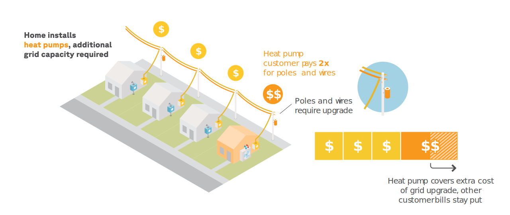
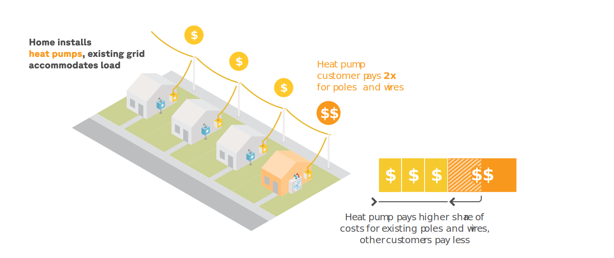
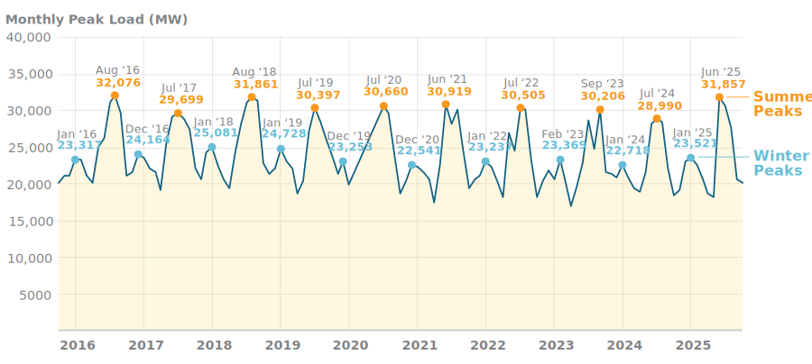

```{python}
#| echo: false

import pickle
from pathlib import Path
from types import SimpleNamespace

_report_vars_raw = pickle.loads(Path("cache/report_variables.pkl").read_bytes())
_path_cos_rv = Path("cache/report_variables_cos_subclass.pkl")
if _path_cos_rv.exists():
    _cos_rv = pickle.loads(_path_cos_rv.read_bytes())
    for _k in (
        "natgas_avg_xsub_default_pc",
        "natgas_avg_xsub_hp_seasonal_pc",
        "delivered_fuels_avg_xsub_default_pc",
        "delivered_fuels_avg_xsub_hp_seasonal_pc",
        "hp_share_of_delivery_revenue",
        "hp_avg_kwh_over_natgas_avg_kwh",
    ):
        if _k in _cos_rv:
            _report_vars_raw[_k] = _cos_rv[_k]
v = SimpleNamespace(**_report_vars_raw)
gb = SimpleNamespace(
    **pickle.loads(Path("cache/gold_book_report_vars.pkl").read_bytes()),
)


def dollar(x, accuracy=0):
    return f"${x:,.{accuracy}f}"


def dollar_signed(x, accuracy=0):
    """Currency with a leading minus for negative amounts (e.g. ``-$131`` not ``$-131``)."""
    if x < 0:
        return f"-${abs(x):,.{accuracy}f}"
    return f"${x:,.{accuracy}f}"


def pct(x, accuracy=0):
    return f"{x * 100:,.{accuracy}f}%"


def comma(x, accuracy=0):
    return f"{x:,.{accuracy}f}"


def cents(x, accuracy=1):
    return f"{abs(x) * 100:,.{accuracy}f}"
```

# Introduction

New York faces two intertwined challenges: rising electricity bills that strain household budgets across the state, and statutory climate targets that require a rapid shift away from fossil fuels. The Climate Leadership and Community Protection Act (CLCPA) mandates an 85% reduction in greenhouse gas emissions by 2050,[^clcpa] and the state's Scoping Plan identifies building electrification — replacing gas furnaces and boilers with electric heat pumps — as one of the largest sources of those reductions.[^scoping-plan] These goals are not in tension. As this report shows, modernizing rate design can advance both affordability and climate at once.

[^clcpa]: NYS Climate Leadership and Community Protection Act (CLCPA), S6599/A8429 (2019).

[^scoping-plan]: NYS Climate Action Council, *Scoping Plan* (Dec. 2022). The accompanying Integration Analysis, prepared by E3 for NYSERDA, models pathways requiring millions of heat pump installations statewide.

But under today's electric rates, switching from a gas furnace to a heat pump often _increases_ a household's energy bills — despite heat pumps being two to three times more efficient.[^nyserda-18-44] This operating cost penalty is one of the most significant barriers to heat pump adoption, discouraging homeowners from making the switch even when incentives cover the upfront cost of the equipment.[^neep-modern-rate]

[^nyserda-18-44]: NYSERDA, *New Efficiency: New York: Analysis of Residential Heat Pump Potential and Economics*, Report No. 18-44, at 5-3 and 58–59 (Jan. 2019).

[^neep-modern-rate]: Northeast Energy Efficiency Partnerships (NEEP), *Modern Rate Design in the Northeast: Unlocking Efficiency, Affordability, and Electrification*, at 15 (Dec. 2025).

The bill increase is not inherent to the technology. It is largely an artifact of how utilities charge for the poles and wires that deliver electricity to homes. Most delivery costs are recovered through volumetric rates — per-kWh charges that grow with a customer's electricity consumption.[^costello-defective] When a home installs a heat pump and begins using more electricity for heating, its delivery bill jumps proportionally — even though most of that new consumption falls in winter, when the grid has ample spare capacity and the cost of delivering electricity is low.[^chhabra-aceee] The result is a cross-subsidy: heat pump customers systematically overpay for delivery, and the excess effectively subsidizes electric customers who heat with fossil fuels — penalizing the very customers New York most needs to encourage.

[^costello-defective]: Kenneth W. Costello, "Today's rate designs are defective: How can utilities better recover their fixed costs, and from whom?", *Utility Dive* (Nov. 22, 2022).

[^chhabra-aceee]: Mohit Chhabra et al., "Doing the Right Things Now Will Eventually Pay Off: Cost-Effective & Equitable Building Decarbonization Requires (More) Proactive Planning and (Completely) Rethinking Rate Design," ACEEE (2024).

This dynamic is not new. In 2019, the New York State Energy Research and Development Authority (NYSERDA) published the first study to estimate the magnitude of the operating cost problem for the state's heat pump customers.[^nyserda-18-44] But no study has rigorously measured the cross-subsidy for each utility in the state, proposed concrete rate designs to eliminate it, or evaluated what those rates would mean for household bills and energy equity. And existing alternative rates — such as the time-of-use tariffs available in some service territories — were not designed to address this structural problem.

This report fills that gap. Using NREL's ResStock building energy simulations and hourly marginal cost data, we measure the delivery cross-subsidy for every major electric utility in New York and find that heat pump customers overpay by **`{python} dollar(v.hp_mean_delivery_bat)`** per year on average — approximately **`{python} f"${v.hp_total_cross_subsidy_delivery_millions:,.0f}"` million** statewide. We then design seasonal delivery rates calibrated to each utility's actual cost of service and show that they would transform the economics of heat pumps: under these rates, **`{python} f"{v.pct_natgas_save_hprate_lmi40 * 100:.0f}"`%** of gas-heated households would save by switching, up from just **`{python} f"{v.pct_natgas_save_default_lmi40 * 100:.0f}"`%** under default rates. We evaluate the impact on non-heat-pump customers, on energy burdens for low-income households, and on rates with added time-of-use price signals.

# Executive Summary

This report analyzes the electric bills of heat pump customers in New York State and finds that:

- **Under today's rates, most gas-heated homes would pay more after switching to heat pumps.** Only **`{python} f"{v.pct_natgas_save_default_lmi40 * 100:.0f}"`%** of natural gas-heated households would save on their annual energy bills after installing a heat pump — not because heat pumps are expensive to run, but because electricity rates are inflated by outdated delivery charges.
- **Heat pump customers are overpaying for the poles and wires by `{python} dollar(v.hp_mean_delivery_bat)` per year**, on average. Their delivery cost of service is only **`{python} f"{(v.hp_mean_delivery_cost / v.natgas_mean_delivery_cost - 1) * 100:.0f}"`%** higher than that of gas-heated customers, but their delivery bills are **`{python} f"{(v.hp_mean_delivery_bill / v.natgas_mean_delivery_bill - 1) * 100:.0f}"`%** higher — a direct consequence of volumetric delivery rates applied to customers who use more electricity.
- **The total cross-subsidy amounts to approximately `{python} f"${v.hp_total_cross_subsidy_delivery_millions:,.0f}"` million per year** — money that heat pump customers are effectively transferring to customers who heat with fossil fuels.
- **The grid can handle the additional winter load.** New York's winter peak is only 77% of the summer peak, and the distribution grid has an estimated 42% spare winter capacity statewide. Heat pump adoption is not triggering significant grid upgrades today — yet heat pump customers are being charged as if it were.
- **Utilities should create dedicated rate classes for heat pump customers** that reflect what these customers actually cost the system — rather than letting default volumetric rates collect far more than the cost of serving them. We propose a seasonal delivery rate specifically for heat pump customers that would charge them fairly for every utility in the state.
- **This rate would transform the economics of operating heat pumps.** Under it, **`{python} f"{v.pct_natgas_save_hprate_lmi40 * 100:.0f}"`%** of gas-heated households would save by switching to heat pumps (up from **`{python} f"{v.pct_natgas_save_default_lmi40 * 100:.0f}"`%** under default rates), and the share losing more than $1,000 per year would drop from **`{python} f"{v.pct_natgas_lose_1k_default_lmi40 * 100:.0f}"`%** to just **`{python} f"{v.pct_natgas_lose_1k_hprate_lmi40 * 100:.0f}"`%**.
- **The impact on non-heat-pump customers would be very modeste**: **`{python} dollar(v.rebal_nonhp_mean_monthly_delta, 2)`** per month, on average. Heat pump customers make up just `{python} pct(v.hp_share_of_households)` of residential customers, so the cross-subsidy they generate is spread thin — **`{python} pct(v.rebal_nonhp_pct_decrease + v.rebal_nonhp_pct_increase_under_5)`** of non-HP households would see their monthly bill rise by less than $5.
- **Heat pump rates could also improve energy affordability for low-income households.** If LMI households installing heat pumps are enrolled in both the seasonal rate and existing discount programs, the share of highly energy-burdened households would drop by **`{python} f"{(v.pct_burdened_current_lmi40 - v.pct_burdened_hp_seasonal_lmi100) * 100:.0f}"`** percentage points compared to today.
- **Adding time-of-use pricing to the seasonal rate would modestly improve outcomes further**, though nearly all of the improvement comes from the cost allocation itself, not from the time-varying price signals.

# Background

To follow along with this report, the reader needs to understand the electric utility , , and . These concepts are introduced and explained in this section.

Utility customers pay  to cover the utility's , and these bills are calculated using .

Rates are simply the _prices_ charged by the utility, and they come in two flavors:[^demand-charges]

- Fixed, where customers pay a certain number of dollars per month of being connected to the grid
- Volumetric, where customers pay a certain number of dollars for every kWh of energy they consume from the grid

[^demand-charges]: Rate design enthusiasts will be quick to point out the omission of demand charges, where customers pay for the highest kW of demand they use in a month — power instead of energy. Demand charges are out of scope for this report.

A customer's "fair share" of the utility's costs is called their . In theory, a customer's bill should equal their cost of service. In practice, it rarely does, because  — the prices people _pay_ for electricity — are a poor proxy for the  that they cause when using electricity.

This will all make more sense after we lay some additional groundwork. Let's start with costs.

## Costs

Companies build power plants, transmission lines, and distribution lines to produce and deliver electricity to customers. They incur  while doing so, and ultimately need to recoup these costs from customers — plus a profit margin.

In addition to the costs they incur when building this infrastructure, these companies also incur  to operate and maintain their infrastructure, and run their business.

Examples of these capital and operating costs are shown in the table below.

::: {.column-page-right}

|                    | Capital costs                                                        | Operating costs                                                          |
| ------------------ | :------------------------------------------------------------------ | :----------------------------------------------------------------------- |
| [**Generation**]{.badge-gen}     | **Capacity costs**: Power plants, turbines, solar arrays, battery storage                | **Fixed**: Staff, inspections, insurance<br>**Variable (with output)**: Fuel, water, consumables              |
| [**Transmission**]{.badge-trans}   | **Capacity costs**: High-voltage lines, bulk substations, switching stations             | **Fixed**: Infrastructure maintenance, vegetation management, property taxes, admin     |
| [**Distribution**]{.badge-dist}   | **Capacity costs**: Feeders, transformers, secondary lines<br>**Connection costs**: Meters, service drops        | **Fixed**: Infrastructure maintenance, vegetation management, storm restoration, property taxes, admin<br>**Variable (with customers)**: Billing, customer service, meter reading |

:::

The operating costs of traditional fossil-fueled power plants go by a special name: **energy costs**, or how much it costs each power plant to generate an additional kWh of electricity at any given moment. This is largely the cost of the fuel they burn to produce it, and a few other consumables.[^renewables]

[^renewables]: Renewables like wind, solar, batteries, hydro, and geothermal have near-zero operating / energy costs, while nuclear has very low energy costs.

::: {.callout-note}
## Ownership of infrastructure
Formerly, all three kinds of infrastructure were owned and operated by electrical utilities. Today, they only own the distribution lines. Transmission lines are owned by separate companies called transmission owners, and generation is owned by still other companies called power producers. Regardless of ownership, all of these entities ultimately recoup their customers by charging customers through their electric bills.
:::

Ultimately, power sector companies incur these  and  in order to serve customers, be they tiny studio apartments or massive data centers. So they turn around and recoup these  from customers through their .

But how much should they charge each customer? What is each customer's "fair share" of all of these costs?

## Cost of service
<!--
The first step is to divide costs among broad customer classes — residential, commercial, and industrial. For delivery, this happens through a formal regulatory proceeding called a **rate case**, where the utility files an  with the state Public Service Commission. The ECOS allocates the utility's entire delivery revenue requirement — both transmission and distribution costs — across customer classes, using proxy allocators like each class's contribution to peak demand, total energy consumption, and customer count. For supply, the allocation is more straightforward: the utility tracks its wholesale procurement costs and assigns each class its share based on how much that class consumed and when. -->

The standard answer is that customers should be allocated the costs that they _cause_ (and then charged for them through their bills). The jargon is that their  should be determined by the .

To see how this might work, let's follow a single customer through their lifecycle, and see which costs they cause at each stage.

<br>

::: {.column-page-inset-right}

:::: {.cos-step}
::: {.cos-step-narrative}
Let's say a family moves into a newly built home. When they first sign up for electricity service, the utility installs a meter and connects their home to the local power line with a service line.
:::
::: {.cos-step-cost}
[_causes..._]{.cos-causes}

[Distribution]{.badge-dist} **Capacity Costs** <br> Connection Costs: meters, service drops
:::
::::

:::: {.cos-step}
::: {.cos-step-narrative}
The utility starts reading their meter and sending them bills. The family has therefore caused new operating costs — ones that scale with the number of customers the utility serves.
:::
::: {.cos-step-cost}
[_causes..._]{.cos-causes}

[Distribution]{.badge-dist} **Operating Costs** <br> Variable (with customers): billing, meter reading
:::
::::

:::: {.cos-step}
::: {.cos-step-narrative}
As the family uses electricity, hour by hour, generators have to burn a little more fuel to keep up. The family is causing operating costs that scale with the amount of energy produced.
:::
::: {.cos-step-cost}
[_causes..._]{.cos-causes}

[Generation]{.badge-gen} **Operating Costs** <br> Variable (with output): fuel, etc.
:::
::::

:::: {.cos-step}
::: {.cos-step-narrative}
During the summer, they run their air conditioner during a heat wave, at the same time as many other customers. Most generators are running at full tilt — including many that sit idle for much of the year. By consuming electricity during these peak hours, the family is contributing to the need to pay these "peaker" plants just to stay in business, so they'll be around the next time demand surges.
:::
::: {.cos-step-cost}
[_causes..._]{.cos-causes}

[Generation]{.badge-gen} **Capital Costs** <br> **Capacity Costs**: power plants, etc.
:::
::::

:::: {.cos-step}
::: {.cos-step-narrative}
But generation is not the only infrastructure running at full tilt during the heat wave. The transmission line that brings electricity to their city, the distribution line that brings it to their home, and the substation that connects the two may also be approaching their  — the maximum current they can carry without damaging the equipment. By turning on their air conditioner at this moment, the family is contributing to the need for the utility to upgrade these components so they can handle even higher demand in the future.
:::
::: {.cos-step-cost}
[_causes..._]{.cos-causes}

[Transmission]{.badge-trans} **Capital Costs** <br> **Capacity Costs**: upgrading high-voltage lines, bulk substations, etc.

[Distribution]{.badge-dist} **Capital Costs** <br> **Capacity Costs**: upgrading feeders, transformers, etc.
:::
::::

:::: {.cos-step}
::: {.cos-step-narrative}
During most of the year, however, the family is simply benefiting from the transmission and distribution infrastructure that is _already built_, not causing the need for upgrades. How are these "historical" capital costs to be paid for?
:::
::: {.cos-step-cost}
[_benefits from..._]{.cos-causes}

[Transmission]{.badge-trans} **Capital Costs** (Embedded) <br> **Capacity Costs**: existing high-voltage lines, bulk substations, etc.

[Distribution]{.badge-dist} **Capital Costs** (Embedded) <br> **Capacity Costs**: existing feeders, transformers, etc.
:::
::::

:::

This example shows that cost-causation is not so straightforward. Some costs are caused by customers in real-time based on their usage, like energy costs and new T&D capacity upgrades. These are called .

Other costs — like most transmission and distribution infrastructure — were caused in the past by yesterday's customers, and simply have to be paid for in the future by today's customers. These are called .

::: {.column-page-right}

|                                        | Marginal costs                         | Embedded costs                                    |
| -------------------------------------- | :------------------------------------- | :------------------------------------------------ |
| [**Generation**]{.badge-gen}           | **Capacity costs**: new plants and storage<br>**Operating costs**: fuel and consumables (energy costs) | |
| [**Transmission**]{.badge-trans}       | **Capacity costs**: new lines and substations | **Capacity costs**: existing lines and substations<br>**Operating costs**: maintenance, vegetation management, property taxes |
| [**Distribution**]{.badge-dist}        | **Capacity costs**: new feeders and transformers<br>**Connection costs**: meters, service drops<br>**Operating costs**: billing, customer service, meter reading | **Capacity costs**: existing feeders and transformers<br>**Operating costs**: maintenance, storm restoration, property taxes |

:::

To find a customer's , we must calculate their  — the new costs they caused over the past year — and add them to their "fair share" of the utility's —largely for existing infrastructure that they likely benefited from over the past year, but may or may not have caused originally.

In fact, the vast majority of transmission and distribution costs that utilities need to recoup from customers via their bill are embedded: the infrastructure is already built, and it has to be paid for, regardless of what customers do going forward.[^fixed_operating_costs] Only a small fraction of T&D costs are marginal — new capacity upgrades that haven't been committed to yet, and that could be avoided or deferred if fewer customers stress the grid at peak times in the coming year.

[^fixed_operating_costs]: Similarly, most T&D _operating_ costs are fixed: the utility will need to trim trees and restore service after storms regardless of how customers consume electricity during the year.

::: {.callout-note}
## Why are most T&D capital costs embedded?
Generation capital and operating costs are short-lived: customers pay for them shortly after causing them. Households pay for the energy costs they caused that month on their bill at the end of the month. Generators receive the capacity payments they need to stay in business for another year more or less during that same year. T&D operating costs are also short-lived: customers pay for the utility's annual tree trimming and customer service budgets over the course of the year.

T&D capital costs are long-lived, meaning they get paid back over decades. This is because infrastructure projects are expensive, so they can't be recouped from customers all at once, and they are long-lasting, so customers will use them, and can therefore be charged for them, across many years.

In any given year, the utility will charge customers their "yearly payment" for each one of thousands of infrastructure projects built over decades — all the projects that are still in service, but haven't been fully paid for yet.

The latest wave of T&D capacity upgrades that will be triggered by the forthcoming summer peak — the   — will therefore make up a very small fraction of all the embedded capital costs that the utility still needs to recoup from customers.
:::

This distinction matters, because cost-causation works very differently for marginal costs than for embedded ones. For **marginal costs**, cost-causation is both measurable and uncontroversial: you can observe how much electricity a customer consumed each hour, calculate the energy and capacity costs they caused, and allocate accordingly.

But determining a customer's fair share of embedded costs is harder — and more contentious.

Many practitioners — including most utilities — believe cost-causation is still the right principle. A customer's current cost-causation (as measured by their marginal T&D costs), they argue, is a reasonable proxy for how customers like them contributed to past infrastructure needs.

But even proponents who agree with this principle acknowledge that it is difficult to measure in practice: which customers caused a particular transformer to be upgraded 30 years ago? Are they even still around?[^cos_class_level]

[^cos_class_level]: This is part of why utilities apply cost-causation at the level of broad customer classes — residential, commercial, industrial — rather than to individual customers. You can estimate that the residential class as a whole is responsible for a certain share of historical infrastructure costs. Tracing those costs to individual households is much more difficult.

Other experts, including many economists, argue that cost-causation is not just hard to apply to  — it is the _wrong_ principle for them. Their reasoning starts from what cost-causation means in practice: to actually bill customers according to the costs they cause, since that is the ultimate goal of determining their , you need prices (or rates) that reflect those costs.

When costs are still up for grabs — when a customer's behavior today can change the costs that will be incurred tomorrow — this works well. Prices that reflect these  achieve the goal of billing each customer in line with their cost-causation, and they have a productive secondary effect: customers who see higher prices during hours when capacity upgrades are at risk will shift load away from those hours, reducing the need for the next wave of infrastructure and right-sizing future .[^energy_costs] Cost-causation, applied to marginal costs, is both fair and _useful_.

[^energy_costs]: The same applies to energy costs: if the prices customers pay for energy reflect their underlying marginal costs, some will shift their demand to hours with lower costs, thereby lowering their bills for the same energy consumed.

But once the infrastructure is built, those  are : charging today's customers based on who caused them in the past doesn't change those costs — it can't. The question is no longer _who caused them originally_, but _how to divide them fairly among the customers who benefit from the grid today_. One answer is **equally** — a per-customer lump sum, on the grounds that everyone benefits from the existing grid and no one's current behavior can change what it cost to build. Another is progressively, based on **ability to pay**, on the grounds that since these costs must be paid regardless, distributing them equitably does the least harm.

In this report, we take the lump-sum approach: each customer's share of embedded delivery costs is treated as approximately equal, and what varies in their cost of service is their **marginal costs**—the new generation energy and T&D capacity costs they are causing now.

Why not adopt the cost-causation view instead? Consider what that would require. You would need to measure how much of the existing infrastructure each heat pump customer "caused." No one has historical data tracing individual households to specific infrastructure investments, so you would do what utilities typically do: use each customer's _current_ cost-causation as a proxy for their historical contribution to infrastructure needs. But this is where the approach breaks down for heat pump customers. Nearly all of them are retrofits — and installing a heat pump fundamentally changes a home's load profile. Their current cost-causation reflects their _post_-heat-pump load, but the infrastructure they would be paying for was built in response to their _pre_-heat-pump demand.

Rather than rely on a proxy that could produce misleading results, we allocate embedded delivery costs equally across all customers and let  — the costs each customer is actually causing now, and the costs that matter for the grid going forward — be what differentiates their  for purposes of measuring cross-subsidies.

## Bills

That is cost of service — the costs the utility incurs to serve each customer. The next question is how those costs are recovered. The answer is , which are _supposed_ to collect each customer's cost of service. A customer's electric bill has two sides, each designed to recover a different set of costs:

- **Supply** pays for generation — both the operating costs of producing electricity (energy costs) and the capital costs of keeping power plants available to meet demand (generation capacity costs).
- **Delivery** pays for the poles and wires — both the capital and operating costs of the transmission and distribution infrastructure that carries electricity from generators to homes.

The cost composition of each side is very different. The vast majority of generation costs are : energy costs change hour by hour based on how much electricity customers consume, and generation capacity costs are set annually through competitive auctions that reflect the cost of keeping enough power plants available to meet peak demand.[^gen_market] As a result, a customer's supply cost of service, and the supply side of the bill that is supposed to collect it, is driven almost entirely by what customers are consuming right now.

[^gen_market]: Unlike transmission and distribution infrastructure, power plants compete in a market. Customers pay the market-clearing price for energy and capacity — not any individual plant's embedded costs. If revenues from energy and capacity auctions don't cover a plant's costs, it can shut down. So customers are not on the hook for keeping specific generators in business the way they are for keeping specific poles and wires in service.

The delivery side is the opposite. As we saw above, the vast majority of transmission and distribution costs are  — the infrastructure is already built and has to be paid for regardless of what customers do. Only a small fraction of delivery costs are marginal: the next wave of capacity upgrades triggered by rising peak demand. A customer's delivery cost of service, and the delivery side of the bill that is supposed to collect it, is therefore dominated by their "fair share" of embedded costs, with marginal T&D costs adding a relatively small amount on top.

## Rates

Bills _attempt_ to recover each customer's cost of service — but they rarely succeed, because bills are calculated using , and rates are imperfect proxies for costs.

Residential customers face two kinds of rates:

- ****: a flat dollar amount per month, regardless of how much electricity the customer uses. These only appear on the delivery side of the bill. In many utilities, these only cover customer-related capacity and operating costs — meters, service lines, billing, meter reading, etc.
- ****: a price per kWh of electricity consumed. These appear on _both_ sides of the bill — supply and delivery. Volumetric charges can either be  — the same price at all hours — or  — prices that change over time.

On the **supply** side, volumetric rates make intuitive sense. Generation costs are mostly marginal: the more kWh a customer consumes, the more fuel gets burned and the more generation capacity is needed. A per-kWh price tracks this relationship well — customers who consume more electricity cause more supply costs, and pay proportionally more.

Volumetric rates also feature heavily on the **delivery** side — the more electricity a customer happens to consume, the more they pay for the poles and wires. But here the logic breaks down. Delivery costs do not scale with how much electricity a customer uses _in general_. New T&D costs are triggered during a handful of peak hours — typically summer heat waves — when the grid is strained and upgrades become necessary. The rest of the time, customers are simply using infrastructure that is already built. (And as we established above, each customer's share of those embedded costs is roughly equal in our framework.)

Yet a volumetric delivery rate charges customers _as if_ delivery costs grew with every kWh they consumed. The rate doesn't distinguish between a kWh consumed during a summer peak that strains the grid and a kWh consumed on a mild winter evening when there is ample capacity. It charges the same price for both — a customer who doubles their electricity use will pay roughly double for delivery, even if none of that new consumption falls during peak hours and they haven't triggered a single dollar of new T&D spending.

This mismatch — volumetric rates applied to costs that don't scale with volume — is the source of the  problem at the heart of this report.

## The fairness problem {#sec-fairness-problem}

We established earlier that a widely held principle of fairness in rate design is that each customer's bill should match their  — the costs they impose on the system. It follows that when a rate systematically causes a group of customers to pay _more_ on their bills than their cost of service, that group has a fairness problem. They are being overcharged, and the excess revenue they contribute effectively subsidizes everyone else (see @sec-cross-subsidy for an explanation of cross-subsidies).

As we'll see, this is precisely what is happening to heat pump customers on the delivery side of the bill. Because delivery costs are recovered through volumetric rates, heat pump customers — who consume significantly more electricity after the switch — pay far more for the poles and wires than they actually cost to serve.

The solution requires two steps:  — determining the correct delivery revenue to collect from heat pump customers, based on their actual cost of service (@sec-cost-allocation) — followed by  that collects that amount without overcharging them (@sec-seasonal-rate).


## The efficiency problem {#sec-efficiency-problem}

Solving the fairness problem means collecting the right _amount_ from each group of customers. But there is a second problem that fairness alone does not address: are customers aware of _when_ costs are happening?

Under a , a customer who runs their heat pump at 3 AM on a mild night pays the same price per kWh as one who cranks the air conditioning during a summer heat wave that strains the grid. The rate collects revenue — but it sends no signal about when electricity is cheap or expensive to produce, or when consumption risks triggering costly infrastructure upgrades. If prices don't distinguish between cheap hours and expensive hours, customers have no reason to shift their load — and load that doesn't respond to costs leads to **waste**.

This is the **** problem, and it has two distinct flavors:

1. **Consumption efficiency**: when prices reflect the hour-by-hour marginal cost of generating electricity, customers use more when it's cheap to produce (like when the sun is shining) and less when it's expensive (like when peakers are running).
2. **Investment efficiency**: when prices reflect the marginal cost of expanding grid capacity, customers reduce their electricity use during peak demand periods, reducing the need for the next wave of infrastructure investment — in generation, transmission, and distribution alike.

A rate that exposes customers to prices reflecting the underlying  of energy and infrastructure — costs that change over time and by location — is called a **cost-reflective** rate. Cost-reflective rates can help customers in two concrete ways:

- By lowering their supply and delivery bills _today_, to the extent they can shift their electricity use to off-peak periods. This also benefits climate and health, because low-cost hours tend to come from renewable sources, whereas high-cost hours tend to come from high-polluting peaker plants.
- By lowering their supply and delivery bills _tomorrow_, to the extent that load shifting slows the growth of peak demand, reducing future investments in generation, transmission, and distribution capacity.

The  we previewed earlier — where prices change over the course of the day — are the most common implementation of cost-reflective pricing. Time-of-use (TOU) rates, which set different prices for on-peak and off-peak hours, are the version available in most New York utilities.[^cpp] But in practice, existing TOU rates are only partially cost-reflective: prices in each period are set ahead of time rather than responding to real-time conditions, and  are often recovered through the  (rather than ), which inflates both on- and off-peak prices above the underlying marginal energy and capacity costs.[^p_gt_lrmc]

[^cpp]: Critical peak pricing, where utilities charge higher prices during a set number of peak demand days per season, is more dynamic than time-of-use. But prices are still set ahead of time, and utilities can only declare peak days a few times per season.

[^p_gt_lrmc]: Inflating the on- and off-peak prices to cover embedded costs, as is common practice, _also_ hurts cost-reflectiveness — and therefore economic efficiency — by making prices systematically higher than the marginal costs they are supposed to reflect.

### Fairness and efficiency are independent

This brings us to a crucial distinction. Solving the  problem — making sure each group of customers pays the right _total_ — is not the same as solving the  problem — making sure prices _reflect costs as they happen_. A rate can achieve one without the other.

A rate is **** if it bills each group of customers in line with their cost of service.
A rate is **** if it exposes customers to prices that track marginal costs over time.

These are independent properties:

A rate can be **cost-reflective without being cost-based**. When a utility switches all customers from  to time-of-use rates — as PSEG Long Island recently did — customers are exposed to a degree of temporal cost-reflectivity: if the TOU rate is well-designed, prices are more aligned with the hour-by-hour fluctuation in marginal energy and capacity costs. But as long as embedded costs, which make up the majority of the delivery revenue requirement, continue to be collected through volumetric rates — even time-varying ones — electric heating customers will continue to overpay, on average, and fossil heating customers to underpay, relative to their cost of service. The rate sends better price signals, which improves , but it doesn't fix the  problem.

A rate can also be **cost-based without being cost-reflective**. Imagine if heat pump and fossil heating customers each paid all of their delivery costs through fixed charges equal to the average cost of service of their group: `{python} dollar(v.hp_mean_monthly_delivery_cost)` per month for heat pump customers, and `{python} dollar(v.ff_mean_monthly_delivery_cost)` per month for fossil heating customers (we derive these figures in the analysis below). This rate would be cost-based — the average overpayment or underpayment would be zero for both groups. But it would not be cost-reflective, because it would not expose customers to different prices at different hours. There would be no incentive to minimize the buildout of the grid in the future (marginal capacity costs) and no ability to access cheaper electrons from solar and wind in the present (marginal energy costs). Fair, but not efficient.

**Flat volumetric rates** — the status quo for most residential customers — are the worst of both worlds: neither fair nor efficient. They overcharge electric heating customers relative to the cost of serving them, so they are not cost-based. They don't change over time, so they are not cost-reflective. Flat rates create unfair cross-subsidies _and_ fail to send customers the price signals they need to make cost-aware decisions.

But it is possible to design rates that are **both  and **: we design such a rate, a seasonal time-of-use rate for heat pump customers, in @sec-tou-rate.

In fact, meeting the state's building electrification goals hinges on doing so: cost-based rates would lower heat pump bills by paying for _already built_ infrastructure more fairly, while cost-reflective rates could lower heat pump bills further by allowing customers to pre-cool and pre-heat their homes when electrons are cheap — while also reducing the amount of infrastructure the state will need to build as it electrifies, thereby limiting bill growth for all.

# Findings

## What happens to heating bills when households switch to heat pumps?

<!-- Imagine a home in Utica: a pre-war, two-bedroom unit in a small multifamily building, heated by a natural gas furnace with central air conditioning. It pays {python} dollar(v.median_energy_total) for energy every year, which is the median bill for gas-heated homes in the state. [^utica_home] -->

Imagine a single-family home in Syracuse: a three-bedroom ranch built in the 1940s, heated by a natural gas furnace with
central air conditioning. It pays `{python} dollar(v.median_energy_total)` for electricity and natural gas every year — close to the median total bill for gas-heated homes in the state.[^syracuse_home]

Like all homes in New York, when this household switches to an air-source heat pump,[^heatpump_efficiency] its annual
energy use plummets (@fig-consumption-only-state):

::: {.column-body-outset-right}

:::

[^syracuse_home]:
    Specifically: a 1,698 sq ft, owner-occupied, single-story home with uninsulated wood-frame walls,
    an 80% AFUE gas furnace, and SEER 13 central AC. The home is served by National Grid (electricity
    and gas).

<!-- [^utica_home]: Specifically: a 2,648 sq ft, owner-occupied, two-story unit in a 2-unit building, built before 1940 with uninsulated brick walls, an 80% AFUE gas furnace, and SEER 15 central AC. The home is served by National Grid (electricity and gas). -->

[^heatpump_efficiency]: TODO add model specs here.

Heat pumps are 2 to 3 times more efficient than gas furnaces, so they only require a fraction as much energy input to heat a home to the same temperature.

However, while switching to heat pumps cuts a home's energy *use*, it often increases its energy *costs*, as is the case
with this Syracuse home (@fig-consumption-vs-bills-state).

::: {.column-body-outset-right}

:::

This is because electricity is more expensive than natural gas in New York State: while electricity makes up only
`{python} pct(v.elec_share_of_energy_use)` of this gas-heated building's total annual energy use, it accounts for
`{python} pct(v.elec_share_of_energy_bill)` of its annual energy bill.

After this building replaces its gas furnace with a heat pump, its
annual [gas bill]{style="color: #a0af12; font-weight: bold"} drops by
`{python} dollar(v.median_gas_drop)`.[^using_gas_for_cooking_and_hot_water] But its annual
[electric bill]{style="color: #e6b400; font-weight: bold"} jumps by `{python} dollar(v.median_elec_jump)`.

The result: despite the heat pump's lower energy use, switching this home's heating fuel from natural
gas to electricity causes its annual **combined energy bills** to jump by
`{python} dollar(v.median_net_increase)`.

[^using_gas_for_cooking_and_hot_water]:
    The home in this example still uses some gas for cooking and hot water, which is why the gas bill doesn't drop to
    zero after the switch.

In other words, under today's utility prices for electricity and gas, it costs more to heat this home with heat pumps than with natural gas. While this experience is fairly
typical of what happens when gas-heated homes switch to heat pumps today, New York State's building stock is diverse, so
the full range of bill impacts varies widely (@fig-quadrant-bar-natgas-state-state-lmi-current).

::: {.column-page-inset-right}

:::

While most natural gas-heated households that switch to heat pumps do see their bills go up, approximately
`{python} pct(v.pct_natgas_save_default_lmi40)` actually enjoy lower bills after the switch.[^why_save]

[^why_save]: The homes most likely to save under default rates are those with with less efficient furnaces (they spend more on gas, giving the heat pump a larger bill to offset) and those that have full cooling because the heat pump typically cools more efficiently than the existing AC. See @sec-savings.

Only `{python} pct(v.pct_natgas_households)` of New York households are heated with natural gas, however. The rest are
heated with delivered fuels or electric resistance — both of which have more potential for bill savings than natural gas
(@fig-households-by-fuel).

::: {.column-page-inset-right}

:::

Indeed, when households who heat with delivered fuels switch to heat pumps, their bills tend to go down
(@fig-quadrant-bar-oil-propane-state).

::: {.column-page-inset-right}

:::

Today, over `{python} pct(v.pct_oil_propane_save_default)` of oil and propane households lower their bills after
switching, and `{python} pct(v.pct_oil_propane_save_1k_default)` save more than $1,000 per year.

The story is similar for electric resistance-heated households (@fig-quadrant-bar-elec-resistance-state).

::: {.column-page-inset-right}

:::

For households that heat with electric resistance, `{python} pct(v.pct_elec_resistance_save_default)` would see bill
decreases after switching to heat pumps, and `{python} pct(v.pct_elec_resistance_save_1k_default)` would save more than
$1,000 per year.

---

So why do heat pumps struggle to compete against natural gas in New York State?

Low natural gas prices are one significant reason, but not the only one. As we'll see in the next section, the main
culprit is (artificially) high electricity prices, which are exacerbated by the outdated way that utilities charge electric customers for the poles and wires that deliver electricity to their homes.

## HP customers are cross-subsidizing non-HP customers {#sec-cross-subsidy}

### Why electric bills go up when heat pumps are installed

When a gas-heated household with existing air conditioning switches to a heat pump, its annual electricity
consumption goes up by roughly `{python} f"{v.elec_pct_change_full_cooling_p25:.0f}"`% to
`{python} f"{v.elec_pct_change_full_cooling_p75:.0f}"`% — and much more for homes that gain cooling for the first
time.[^elec_increase_range] The electric bill goes up by approximately the same amount.

[^elec_increase_range]:
    The range shown is the weighted interquartile range (25th to 75th percentile) for fossil-fueled homes with full
    baseline cooling statewide. The increase varies by utility territory and by whether the home already had air
    conditioning — see @sec-by-utility for a breakdown.

In the case of the Syracuse home, which had central air conditioning before the switch, its annual electricity use and its annual electric bill both grow by
`{python} f"{v.elec_kwh_multiplier:.1f}"`× (@fig-consumption-elec-focus-state).

::: {.column-body-outset-right}

:::

To understand why this happens, we need to drill down into the electric bill's components
(@fig-bill-components-decomposed-state).

::: {.column-body}

:::

The home pays `{python} f"{v.supply_multiplier:.1f}"`× as much for [supply]{style="color: #E69F00; font-weight: bold"} — the part of the bill that pays for the electricity itself, and for power plants to be available to generate it. This makes sense: after making the switch, the home consumes `{python} f"{v.elec_kwh_multiplier:.1f}"`× as much
electricity per year.

But upon turning on the heat pump, the home also starts paying `{python} f"{v.delivery_multiplier:.1f}"`× more for the
same poles and wires that bring that electricity to their home.

This happens because delivery costs are largely recovered through
[volumetric charges]{style="color: #56B4E9; font-weight: bold"}, rather than
[fixed charges]{style="color: #023047; font-weight: bold"}. The result: when a customer consumes more electricity,
not only do they pay more for that electricity, but they also pay more for the grid itself — regardless of whether they
trigger the need for grid upgrades.

Is this delivery bill inflation fair?

### Heat pump customers are overpaying for delivery

Utility regulators generally hold the principle that to be **fair**, a customer's **bill** must match the **costs** the customer imposes on the
system.[^cost-causation-principle]

[^cost-causation-principle]: TODO add link to Bonbright's principle of fairness based on cost-causation.

When a customer increases their electricity use after installing a heat pump, they increase their **energy
costs**—power plants have to burn more fuel to generate that electricity, and so on. So it makes sense that their
[supply bill]{style="color: #E69F00; font-weight: bold"} also grows.

But a customer's [delivery bill]{style="color: #56B4E9; font-weight: bold"} should only grow if they grow their
**capacity costs**, also known as their [delivery cost of service]{style="color: #1b7837; font-weight: bold"}. And this
only happens when their new electricity use triggers new upgrades to the grid's capacity — during the handful of "peak
hours" of the year, when the grid as a whole (or their local distribution line) is most congested.

If a customer's delivery bill exceeds their delivery cost of service, they are
[overpaying]{style="color: #b71c1c; font-weight: bold"}.

---

To illustrate, let's return to our Syracuse home, which is served electricity by National Grid, and has an annual delivery
cost of service of `{python} dollar(v.cs_gas_cost)` per year (@fig-cross-subsidy-example).

When heated with natural gas, the home's annual [electric delivery bill]{style="color: #56B4E9; font-weight: bold"}
is `{python} dollar(v.cs_gas_underpay)` lower than its [delivery cost of service]{style="color: #1b7837; font-weight: bold"} — a good illustration of how most gas-heated homes actually [underpay]{style="color: #ffc729; font-weight: bold"} for electric delivery.

::: {.column-page-inset-right}

:::

After switching to the heat pump, this particular home's electric delivery cost of service is unchanged, because its new electricity use is highly concentrated in the winter, during hours when marginal capacity costs are zero.[^notmuch]

[^notmuch]:
    The fact that the home's electricity use grew by `{python} f"{(v.elec_kwh_multiplier - 1) * 100:.0f}"`%, but its
    delivery cost of service changed so little, reflects the
    fact that both the NYISO grid as a whole and National Grid's local distribution system have ample winter headroom
    (see @sec-headroom).

But as we saw earlier — as a direct consequence of volumetric rates — the Syracuse home's annual electric
[delivery bill]{style="color: #56B4E9; font-weight: bold"} grows to `{python} dollar(v.cs_hp_bill)` per
year, causing an [overpayment]{style="color: #b71c1c; font-weight: bold"} of `{python} dollar(v.cs_hp_bat)` per
year.

---

How widespread is this overpayment problem in practice?

We find that households with heat pumps are systematically paying more than their cost of service for electric delivery across
New York State.

Statewide, the electric [delivery cost of service]{style="color: #1b7837; font-weight: bold"} for
electric customers that heat with natural gas is `{python} dollar(v.natgas_mean_delivery_cost)` per year, on average,
compared to `{python} dollar(v.hp_mean_delivery_cost)` per year for heat pump customers, just
**`{python} f"{(v.hp_mean_delivery_cost / v.natgas_mean_delivery_cost - 1) * 100:.0f}"`%** higher.

But the electric [delivery bills]{style="color: #56B4E9; font-weight: bold"} that heat pump customers currently pay are
**`{python} f"{(v.hp_mean_delivery_bill / v.natgas_mean_delivery_bill - 1) * 100:.0f}"`%** higher than those of electric customers that heat with natural gas, on average.

::: {.column-page-inset-right}

:::

We find that heat pump customers are overpaying for delivery by
**`{python} f"{dollar(v.hp_mean_delivery_bat)} per year"`**, on average.

::: {.callout-note}
To see how heat pump overpayments vary by utility, see @sec-bill-alignments-by-utility.
:::

Simultaneously, households that heat with natural gas are *underpaying* for electric delivery by
**`{python} f"{dollar(abs(v.natgas_mean_delivery_bat))} per year"`**, on average, while those with heating oil and
propane are *underpaying* by **`{python} f"{dollar(abs(v.oil_propane_mean_delivery_bat))} per year"`**.

These findings are connected: part of what allows electric customers that heat with fossil fuels to pay less for electric delivery than their cost of service is precisely the fact that heat pump customers are overpaying, which creates a cross-subsidy to
customers that heat with fossil fuels.[^er-cross-subsidy]

[^er-cross-subsidy]:
    Electric resistance customers are also overpaying, and are responsible for a substantial portion of the
    cross-subsidy to customers that heat with natural gas and heating oil and propane.

### How overpayments create cross-subsidies

To understand how cross-subsidies arise, let's return to the single-family home in Syracuse.

Before switching to a heat pump, let's assume its annual electricity use, and therefore its annual delivery bill, is the same as
those of its natural gas-heated neighbors.

::: {.column-page-inset}
{#fig-same-delivery}
:::

The power line on this block was upgraded in recent years, and the cost of this upgrade is paid back by customers over decades. Every year, the cost of this upgrade is paid for by the homes on this block.[^simplification]

[^simplification]:
    In reality, these customers would also help pay for other power lines, and customers on other blocks would help pay for this one. This is a stylized example to illustrate the zero-sum dynamic: the utility's annual revenue requirement is fixed, so under volumetric rates, any customer who consumes more electricity pays a larger share of that fixed pot — and everyone else pays a smaller share, regardless of whether the actual cost of serving anyone changed.

As we've seen, after the home installs a heat pump, its annual electricity use (and therefore its annual delivery bill)
both grow by `{python} f"{v.elec_kwh_multiplier:.1f}"`×. But this new electricity use is highly concentrated in the winter:

::: {.column-body-outset}

:::

Does the power line have enough capacity to accommodate this additional wintertime load?

If it does not, the electrical utility would need to upgrade the power line.

::: {.column-page-inset}
{#fig-capacity-upgrade}
:::

These new **capacity costs** (represented by the growth in rectangle in the diragram above) must now be recovered from
the customers.

The costs were caused by the heat pump installation, so under the principle of cost-causation, they should be borne by
that customer.

And, in this case, they are: the higher delivery bills resulting from volumetric delivery rates cover these "marginal
capacity costs." The customer's delivery cost of service grows, but the delivery bill grows to match it. There's no
underpayment or overpayment, and no impact on the other customers on the block.

But as we'll see in the next section, the overwhelming majority of New York's grid *does* have the capacity to
accommodate this additional wintertime load. And that's what creates the cross-subsidy.

::: {.column-page-inset}
{#fig-no-capacity-upgrade}
:::

In this alternative scenario, the power line's spare winter capacity absorbs the heat pump's additional winter load.
**Capacity costs** don't grow; they stay fixed.

Volumetric rates cause the heat pump customer's delivery bill to rise, despite the fact that their delivery
cost of service hasn't changed. The heat pump customer pays a bigger share of the fixed costs, which allows the other
customers on the block to pay less.[^howitworks]

[^howitworks]:
    TODO add a note on how this actually works in practice — revenue adjustments respond to overcollection caused by heat
    pump customer overpayments in one year to lower the delivery rates for everyone in the following year, causing the
    bills of non-heat pump customers to shrink compared to the year before. Those of heat pump customers shrink too, but
    they remain far above their cost of service, while those of customers that heat with fossil fuels sink below theirs.

And this "no capacity upgrade" scenario is the one that prevails across most of the state today.

### Why the grid can handle the additional load {#sec-headroom}

Over the past ten years, New York's grid-wide winter peak has averaged only **77%** of the summer peak
(@fig-nyiso-peaks).

::: {.column-body-outset}
{#fig-nyiso-peaks}
:::

In other words, at the level of **generation** and **transmission**, around a quarter of the grid's capacity goes unused
during the winter.

And since the grid is already sized to handle these summer peaks, there's significant "headroom" for winter peaks to
grow up to their level, using existing infrastructure.

But what about at the **distribution** level of the grid?

A recent study by Synapse Energy Economics analyzed the capacity of New York's distribution grid to accommodate building
electrification.

While the picture varies by utility, the distribution grid as a whole appears to have even more winter headroom than the
bulk power grid:

::: {.column-page-inset-right}
| Utility           | Distribution winter peak (MW) | Total estimated winter headroom (MW) | Available winter capacity |
| ----------------- | ----------------------------- | ------------------------------------ | ------------------------- |
| National Grid     | 4,276                         | 4,477                                | 51%                       |
| Central Hudson    | 796                           | 279                                  | 26%                       |
| NYSEG and RGE     | 3,786                         | 3,235                                | 46%                       |
| ConEd             | 4,691                         | 1,346                                | 22%                       |
| Orange & Rockland | 1,123                         | 1,071                                | 49%                       |
| **Total**         | **14,673**                    | **10,408**                           | **42%**                   |

Table: Distribution grid winter headroom by utility, adapted from [p. 4](https://www.documentcloud.org/documents/26207519-synapse-bd-assessment-of-electric-grid-headroom-for-accommodating-building-electrification-2024/?mode=annotating#document/p4/a2675823) of [@takahashi_AssessmentElectricGrid_2024]. {#tbl-dist-grid-headroom}
:::
For instance, in Central Hudson, 26% of the distribution grid's winter capacity is currently unused. In National Grid,
the figure is 51%.
The study concludes: "Existing distribution grids could support residential heat pumps reaching
roughly 29 percent to 47 percent of the entire heating fuel stock... with the statewide average of 39
percent."[^nyiso_distribution_grid_headroom]

[^nyiso_distribution_grid_headroom]:
    See [p.
    4](https://www.documentcloud.org/documents/26207519-synapse-bd-assessment-of-electric-grid-headroom-for-accommodating-building-electrification-2024/?mode=annotating#document/p4/a2675823)
    of Synapse Energy Economics' distribution headroom report [@takahashi_AssessmentElectricGrid_2024].

Simply put: at present, New York's grid has significant spare winter capacity to accommodate
heat pumps. And this is the main reason why their delivery cost of service is only
`{python} f"{(v.hp_mean_delivery_cost / v.natgas_mean_delivery_cost - 1) * 100:.0f}"`% higher than that of electric customers that heat with natural gas.

## Fixing the cross-subsidy: the cost allocation step {#sec-cost-allocation}

So far, we have examined the cross-subsidy problem one household at a time: the average heat pump customer overpays for delivery by **`{python} dollar(v.hp_mean_delivery_bat)`** per year. But what does this add up to across the state?

Heat pump customers currently make up just `{python} pct(v.hp_share_of_households, accuracy=1)` of New York's residential electricity customers, but they contribute `{python} pct(v.hp_share_of_delivery_revenue, accuracy=1)` of total delivery revenue. Despite their small numbers, they consume considerably more electricity per household than other residential customers — and under volumetric delivery rates, they pay accordingly (@tbl-baseline-sw-summary-pc).

::::: {.column-page-inset-right}

:::::

They consume approximately `{python} f"{v.hp_avg_kwh_over_natgas_avg_kwh:.1f}x"` more electricity per household, on average, than customers that heat with natural gas.

But how much of this revenue is justified by the actual cost of serving these customers? @tbl-baseline-sw-totals-pc adds the key comparison: the total delivery cost of service for each of these residential customer groups, alongside the revenue utilities currently collect from them.

::::: {.column-page-inset-right}

:::::

Across the state, heat pump customers are overpaying for delivery by a total of approximately **`{python} f"${v.hp_total_cross_subsidy_delivery_millions:,.0f}"` million per year**—the gap between what utilities collect from them and what it actually costs to serve them.

---

This gap points to a fix that is more fundamental than designing a new rate.

Utilities already perform  between customer classes — residential, commercial, industrial, and so on. For each class, the utility measures the cost of serving that group and assigns a : a target amount to collect that matches the group's cost of service. This is how every rate case begins.

But utilities do not currently perform cost allocation at the level of customer _subclasses_ within the residential class. All residential customers — whether they heat with gas, oil, or a heat pump — are lumped into a single group and charged the same default rate. Whatever revenue that rate happens to collect from each subclass is whatever it collects; the utility doesn't track whether it overshoots or undershoots any subclass's cost of service, because it has no reason to. Which is exactly what happens to heat pump customers: the default volumetric rate collects far more from them than it costs to serve them, and the utility has no visibility into the mismatch.

The fix is for each utility to create a **dedicated  for heat pump customers**. This would require the utility to determine these customers' actual delivery cost of service and set a revenue requirement that reflects it — rather than the inflated revenue total it happens to collect when the default volumetric rate is applied to customers who use more electricity.[^cost-allocation-appendix]

[^cost-allocation-appendix]:
    For our estimate of each utility's heat pump customer cost allocation — including the number of heat pump customers, their collective delivery cost of service, and the revenue the utility should aim to collect — see @sec-cost-allocation-by-utility.

To eliminate the cross-subsidy, we follow a two-step process:

1. : determine the correct revenue to collect from heat pump customers.
2. : choose among the many rates that could collect this revenue. A lower flat rate, a higher fixed charge, a seasonal rate, a time-of-use rate — any rate calibrated to collect the revenue dictated by the cost allocation will, by definition, have eliminated the cross-subsidy and solved the  problem.

This is how ratemaking works: rate design is always based on cost allocation. First, the utility determines how much revenue to collect from a group of customers, based on their cost of service. Then, it chooses among rate structures that all collect this amount but may have different secondary effects — on equity across income levels, on economic efficiency, on incentives for conservation or distributed generation, on simplicity, on ease of implementation, and so on.

Cost allocation determines _how much_ to collect. Rate design simply determines _how_ to collect it. **Getting the cost allocation right is what eliminates the cross-subsidy.** The choice among rate designs, while important, is secondary.[^note]

[^note]: In other words, under tech-specific rates, fairness is not an intrinsic property of a rate's structure — it comes from the subclass-specific revenue target the rate is calibrated to hit. A seasonal rate calibrated to the wrong revenue requirement wouldn't be fair at all.

We propose two rate designs that implement this cost allocation: a simple seasonal heat pump rate that could be deployed immediately, and a more cost-reflective seasonal time-of-use rate that would additionally help heat pump customers lower their bills by shifting electricity use away from peak hours.


## Rate design 1: seasonal delivery rate for heat pump customers {#sec-seasonal-rate}

Having determined the correct delivery revenue requirement for heat pump customers at each utility, the next question is how to collect it.

We propose simple seasonal heat pump rates for every utility in New York state. By design, these rates would lower heat pump customer delivery bills in every month, and could therefore be retroactively applied to all known heat pump customers in the state. This rate would only be available to heat pump customers, and would only apply to the delivery side of the bill.

This rate is calibrated to each utility's heat pump revenue requirement.
In summer, the volumetric delivery rate equals the utility's current
default rate — so no heat pump customer pays more in summer than they
do today. That means the entire reduction needed to bring annual
delivery revenue in line with the cost allocation must come from
winter, when volumetric rates are lowered accordingly. The result: heat
pump customers pay the same in every summer month, and less in every winter month,
and the utility collects the correct annual revenue from them as a group.

The exact winter rate would be unique to each electric utility, reflecting the cost of service of heat pump customers in that territory.

::::: {.column-body-outset-right}

:::::

If all existing heat pump customers opted in to these rates, what would happen to the overpayments and underpayments we
saw earlier?

::::: {.column-screen-inset-right}

:::::

Because the seasonal rate is calibrated to each utility's heat pump revenue requirement,
it collects the correct annual delivery revenue from heat pump customers as a group —
`{python} dollar(v.hp_mean_delivery_cost)` per year, on average, statewide — eliminating
their overpayment by design.

By eliminating the cross-subsidy from heat pump customers to customers that heat with fossil fuels, the underpayments of
natural gas, propane, and heating oil customers would decrease, on average — from `{python} dollar_signed(v.natgas_avg_xsub_default_pc)` to `{python} dollar_signed(v.natgas_avg_xsub_hp_seasonal_pc)` per year for natural gas, and from `{python} dollar_signed(v.delivered_fuels_avg_xsub_default_pc)` to `{python} dollar_signed(v.delivered_fuels_avg_xsub_hp_seasonal_pc)` for heating oil and propane, respectively.[^elimination]

[^elimination]:
    They would not be eliminated, however, without also removing overpayments by electric resistance customers.

The seasonal heat pump rate eliminates the cross-subsidy — that's what cost allocation guarantees. But does charging heat pump customers fairly move the needle on their operating costs?

## Bill impact of seasonal heat pump rate on HP customers

If our seasonal heat pump rate were available, how would it affect what happens to annual energy bills when natural gas heated
households switch to heat pumps? Let's revisit our earlier analysis.

First, let's revisit the post-heat pump bills for the Syracuse home.

::::: {.column-page-inset-right}

:::::

Under the seasonal heat pump rate, the Syracuse home's post-heat pump annual electric bill
would drop by **`{python} f"{v.fair_rate_savings_pct * 100:.0f}"`%** — from
`{python} dollar(v.fair_rate_total_bill + v.fair_rate_savings_dollar)` under default rates to
**`{python} dollar(v.fair_rate_total_bill)`**.

The savings come entirely from the electric [delivery (volumetric)]{style="color: #56B4E9; font-weight: bold"} component, which shrinks thanks to the lower winter rate. Electric supply and gas bills are unchanged.

The dashed line marks the home's pre-heat-pump delivery bill. Under the seasonal rate, the post-heat-pump delivery bill falls
close to it — meaning the overpayment for delivery has been largely eliminated for this home.

Bottom line: the seasonal heat pump rate would allow this home to save `{python} dollar(v.median_energy_total - v.fair_rate_total_bill)`
per year by switching from gas heating to heat pumps.

---

Would we see similar outcomes statewide? Let's zoom out and see.

::::: {.column-page-inset-right}

:::::

Seasonal heat pump rates (based on fair cost allocation) would transform the economics of heat pumps in New York State.

Under default rates, only **`{python} f"{v.pct_natgas_save_default_lmi40 * 100:.0f}"`%** of gas-heated households would
save by switching to heat pumps. But under the seasonal heat pump rate, **`{python} f"{v.pct_natgas_save_hprate_lmi40 * 100:.0f}"`%**
of gas-heated households would save. And the share of households losing over $1,000 per year would drop from
`{python} f"{v.pct_natgas_lose_1k_default_lmi40 * 100:.0f}"`% to just `{python} f"{v.pct_natgas_lose_1k_hprate_lmi40 * 100:.0f}"`%.

The fact that most gas-heated households would save by switching to heat pumps if overpayments were eliminated proves
that heat pump operating costs struggle to compete against natural gas largely because of outdated volumetric delivery
rates — not cheap gas supply.

The pattern holds for oil and propane-heated homes. Under default rates,
`{python} f"{v.pct_oil_propane_save_default * 100:.0f}"`% of oil/propane households would save by switching to
heat pumps. Under seasonal heat pump rates, **`{python} f"{v.pct_oil_propane_save_hprate * 100:.0f}"`%** would save, and the
share losing over $1,000 per year would drop from `{python} f"{v.pct_oil_propane_lose_1k_default * 100:.0f}"`% to
`{python} f"{v.pct_oil_propane_lose_1k_hprate * 100:.0f}"`%.

::::: {.column-page-inset-right}

:::::

Electric resistance homes see a similar improvement. Under default rates,
`{python} f"{v.pct_elec_resistance_save_default * 100:.0f}"`% would save by upgrading to heat pumps. Under seasonal heat pump rates,
**`{python} f"{v.pct_elec_resistance_save_hprate * 100:.0f}"`%** would save.

::::: {.column-page-inset-right}

:::::

## Equity impact of seasonal heat pump rate on HP customers

While the bill impacts shown above reveal how the population at large would be affected by seasonal heat pump rates, they don't
illuminate the equity impact on low- and moderate-income households. For that, we must zoom in on this population, and
look at energy burdens.[^energy-burden]

[^energy-burden]: Energy burden is defined as the percentage of a household's annual income spent on energy bills.

Today, `{python} pct(v.pct_burdened_current_lmi40)` of New York's low- and moderate-income households that heat with natural
gas pay more than 6% of their annual income on energy bills, and are therefore considered to be **highly energy
burdened**. This figure reflects current LMI discounts for electricity and gas; only ~`{python} f"{v.lmi_current_enrollment_pct:.0f}"`% of eligible LMI households are currently enrolled.[^lmi-def]

[^lmi-def]: Low-and-moderate-income (LMI) households are those eligible for New York's Energy Affordability Program (EAP) or Enhanced Energy Affordability Program (EEAP) — generally, households with income at or below 100% of State Median Income (or Area Median Income in Con Edison and KeySpan territories). See @sec-methods-lmi for the full tier structure and how we assign eligibility in the simulation.

::::: {.column-page-inset-right}

:::::

After installing heat pumps under default rates, `{python} pct(v.pct_burdened_hp_default_lmi40)` of these households
pay more than 6% of their annual income. This assumes that the same households that are already enrolled in LMI discounts remain enrolled after switching to heat pumps.

After installing heat pumps under heat pump-only seasonal rates,
`{python} pct(v.pct_burdened_hp_seasonal_lmi40)` of these households would still be highly burdened. This assumes that LMI electrification is paired with opting households into the HP seasonal rates.

And as long as we're updating LMI electrification programs to include rate enrollment, what if these programs also ensured that all eligible LMI households were enrolled in the discounts they're eligible for?

The final bar in @fig-burden-bar-lmi-current shows what post-heat pump installation burdens would look like — under HP seasonal rates and 100% enrollment in LMI discounts. Under this scenario, the number of highly energy burdened households would actually drop by
`{python} f"{(v.pct_burdened_current_lmi40 - v.pct_burdened_hp_seasonal_lmi100) * 100:.0f}"` percentage points compared to today.

## Bill impact of seasonal heat pump rate on non-HP customers

As we saw earlier, households that heat with natural gas are underpaying for electric delivery by
**`{python} dollar(abs(v.natgas_mean_delivery_bat))`** per year, on average, while those with oil or propane are
underpaying by **`{python} dollar(abs(v.oil_propane_mean_delivery_bat))`**.

Part of why this happens is that heat pump customers are overpaying for delivery — by
**`{python} dollar(v.hp_mean_delivery_bat)`** per year, on average — which allows utilities to lower the volumetric
delivery rate on everyone.

If all heat pump customers opted in to seasonal heat pump rates, this cross-subsidy would be removed. The volumetric delivery rate
used by non-heat pump customers would need to rise slightly to compensate. How would this affect their bills?
(@fig-bill-change-non-hp-rebal-state).

::::: {.column-page-inset-right}

:::::

By **`{python} dollar(v.rebal_nonhp_mean_monthly_delta, 2)` per month**, on average.

In fact, **`{python} pct(v.rebal_nonhp_pct_decrease + v.rebal_nonhp_pct_increase_under_5)`** of non-HP households would
see their monthly electric bill rise by less than $5 a month.

Importantly, this is **not a "rate hike"** on customers without heat pumps. It is the removal of an unfair
cross-subsidy, and a step toward better aligning delivery rates with each customer's actual cost of service.

Why so little?

Because heat pump customers only make up `{python} pct(v.hp_share_of_households)` of residential customers. The total
cross-subsidy they generate is modest, around **`{python} f"${v.hp_total_cross_subsidy_delivery_millions:,.0f}"` million
per year**, and it gets spread across `{python} f"{v.nonhp_households_millions:,.1f}"` million non-HP households.

The result: the benefit each non-heat pump household receives from the cross-subsidy is small — but the cost each heat
pump household bears is large, as we saw in @fig-quadrant-bar-natgas-switch-hprate-state-lmi-current.

This shows how counterproductive this unintentional public policy of cross-subsidization really is: the state is trying to
advance heat pump adoption, but its own volumetric rates are penalizing the customers who electrify — while delivering
negligible savings to everyone else.

This asymmetry won't last forever. As heat pump adoption grows, the cross-subsidy will grow with it, and removing it
will become harder. The time to fix the fairness problem is now, before it becomes entrenched.

## How should the seasonal heat pump rate evolve as the winter peak grows?

The seasonal heat pump rate proposed above has planned obsolescence built in: it is intended to be a medium-term solution, to be gradually adjusted over time, and eventually replaced if the grid become fully winter-peaking.

The rates we have designed for each utility reflect today's reality: in the summer, some customers installing heat pumps are triggering modest grid capacity upgrades, in cases where they gain more cooling than before.

In the winter, these customers are significantly increasing their electricity use — if they previously heated with fossil fuels. Since the grid has spare capacity during these months, these new loads are not triggering grid capacity upgrades — though heat pump customers are being charged as if they were. Our proposed heat pump rate would correct that, by lowering the volumetric rate for these customers.

While the grid has spare capacity in winter at present, this will not always be the case. Each customer installing a heat pump nudges up the winter peak of their feeder, substation, local transmission lines, bulk transmission line, and statewide generators by a tiny amount. Over time, these increases will add up, and eventually drive one or more of these components to become constrained in winter, if the summer peak doesn't rise as well.

As this begins to happen across the state, heat pump adoption could become the main driver of grid capacity investment, the cost of service of heat pump customers will gradually increase, and the rate will need to be adjusted upwards to reflect that.

So how quickly will New York State's grid become winter-peaking?

It will not happen all at once, or at the same time for all utilities, and it will depend on the pace of heat pump adoption and other factors.[^perf-caveat]

NYISO has the most recent and advanced forecast of New York State's heat pump adoption available, and it predicts that adoption rate is about to pick up (@fig-nyca-electrified-housing-image).

[^perf-caveat]: And on the cold-weather performance of the equipment being installed. Widespread deployment of ground-source heat pumps would significantly delay the transition to winter-peaking.

:::{.column-page-inset-right}

:::

NYISO's adoption forecast assumes that around half of New York residential buildings will electrify their heating by 2060, and a similar share of commercial buildings. [^nyiso-adoption-forecast]

[^nyiso-adoption-forecast]: To comply with the State's climate targets, nearly all buildings in the state will need to install heat pumps by that same date. TODO get Integration Analysis citation for this.

In the short-term, heat pump adoption will only trigger **generation capacity costs** to the extent that it drives up the **summer peak**, the maxium annual demand that determines how much generation capacity the system needs. [^which-upgrades]

[^which-upgrades]: Specifically, it would create **generation capacity** costs once system-wide summer-peak growth sufficiently erodes NYISO's current reserve margin.

:::{.column-page-inset-right}

:::

While the system-wide summer peak is expected to grow steadily over the next three decades (@fig-summer-growth-slices), most of it will come from EVs, large loads, and "organic demand" — economic growth and warmer summers. Building electrification accounts for a tiny slice of this growth — and of any generation capacity costs that it triggers.[^building-electrification]

[^building-electrification]: NYISO's baseline forecast does not split out heat pump adoption from the broader category of building electrification, though we know that cooling and heating loads dwarf hot water heating, stoves, and other electrified end-uses.

Heat pump adoption will have a much bigger impact on the *winter peak*, however.

The winter peak is currently only **`{python} pct(gb.winter_summer_ratio_2025)`** of the summer peak in NYISO's 2025 baseline forecast, but is expected to grow faster and eventually overtake it (@fig-combined-growth-slices).

:::{.column-page-inset-right}

:::

In NYISO's baseline scenario, the winter peak overtakes the summer peak for the first time around **`{python} '—' if gb.nyca_crossover_year is None else str(int(gb.nyca_crossover_year))`**, though this crossover is delayed to **`{python} '—' if gb.nyca_crossover_year_lower is None else str(int(gb.nyca_crossover_year_lower))`** in their "lower demand" scenario.

After that point, building electrification becomes the dominant driver of winter peak growth, and is therefore responsible for the majority of new generation capacity costs. [^winter-peak-drivers]

[^winter-peak-drivers]: In practice, these generation capacity costs wouldn't wait until after the crossover. Because grid planners build ahead, NYISO's capacity procurement to meet these anticipated winter peaks would begin years before winter formally overtakes summer. Customers could start paying for winter-driven capacity costs as early as the mid-2030s, even while the system is still nominally summer-peaking.

**There isn't a single moment that New York's grid becomes winter-peaking, however.**

The NYISO-wide peak tells us when heat pump adoption may start driving **generation capacity costs**, but the impact on **bulk transmission capacity** will occur at different times throughout the state.

In transmission-constrained zones like New York City and Long Island, where many multifamily buildings lack full cooling, heat pump adoption is likely already contributing to bulk transmission capacity costs.[^transmission-constrained] Upstate, heat pump adoption may not drive the need for bulk transmission upgrades until well after the system as a whole becomes winter-peaking.
[^transmission-constrained]: Albeit modestly, given the slow pace of heat pump adoption in NYC.

Finally, heat pump adoption will start to drive significant **distribution capacity** costs only as feeders and substations start becoming constrained in winter, which will happen gradually, and at different times throughout the state. On the whole, this will likely occur after the system as a whole becomes winter-peaking, due to existing headroom on the distribution grid.

:::{.column-page-inset-right}

:::

For instance, in National Grid's upstate territory, the utility-wide winter peak overtakes the summer peak around **`{python} '—' if gb.natgrid_crossover_baseline is None else str(int(gb.natgrid_crossover_baseline))`** (in the baseline scenario). But because National Grid's feeders peak in summer well below their normal capacity, the utility has significant headroom on the distribution grid, and the winter peak can keep growing until approximately **`{python} '—' if gb.natgrid_headroom_baseline is None else str(int(gb.natgrid_headroom_baseline))`** before this headroom is exhausted, and heat pump adoption starts driving significant distribution capacity costs.

In NYISO's "lower demand" scenario, the distribution headroom isn't exhausted until **`{python} '—' if gb.natgrid_headroom_lower is None else str(int(gb.natgrid_headroom_lower))`**.

For the other utilities, distribution capacity costs would start to increase gradually between 2038 and 2044, depending on the utility and the forecast scenario.[^distribution-costs]

[^distribution-costs]: For each utility's forecast, see @sec-peak-growth-by-utility.

This is our estimate of when winter heat pump use would _start_ to constrain feeders and substations, meaning the _distribution_ component of the heat pump rates could be left untouched for the next decade and a half, at least.

The current system-wide peak doesn't have to grow very far before triggering new generation capacity costs — forecasted summer peak growth will start to do so this decade, and winter peak will continue to do so after it overtakes the summer peak.

Transmission and distribution capacity costs are different: they begin to accumulate once the winter peak exhausts available capacity. Upstate, this will happen well after the winter peak overtakes the summer peak. Downstate, summer peak growth — driven largely by EVs and other sources — will exhaust the headroom first, triggering capacity upgrades that will extend the winter peak's "runway".

The heat pump rate proposed in this report is a short to medium-term fix. It corrects today's significant cross-subsidy, where heat pump customers overpay for delivery because the system has spare winter capacity.

But as heat pump adoption starts to drive generation needs, and to exhaust transmission and distribution headroom across the state, heat pump customers will increasingly be the ones driving grid investment — and keeping rates fair will mean reflecting that cost. Under NYISO's baseline forecast, these adjustments wouldn't need to begin until the late-2030s for the generation, and early 2040s for distribution.

Thereafter, the transition would follow a glide path. As building electrification's share of capacity costs grows, the rate would gradually converge from today's below-average delivery charge toward a cost-of-service rate that reflects heat pump customers' actual contribution to winter peak investment.

## Rate design 1.5: a seasonal rate for electric heating

- Most of the cross-subsidy is produced by ER customers, not HP customers.
- What is we calculated their cost-of-service, in addition to that of HP customers, and designed a single electric heating rate that would correct the cross-subsidy for both groups? At the same time?
- It would also be a seasonal rate, but all electric heating customers would be eligible, not just HP customers.
- And the rate would be designed to remove the cross-subsidy for both groups, assuming all HP + ER customers were enrolled.
- Here is what the rate would be.

TABLE of rate

- Would customers going from gas to heat pumps still benefit under this electric heating rate?

- The rate would remove the overpayments that ER customers are currently paying. So if existing ER custoemrs simply enrolled in the heating rate, withotu switching to heat puups, their bills would go down. How big would the impact on their bills be?

- So an EH rate would still be good for gas-to-HP switch, and would correct a long-standing overpayment for ER, improving their bills. However, by lowering bills for ER customers, it would also lower that savigns they get from switching to heat pumps. How big would the impact on ER to HP savigns be? And is it a problem? (No, it's still a lot of savings and the upfront cost is the bigger barrier given the population who has ER.)


- Ok so an EH rate would remove the cross-subsidy for both HP and ER customers, without ruining the incentive of ER to switch to heat pumps. But by removing MORE overpayements, it would have a bigger impact on the electrric customers left on the defautl rate, if all electric heating customers were enrolled. How big would the impact be?

- It's important to remembmer that the state wants to electrify fossil heating. And this is how much fossil-heating customers are currently being subsidized by electric heating customers.

- However, it would full eliminate the cross-subsidy: TABLE

- Gas-to-HP switch (LMI-40): `{python} pct(v.pct_natgas_save_default_lmi40)` of gas-heated households save under default rates vs. `{python} pct(v.pct_natgas_save_ehrate_lmi40)` under the electric heating rate, and the share losing more than $1,000/yr changes from `{python} pct(v.pct_natgas_lose_1k_default_lmi40)` to `{python} pct(v.pct_natgas_lose_1k_ehrate_lmi40)`.

::::: {.column-page-inset-right}

:::::

- Electric-resistance homes staying on ER: `{python} pct(v.pct_er_stay_save_ehrate)` save under the electric heating rate, averaging `{python} dollar(v.mean_monthly_er_stay_delta_ehrate, 2)`/month.

::::: {.column-page-inset-right}

:::::

- Non-ER, non-HP homes (gas, oil, propane) under the recalibrated flat rate: average bill change of `{python} dollar(v.mean_monthly_fossil_delta_ehrate, 2)`/month, with `{python} pct(v.pct_fossil_monthly_under_5_ehrate)` seeing a monthly change of less than $5 and `{python} pct(v.pct_fossil_lose_1k_ehrate)` losing more than $1,000/yr.

::::: {.column-page-inset-right}

:::::

- ER → HP switching economics: `{python} pct(v.pct_er_switch_save_default)` save under the default rate (average `{python} dollar(v.mean_er_switch_delta_default)`/yr) vs. `{python} pct(v.pct_er_switch_save_ehrate)` save under the new electric heating rate (average `{python} dollar(v.mean_er_switch_delta_ehrate)`/yr).

::::: {.column-page-inset-right}

:::::

## Rate design 2: a seasonal time-of-use rate for heat pump customers {#sec-tou-rate}

The seasonal rate solves the  problem (@sec-fairness-problem): it allocates delivery costs so that heat pump customers no longer overpay. But it does not address the  problem (@sec-efficiency-problem) — prices are still  within each season, sending no signal about _when_ electricity is cheap or expensive to produce.

A time-of-use rate goes further. The seasonal rate only touches the delivery side of the bill — it lowers the volumetric delivery rate in winter so that heat pump customers, as a group, pay for the poles and wires in line with their cost of service. It does not change supply rates at all. But for time-varying pricing to send useful signals, it needs to reflect _both_ sets of costs: the hour-by-hour cost of generating electricity (supply) and the cost of expanding grid capacity (delivery). A TOU rate that only varied delivery prices would miss the larger source of hourly cost variation — energy costs — and would send incomplete price signals.

For each utility in New York, we've therefore designed TOU rates that cover both supply and delivery, specifically for heat pump customers. These rates are both  _and_ : the on-peak and off-peak prices are aligned with the underlying marginal energy and capacity costs, while the total delivery revenue collected from heat pump customers remains the same as under the seasonal rate — preserving the cost allocation that eliminates the cross-subsidy. Supply revenue is also collected at the same total, but redistributed across peak and off-peak hours to better reflect when generation costs actually occur.

In other words, the TOU rate charges different prices at different times of _day_, not just at different times of _year_. The delivery side remains cost-based — heat pump customers pay the same total for the poles and wires. The supply side becomes more cost-reflective — customers see higher prices when electricity is expensive to generate and lower prices when it's cheap.

A well-designed time-of-use rate needs to find the peak-period start hour, duration, and price level that most closely matches the marginal energy and capacity costs for that utility, over the entire season, and do the same for the off-peak period (@fig-rep-days-cenhud-summer).

::::: {.column-page-inset-right}

:::::

@fig-rep-days-cenhud-summer shows the optimal summer time-of-use rate for heat pump customers in Central Hudson.

The off-peak period costs `{python} dollar(v.cenhud_winter_off_rate, 3)`/kWh. The `{python} v.cenhud_winter_on_duration`-hour on-peak period, which starts at `{python} v.cenhud_winter_on_start`pm, sets the price at `{python} dollar(v.cenhud_winter_on_rate, 3)`/kWh, or `{python} f"{v.cenhud_winter_ratio:.1f}"`x the off-peak price.

On cooler days, when demand is well below the peak, energy costs average `{python} dollar(v.cenhud_winter_low_energy_avg, 3)`/kWh, lower than even the off-peak rate, and capacity costs are zero. On the hottest days, energy costs shoot up to `{python} dollar(v.cenhud_winter_high_energy_avg, 3)`/kWh, above the on-peak rate, and are joined by capacity costs that reach `{python} dollar(v.cenhud_winter_high_cap_max, 3)`/kWh in peak hours.

Time-of-use rates are clearly more cost-reflective than a flat rate, which would look like a straight line impervious to costs. But they are less reflective than a real-time-price that follows true marginal costs, because the on-peak price must be fixed for the entire season: the on-peak price is set at the level that follows the marginal cost as much as possible _on average_, but on any given day, it may overshoot or undershoot the marginal cost.

::::: {.column-page-inset-right}

:::::

@fig-rep-days-cenhud adds the optimal winter time-of-use rate for heat pump customers in Central Hudson. While the window is still `{python} v.cenhud_winter_on_duration` hours long, it starts `{python} v.cenhud_winter_start_later` hour later than the summer window. The off-peak price in winter is `{python} cents(v.cenhud_offpeak_winter_minus_summer)` cents higher than in summer, reflecting higher average energy costs in cold months. The on-peak price in winter is `{python} cents(v.cenhud_onpeak_winter_minus_summer)` cents _lower_ than in summer, reflecting the much higher marginal capacity costs in hot months.


The optimal time-of-use rates for each utility vary in start hour, duration, and price level, as shown in the following charts.

::::: {.column-page-inset-right}

:::::

::::: {.column-page-inset-right}

:::::

::::: {.column-page-inset-right}

:::::

::::: {.column-page-inset-right}

:::::

::::: {.column-page-inset-right}

:::::

::::: {.column-page-inset-right}

:::::

::::: {.column-page-inset-right}

:::::

## Bill impact of seasonal time-of-use rate on heat pump customers

If customers installing heat pumps opted in to these rates, how much lower would their bills be?

It depends on the extent to which these households shift their electricity use to off-peak periods, which would produce lower bills.

Depending on the utility, we assumed that heat pump customers would shift between 13% and 17% of their on-peak consumption to off-peak periods in summer, and between 6% and 8% in winter.[^load-shifts]

[^load-shifts]: The larger a utility's on-to-off peak differential in a given season, the larger the load shift assumed. We calibrated these assumptions based on the empirical evidence on "technology-enabled" load reductions from the Arcturus 2.0 meta-analysis of time-varying pricing pilots [@faruqui_Arcturus20Metaanalysis_2017].

Adding cost-reflectiveness to the seasonal rate improves gas-to-heat-pump bill outcomes modestly (@fig-quadrant-bar-natgas-tou-state).

::::: {.column-page-inset-right}

:::::

The number of households that would lose money would drop by `{python} pct(v.tou_lose_drop_pp)`, while the number saving more than $1,000 would rise by `{python} pct(v.tou_save_1k_rise_pp)`.

For those who save, the average yearly savings would rise by `{python} dollar(v.tou_avg_savings_rise)`.

Why aren't the savings more substantial?

## Load shift impact of seasonal time-of-use rate on heat pump customers
Because there's not that much on-peak load to shift to off-peak periods, and only a fraction of the on-peak load would actually be shifted. @fig-tou-flex-combined-after, which shows a ConEd customer's electricity use and bill before and after shifting under ConEd's proposed fair TOU rate, illustrates this point.

::::: {.column-page-inset-right}

:::::

In winter, their on-peak electrical consumption represents `{python} pct(v.tou_flex_winter_onpeak_share)` of their total consumption, and the `{python} f"{v.tou_flex_winter_on_off_ratio:.1f}"`x difference between ConEd's on-peak and off-peak prices (`{python} f"{v.tou_coned_winter_on:.0f}"`¢ and `{python} f"{v.tou_coned_winter_off:.0f}"`¢ per kWh, respectively) would lead them to shift `{python} pct(v.tou_flex_winter_shift_share)` of this load to off-peak, resulting in a `{python} dollar(v.tou_flex_winter_savings)` lower bill at the end of the season.

In summer, their on-peak electrical consumption represents `{python} pct(v.tou_flex_summer_onpeak_share)` of their total consumption, and the `{python} f"{v.tou_flex_summer_on_off_ratio:.1f}"`x difference between ConEd's proposed on-peak and off-peak prices (`{python} f"{v.tou_coned_summer_on:.0f}"`¢ and `{python} f"{v.tou_coned_summer_off:.0f}"`¢ per kWh, respectively) would lead them to shift `{python} pct(v.tou_flex_summer_shift_share)` of this load to off-peak, resulting in a `{python} dollar(v.tou_flex_summer_savings)` lower bill at the end of the season.

To be clear: the TOU rate would eliminate the cross-subsidy as well as the seasonal rate, and would save heat pump customers slightly more money. From that perspective, it is superior to the seasonal rate we proposed earlier.

Nearly all of improvement in bill impact, compared to the default rate, comes from the fact that the rate is **cost-based**, not from the fact that it is **cost-reflective**: in other words, nearly all of the improvement does _not_ come from the inclusion of two price levels (that reflect the underlying marginal costs of energy and infrastructure) per se, but from the fact that the "average" price level is lower than under the default rate.


# Appendix

## What causes people to save (or lose) when they switch to heat pumps {#sec-savings}

Under default rates, `{python} pct(v.pct_natgas_save_default_lmi40)` of gas-heated households would save on their annual energy bills after switching to a heat pump. What distinguishes these households from the rest? Two building characteristics stand out: the efficiency of the existing furnace or boiler, and whether the home already has air conditioning.

Homes with less efficient fossil heating systems — older furnaces and boilers with lower AFUE ratings — spend more on gas, giving the heat pump a larger bill to offset. And homes that already have cooling equipment may lower new cooling load when they install a heat pump (since the heat pump are often more efficient than the existing cooling system). Together, these two factors explain much of the variation in bill outcomes: among gas-heated homes with the least efficient furnaces (60% AFUE) and full air conditioning, roughly two-thirds would save even under today's rates. Among homes with the most efficient condensing furnaces (92.5% AFUE) and no existing cooling, almost none would (@fig-natgas-afue-cooling-pct-save-heatmap).

:::{.column-page-inset-right}

:::

## Results by utility


### Number of households by utility

:::{.column-page-inset-right}

:::

### Number of households by heating fuel, by utility
:::{.column-page-inset-right}

:::

## Change in electricity use post-heat pump, by utility {#sec-by-utility}

The percent increase in annual electricity consumption after switching to a heat pump varies by utility territory and by whether the home already had air conditioning.

:::{.column-page-inset-right}

:::

### Average cross-subsidy by utility

::: {.column-page-inset-right}

:::

### Total cross-subsidy by utility {#sec-cost-allocation-by-utility}
::::: {.column-page-inset-right}

:::::

### Bill changes by utility
TODO: ADD THE FLEX

::::: {.column-page-inset-right}

:::::

::::: {.column-page-inset-right}

:::::

::::: {.column-page-inset-right}

:::::

### Equity by utility

::::: {.column-page-inset-right}

:::::

### Peak growth by utility {#sec-peak-growth-by-utility}

:::{.column-page-inset-right}

:::

:::{.column-page-inset-right}

:::

:::{.column-page-inset-right}

:::

:::{.column-page-inset-right}

:::

## Bill alignments under default rate for each utility {#sec-bill-alignments-by-utility}

::::: {.column-page-inset-right}

:::::


## Marginal cost heat maps for each utility

TODO ADD

## Demand-flex elasticity

::: {.column-page-inset-right}

:::

## Acknowledgments

## Data and Methods

All modeling, bill calculation, and rate design was performed using Switchbox's open-source [Rate Design Platform](https://github.com/switchbox-data/rate-design-platform) (RDP), built on top of NREL's [CAIRO](https://github.com/NatLabRockies/CAIRO) rate simulation engine.[^cite-cairo] The analysis notebooks that produced this report's figures and statistics are also open-source, in Switchbox's [reports repository](https://github.com/switchbox-data/reports2/tree/main/reports/ny_hp_rates).

[^cite-cairo]: The Customer Affordability, Incentives, and Rates Optimization (CAIRO) Model provides users with a framework to evaluate the impact of different regulatory and utility decisions on ratepayers through a variety of evaluation metrics. @nrel_NatLabRockiesCAIROCustomer_2026

### How we estimate energy bill changes after switching to heat pumps {#sec-methods-bill-changes}

#### Building stock simulations

We use NREL's ResStock 2024.2 dataset to model New York's residential building stock. ResStock uses EnergyPlus physics-based simulations to represent the existing U.S. housing stock as a statistical sample, collectively matching the state's diversity of building types, sizes, ages, envelope characteristics, and heating equipment. These are simulated buildings, not individual real households. The 2024.2 release uses actual meteorological year 2018 (AMY 2018) weather data.[^resstock-cite]

[^resstock-cite]: @nrel_EndUseLoadProfiles_2024. Default national sample weights represent ~252 real-world homes each.

New York has seven major electric utilities, each with its own tariff structure, service territory, and regulatory filings. We model all seven: Central Hudson (CenHud), Con Edison, National Grid (Niagara Mohawk / NiMo), New York State Electric & Gas (NYSEG), Orange & Rockland (O&R), PSEG Long Island (PSEG-LI / LIPA), and Rochester Gas & Electric (RG&E). Each ResStock building is assigned to an electric utility and, where applicable, a gas utility based on its geographic location. We rescale the ResStock sampling weights for each utility so that the weighted customer count matches the EIA-861 reported residential customer count as of 2024.[^resstock-reweight]

[^resstock-reweight]: We apply a uniform proportional rescaling: `new_weight = old_weight × (EIA_customer_count / sum_of_old_weights)`. This preserves the relative weighting across buildings while ensuring that utility-level totals aggregate correctly. Implemented in the RDP's [reweighting script](https://github.com/switchbox-data/rate-design-platform/blob/main/utils/pre/reweight_customer_counts.py).

ResStock outputs 15-minute end-use load profiles (electricity, gas, oil, propane) for each building; we aggregate to hourly resolution for bill calculation. We use two scenarios from this dataset:

- **Upgrade 0 (baseline)**: current HVAC equipment as distributed across the existing housing stock — natural gas furnaces, fuel oil boilers, propane heaters, electric resistance, or existing heat pumps.
- **Upgrade 2 (heat pump)**: high-efficiency cold-climate air-source heat pump retrofit with electric backup.[^hp_specs] Performance is modeled hourly as a function of outdoor temperature via NEEP ccASHP performance curves.

[^hp_specs]: The heat pump is a high-efficiency cold-climate air-source heat pump with electric backup, rated SEER1 20 / HSPF1 11, sized to max load, with 90% capacity retention at 5°F (ResStock Measure Package 2).

---

**Load curve adjustments.** We apply two corrections to ResStock load curves before running the bill analysis.

**Multifamily non-HVAC electricity correction.** An analysis comparing ResStock residential loads to EIA-861 electricity sales across New York utilities revealed a systematic pattern: utilities with a higher share of multifamily buildings showed larger discrepancies between EIA-reported residential sales and the ResStock loads scaled to customer count. We traced the discrepancy to non-HVAC end uses (plug loads, lighting, appliances, and miscellaneous loads). Multifamily buildings in ResStock had non-HVAC electricity intensity (kWh per square foot) roughly 1.5–2.0 times higher than single-family buildings, while HVAC intensity was actually about 40% lower for multifamily — directionally sensible since multifamily buildings have less exposed exterior surface area per dwelling unit.

We correct this by computing the mean non-HVAC electricity intensity (kWh/sqft, among buildings with non-zero consumption) for single-family and multifamily buildings separately, then dividing each multifamily building's non-HVAC end-use consumption by the multifamily-to-single-family ratio for that end use. Each end use gets its own ratio. **HVAC loads are left unchanged.** The same scaling factors are applied to both annual totals and hourly load curves, preserving each building's hourly shape while reducing the non-HVAC magnitude.[^mf-adjustment]

[^mf-adjustment]: Non-HVAC adjustment implemented in [RDP](https://github.com/switchbox-data/rate-design-platform/blob/main/utils/pre/adjust_mf_electricity.py). Each adjusted building is flagged to prevent double-application. Validation [script in RDP](https://github.com/switchbox-data/rate-design-platform/blob/main/utils/post/compare_resstock_eia861_loads.py).

**Non-HP multifamily HVAC approximation (upgrade 2 only).** ResStock's upgrade 2 scenario converts most buildings to heat pumps, but a subset of large multifamily buildings (primarily 5+ unit, 8+ story) are left unconverted — their upgrade 2 load curves are identical to upgrade 0. To ensure these buildings are represented as HP customers in the upgrade 2 analysis, we approximate their HP load profiles using a $k$-nearest-neighbor method: for each unconverted multifamily building, we find the 15 buildings at the same weather station whose heating load curves are closest by root mean squared error (RMSE), then replace the target building's HVAC electricity, natural gas, fuel oil, and propane columns with the average of those neighbors' profiles. Metadata is updated to mark these buildings as heat pump customers.[^approx-hp]

[^approx-hp]: HVAC approximation implemented in [RDP](https://github.com/switchbox-data/rate-design-platform/blob/main/utils/pre/approximate_non_hp_load.py). Each approximated building is flagged.

**kWh vs. EIA mismatch.** After customer reweighting and the multifamily correction, the total electricity consumption (kWh) implied by the ResStock loads does not perfectly match EIA-861 reported residential sales. ResStock kWh is systematically higher than EIA kWh for most utilities — by as much as 18% for Con Edison and 8% statewide.[^kwh-mismatch] We do not rescale the kWh to match EIA; the loads that enter the simulation are the ResStock hourly profiles, reweighted only for customer count. This means the simulation's calibrated delivery rates are somewhat lower than the rates the utilities actually filed (since the same delivery revenue requirement is spread across more kWh). The discrepancy does not affect relative comparisons between rate designs — the same kWh enters all scenarios — but it means the absolute $/kWh rates and dollar bill amounts are approximate rather than exact reproductions of filed rates.

[^kwh-mismatch]: The discrepancy varies by utility: +10% for Central Hudson, +18% for Con Edison, +8% for Niagara Mohawk, +1% for NYSEG, −3% for O&R, −0.3% for PSEG-LI, and +10% for RG&E. It likely reflects differences between ResStock's modeled kWh per customer (driven by building characteristics and the 2018 AMY weather year) and EIA's reported sales per customer.

#### Energy prices and tariffs

**Electricity.** Each of the seven utilities has its own residential electric tariff, consisting of a **delivery** portion (fixed monthly customer charge plus volumetric rates set in the utility's most recent rate case) and a **supply** portion (reflecting NYISO wholesale costs passed through via the Market Supply Charge or equivalent). Electric tariff data was sourced from Genability's utility rate database and verified against each utility's filed tariff schedules. Delivery tariffs and supply tariffs are committed in the RDP in standard URDB JSON format.[^cite-tariff-elec]

[^cite-tariff-elec]: Filed tariffs for all seven utilities are committed in the RDP under [config/tariffs/electric/](https://github.com/switchbox-data/rate-design-platform/tree/main/rate_design/hp_rates/ny/config/tariffs/electric) (one JSON per utility per tariff component). A detailed charge-by-charge taxonomy of every charge on each utility's residential bill — including which charges are included in the delivery revenue requirement, which are top-up surcharges, and which are excluded — is documented internally.

**Natural gas.** Homes that heat with natural gas are assigned utility-specific residential heating tariffs. When a home installs a heat pump, it is moved from the heating rate to the corresponding non-heating rate (lower volumetric charges). Homes with zero gas consumption receive no gas tariff. Gas tariff data was sourced from RateAcuity and verified against utility filings.[^cite-tariff-gas]

[^cite-tariff-gas]: Filed gas tariffs are committed in the RDP under [config/tariffs/gas/](https://github.com/switchbox-data/rate-design-platform/tree/main/rate_design/hp_rates/ny/config/tariffs/gas).

**Delivered fuels.** For homes that heat with heating oil or propane, we use EIA's monthly residential fuel price series for New York, applied to each building's modeled annual consumption.[^cite-eia877]

[^cite-eia877]: EIA Form EIA-877, Petroleum Marketing Monthly — 2024 monthly residential heating oil and propane prices for New York. Available from the [EIA Petroleum Marketing Monthly](https://www.eia.gov/petroleum/heatingoil/). @eia_HeatingOilPropanePrices_2024.

#### Assigning tariffs to buildings

Each ResStock building in the NY sample is assigned to an electric utility based on its geographic location using the RDP's utility assignment logic, which maps ResStock building locations to utility service territories.[^cite-utility-assign] Gas tariff assignment distinguishes heating from non-heating customers: homes with gas heating loads are assigned the utility's residential heating rate, while homes that use gas but not for space heating are assigned the non-heating rate. When a home switches to a heat pump, it moves from the gas heating rate to the non-heating rate.

[^cite-utility-assign]: Utility assignment implemented in [RDP](https://github.com/switchbox-data/rate-design-platform/blob/main/data/resstock/assign_utility_ny.py).

#### Computing bill changes under default rates

For each building, we apply the relevant tariffs to the building's hourly electricity load profile and annual fossil fuel consumption to calculate total annual energy bills.[^link_cairo] The **bill change from switching to a heat pump** is the difference between a building's total annual energy bill (electricity plus gas, oil, and propane) under its current heating equipment and after a heat pump retrofit, both on today's default rates. A negative change means the household would save; a positive change means bills would rise.

[^link_cairo]: Electric bills are computed by [CAIRO](https://github.com/NatLabRockies/CAIRO). The RDP's [master-bills builder](https://github.com/switchbox-data/rate-design-platform/blob/main/utils/post/build_master_bills.py) combines the delivery and supply portions; [delivered-fuel bills](https://github.com/switchbox-data/rate-design-platform/blob/main/lib/cairo.py) are computed independently by the RDP.

All bill comparisons are **undiscounted**. Low-income discounts are handled separately (see @sec-methods-lmi). Results are computed building-by-building, aggregated using ResStock sample weights, and broken out by baseline heating fuel type (natural gas, oil/propane, electric resistance).

#### Revenue requirement assembly

The total revenue requirement we simulate against is assembled from two sources. The **delivery revenue requirement** comes from each utility's most recent rate case — a fixed dollar amount derived from the utility's own embedded cost-of-service study (see @sec-methods-rr-table below). The **top-up charges** (program surcharges, supply commodity, and other volumetric charges not part of the rate-case delivery amount) are estimated separately: we take the actual filed $/kWh rates for each charge from 2025 tariff schedules and multiply them by the ResStock kWh to produce annual dollar budgets.[^rr-assembly]

[^rr-assembly]: The top-up process means the assumptions behind the rate-case delivery revenue requirement (the utility's own customer count and kWh projections) are not the same as those used for top-up budgets (EIA customers and ResStock kWh). The delivery amount was designed to be recovered from a specific volume of kWh; we recover it from a different volume (typically larger), so the simulation's calibrated delivery rates are somewhat lower than the rates the utility actually filed. See the kWh mismatch footnote above.

---

### How we measure the cross-subsidy between HP and non-HP customers {#sec-methods-bat}

When we calculate the bills for each building under the default rates, we also compute their  — what they _should_ pay based on the cost they impose on the system. A customer whose bill exceeds their cost of service is overpaying (cross-subsidizing others); a customer whose bill falls short is underpaying (being cross-subsidized). We use this measure to inform the design of a fair rate that eliminates the cross-subsidy.

::: {.column-margin}

:::

::: {.column-margin}

:::

The cross-subsidization analysis uses the  (BAT), developed by @simeone_BillAlignmentTest_2023. The BAT compares what each customer pays in electric delivery charges against their delivery cost of service.

We operate the BAT at the **subclass level**: heat pump customers as one subclass, non-heat pump customers (fossil fuel and electric resistance) as the other. This lets us measure the total dollars flowing from one group to the other under a given rate structure.

#### How we measure the cost of service for each customer {#sec-methods-cost-of-service}

At the highest level, each customer's cost of service has two parts:

::: {.column-margin}

:::

::: {.column-margin}

:::

$$\text{Cost of Service}_i = \underbrace{\sum_{h=1}^{8760} L_{i,h} \times MC_h}_{\text{Marginal cost (economic burden)}} + \underbrace{f(i, R)}_{\text{Residual share}}$$

where:

- $i \in \mathcal{C}$ — customer index (over all customers)
- $h$ — hour of the year (1–8760)
- $L_{i,h}$ — customer $i$'s electricity load in hour $h$
- $MC_h$ — system marginal cost in hour $h$
- $R$ — total residual (the gap between the revenue requirement and total marginal cost revenue)
- $f(i, R)$ — customer $i$'s allocated share of the residual

The  component (also called the ) captures the incremental cost that a customer's hourly load pattern _causes_ the system to incur — the cost of the next unit of generation, transmission, and distribution capacity needed to serve that load. The residual captures everything else in the utility's  that marginal cost pricing does not recover — sunk costs such as carrying charges on past capital investments, operations and maintenance on existing assets, and the regulated return on the rate base.

The next several subsections explain where each piece comes from: first the marginal costs, then the residual and how we allocate it.

#### Where the marginal costs come from

Our hourly marginal cost signal has four components, each derived from publicly available regulatory and market data:

| Component | What it captures | Data source |
|-----------|-----------------|-------------|
| Energy | Short-run cost of generation, congestion, and transmission losses in each hour. Contributes to the marginal cost of supply. | NYISO real-time locational marginal prices (LBMP) |
| Generation capacity | Cost of the next MW of generation to meet demand during scarcity hours. Contributes to the marginal cost of supply. | NYISO Installed Capacity (ICAP) market auction prices |
| Bulk transmission | Cost of the next MW of regional transmission capacity. Contributes to the marginal cost of delivery. | NYISO OATT Attachment H annual transmission revenue requirements |
| Sub-TX + distribution | Cost of the next MW of local delivery capacity. Contributes to the marginal cost of delivery. | Utility-specific 2025 Marginal Cost of Service (MCOS) studies (PSC Docket 19-E-0283) |

#### How marginal costs are assigned to individual customers {#sec-methods-mc-allocation}

Each component produces a separate 8,760-hour signal. The signals differ in which hours carry non-zero costs. The capacity and transmission components use **exceedance weighting** to concentrate costs in peak hours — the hours when the grid is closest to its capacity limits and new load is most likely to trigger infrastructure investment. Both exceedance weighting and the probability-of-peak method (used below for distribution) serve as proxies for the probability that a given hour is capacity-binding.

Given the top $N$ hours by load, each hour's exceedance and weight are:

$$e_h = \max(L_h - T,\ 0), \qquad w_h = \frac{e_h}{\displaystyle\sum_{h'} e_{h'}}$$

where:

- $L_h$ — aggregate system load in hour $h$ for the relevant load zone (specified separately for each component below)
- $T$ — load threshold: the load of the hour immediately below the $N$-th highest
- $e_h$ — exceedance of hour $h$ above the threshold (zero for hours outside the top $N$)
- $w_h$ — normalized weight assigned to hour $h$ (zero outside the top $N$)

This pattern recurs below for generation capacity and bulk transmission, each applied to a different load profile and annual cost.

**Energy.** Every hour receives a non-zero value equal to the NYISO real-time locational marginal price for the utility's zone(s):[^cite-lbmp]

$$MC^{\text{energy}}_h = \text{LBMP}_h$$

For single-zone utilities (RG&E, CenHud, O&R, PSEG-LI), we use that zone's hourly LBMP directly. For multi-zone utilities (Con Edison spans zones G–J; NYSEG and NiMo span zones A–F), we compute a load-weighted average: $\text{LBMP}_h = \sum_z (\text{LBMP}_{z,h} \times L_{z,h}) / \sum_z L_{z,h}$, where zone loads come from NYISO zone-level hourly demand data.

[^cite-lbmp]: NYISO real-time 5-minute LBMPs aggregated to hourly averages. Hourly energy MC signals are built by the RDP's [supply energy MC generator](https://github.com/switchbox-data/rate-design-platform/blob/main/utils/pre/marginal_costs/generate_supply_energy_mc.py).

**Generation capacity.** NYISO operates an Installed Capacity (ICAP) market with monthly spot auctions. Unlike ISO-NE's single forward auction, NYISO prices capacity by **locality** — geographic zones with different levels of transmission constraint. Four localities clear at different prices: Rest of State (NYCA, zones A–F), Lower Hudson Valley (LHV, zones G–I), New York City (NYC, zone J), and Long Island (LI, zone K). Downstate utilities pay higher capacity prices because their constrained transmission paths require local generation.

For each locality, we identify the top 8 hours per month by aggregate load within that locality's zone footprint, then allocate the monthly ICAP auction price across those hours using exceedance weights:[^cite-icap]

$$MC^{\text{gen cap}}_h = \sum_{m} w_{h,m} \times P^{\text{ICAP}}_{m} \times c_w$$

where:

- $w_{h,m}$ — exceedance weight for hour $h$ in month $m$ (from the formula above, applied to the locality's aggregate load, top 8 hours per month)
- $P^{\text{ICAP}}_{m}$ — ICAP auction clearing price for month $m$ in the applicable locality ($/kW-month)
- $c_w$ — capacity weight (for utilities spanning multiple localities, e.g. Con Edison: 0.87 NYC + 0.13 LHV)

Multi-locality utilities (Con Edison) sum separate component signals: one using NYC zone load to identify peak hours with NYC ICAP prices, another using LHV zone load with LHV prices, weighted by each locality's share of the utility's capacity obligation. The result is up to 192 non-zero hours per year (8 per month × 12 months × number of locality components), concentrated in the hours when the regional grid is under the most stress.

[^cite-icap]: NYISO ICAP monthly spot auction clearing prices by locality. Hourly capacity MC signals are built by the RDP's [supply capacity MC generator](https://github.com/switchbox-data/rate-design-platform/blob/main/utils/pre/marginal_costs/generate_supply_capacity_mc.py).

**Bulk transmission.** Each NYISO transmission owner files an Annual Transmission Revenue Requirement (ATRR) under OATT Attachment H. This represents the annualized cost of the bulk transmission network (≥115 kV) operated by that utility. We divide each utility's ATRR by its coincident system peak to obtain a $/kW-yr cost, then allocate it to the top $N = 100$ hours of NYISO zonal load using exceedance weights:[^cite-bulk-tx]

$$MC^{\text{bulk tx}}_h = w_h \times C_{\text{ATRR}}$$

where:

- $w_h$ — exceedance weight from the formula above, applied to the utility's NYISO zonal load
- $C_{\text{ATRR}}$ — annualized bulk transmission cost ($/kW-yr) from OATT Attachment H

Non-zero hours are concentrated around the annual system peak, currently summer-dominated for most NY utilities.

[^cite-bulk-tx]: FERC OATT Attachment H filings; coincident peak from NYISO Gold Book. Hourly bulk-TX MC signals are built by the RDP's [bulk transmission MC generator](https://github.com/switchbox-data/rate-design-platform/blob/main/utils/pre/marginal_costs/generate_bulk_tx_mc.py).

**Sub-transmission and distribution.** Each NY utility filed a Marginal Cost of Service (MCOS) study in 2025 as part of PSC Docket 19-E-0283. These studies project planned capital investments in local grid infrastructure — substations, feeders, and sub-transmission lines — over a multi-year horizon. From each study, we extract a **diluted marginal cost**: the annualized cost of new infrastructure divided by the utility's total system peak, expressed in $/kW-yr. This represents the expected infrastructure cost of adding one kW of peak load to the system, accounting for the fact that most grid components have spare capacity (headroom).

We use the **incremental diluted** variant — based on the capital entering service in each year, not the cumulative total — because the BAT's economic cost concept requires the cost _caused by new load_, not the carrying charges on historical investment (which belong in the residual). The per-utility values, levelized over 2026–2032 in real 2026 dollars, are:

| Utility | Sub-TX + Dist MC | Study preparer |
|---------|----------------:|----------------|
| PSEG-LI | ~$2/kW-yr | PSEG-LI staff |
| O&R | $4/kW-yr | NERA |
| Central Hudson | $4/kW-yr | DSA (NERA method) |
| RG&E | $5/kW-yr | CRA International |
| NYSEG | $4/kW-yr | CRA International |
| National Grid (NiMo) | $10/kW-yr | NiMo staff |
| Con Edison | $48/kW-yr | NERA |

The per-utility derivation of these values — including project classification, bulk-TX exclusion, annualization, and levelization — is detailed in @sec-methods-mcos-detail below.

The $/kW-yr cost is allocated to the top 100 hours of each utility's system load (from EIA Form 930) using a **probability-of-peak** (PoP) method. Each peak hour's weight is proportional to its absolute load rather than its exceedance above a threshold:[^cite-eia930]

$$MC^{\text{dist}}_h = \frac{L_h}{\displaystyle\sum_{h' \in \text{top 100}} L_{h'}} \times \overline{MC}^{\text{dist}}$$

where:

- $L_h$ — utility system load in hour $h$ (from EIA Form 930)
- $\overline{MC}^{\text{dist}}$ — sub-TX + distribution marginal cost ($/kW-yr) from the MCOS study

[^cite-eia930]: EIA Hourly Electric Grid Monitor (Form 930) — hourly demand by balancing authority. @eia_HourlyElectricGridMonitor_2025. Hourly sub-TX + distribution MC signals are built by the RDP's [utility TX/DX MC generator](https://github.com/switchbox-data/rate-design-platform/blob/main/utils/pre/marginal_costs/generate_utility_tx_dx_mc.py).

---

The four components combine into two cost categories — **supply** and **delivery** — which are modeled as separate CAIRO simulation runs:

$$MC^{\text{supply}}_h = MC^{\text{energy}}_h + MC^{\text{gen cap}}_h$$

$$MC^{\text{delivery}}_h = MC^{\text{bulk tx}}_h + MC^{\text{dist}}_h$$

The total  in each hour is the sum of both:

$$MC_h = MC^{\text{supply}}_h + MC^{\text{delivery}}_h$$

Each customer's  is computed by multiplying their hourly consumption by the marginal cost in that hour and summing across all hours of the year:

$$EB_i = \sum_{h=1}^{8760} L_{i,h} \times MC_h$$

Customers who consume more electricity during peak hours — when capacity costs are nonzero — bear a larger economic burden than customers whose load is concentrated in off-peak hours.

#### Why there is a residual {#sec-methods-residual}

::: {.column-margin}

:::

::: {.column-margin}

:::

Marginal costs capture only the forward-looking incremental cost of new infrastructure — the specific projects in each utility's current capital plan and the next MW of generation and transmission capacity. In rate design, this is typically called the long-run marginal cost (LRMC): the cost of serving an additional unit of demand when the infrastructure stock can be fully adjusted over time. The capital plan serves as a practical proxy for LRMC; it captures near-term investment needs but may not fully reflect long-run equilibrium costs. Marginal costs do not capture the embedded cost of existing infrastructure: carrying charges on past investments, operations and maintenance on sunk assets, regulatory return on the rate base, or customer-related costs. These are real costs that the utility must recover, but they are not caused by any individual customer's current consumption decisions.

The gap between the utility's total  and the revenue that marginal cost pricing generates is the . For New York's utilities, the delivery residual typically represents 87–98% of total delivery revenue — only a small fraction of what customers pay for delivery reflects the forward-looking cost of new infrastructure.

##### Residential delivery revenue requirement {#sec-methods-rr-table}

Residential delivery revenue requirements come from the most recent rate case for each utility. The exception is PSEG-LI, which operates under a unique regulatory structure (LIPA as municipal owner, PSEG-LI as contract operator) and does not report a delivery-only revenue requirement for the residential class.

Table: Residential delivery revenue requirements ($000s)

| Utility                       | Effective start | Effective end     | Revenue requirement ($000s) | Source                                                                                                                                                                                                                                           |
| ----------------------------- | --------------- | ----------------- | --------------------------: | ------------------------------------------------------------------------------------------------------------------------------------------------------------------------------------------------------------------------------------------------ |
| Central Hudson                | July 1, 2025    | June 30, 2026     |                    $394,388 | [Docket 24-E-01580](https://www.documentcloud.org/documents/27354700-joint-proposals-and-stipulations-05-13-2025-joint-proposal-and-appendices-45770242/#document/p213/a2804860) @cenhud_Docket24E01580Joint_2025                                |
| Niagara Mohawk                | April 1, 2025   | March 31, 2026    |                  $1,314,441 | [Docket 24-E-0322](https://www.documentcloud.org/documents/27422700-joint-proposals-and-stipulations-04-25-2025-appendix-2-schedule-5-appendix-2-schedule-16-nmpc-joint-proposal-61180221/#document/p187/a2804589) @nimo_Docket24E0322Joint_2025 |
| Orange & Rockland             | January 1, 2025 | December 31, 2025 |                    $248,359 | [Docket 24-E-0060](https://www.documentcloud.org/documents/27422823-joint-proposals-and-stipulations-11-08-2024-joint-proposal-and-appendices-45147253/#document/p314/a2804590) @o&r_Docket24E0060Joint_2024                                     |
| Rochester Gas & Electric      | May 1, 2025     | April 30, 2026    |                    $325,583 | [Docket 25-E-01376](https://www.documentcloud.org/documents/27422850-exhibits-09-26-2025-revenue-allocation-and-rate-design-panel-supplemental-candu-exhibits-61117988/#document/p2/a2804672) @nysegrg&e_Docket25E01376Exhibits_2025             |
| New York State Electric & Gas | May 1, 2025     | April 30, 2026    |                    $834,674 | [Docket 25-E-01376](https://www.documentcloud.org/documents/27422850-exhibits-09-26-2025-revenue-allocation-and-rate-design-panel-supplemental-candu-exhibits-61117988/#document/p1/a2804616) @nysegrg&e_Docket25E01376Exhibits_2025             |
| Con Edison                    | January 1, 2025 | December 31, 2026 |                  $3,116,197 | [Docket 25-E-00241](https://www.documentcloud.org/documents/27687458-correspondence-01-31-2025-2025-filing-letter-and-attachments-11531948/#document/p104/a2804859) @coned_Docket25E00241Correspondence_2025                                     |

#### How we allocate the residual {#sec-methods-residual-allocation}

::: {.column-margin}

:::

Because the residual represents sunk costs that are not attributable to any customer's current behavior, the choice of how to split it is a normative decision, not a strictly economic one. We use equi-proportional marginal cost () allocation: each customer's residual share is proportional to their share of total system marginal costs. If a subclass causes 3% of total marginal costs, it bears 3% of the residual. This is equivalent to scaling all marginal-cost-based rates by a uniform factor:

$$K = \frac{TRR}{EB_{\text{total}}}$$

where:

- $K$ — the EPMC scaling factor
- $TRR$ — total delivery revenue requirement
- $EB_{\text{total}}$ — total system economic burden (sum of all customers' economic burdens, $\sum_{i \in \mathcal{C}} EB_i$)

so that total revenue equals the . This is the standard reconciliation method used in marginal cost-of-service studies [@naruc_ElectricUtilityCost_1992].

Under EPMC, the BAT reveals how the current delivery rate redistributes costs between customer groups. Heat pump customers, who consume more electricity (especially in winter, when capacity marginal costs are low), pay a disproportionate share of the delivery revenue requirement relative to the cost they impose on the system.[^script-rr-mid]

[^script-rr-mid]: BAT values, per-customer economic burden, and cross-subsidy are computed by CAIRO during the run. The RDP's [subclass revenue-requirement allocator](https://github.com/switchbox-data/rate-design-platform/blob/main/utils/mid/compute_subclass_rr.py) then applies the EPMC split between HP and non-HP subclasses. BAT results are consolidated across utilities by the RDP's [master BAT builder](https://github.com/switchbox-data/rate-design-platform/blob/main/utils/post/build_master_bat.py).

---

### How we designed the proposed fair rates {#sec-methods-fair-rate}

The cross-subsidy analysis (@sec-methods-bat) identifies the problem: under today's flat delivery rates, heat pump customers systematically overpay for delivery. We propose two rate designs to address this — a **seasonal flat rate** and a **seasonal time-of-use rate** — both calibrated to eliminate the cross-subsidy at the subclass level. Each utility gets its own rates, reflecting its territory's cost structure.

#### The HP seasonal flat delivery rate

The simplest fix is a flat volumetric delivery rate for HP customers, differentiated by season (summer and winter). The rate is calibrated so that HP customers' total delivery revenue equals their  on a subclass basis, eliminating the cross-subsidy. Each utility gets a separate pair of seasonal rates reflecting its territory's cost structure.

The calibration works as follows. Under , the HP subclass's cost of service is its  scaled by the EPMC factor $K$. The HP seasonal rate for each season is the volumetric charge that recovers exactly this cost of service from the HP subclass's consumption in that season:

$$r_{\text{HP, season}} = \frac{RR_{\text{HP, season}} - FC_{\text{HP, season}}}{Q_{\text{HP, season}}}$$

where:

- $RR_{\text{HP, season}}$ — HP subclass revenue requirement for that season (EPMC-allocated share of the total delivery )
- $FC_{\text{HP, season}}$ — fixed-charge revenue already collected from HP customers in that season
- $Q_{\text{HP, season}}$ — total HP kWh delivered in that season

By construction, this rate collects exactly the HP subclass's allocated cost of service.[^script-fair-rate] Non-HP customers remain on a slightly recalibrated default rate that absorbs the revenue previously cross-subsidized by HP customers.

[^script-fair-rate]: The fair seasonal flat delivery rate is derived by the RDP's [subclass revenue-requirement allocator](https://github.com/switchbox-data/rate-design-platform/blob/main/utils/mid/compute_subclass_rr.py).

#### The HP seasonal time-of-use delivery rate {#sec-methods-tou}

The seasonal flat rate solves the fairness problem — HP customers pay their fair share — but it does not send a price signal about _when_ customers consume. A time-of-use (TOU) rate goes further: it varies the price by time of day, charging more during peak hours (when grid infrastructure costs are concentrated) and less during off-peak hours. This creates an incentive for customers with programmable heat pumps to shift load away from peaks, reducing system costs.

**Demand-weighted MC per period.** The TOU rate divides each day into a peak period and an off-peak period. The rate for each period is the demand-weighted average marginal cost within that period:

$$\overline{MC}_{\text{peak}} = \frac{\sum_{h \in \text{peak}} MC_h \times L_h}{\sum_{h \in \text{peak}} L_h}$$

and similarly for off-peak. The **cost-causation ratio** — $\overline{MC}_{\text{peak}} / \overline{MC}_{\text{offpeak}}$ — measures how much more expensive peak hours are than off-peak hours. A higher ratio means a stronger price signal.

**Optimal peak window.** The width of the peak period (how many hours per day) is a design choice. Too narrow, and most capacity costs fall outside the peak; too wide, and the peak rate is diluted by low-cost hours. We optimize this for each utility by sweeping peak widths from 1 to 23 hours and selecting the width $N$ that minimizes the HP-load-weighted squared deviation between the two-period TOU prices and the true hourly marginal costs:[^cite-tou-sweep]

$$\mathcal{L} = \sum_{h} L^{\text{HP}}_h \times \left( MC_h - \overline{MC}_{\text{period}(h)} \right)^2$$

The same $N$ applies to both summer and winter, but the optimal start/end hours can differ by season. Contiguity is enforced — the peak period is a single unbroken block of hours — for customer usability.

[^cite-tou-sweep]: TOU window optimization implemented in the RDP's [derive_seasonal_tou_window.py](https://github.com/switchbox-data/rate-design-platform/blob/main/utils/pre/tou_window/derive_seasonal_tou_window.py). The optimization uses HP-class loads specifically (not all residential) because the TOU rate applies to HP customers. Results for each utility are committed in the RDP's config directory.

The resulting peak windows for each utility are:

| Utility | Peak width | Summer peak | Winter peak |
|---------|----------:|------------|------------|
| Con Edison | 3 hours | 17:00–20:00 | 17:00–20:00 |
| National Grid | 3 hours | 17:00–20:00 | 17:00–20:00 |
| NYSEG | 3 hours | 17:00–20:00 | 17:00–20:00 |
| RG&E | 3 hours | 17:00–20:00 | 17:00–20:00 |
| Central Hudson | 5 hours | 15:00–20:00 | 15:00–20:00 |
| O&R | 5 hours | 15:00–20:00 | 15:00–20:00 |
| PSEG-LI | 5 hours | 15:00–20:00 | 15:00–20:00 |

**Calibration to revenue requirement.** The TOU period prices (peak and off-peak, by season) are expressed as ratios derived from the demand-weighted MC formula. CAIRO then calibrates the absolute price level so that total revenue from the TOU rate equals the HP subclass's EPMC-allocated revenue requirement — the same dollar amount as the seasonal flat rate, but distributed across time periods.

#### Bill comparisons under the proposed rates

Once the rates are calibrated, we compute additional sets of bill comparisons using the same building-by-building, undiscounted methodology described above:

- **HP customers switching under the proposed rate.** We compare each building's total energy bill under its current heating equipment on default rates (upgrade 0, default rate) against its bill after a heat pump retrofit on the proposed rate (upgrade 2, HP seasonal or TOU rate). This captures the combined effect of electrification and rate reform.
- **Non-HP customers after cross-subsidy removal.** If HP customers move to the proposed rate, the default rate is recalibrated for remaining customers. We compare non-HP customers' bills before and after this recalibration — same homes (upgrade 0), same heating equipment, only a slight rate adjustment.

---

### Demand flexibility {#sec-methods-demand-flex}

TOU rates create a financial incentive to shift electricity use away from peak hours — running the heat pump harder before the peak period, for instance, or letting the house coast during peak hours and recovering afterward. This is demand flexibility: customers responding to price signals by changing _when_ they consume electricity, without reducing how much they consume overall.

The demand flexibility analysis models how heat pump customers shift electricity consumption from peak to off-peak hours in response to TOU price signals. The key parameter is the elasticity of substitution ($\varepsilon$), which controls how much load shifts for a given peak-to-off-peak price ratio.[^elast_def] We calibrate this parameter separately for each utility and season, anchored to empirical evidence from real TOU pricing pilots.

[^elast_def]: A more negative elasticity means more load shifts away from peak hours for a given peak-to-off-peak price ratio. The bigger the difference between the peak and off-peak rates, the more customers shift their demand.

#### How much loads shift

We ground our elasticity in the Arcturus 2.0 meta-analysis [@faruqui_Arcturus20Metaanalysis_2017], which synthesized results from 62 residential time-varying pricing pilots across North America, Europe, and Australia. The study's central finding is that peak demand reduction is strongly predicted by the peak-to-off-peak price ratio. The relationship is log-linear. Arcturus estimates two models:

**No enabling technology** (customers responding to price signals alone, without smart thermostats or automation):

$$\text{peak reduction} = -0.011 + (-0.065) \times \ln(\text{price ratio})$$

At a 2:1 price ratio, this predicts ~5.6% peak reduction; at 4:1, ~10.1%. Returns diminish as the ratio increases.

**With enabling technology** (customers with smart thermostats or programmable devices):

$$\text{peak reduction} = -0.011 + (-0.111) \times \ln(\text{price ratio})$$

At the same price ratios, this predicts ~8.8% peak reduction at 2:1 and ~16.5% at 4:1 — roughly 1.5–1.6x the no-tech response. Since most modern heat pumps are programmable and can respond to price signals automatically, we use the with-tech model for our presented results. That said, the resulting bill savings from demand shifting are modest either way — on the order of $15–$35 per HP customer per year — compared to the much larger savings from simply being on a TOU rate.

#### Calibrating the elasticity to our TOU rates

Our simulation uses a constant-elasticity model ($Q_{\text{shifted}} = Q \times (P_{\text{period}} / P_{\text{flat}})^\varepsilon$), which differs from Arcturus's log-linear regression. We cannot directly equate the two functional forms. Instead, we calibrate by:

1. Taking each utility's actual seasonal TOU price ratios (derived from marginal costs)
2. Computing the Arcturus-predicted peak reduction at those ratios
3. Running our constant-elasticity model across a sweep of $\varepsilon$ values (-0.04 to -0.50)
4. Selecting the $\varepsilon$ that reproduces the same peak reduction Arcturus predicts

This yields an empirically grounded elasticity — one that matches the aggregate demand response observed in real pricing pilots at a comparable price ratio.

Each NY utility has different TOU price ratios derived from its marginal cost profile. Summer ratios range from 2.87 (RG&E) to 4.33 (Con Edison); winter ratios are lower, ranging from 1.57 (Central Hudson, O&R) to 1.98 (Con Edison). Because Arcturus predicts different peak reductions at different ratios, a single statewide elasticity would overshoot some utilities and undershoot others. We calibrate each utility and season independently. The calibration runs on actual ResStock HP building loads — the same hourly consumption data used in the bill analysis — ensuring the elasticity reflects the load profile of the buildings we are modeling.

The resulting seasonal elasticities fall into two natural groups:

- Utilities with **3-hour peak windows** (Con Edison, National Grid, NYSEG, RG&E): $\varepsilon$ = -0.16 to -0.18
- Utilities with **5-hour peak windows** (Central Hudson, O&R, PSEG-LI): $\varepsilon$ = -0.18 to -0.24

Wider peak windows shift more kWh per unit of elasticity, so less elasticity is needed to reach the same Arcturus target.

::: {.column-page-inset-right}

:::

#### What the calibration captures and what it does not

The calibrated elasticities reproduce the _average_ response observed across real TOU pilots. They do not capture the distribution of individual customer responses — in reality, some customers shift aggressively while others do not shift at all. Our model applies the same $\varepsilon$ uniformly to every HP building, producing identical percentage peak reductions across all buildings. This is a known simplification.

The bill savings from demand flexibility come almost entirely from **rate arbitrage**: consuming less electricity at the peak rate and more at the off-peak rate. The system-level savings channel (lower marginal costs reducing the revenue requirement) is negligible because delivery marginal costs are nonzero in only 40–113 hours per year, leaving very little cost to shift away from.

**Validation.** We validated the shifting mechanics against CAIRO's own outputs for all seven NY utilities. The validation confirms energy conservation (total kWh is preserved within machine precision), correct direction (peak kWh decreases, off-peak increases), and consistency with CAIRO's internal demand response tracker (mean $|\Delta\varepsilon|$ < 0.003 across all utilities).

---

### Low-income discount methodology {#sec-methods-lmi}

#### New York's Energy Assistance Programs

New York's low-income bill assistance operates through the **Energy Affordability Program (EAP)** and, since late 2025, the **Enhanced Energy Affordability Program (EEAP)**. Unlike Rhode Island's percentage-of-bill discount, New York uses **fixed monthly bill credits** — dollar amounts that vary by utility, by tier, and by whether the household heats with that fuel.

The EAP/EEAP system assigns households to seven tiers based on income relative to federal and state thresholds:

| Tier | Eligibility | Program |
|------|------------|---------|
| 1 | ≤60% SMI, not eligible for higher tiers | EAP |
| 2 | ≤130% FPL, utility-heated, not vulnerable | EAP |
| 3 | ≤130% FPL, utility-heated, vulnerable household | EAP |
| 4 | DSS referral (program enrollment required) | EAP |
| 5 | >60% SMI but ≤60% AMI (or ≤60% SMI for non-AMI territories) | EEAP |
| 6 | 60–80% AMI (or SMI) | EEAP |
| 7 | 80–100% AMI (or SMI) | EEAP |

_SMI = State Median Income; AMI = Area Median Income (used by Con Edison, KEDNY, KEDLI); FPL = Federal Poverty Level._

Most upstate utilities use SMI as the income benchmark for EEAP tiers 5–7. Con Edison and the KeySpan gas utilities (KEDNY, KEDLI) use Area Median Income (AMI), which is higher than SMI in the New York City and Long Island metro areas — expanding eligibility to more households. PSEG-LI operates a separate **Household Assistance Program (HAP)** with a flat $45/month credit regardless of tier or heating status.[^lmi-cite]

[^lmi-cite]: EAP/EEAP credit amounts by utility and tier are committed in the RDP's [NY EAP credits YAML](https://github.com/switchbox-data/rate-design-platform/blob/main/utils/post/data/ny_eap_credits.yaml), compiled from utility filings and public EAP program pages as of February 2026.

#### How we apply discounts in the simulation

Because ResStock does not include program enrollment data, we assign EAP/EEAP tiers based on household income from ResStock metadata. We inflate ResStock's 2019-dollar income to 2025 dollars using the BLS CPI-U, then compute each household's income as a percentage of FPL (adjusted for household size) and SMI (or AMI in applicable territories). Tier assignment follows the rules above, except that we do not assign Tier 4 (which requires DSS referral data we cannot observe).[^lmi-script]

[^lmi-script]: LMI tier assignment and discounts are applied by the RDP's [NY LMI discount module](https://github.com/switchbox-data/rate-design-platform/blob/main/utils/post/apply_ny_lmi_to_master_bills.py), using [shared tier logic](https://github.com/switchbox-data/rate-design-platform/blob/main/utils/post/lmi_common.py) and [NY EAP credit tables](https://github.com/switchbox-data/rate-design-platform/blob/main/utils/post/data/ny_eap_credits.yaml) committed in the RDP.

We model two enrollment scenarios: **~40% participation** (reflecting current estimated enrollment rates) and **100% participation** (reflecting universal automatic enrollment). Under partial participation, we sample eligible households using weighted random selection with a fixed seed for reproducibility.

#### Computing energy burden

A household's energy burden is the share of annual income spent on energy. We define a household as **highly energy-burdened** if this share exceeds 6%.[^burden-threshold-ny] For each ResStock building:

$$\text{Energy burden}_i = \frac{\text{Electric bill}_i + \text{Gas bill}_i + \text{Delivered fuel bill}_i}{\text{Annual household income}_i}$$

We focus on a cohort of LMI gas-heated households — those flagged as low-or-moderate income who heat with natural gas in the baseline scenario — and track their energy burden across three rate scenarios (current HVAC on default rates; heat pump on default rates; heat pump on HP seasonal rates), under both partial and full enrollment assumptions. This lets us isolate the separate effects of rate reform and discount take-up on low-income energy affordability.

[^burden-threshold-ny]: The 6% threshold is a commonly used benchmark in energy affordability research. We apply it to total energy costs (electric + gas + delivered fuels), not electricity alone.

---

### Sub-transmission and distribution marginal costs by utility {#sec-methods-mcos-detail}

This section documents how we derived the sub-TX + distribution marginal cost for each utility from its 2025 MCOS filing. The seven utilities used different MCOS consultants and methodologies; we harmonized them into a common framework — incremental diluted $/kW-yr, levelized over 2026–2032 in real 2026 dollars — for cross-utility comparability and BAT input.

##### Con Edison and Orange & Rockland

Con Edison and O&R (its subsidiary) both use the NERA marginal cost methodology, which organizes investment into **cost
centers** corresponding to different levels of the grid. Their MCOS workbooks present costs in an undiluted form — $/kW
of new capacity — so we needed to compute the diluted values ourselves.

Unlike NiMo, ConEd required no project-level classification — its workbook already separates costs into cost centers
that map directly to grid tiers: **Transmission** (138–345 kV) covers bulk transmission, which we exclude, and the
remaining cost centers — **Area Station & Sub-Transmission**, **Primary**, **Transformer**, and **Secondary** — are
the sub-transmission and distribution investments we use as BAT inputs. We verified ConEd's two Transmission projects
against the NYISO Gold Book.[^coned_or_goldbook]

[^coned_or_goldbook]:
    ConEd's two Transmission projects (Eastern Queens 138 kV and Brooklyn Clean Energy Hub 345 kV) both appear in Gold
    Book Table VII.

O&R required a partial split of its CapEx Transmission sheet. Of three 138 kV projects, only West Nyack appears
in the Gold Book; Oak Street and New Hempstead (both 138 kV reconductoring) do not. Under a "Gold Book entries =
bulk TX" approach, these two projects would fall through the gap — excluded from our analysis but absent from the
bulk TX analysis too. We reclassify them as local sub-transmission and include them in the sub-TX + distribution
total.[^or_tx_split]

[^or_tx_split]:
    Justification: (1) not in Gold Book Table VII — not NYISO-jurisdictional bulk TX; (2) 138 kV reconductoring of
    existing local lines, not new backbone capacity; (3) small scale ($29M + $7.5M) serving O&R's Eastern NY load area;
    (4) without reclassification, $36.5M in capital falls through the gap. These projects use the Transmission composite
        rate (same plant type / carrying charge characteristics).

The area station and sub-transmission cost center bundles both sub-TX feeders and distribution substation transformers
in the same projects (e.g., a 138/27 kV transformer installed alongside a 138 kV feeder). We cannot separate these into
distinct sub-TX and distribution tiers, but for the BAT this is acceptable: what matters is excluding bulk TX, and the
bundled "Substation" cost center correctly captures all local delivery investment at both levels.

**MC formula.** For each cost center and year, we computed:

$$
\text{Annual RR}(Y) = \text{Capital}(Y) \times \text{Composite Rate} \times \text{Escalation}(Y)
$$

$$
\text{MC}(Y) = \frac{\text{Annual RR}(Y)}{\text{Denominator}}
$$

The composite rate is the "Annual MC at System Peak" rate from the carrying charge schedule, which already adjusts for
area-station-to-system diversity (coincidence factor ≈0.95 for both). Escalation uses the GDP Implicit Price Deflator
(2.1%/yr). The system peak is ConEd's 2025 area station coincident total (11,998 MW) or O&R's 2024 coincident forecast
(1,079 MW).[^coned_or_peak]

[^coned_or_peak]:
    ConEd: Coincident Load sheet, 2025 area station coincident total. O&R: Coincident Forecast sheet, 2024 value. Both
    from the respective MCOS workbooks. Using the area station coincident total (rather than the lower system coincident
    peak) is correct because the composite rate already includes the area-to-system diversity adjustment.

**Cumulative vs. incremental capital.** MCOS studies present marginal costs using *accumulated* capital — the running
total of all projects in service through each year. This is appropriate for utility cost allocation (total revenue
requirements), but the BAT's economic cost concept calls for *incremental* marginal cost: the cost caused by new load
in a given year, which depends on the capital *entering service* that year, not the historical total. We compute both
perspectives:

- **Cumulative** Capital(Y) = total in-service capital through year Y (what MCOS studies report)
- **Incremental** Capital(Y) = new capital entering service in year Y (year-over-year delta)

For the BAT inputs, we use the **incremental diluted** values: new capital per year divided by the system
peak.[^cumulative_vs_incremental] This gives the marginal cost of serving one additional kW of peak load in year Y — the
cost signal appropriate for economic efficiency. The cumulative values are retained for cross-checking against the MCOS
study's own Schedule 1/2 tables.

[^cumulative_vs_incremental]:
    The distinction matters because MCOS capital budgets are front-loaded: most large projects enter service early in
    the study period, so incremental costs decline over time while cumulative costs grow monotonically. As a sanity
    check, cumulative and incremental values are identical in the first study year (2025) since there is no prior
    accumulation.

**Levelized results.** We averaged the real (base-year) incremental diluted MC across all study years. The sub-TX +
distribution total is the sum of all cost centers excluding bulk TX:

**Con Edison**

| Cost center               | Capital              | Composite rate | Levelized MC  |
| ------------------------- | -------------------: | -------------: | ------------: |
| Bulk TX (138/345 kV)      | $1,447M (cumulative) |          0.135 |     $15/kW-yr |
| Area Station & Sub-TX     | $7,419M (cumulative) |          0.128 |     $47/kW-yr |
| Primary                   |        $13M (annual) |          0.129 |   $0.14/kW-yr |
| Transformer               |         $6M (annual) |          0.113 |   $0.06/kW-yr |
| Secondary                 |        $17M (annual) |          0.128 |   $0.18/kW-yr |
| **Sub-TX + Distribution** |                      |                | **$48/kW-yr** |

ConEd's sub-TX + distribution cost is dominated by the Area Station & Sub-TX cost center ($47/kW-yr). The distribution
components (Primary, Transformer, Secondary) total less than $0.40/kW-yr because they represent a single sample
year's small projects (143 demand-related projects adding 97.5 MW), while the substation cost center captures $7.4B in
cumulative 10-year investment across 17 major station builds.

**O&R**

| Cost center                        | Capital            | Composite rate | Levelized MC  |
| ---------------------------------- | -----------------: | -------------: | ------------: |
| Bulk TX (West Nyack, Gold Book)    |  $46M (cumulative) |          0.130 |      $5/kW-yr |
| Local TX (Oak St. + New Hempstead) |  $37M (cumulative) |          0.130 |      $2/kW-yr |
| Area Station & Sub-TX              | $200M (cumulative) |          0.119 |     $15/kW-yr |
| Primary                            |  $16M (cumulative) |          0.154 |      $2/kW-yr |
| Secondary Distribution             |   $12.57/kW (flat) |          0.137 |      $2/kW-yr |
| **Sub-TX + Distribution**          |                    |                | **$21/kW-yr** |

O&R's sub-TX + distribution cost is lower than ConEd's, reflecting its smaller service territory (1,079 MW vs. 11,998 MW
peak). The Local TX row captures the two non-Gold-Book 138 kV reconductoring projects reclassified as sub-transmission
($2/kW-yr). The Secondary Distribution cost center uses a flat $/kW figure derived from just two sample projects, so it
has no temporal variation.

The full analysis scripts, cell-level workbook references, and year-by-year annualized outputs are [available on
GitHub](TODO_link_to_dist_mc_dir).

##### Central Hudson

Central Hudson's 2025 MCOS study was prepared by Demand Side Analytics (DSA) using the NERA methodology.[^cenhud_mcos]
The study identifies 8 named capital projects plus 3 "future unidentified" placeholders (one per cost center) across
three cost centers: Local Transmission (69/115 kV), Substation, and Feeder Circuit. CenHud has a 2024 actual coincident
peak of 1,103 MW.

[^cenhud_mcos]: See CenHud's 2025 MCOS filing, Docket 19-E-0283 [@cenhud_Docket19E02832025_2025].

**No bulk TX.** Unlike ConEd, O&R, and NiMo, CenHud has no FERC-jurisdictional bulk transmission in its MCOS study.
The "Local Transmission" cost center covers 69 kV and 115/69 kV lines serving 10 local areas — all explicitly labeled
"local." CenHud has no entries in NYISO Gold Book Table VII. All three cost centers are therefore included in our BAT
input without exclusion.

**MC formula.** CenHud's workbook provides each project's fully-loaded annual cost per kW of new capacity (row 26),
which already incorporates a 30% reserve margin, 16.1% general plant loading, level-specific ECCR rates (13.72% for
transmission, 13.33% for substations, 17.83% for feeders), working capital charges, and loss factors. The system-wide
marginal cost aggregates projects by weighting each project's annual cost by its area's share of the coincident system
peak:

$$
\text{MC}_{\text{diluted}}(Y) = \sum_{p \in \text{in-scope}} \text{annual cost}(p) \times \text{peak share}(p)
$$

**Flat nominal costs.** CenHud is the only NY utility that does not apply inflation escalation. A project's $/kW-yr is
identical in every year after in-service — no GDP deflator, no Blue Chip rate. This is a real methodological outlier:
over a 10-year horizon, it understates later-year costs by \~20% relative to the other utilities' 2%/yr escalation. For
our analysis, this means real and nominal values are identical.

**Cumulative vs. incremental capital.** As with the other utilities, we compute both perspectives. CenHud's per-project
in-service years make this straightforward — projects contribute starting in their in-service year. For the BAT inputs,
we use the **incremental diluted** values.[^cenhud_cum_vs_inc]

[^cenhud_cum_vs_inc]:
    First-year sanity check: in each cost center, cumulative and incremental values are identical in the first year
    any project contributes (2026 for Substation, 2032 for Local TX). Feeder is the exception: the Future Unidentified
    project (ISD 2025) enters cumulative from the first study year but has no matching incremental year.

**Levelized results.** We averaged the incremental diluted MC across all study years:

| Cost center          | Projects | Capacity   | Levelized MC |
| -------------------- | -------: | ---------: | -----------: |
| Local TX (69/115 kV) |        3 |     593 MW |     $3/kW-yr |
| Substation           |        6 |     124 MW |     $1/kW-yr |
| Feeder Circuit       |        2 |      29 MW |     $0/kW-yr |
| **Total**            |   **11** | **746 MW** | **$4/kW-yr** |

CenHud's total incremental diluted MC ($4/kW-yr) is the lowest of the four utilities, reflecting a combination of small
project budgets ($111M total capital over 10 years), a mostly stable or declining load territory (many areas have ample
headroom), and the absence of escalation.

Because projects enter service at different times, the cumulative diluted MC grows over the study period:

| Year | Local TX  | Substation | Feeder   | Total     |
| ---: | --------: | ---------: | -------: | --------: |
| 2026 |  $0/kW-yr |   $0/kW-yr | $0/kW-yr |  $0/kW-yr |
| 2027 |  $0/kW-yr |   $2/kW-yr | $0/kW-yr |  $3/kW-yr |
| 2028 |  $0/kW-yr |   $2/kW-yr | $0/kW-yr |  $3/kW-yr |
| 2029 |  $0/kW-yr |   $4/kW-yr | $0/kW-yr |  $4/kW-yr |
| 2030 |  $0/kW-yr |  $10/kW-yr | $0/kW-yr | $11/kW-yr |
| 2031 |  $0/kW-yr |  $10/kW-yr | $0/kW-yr | $11/kW-yr |
| 2032 | $15/kW-yr |  $12/kW-yr | $0/kW-yr | $28/kW-yr |
| 2033 | $15/kW-yr |  $12/kW-yr | $0/kW-yr | $28/kW-yr |
| 2034 | $15/kW-yr |  $12/kW-yr | $0/kW-yr | $28/kW-yr |
| 2035 | $30/kW-yr |  $12/kW-yr | $0/kW-yr | $43/kW-yr |

The full analysis script, cell-level workbook references, and year-by-year outputs are [available on
GitHub](TODO_link_to_dist_mc_cenhud_dir).

##### NYSEG

New York State Electric & Gas's 2025 MCOS study was prepared by CRA International.[^nyseg_mcos] The workbook contains
per-project data for 13 operating divisions (Auburn through Plattsburgh). We read the project-level data from CRA's W2
sheet and apply **NERA-style project-level formulas** for cross-utility consistency — each project's total capital and
capacity enter the MC calculation at its in-service date. NYSEG uses a **2035 forecast peak of 2,036 MW** as the diluted
denominator (fixed across all study years).

[^nyseg_mcos]: See NYSEG's 2025 MCOS filing, Docket 19-E-0283 [@nyseg_Docket19E02832025_2025].

**No bulk TX.** NYSEG's MCOS explicitly excludes NYISO Transmission Service Charges. All cost centers — upstream
substation (115 kV/46 kV), upstream feeder (115 kV/34.5 kV), distribution substation (12.5 kV), and primary feeder (12.5
kV/4 kV) — are local sub-transmission and distribution, included in the BAT input without exclusion.

**NERA-style aggregation.** We parse 107 projects with nonzero capital from W2 (Investment Location Detail) and
derive composite annualization rates from the workbook (0.10248 for substations, 0.09801 for feeders). The formulas
are identical to NiMo/ConEd/O&R/CenHud: `annualized_$/kW = (total_capital / capacity) × composite_rate`, scoped by
in-service year. Loss factors from W4 are applied when computing the "Total at Primary" column. No projects enter
service in 2026–2027, so those years have zero incremental MC.

**Cost inflation.** We apply 2.0%/yr inflation to project costs from their in-service year. For cumulative MC, prior
years' contributions are inflated forward to current-year dollars before summing. Levelization uses NPV discounting at a
6.975% WACC.

**Primary voltage level.** We report all values at primary distribution voltage. The "Total at Primary" includes
demand-related loss factors (\~5%) from the W4 sheet.

**Levelized results.** We computed the incremental diluted MC at primary voltage (real 2026 $/kW-yr, simple average
across study years):

| Cost center             | Levelized MC  |
| ----------------------- | ------------: |
| Upstream (Sub + Feeder) |      $9/kW-yr |
| Distribution Substation |      $3/kW-yr |
| Primary Feeder          |      $2/kW-yr |
| **Total at Primary**    | **$15/kW-yr** |

Year-by-year incremental diluted MC (nominal $/kW-yr) shows when investment enters the system:

| Year | Upstream  | Dist. Sub | Primary Feeder | Total     |
| ---: | --------: | --------: | -------------: | --------: |
| 2026 |  $0/kW-yr |  $0/kW-yr |       $0/kW-yr |  $0/kW-yr |
| 2027 |  $0/kW-yr |  $0/kW-yr |       $0/kW-yr |  $0/kW-yr |
| 2028 |  $0/kW-yr |  $3/kW-yr |       $0/kW-yr |  $4/kW-yr |
| 2029 |  $2/kW-yr |  $2/kW-yr |       $0/kW-yr |  $4/kW-yr |
| 2030 |  $3/kW-yr |  $2/kW-yr |       $0/kW-yr |  $5/kW-yr |
| 2031 |  $4/kW-yr |  $1/kW-yr |       $0/kW-yr |  $6/kW-yr |
| 2032 |  $5/kW-yr |  $6/kW-yr |       $3/kW-yr | $15/kW-yr |
| 2033 | $32/kW-yr | $10/kW-yr |       $1/kW-yr | $45/kW-yr |
| 2034 | $35/kW-yr |  $5/kW-yr |       $9/kW-yr | $51/kW-yr |
| 2035 | $28/kW-yr |  $6/kW-yr |       $5/kW-yr | $41/kW-yr |

The full analysis script, cell-level workbook references, and year-by-year outputs are [available on
GitHub](TODO_link_to_dist_mc_nyseg_dir).

##### RG&E

Rochester Gas & Electric's 2025 MCOS study was also prepared by CRA International, using the same methodology as
NYSEG.[^rge_mcos] RG&E has 4 operating divisions (Canandaigua, Central, Fillmore, Sodus) and a **2035 forecast peak of
1,429 MW**. We parse 96 projects with nonzero capital from W2.

[^rge_mcos]: See RG&E's 2025 MCOS filing, Docket 19-E-0283. <!-- TODO: [@rge_Docket19E02832025_2025] -->

The methodology is identical to NYSEG: no bulk TX, NERA-style project-level aggregation from W2, 2.0%/yr inflation, NPV
levelization at 6.975% WACC, and primary voltage output with loss factors from W4. See the NYSEG section above for full
methodology details.

**Levelized results** (real 2026 $/kW-yr, simple average across study years):

| Cost center             | Levelized MC  |
| ----------------------- | ------------: |
| Upstream (Sub + Feeder) |      $5/kW-yr |
| Distribution Substation |     $11/kW-yr |
| Primary Feeder          |      $2/kW-yr |
| **Total at Primary**    | **$18/kW-yr** |

Year-by-year incremental diluted MC (nominal $/kW-yr):

| Year | Upstream  | Dist. Sub | Primary Feeder | Total     |
| ---: | --------: | --------: | -------------: | --------: |
| 2026 |  $0/kW-yr |  $0/kW-yr |       $0/kW-yr |  $0/kW-yr |
| 2027 |  $2/kW-yr |  $0/kW-yr |       $0/kW-yr |  $2/kW-yr |
| 2028 |  $1/kW-yr |  $0/kW-yr |       $0/kW-yr |  $1/kW-yr |
| 2029 |  $0/kW-yr |  $3/kW-yr |       $0/kW-yr |  $4/kW-yr |
| 2030 |  $1/kW-yr |  $2/kW-yr |       $4/kW-yr |  $7/kW-yr |
| 2031 |  $3/kW-yr |  $2/kW-yr |       $1/kW-yr |  $6/kW-yr |
| 2032 |  $5/kW-yr |  $4/kW-yr |       $4/kW-yr | $14/kW-yr |
| 2033 |  $9/kW-yr | $14/kW-yr |      $10/kW-yr | $34/kW-yr |
| 2034 | $24/kW-yr | $25/kW-yr |       $1/kW-yr | $53/kW-yr |
| 2035 |  $7/kW-yr | $77/kW-yr |       $2/kW-yr | $90/kW-yr |

The full analysis script and outputs are [available on GitHub](TODO_link_to_dist_mc_rge_dir).

##### PSEG-LI

PSEG Long Island (LIPA) publishes only an **undiluted** marginal cost — $146.90/kW-yr — from a shorter 8-year study
(2025–2032) with 30 projects adding 1,210 MW of capacity across two cost centers: Transmission (T-Station, 1,027 MW) and
Distribution (D-Station + D-Feeders, 183 MW).[^pseg_mcos] [^pseg_mva]

[^pseg_mcos]:
    See PSEG-LI's 2025 MCOS filing, Exhibit 1. <!-- TODO: [Exhibit 1](documentcloud_url) [@TODO_pseg_mcos_2025] -->
    [^pseg_mva]:
    PSEG-LI's MCOS reports project capacity in MVA (apparent power). We convert to MW assuming a power factor of 1.0 —
    a standard simplification for T&D planning studies where the difference is typically small (a 0.95 PF would reduce
    these figures by \~5%).

The filing's headline $146.90/kW-yr is the **sum of two component MCs with different capacity denominators** — $46/kW of
TX capacity plus $100/kW of Dist capacity — not a per-kW value applicable to the combined 1,210 MW. To dilute correctly,
we compute each component's total annual cost and divide by LIPA's 2024 actual system peak of 4,935 MW:[^lipa_peak]

[^lipa_peak]:
    2024 actual non-coincident peak for Zone K (Long Island), Table I-4a of the 2025 NYISO Gold Book. <!-- TODO: [Table
    I-4a](documentcloud_url) [@TODO_nyiso_gold_book_2025] -->

| Component             | Undiluted                     | Project capacity | Annual cost | Diluted        |
| --------------------- | ----------------------------: | ---------------: | ----------: | -------------: |
| Sub-TX (T-Substation) |                     $46/kW-yr |         1,027 MW |      $47.4M |     ~$10/kW-yr |
| Distribution          |                    $100/kW-yr |           183 MW |      $18.3M |      ~$4/kW-yr |
| **Total**             | **$147/kW-yr**[^psegli_total] |     **1,210 MW** |  **$65.8M** | **~$13/kW-yr** |

[^psegli_total]:
    Sum of per-kW MCs with different denominators — not a meaningful per-kW value for the combined capacity. The
    correctly diluted total is the sum of the diluted components ($10 + $4 ≈ $13), not $147 × 1,210 / 4,935 ≈ $36.

**Voltage classification.** The filing labels these 15 T-Substation projects as "Transmission," but LIPA's
system operates at only five voltages: 138/345 kV (Bulk Electric System, NYISO-jurisdictional) and 23/34.5/69 kV
(sub-transmission).[^lipa_planning] We cross-referenced each T-Substation project against public sources — PSEG LI
reliability project pages, LIPA environmental assessments, and NYISO interconnection queue entries in the Gold Book —
and found that **all 15 operate at 69 kV or below**. Twelve have high-confidence direct voltage evidence; the remaining
three have no NY Article VII filing (required for ≥100 kV), no NYISO queue entry, and project characteristics consistent
with sub-TX. The Deerfield project is an edge case: the Southampton-to-Deerfield cable is *rated* at 138 kV but will
*operate* at 69 kV during the entire study period (FY2025–2032). We classify it as sub-TX based on its operating
voltage.

[^lipa_planning]:
    LIPA Transmission Planning Criteria (Rev 1, Dec 2022), Section 5: "The transmission system consists of 138 kV and
    345 kV voltage levels and the sub-transmission system consists of 23, 34.5 kV and 69 kV voltage levels." Section
    4.1: "The entire LIPA 138 kV transmission system [is] classified as BES."

We use the **total (Sub-TX + Distribution) of \~\$1.67/kW-yr** (incremental diluted, levelized) as our distribution
marginal cost input for LIPA. Unlike our initial analysis which used only the Distribution component (\~\$0.46/kW-yr),
the reclassification of all T-Substation projects as local sub-transmission means both components are included —
consistent with how we treat sub-TX for all other utilities.

The Exhibit 2 project list (30 projects with in-service dates, capacities, and costs) was manually transcribed from
the filing PDF into a CSV on S3. A separate classification script cross-references each project's voltage and outputs
a classified CSV (checked into the repo). The analysis script reads this classified CSV and uses actual per-project
in-service dates for year-by-year timing, combined with Exhibit 1's aggregate ECCR+O&M rates (8.2% Sub-TX, 13.9% Dist)
for MC computation. Capacity entry is heavily front-loaded: 442 MW (36.5%) enters in 2025, and no Distribution projects
enter after 2029. The full analysis script and outputs are [available on GitHub](TODO_link_to_dist_mc_psegli_dir).

##### National Grid Upstate

National Grid's upstate territory (NiMo) required the most work. Unlike other utilities, NiMo publishes only an
**undiluted** marginal cost — $71.52/kW-yr — which reflects the average cost per MW of *new capacity added*, not the
cost per MW of *existing system load*.[^nimo_mcos] We needed the diluted number: the annual infrastructure bill spread
across all customers in proportion to their peak demand. We also needed it broken down by grid tier (bulk transmission
vs. sub-transmission vs. distribution) and by year, since projects enter service at different times over NiMo's 11-year
study period (FY2026–FY2036).

[^nimo_mcos]:
    See Exhibit 1 of NiMo's 2025 MCOS filing. <!-- TODO: [Exhibit 1](documentcloud_url) [@TODO_nimo_mcos_2025] -->

**Extracting project-level data.** NiMo's MCOS workbook contains one row per planned capital project — 237 projects in
total. For each project, we extracted the station name, capacity added (MW), capital cost broken into four components
(T-Station, T-Line, D-Station, D-Line), an annualized cost per MW (capital converted to a yearly revenue requirement via
an Economic Carrying Charge Rate), and an in-service year. A few representative rows:

| Station                              | Capacity | Capital | Annualized cost/MW | In-service |
| ------------------------------------ | -------: | ------: | -----------------: | ---------: |
| Sawyer Ave (distribution substation) |    12 MW |   $3.6M |               $39k |     FY2029 |
| Altamont (distribution substation)   |    27 MW |   $8.4M |               $26k |     FY2031 |
| Transm Net (sub-TX line project)     |   105 MW |  $93.6M |               $75k |     FY2029 |
| Transm Net (Niagara-Dysinger 345kV)  | 1,100 MW |   $142M |               $11k |     FY2036 |

**Classifying projects by grid tier.** NiMo's workbook labels cost components as T-Station, T-Line, D-Station, and
D-Line, but does not distinguish **bulk transmission** (≥230kV) from **sub-transmission** (69–115kV). This matters
for the Bill Alignment Test: bulk transmission costs are recovered through NYISO-wide charges and don't belong in a
utility's local delivery marginal cost.

To separate the tiers, we cross-referenced every project against the NYISO Gold Book, which lists all planned bulk
transmission projects with their voltage levels,[^gold_book] and examined sub-project detail sheets for explicit
voltage labels. Of NiMo's 49 transmission-network projects, three are bulk transmission at ≥230kV: Smart Path Connect
(a 230/345kV line) and Niagara-Dysinger (a 345kV line) matched Gold Book entries, while Eastover (a 230kV cap bank)
was identified from its explicit voltage label in the sub-project detail. Together they total 2,120 MW and $1.08B in
capital. The remaining 46 transmission-network projects are sub-transmission work at 69–115kV — lines and stations that
step bulk voltage down to distribution levels. The 188 named-substation projects are straightforwardly distribution
(≤13.2kV): substation transformers, feeders, and related equipment.

[^gold_book]:
    See Table VII of the 2025 NYISO Gold Book. <!-- TODO: [Table VII](documentcloud_url) [@TODO_nyiso_gold_book_2025]
    -->

The full classification table, with voltage evidence and rationale for each project, is [available on
GitHub](TODO_link_to_nimo_project_classifications_csv).

**Computing marginal costs.** NiMo's workbook provides each project's annualized cost at each fiscal year's price level
via an Economic Carrying Charge Rate (ECCR), inflating at 2.1%/yr per the Blue Chip GDP deflator. The diluted marginal
cost for a set of projects divides their total annualized cost by the system peak: MC(Y) = sum(F × capacity) / system
peak, where F is the base-year (FY2026) annual cost per MW. We used NiMo's 2024 system peak of 6,616 MW.[^nimo_peak]

[^nimo_peak]: NiMo Peak Load Forecast, March 2025. <!-- TODO: [@TODO_nimo_peak_load_forecast] -->

The full analysis is in a [script on GitHub](TODO_link_to_analyze_nimo_mcos_py). We averaged the real (FY2026-dollar)
incremental diluted MC across all study years. The levelized results:

| Grid tier                 | Projects | Capacity     | Levelized MC  |
| ------------------------- | -------: | -----------: | ------------: |
| Bulk TX (≥230kV)          |        3 |     2,120 MW |      $1/kW-yr |
| Sub-TX (69–115kV)         |       46 |     6,869 MW |      $7/kW-yr |
| Distribution (≤13.2kV)    |      188 |     2,543 MW |      $4/kW-yr |
| **Sub-TX + Distribution** |  **234** | **9,413 MW** | **$10/kW-yr** |

The sub-TX and distribution tiers are the ones relevant to local delivery rates. We exclude bulk TX from our marginal
cost inputs.

Because projects enter service at different times, the cumulative diluted MC grows over the study period. The following
table illustrates this growth:

| FY   | Bulk TX   | Sub-TX    | Distribution | Sub-TX + Dist |
| ---: | --------: | --------: | -----------: | ------------: |
| 2026 |  $0/kW-yr |  $3/kW-yr |     $1/kW-yr |      $4/kW-yr |
| 2027 | $12/kW-yr |  $6/kW-yr |     $3/kW-yr |      $9/kW-yr |
| 2028 | $12/kW-yr |  $7/kW-yr |     $4/kW-yr |     $11/kW-yr |
| 2029 | $12/kW-yr |  $8/kW-yr |     $5/kW-yr |     $14/kW-yr |
| 2030 | $13/kW-yr | $14/kW-yr |     $7/kW-yr |     $21/kW-yr |
| 2031 | $13/kW-yr | $17/kW-yr |    $13/kW-yr |     $31/kW-yr |
| 2032 | $13/kW-yr | $20/kW-yr |    $16/kW-yr |     $36/kW-yr |
| 2033 | $14/kW-yr | $21/kW-yr |    $19/kW-yr |     $40/kW-yr |
| 2034 | $14/kW-yr | $23/kW-yr |    $24/kW-yr |     $47/kW-yr |
| 2035 | $14/kW-yr | $31/kW-yr |    $32/kW-yr |     $63/kW-yr |
| 2036 | $16/kW-yr | $89/kW-yr |    $48/kW-yr |    $137/kW-yr |

For our distribution marginal cost input, we use the **Sub-TX + Distribution** incremental diluted values.
Sub-transmission lines and stations (69–115kV) deliver power to the distribution substations that serve customers —
their costs are local delivery costs, not NYISO bulk system costs, and load growth drives investment at both levels.

## Assumptions {#sec-assumptions}

- **Building stock.** We use NREL's ResStock 2024.2 with actual meteorological year 2018 (AMY 2018) weather data. The building stock sample is a statistical representation of New York's housing stock — not a census of actual homes. We weight to EIA-861 customer counts but do not correct for the kWh mismatch between ResStock and EIA (see @sec-methods-bill-changes).
- **Heat pump specification.** All heat pump retrofits use a single specification: high-efficiency cold-climate air-source heat pump (SEER1 20 / HSPF1 11), sized to maximum load, with electric backup. Ground-source heat pumps, ductless mini-splits, and partial electrification are out of scope.
- **HVAC only.** We model only space heating and cooling equipment replacements. Non-HVAC end uses (water heating, cooking, laundry) remain unchanged between baseline and heat pump scenarios. The upfront cost of heat pump installation is out of scope; we report only post-installation operating costs.
- **Static tariffs and fuel prices.** Electricity tariffs, natural gas tariffs, and delivered fuel prices are held constant at 2025 filed rates. We do not model future rate changes, fuel price volatility, or general inflation.
- **No behavioral response.** Outside the demand flexibility scenarios, we assume no change in how customers use energy after switching to heat pumps. Thermostat setpoints, occupancy patterns, and appliance usage are identical across baseline and heat pump scenarios.
- **Demand flexibility.** In the demand-flex scenarios, we model load shifting via a constant-elasticity substitution model calibrated to the Arcturus 2.0 with-tech meta-analysis (@sec-methods-demand-flex). The model applies uniform elasticities to all HP buildings — it does not capture heterogeneity in customer responsiveness. Energy conservation is enforced (total kWh is preserved).
- **EPMC residual allocation.** We use equi-proportional marginal cost (EPMC) allocation for the residual — a standard but normative choice. Alternative allocation methods (volumetric, per-customer, Ramsey pricing) would produce different cross-subsidy estimates.
- **Marginal cost basis.** Sub-transmission and distribution marginal costs are derived from each utility's 2025 MCOS filing, using incremental diluted values levelized over 2026–2032 in real 2026 dollars. These represent near-term capital plans, not long-run equilibrium marginal costs. Bulk transmission uses OATT Attachment H annual revenue requirements as an upper-bound proxy. Energy and generation capacity marginal costs use 2024 NYISO LBMP and ICAP data.
- **Low-income discount structure.** We model New York's EAP/EEAP fixed monthly credits as of early 2026. Tier 4 (DSS referral) is excluded because it requires program enrollment data we cannot observe. Some EEAP (Tiers 5–7) credit amounts are unpublished for certain utilities and are treated as $0. Participation is modeled at two rates: ~40% (estimated current enrollment) and 100% (universal automatic enrollment).
- **Income data.** Household income comes from ResStock metadata (originally in 2019 dollars), inflated to 2025 dollars using the BLS CPI-U. Income is a modeled distribution, not observed tax data. Household size for FPL calculations comes from ResStock's occupant count.
- **Single weather year.** All results use AMY 2018 weather. A different weather year (particularly an extreme winter) would change absolute bill levels and could affect the relative economics of heat pumps. We do not perform weather-year sensitivity analysis.

## References
