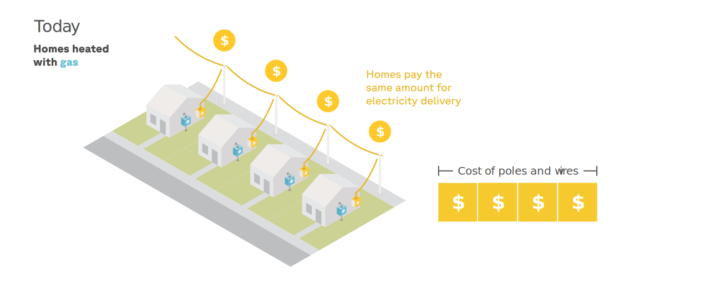

```{python}
#| echo: false

import pickle
from pathlib import Path
from types import SimpleNamespace

v = SimpleNamespace(**pickle.loads(Path("cache/report_variables.pkl").read_bytes()))


def dollar(x, accuracy=0):
    return f"${x:,.{accuracy}f}"


def pct(x, accuracy=0):
    return f"{x * 100:,.{accuracy}f}%"


def comma(x, accuracy=0):
    return f"{x:,.{accuracy}f}"


def cents(x, accuracy=1):
    return f"{abs(x) * 100:,.{accuracy}f}"
```

<!--
# Introduction

# Executive Summary

# Background
## Rate 101 - supply vs. delivery rates

## Costs

- Let's look at those costs first.

- CHARTS: Statewide 8760 heat map of marginal energy costs, generation capacity costs, transmission capacity costs, and
  distribution capacity costs.

- (Heat maps for each zone-utility combination are in the appendix.)

- Marginal energy costs are just the wholesale price of electricity from the ISONE spot market. They vary hour by hour,
  as different generators with different costs are dispatched to meet shifting demand. They mostly range from $TK to $TK
  per MWh, reaching a peak of $TK per MWh during summer afternoons.

- Marginal generation capacity costs reflect the cost of adding a new megawatt of generation capacity to the ISONE
  system. They are zero most of the year, but spike during summer afternoons, when generation capacity approaches its
  peak. They are estimated by allocating the cost of the previous year's capacity auction to the top hundred hours of
  the year, and then dividing by the number of hours in the year. They mostly range from $TK to $TK per MWh, reaching a
  peak of $TK per MWh during summer afternoons.

- Marginal transmission capacity costs reflect the cost of adding a new megawatt of transmission capacity to the ISONE
  system. They are zero most of the year, but spike during summer afternoons, when transmission capacity approaches its
  peak. Different transmission zones have different monthly patterns. They are estimated by XYZ. They mostly range from
  $TK to $TK per MWh, reaching a peak of $TK per MWh during summer afternoons.

- Marginal distribution capacity costs are the cost of adding a new megawatt of distribution capacity to the ISONE
  system. Technically, every feeder has a heatmap that looks like this, and they may each peak at different times,
  meaning marginal distribution capacity costs vary by feeder. We average them together to produce a single 8760 heatmap
  for each utility, which is then averaged across utilities to produce a statewide 8760 heatmap. They mostly range from
  $TK to $TK per MWh, reaching a peak of $TK per MWh during summer afternoons.

## The fairness problem

- Delivery rates are volumetric
- That doesn't mix well with heat pumps (or EVs): when your load doubles, you delivery payments do too, even when your
  cost-of-service doesn't, so you pay more than your fair share.
- And by artificially increasing heat pump operating costs, that's hurting heat pump adoption (and it also affects EVs).
- And since heat pumps, electric water heaters, and EVs account for much of the demand flexibility potential in
  Brattle's study, this fairness problem is actually another obstacle to unlocking demand flexibility in NY.

## The cost-reflectiveness problem

- Then there's the fact that rates, which are an important way to achieve demand flexibility, are not currently doing
  so, because they're not cost-reflective.
- The problem occurs on both the supply and delivery sides of the bill.
- Wholesale electricity prices are volatile, reflecting that the underlying cost of generating electricity changes based
  on the demand level and the availability of different types of generators.
- However, supply rates are flat, so customers have no incentive shift their load to take advantage of lower prices, and
  reduce the need for costly and polluting peaker generators.
- Similarly, the need for new grid capacity is largely driven by demand during peak periods.
- But delivery rates are also flat, so customers have no incentive to load shift away from these periods, and thus
  right-size the infrastructure needed to serve them. -->

# Findings

## What happens to heating bills when households switch to heat pumps?

<!-- Imagine a home in Utica: a pre-war, two-bedroom unit in a small multifamily building, heated by a natural gas furnace with central air conditioning. It pays {python} dollar(v.median_energy_total) for energy every year, which is the median bill for gas-heated homes in the state. [^utica_home] -->

Imagine a single-family home in Cranston, Rhode Island: a three-bedroom house built in the 1980s, heated by a natural
gas furnace with central air conditioning. It pays `{python} dollar(v.median_energy_total)` for energy every year —
close to the median bill for gas-heated homes in the state.[^cranston_home]

Like all homes in Rhode Island, when this household switches to an air-source heat pump,[^heatpump_efficiency] its annual
energy use plummets (@fig-consumption-only-state):

::: {.column-body-outset-right}

:::

[^cranston_home]:
    Specifically: a 1,698 sq ft, owner-occupied, single-story home with R-19 insulated concrete masonry walls,
    a 92.5% AFUE gas furnace, and SEER 13 central AC. The home is served by Rhode Island Energy
    (electricity and gas).

<!-- [^utica_home]: Specifically: a 2,648 sq ft, owner-occupied, two-story unit in a 2-unit building, built before 1940 with uninsulated brick walls, an 80% AFUE gas furnace, and SEER 15 central AC. The home is served by National Grid (electricity and gas). -->

[^heatpump_efficiency]: TODO add model specs here.

Heat pumps are 2 to 3 times more efficient than furnaces, so they only require a fraction as much energy input to heat a
home to the same temperature.

However, while switching to heat pumps cuts a home's energy *use*, it often increases its energy *costs*, as is the case
with this Cranston home (@fig-consumption-vs-bills-state).

::: {.column-body-outset-right}

:::

This is because electricity is more expensive than natural gas in Rhode Island: while it makes up only
`{python} pct(v.elec_share_of_energy_use)` of this gas-heated household's annual energy use, it accounts for
`{python} pct(v.elec_share_of_energy_bill)` of its annual energy bill.

After this building replaces its gas furnace with a heat pump, its
annual [gas bill]{style="color: #a0af12; font-weight: bold"} drops by
`{python} dollar(v.median_gas_drop)`.[^using_gas_for_cooking_and_hot_water] But its annual
[electric bill]{style="color: #e6b400; font-weight: bold"} jumps by `{python} dollar(v.median_elec_jump)`.

The result: despite the heat pump's lower energy use, switching this home's heating fuel from natural
gas to electricity causes its annual **combined energy bills**—which are near the statewide median—to jump by
`{python} dollar(v.median_net_increase)`.

[^using_gas_for_cooking_and_hot_water]:
    The home in this example still uses some gas for cooking and hot water, which is why the gas bill doesn't drop to
    zero after the switch.

In other words, it costs more to heat this home with heat pumps than with natural gas. While this experience is fairly
typical of what happens when gas-heated homes switch to heat pumps today, Rhode Island's building stock is diverse, so
the full range of bill impacts varies widely (@fig-quadrant-bar-natgas-state-state-lmi-current).

::: {.column-page-inset-right}

:::

While most natural gas-heated households that switch to heat pumps do see their bills go up, approximately
`{python} pct(v.pct_natgas_save_default_lmi40)` actually enjoy lower bills after the switch.

Only `{python} pct(v.pct_natgas_households)` of RI households are heated with natural gas, however. The rest are
heated with delivered fuels or electric resistance—both of which have more potential for bill savings than natural gas
(@fig-households-by-fuel).

::: {.column-page-inset-right}

:::

Indeed, when households who heat with delivered fuels switch to heat pumps, their bills tend to go down
(@fig-quadrant-bar-oil-propane-state).

::: {.column-page-inset-right}

:::

Today, over `{python} pct(v.pct_oil_propane_save_default)` of oil and propane households lower their bills after
switching, and `{python} pct(v.pct_oil_propane_save_1k_default)` save more than $1,000 per year.

The story is similar for electric resistance-heated households (@fig-quadrant-bar-elec-resistance-state).

::: {.column-page-inset-right}

:::

For households that heat with electric resistance, `{python} pct(v.pct_elec_resistance_save_default)` would see bill
decreases after switching to heat pumps, and `{python} pct(v.pct_elec_resistance_save_1k_default)` would save more than
$1,000 per year.

---

So why do heat pumps struggle to compete against natural gas in Rhode Island?

Low natural gas prices are a significant reason, but it's not the only one. As we'll see in the next section, the main
culprit is (artificially) high electricity prices: outdated volumetric rates are causing heat pump customers to pay more
than their fair share for the poles and wires that deliver electricity to their homes.

## HP customers are cross-subsidizing non-HP customers

### Why electric bills go up when heat pumps are installed

When a household with existing air conditioning switches to a heat pump, its annual electricity
consumption goes up by roughly `{python} f"{v.elec_pct_change_full_cooling_p25:.0f}"`% to
`{python} f"{v.elec_pct_change_full_cooling_p75:.0f}"`% — and much more for homes that gain cooling for the first
time.[^elec_increase_range] The electric bill goes up by approximately the same amount.

[^elec_increase_range]:
    The range shown is the weighted interquartile range (25th to 75th percentile) for fossil-fueled homes with full
    baseline cooling statewide. The increase depends on whether the home already had air
    conditioning:

```{python}
#| echo: false
#| output: asis
#| column: margin
print(Path("cache/elec_pct_change_table.html").read_text())
```

In the case of the Cranston home, its annual electricity use and its annual electric bill both grow by
`{python} f"{v.elec_kwh_multiplier:.1f}"`× (@fig-consumption-elec-focus-state).

::: {.column-body-outset-right}

:::

To understand why this happens, we need to drill down into the electric bill's components
(@fig-bill-components-decomposed-state).

::: {.column-body}

:::

The home pays `{python} f"{v.supply_multiplier:.1f}"`× as much for [supply]{style="color: #E69F00; font-weight: bold"},
which makes sense: after making the switch, the home consumes `{python} f"{v.elec_kwh_multiplier:.1f}"`× as much
electricity per year.

But upon turning on the heat pump, the home also starts paying `{python} f"{v.delivery_multiplier:.1f}"`× more for the
same poles and wires that bring that electricity to their home.

This happens because delivery costs are largely recovered through
[volumetric charges]{style="color: #56B4E9; font-weight: bold"}, rather than
[fixed charges]{style="color: #023047; font-weight: bold"}. The result: when a customer consumes more electricity,
not only do they pay more for that electricity, but they also pay more for the grid itself—regardless of whether they
trigger the need for grid upgrades.

Is this delivery bill inflation fair?

### Heat pump customers are overpaying for delivery

To be fair, a customer's **bill** must match the **costs** the customer imposes on the
system.[^cost-causation-principle]

[^cost-causation-principle]: TODO add link to Bonbright's principle of fairness based on cost-causation.

When a customer grows their electricity use after installing a heat pump, they grow their **energy
costs**—power plants have to burn more fuel to generate that electricity, and so on. So it is fair that their
[supply bill]{style="color: #E69F00; font-weight: bold"} also grows.

But a customer's [delivery bill]{style="color: #56B4E9; font-weight: bold"} should only grow if they grow their
**capacity costs**, also known as their [delivery cost-of-service]{style="color: #1b7837; font-weight: bold"}. And this
only happens when their new electricity use triggers new upgrades to the grid's capacity—during the handful of "peak
hours" of the year, when the grid as a whole (or their local distribution line) is most congested.

If a customer's delivery bill exceeds their delivery cost-of-service, they are
[overpaying]{style="color: #b71c1c; font-weight: bold"}.

---

To illustrate, let's return to our Cranston home, which is served by Rhode Island Energy, and has an annual delivery
cost-of-service of `{python} dollar(v.cs_gas_cost)` per year (@fig-cross-subsidy-example).

When heated with natural gas, the home's annual [electric delivery bill]{style="color: #56B4E9; font-weight: bold"}
is `{python} dollar(v.cs_gas_underpay)` lower than its [delivery cost-of-service]{style="color: #1b7837; font-weight: bold"}—a good illustration of how most gas-heated homes actually *underpay* for delivery.

::: {.column-page-inset-right}

:::

After switching to the heat pump, its delivery cost-of-service actually decreases by
`{python} dollar(v.cs_hp_cost - v.cs_gas_cost)` per year, due to slightly decreased electrical use during peak
hours.[^notmuch]

[^notmuch]:
    The fact that the home's electricity use grew by `{python} f"{(v.elec_kwh_multiplier - 1) * 100:.0f}"`%, but its
    delivery cost of service changed so little, reflects the
    fact that both the ISONE grid as a whole and Rhode Island Energy's local distribution system have ample winter headroom
    (see @sec-headroom).

But as we saw earlier—as a direct consequence of volumetric rates—the Cranston home's annual
[electric delivery bill]{style="color: #56B4E9; font-weight: bold"} grows to `{python} dollar(v.cs_hp_bill)` per
year, causing an [overpayment]{style="color: #b71c1c; font-weight: bold"} of `{python} dollar(v.cs_hp_bat)` per
year. In other words: if Rhode Island Energy's delivery rates were fair, the home's *total* electric bill would shrink by
`{python} f"{v.cs_hp_bat / v.median_elec_bill_hp * 100:.0f}"`%.

---

How widespread is this overpayment problem in practice?

We find that households with heat pumps are systematically paying more than their cost-of-service for delivery across
Rhode Island.

Statewide, the [delivery cost-of-service]{style="color: #1b7837; font-weight: bold"} for
fossil fuel customers is `{python} dollar(v.ff_mean_delivery_cost)` per year, on average,
compared to `{python} dollar(v.hp_mean_delivery_cost)` per year for heat pump customers, just
**`{python} f"{(v.hp_mean_delivery_cost / v.ff_mean_delivery_cost - 1) * 100:.0f}"`%** higher.

But the [delivery bills]{style="color: #56B4E9; font-weight: bold"} that heat pump customers currently pay are
**`{python} f"{(v.hp_mean_delivery_bill / v.ff_mean_delivery_bill - 1) * 100:.0f}"`%** higher than those of fossil fuel
customers, on average.

::: {.column-page-inset-right}
```{python}
#| echo: false
#| output: asis
print(Path("cache/bat_simple_table.html").read_text())
```
:::

We find that heat pump customers are overpaying for delivery by
**`{python} f"{dollar(v.hp_mean_delivery_bat)} per year"`**, on average.

Simultaneously, households that heat with natural gas are *underpaying* for delivery by
**`{python} f"{dollar(abs(v.natgas_mean_delivery_bat))} per year"`**, on average, while those with heating oil and
propane are *underpaying* by **`{python} f"{dollar(abs(v.oil_propane_mean_delivery_bat))} per year"`**.

These findings are connected: part of what allows fossil fuel customers to pay less for delivery than their
cost-of-service is precisely the fact that heat pump customers are overpaying, which creates a cross-subsidy to
customers that heat with fossil fuels.[^er-cross-subsidy]

[^er-cross-subsidy]:
    Electric resistance customers are also overpaying, and are responsible for a substantial portion of the
    cross-subsidy to fossil fuel customers.

### How overpayments create cross-subsidies

To understand how cross-subsidies arise, let's return to the single-family home in Cranston.

Before switching to a heat pump, let's assume its annual electricity use, and therefore its annual delivery bill, equals
those of its natural gas-heated neighbors.

::: {.column-page-inset}
{#fig-same-delivery}
:::

The cost of the power line on this block, which was upgraded in recent years, is split evenly between the home and its
neighbors.

As we've seen, after the home installs a heat pump, its annual electricity use (and therefore its annual delivery bill)
both grow by `{python} f"{v.elec_kwh_multiplier:.1f}"`×. But this new electricity use is highly concentrated in the winter:

::: {.column-body-outset}

:::

Does the power line have enough capacity to accommodate this additional wintertime load?

If it does not, the electrical utility would need to upgrade the power line.

::: {.column-page-inset}
{#fig-capacity-upgrade}
:::

These new **capacity costs** (represented by the growth in rectangle in the diragram above) must now be recovered from
the customers.

The costs were caused by the heat pump installation, so under the principle of cost-causation, they should be borne by
that customer.

And, in this case, they are: the higher delivery bills resulting from volumetric delivery rates cover these "marginal
capacity costs." The customer's delivery cost-of-service grows, but the delivery bill grows to match it. There's no
underpayment or overpayment, and no impact on the other customers on the block.

But as we'll see in the next section, the overwhelming majority of Rhode Island's grid *does* have the capacity to
accommodate this additional wintertime load. And that's what creates the cross-subsidy.

::: {.column-page-inset}
{#fig-no-capacity-upgrade}
:::

In this alternative scenario, the power line's spare winter capacity absorbs the heat pump's additional winter load.
**Capacity costs** don't grow, they stay fixed.

Volumetric rates cause the heat pump customer's delivery bill to rise, despite the fact that their delivery
cost-of-service hasn't changed. The heat pump customer pays a bigger share of the fixed costs, which allows the other
customers on the block to pay less.[^howitworks]

[^howitworks]:
    TODO add a note on how this actually works in practice—revenue adjustments respond to overcollection caused by heat
    pump customer overpayments in one year to lower the delivery rates for everyone in the following year, causing the
    bills of non-heat pump customers to shrink compared to the year before. Those of heat pump customers shrink too, but
    they remain far above their cost-of-service, while those of fossil fuel customers sink below theirs.

And this "no capacity upgrade" scenario is the one that prevails across most of the state today.

### Why the grid can handle the additional load {#sec-headroom}

:::callout-warning
This section will contain an analysis of RIE's feeder-level winter headroom, but is currently uncompleted.
:::

<!-- Simply put: at present, Rhode Island's grid has significant spare winter capacity to accommodate
heat pumps. And this is the main reason why their delivery cost-of-service is only
`{python} f"{(v.hp_mean_delivery_cost / v.ff_mean_delivery_cost - 1) * 100:.0f}"`% higher than that of fossil fuel
customers. -->

## Proposal: fair rate for heat pump customers

In this report, we propose a new rate for heat pump customers that would reduce their overpayments for delivery,
eliminate their cross-subsidy to fossil fuel customers, and reintroduce fairness to delivery rates.

A **fair rate** for heat pump customers is one that reduces their average
[delivery bill]{style="color: #56B4E9; font-weight: bold"} to match their average
[delivery cost-of-service]{style="color: #1b7837; font-weight: bold"}, thereby eliminating the average overpayment.

There are many ways to design a rate for heat pump customers that would achieve this goal. We deliberately propose a
simple seasonal rate that would lower heat pump customer bills in every instance, and could therefore be retroactively
applied to all known heat pump customers in the state. This rate would only be available to heat pump customers, and
would only apply to the delivery side of the bill.

In summer, the volumetric delivery rate would equal each utility's current default rate. In winter, the volumetric
rate would be reduced to the level at which the utility's heat pump customers pay the same *annual* delivery bills, on
average, as their delivery cost-of-service.

Each electrical utility would have a unique winter delivery rate, reflecting the cost of service in that territory.

::::: {.column-page-inset-right}
```{python}
#| echo: false
#| output: asis
print(Path("cache/rate_table.html").read_text())
```
:::::

If all existing heat pump customers opted in to these rates, what would happen to the overpayments and underpayments we
saw earlier?

::::: {.column-page-inset-right}
```{python}
#| echo: false
#| output: asis
print(Path("cache/bat_comparison_table.html").read_text())
```
:::::

These rates would eliminate the overpayment of heat pump customers, on average, bringing their delivery bills in line
with their delivery cost-of-service statewide.

By eliminating the cross-subsidy from heat pump customers to customers that heat with fossil fuels, the underpayments of
natural gas, propane, and heating oil customers would decrease, on average.[^elimination]

[^elimination]:
    They would not be eliminated, however, without also removing overpayments by electric resistance customers.

In other words, our proposed seasonal rates would fix the fairness problem. But would that move the needle on operating
costs?

## Bill impact of heat pump rate on HP customers

If our fair rate were available, how would it affect what happens to annual energy bills when natural gas heated
households switch to heat pumps? Let's revisit our earlier analysis.

First, let's revisit the post-heat pump bills for the Cranston home.

::::: {.column-page-inset-right}

:::::

Under fair rates, the Cranston home's post-heat pump annual electric bill
would drop by **`{python} f"{v.fair_rate_savings_pct * 100:.0f}"`%** — from
`{python} dollar(v.fair_rate_total_bill + v.fair_rate_savings_dollar)` under default rates to
**`{python} dollar(v.fair_rate_total_bill)`**.

The savings come entirely from the [delivery (volumetric)]{style="color: #56B4E9; font-weight: bold"} component, which
shrinks thanks to the lower winter rate. Supply and gas charges are unchanged.

The dashed line marks the home's pre-heat-pump delivery bill. Under fair rates, the post-heat-pump delivery bill falls
close to it — meaning the overpayment for delivery has been largely eliminated.

Bottom line: fair rates would allow this home to save `{python} dollar(v.median_energy_total - v.fair_rate_total_bill)`
per year by switching from gas heating to heat pumps.

---

Would we see similar outcomes statewide? Let's zoom out and see.

::::: {.column-page-inset-right}

:::::

Fair rates would transform the economics of heat pumps in Rhode Island.

Under default rates, only **`{python} f"{v.pct_natgas_save_default_lmi40 * 100:.0f}"`%** of gas-heated households would
save by switching to heat pumps. But under fair rates, **`{python} f"{v.pct_natgas_save_hprate_lmi40 * 100:.0f}"`%**
of gas-heated households would save. And the share of households losing over $1,000 per year would drop from
`{python} f"{v.pct_natgas_lose_1k_default_lmi40 * 100:.0f}"`% to just `{python} f"{v.pct_natgas_lose_1k_hprate_lmi40 * 100:.0f}"`%.

The fact that most gas-heated households would save by switching to heat pumps if overpayments were eliminated proves
that heat pump operating costs struggle to compete against natural gas largely because of outdated volumetric delivery
rates—not cheap gas supply.

The pattern holds for oil and propane-heated homes. Under default rates,
`{python} f"{v.pct_oil_propane_save_default * 100:.0f}"`% of oil/propane households would save by switching to
heat pumps. Under fair rates, **`{python} f"{v.pct_oil_propane_save_hprate * 100:.0f}"`%** would save, and the
share losing over $1,000 per year would drop from `{python} f"{v.pct_oil_propane_lose_1k_default * 100:.0f}"`% to
`{python} f"{v.pct_oil_propane_lose_1k_hprate * 100:.0f}"`%.

::::: {.column-page-inset-right}

:::::

Electric resistance homes see a similar improvement. Under default rates,
`{python} f"{v.pct_elec_resistance_save_default * 100:.0f}"`% would save by upgrading to heat pumps. Under fair rates,
**`{python} f"{v.pct_elec_resistance_save_hprate * 100:.0f}"`%** would save.

::::: {.column-page-inset-right}

:::::

## Equity impact of heat pump rate on HP customers

While the bill impacts shown above reveal how the population at large would be affected by fair rates, they don't
illuminate the equity impact on low-and-moderate income households. For that, we must zoom in on this population, and
look at energy burdens.[^energy-burden]

[^energy-burden]: Energy burden is defined as the percentage of a household's annual income spent on energy bills.

Today, `{python} pct(v.pct_burdened_current_lmi40)` of Rhode Island's low-and-moderate income households that heat with natural
gas pay more than 6% of their annual income on energy bills, and are therefore considered to be **highly energy
burdened**. This figure reflects current LMI discounts for electricity and gas; only ~`{python} f"{v.lmi_current_enrollment_pct:.0f}"`% of eligible LMI households are currently enrolled.[^lmi-def]

[^lmi-def]: TODO add a note on how LMI is defined.

::::: {.column-page-inset-right}

:::::

After installing heat pumps under default rates, `{python} pct(v.pct_burdened_hp_default_lmi40)` of these households
pay more than 6% of their annual income. This assumes that the same households that are already enrolled in LMI discounts remain enrolled after switching to heat pumps.

After installing heat pumps under heat pump-only seasonal rates,
`{python} pct(v.pct_burdened_hp_seasonal_lmi40)` of these households would still be highly burdened. This assumes that LMI electrification is paired with opting households into the HP seasonal rates.

And as long as we're updating LMI electrification programs to include rate enrollment, what if these programs also ensured that all eligible LMI households were enrolled in the discounts they're eligible for?

The final bar in @fig-burden-bar-lmi-current shows what post-heat pump installation burdens would look like—under HP seasonal rates and 100% enrollment in LMI discounts. Under this scenario, the number of highly energy burdened households would actually drop by
`{python} f"{(v.pct_burdened_current_lmi40 - v.pct_burdened_hp_seasonal_lmi100) * 100:.0f}"` percentage points compared to today.

## Bill impact of heat pump rate on non-HP customers

As we saw earlier, households that heat with natural gas are underpaying for delivery by
**`{python} dollar(abs(v.natgas_mean_delivery_bat))`** per year, on average, while those with oil or propane are
underpaying by **`{python} dollar(abs(v.oil_propane_mean_delivery_bat))`**.

Part of why this happens is that heat pump customers are overpaying for delivery—by
**`{python} dollar(v.hp_mean_delivery_bat)`** per year, on average—which allows utilities to lower the volumetric
delivery rate on everyone.

If all heat pump customers opted in to fair rates, this cross-subsidy would be removed. The flat delivery rate
used by non-heat pump customers would need to rise slightly to compensate. How would this affect their bills?
(@fig-bill-change-non-hp-rebal-state).

::::: {.column-page-inset-right}

:::::

Barely at all: just **`{python} dollar(v.rebal_nonhp_mean_monthly_delta, 2)` per month**, on average.

In fact, **`{python} pct(v.rebal_nonhp_pct_decrease + v.rebal_nonhp_pct_increase_under_5)`** of non-HP households would
see their monthly electric bill rise by less than $5 a month.

Importantly, this is **not a "rate hike"** on customers without heat pumps. It is the removal of an unfair
cross-subsidy, and a step toward better aligning delivery rates with each customer's actual cost-of-service.

Why so little?

Because heat pump customers only make up `{python} pct(v.hp_share_of_households)` of residential customers. The total
cross-subsidy they generate is modest, around **`{python} f"${v.hp_total_cross_subsidy_delivery_millions:,.0f}"` million
per year**, and it gets spread across `{python} f"{v.nonhp_households_millions:,.1f}"` million non-HP households.

The result: the benefit each non-heat pump household receives from the cross-subsidy is minuscule—but the cost each heat
pump household bears is large, as we saw in @fig-quadrant-bar-natgas-switch-hprate-state-lmi-current.

This show counterproductive this unintentional public policy of cross-subsidization really is: the state is trying to
advance heat pump adoption, but its own volumetric rates are penalizing the customers who electrify—while delivering
negligible savings to everyone else.

This asymmetry won't last forever. As heat pump adoption grows, the cross-subsidy will grow with it, and removing it
will become politically harder. The time to fix the fairness problem is now, before it becomes entrenched.

<!--
## How would the rate need to evolve over time?

- The idea of making rates fair for heat pump customers by offering them a special rate that avoids overcollecting
  delivery costs from them assumes that heat pump adoption is not a driver of grid investment. As we have shown, this is
  true at present, when heat pump adoption is using spare winter capacity.

- However, heat pump adoption is still the main driver of winter peak growth. And once the winter peak starts growing
  faster than the summer peak, at some point it will catch up. Once this happens, heat pump adoption will become the
  main driver of grid investment.

- And keeping rates fair will mean continuing to align revenue from heat pump customers with their cost-of-service for
  delivery, which will now be higher than not heat pump customers.

- This means that this rate is a short-term fix. It needs a glide path to evolve as the underlying cost-of-service of
  heat pump customers changes, and will need to be sunset as the grid becomes winter-peaking.

- How quickly heat pump adoption will tip the various zones of NY's grid into winter-peaking is unclear—it depends on
  the pace of heat pump adoption, and the performance of the equipment being adopted.

- Rather than trying to forecast *when* the grid will become winter-peaking, estimate *at what level of heat pump
  adoption* this change will occur, for different heat pump technologies.

- And we show how the rate would need to evolve as heat pump adoption increases, to keep rates fair.

- CHART: winter peak growth (vs summer peak) for low-performance ASHP, high-performance ASHP, and GSHP.

- CHART: how HP customer cost-of-service and rate would need to evolve as heat pump adoption increases (for each
  technology), to keep rates fair.

- APPENDIX: How this varies by ISONE zone and utility.

- Discussion of how cost-of-service and rates would need to evolve over time, and how things flip after the winter peak
  becomes larger than the summer peak.

- OPEN QUESTION: do the adoption scenarios assume everything but heat pump adoption is static, or do we try to align
  with ISONE load forecasts to include other sources of peak growth for both the summer and winter peaks? (If so, which
  forecast is really reasonable?)

- OPEN QUESTION: how do we estimate the distribution cost-of-service change over time, as these marginal costs would
  likely kick in first?

-->

# Appendix

## What causes people to save (or lose) when they switch to heat pumps {#sec-savings}

## Acknowledgments

## Data and Methods

## Assumptions

## References
